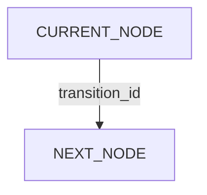

# Feature Specification: [FEATURE NAME]

**Feature Branch**: `[###-feature-name]`

**Created**: [DATE]

**Status**: Draft

**Change Type**: [Governance | Product Feature | Corrective Change]

**Contract Impact**: [None | Internal | Public Core | MCP | Persistence | Host Adapter | Release]

**Release Impact**: [None | Standalone version release may follow after feature completion]

**Dependencies**: [Completed predecessor features, exact contract/version, or None]

**Input**: User description: "$ARGUMENTS"

## Problem Statement *(mandatory)*

[Describe the developer/user problem, the current observable behavior, and why the existing behavior
is insufficient. Do not describe the implementation here.]

## User Scenarios & Testing *(mandatory)*

<!--
User stories are ordered by user value. Each story must be independently demonstrable at its
checkpoint. A story may depend on shared foundational work, but its user value and test must not
depend on unimplemented future stories.
-->

### User Story 1 - [Brief Title] (Priority: P1)

[Describe the user journey in plain language.]

**Why this priority**: [Why this is the first useful vertical slice.]

**Independent Test**: [One bounded journey proving the story without relying on later stories.]

**Acceptance Scenarios**:

1. **Given** [initial state], **When** [action], **Then** [observable result]
2. **Given** [initial state], **When** [action], **Then** [observable result]

---

### User Story 2 - [Brief Title] (Priority: P2)

[Describe the user journey.]

**Why this priority**: [Reason.]

**Independent Test**: [Bounded test.]

**Acceptance Scenarios**:

1. **Given** [initial state], **When** [action], **Then** [observable result]

---

[Add only user stories needed by this feature.]

### Edge Cases

- [Boundary condition and required behavior]
- [Error condition and zero-write/retention behavior]
- [Persisted-data condition: migrate, retain-read-only, reject-and-reset, or N/A]
- [Interrupted or uncertain operation condition]

## State-Graph Impact *(mandatory for process features; otherwise state N/A with reason)*

### Process Definition

- **Process ID**: [stable ID or N/A]
- **Process Version**: [integer or N/A]
- **Affected Nodes**: [closed list]
- **Existing Data Disposition**: [reject-and-reset | migrate | retain-read-only | N/A]
- **Historical Runtime Code**: [None by default; justify any explicitly supported route]

### Target Graph

### Node Contract Summary

| Node | Purpose | Completion Conditions | Allowed Effects | Required Evidence |
| --- | --- | --- | --- | --- |
| `[NODE]` | [purpose] | [conditions] | [effects] | [evidence] |

### Transition Summary

| Source | Transition ID | Destination | Guard / When to Choose | Reason Required |
| --- | --- | --- | --- | --- |
| `[NODE]` | `[transition_id]` | `[NODE]` | [closed condition] | [yes/no] |

Every affected node must list its complete outgoing edge set. Detailed contracts belong in
`contracts/`.

### Method-Profile Impact

| Node | Semantic Step | `plain` | `spec-kit` | `openspec` |
| --- | --- | --- | --- | --- |
| `[NODE]` | `[step_id]` | [guidance] | [mapping] | [mapping] |

## Requirements *(mandatory)*

### Functional Requirements

- **FR-001**: System MUST [specific observable capability]
- **FR-002**: System MUST [specific observable capability]

Requirements must be individually testable, use stable terms, and avoid implementation choices
unless the choice is itself a user-visible or persistence-transition contract.

### Persistence Transition Requirements

- **FR-S001**: Persisted data MUST follow exactly one declared disposition: `reject-and-reset`,
  `migrate`, `retain-read-only`, or `N/A`.
- **FR-S002**: Unsupported data MUST fail closed with zero writes and MUST NOT be deleted, renamed,
  truncated, replaced, or converted automatically.
- **FR-S003**: Unless historical compatibility is an explicit user requirement, production code MUST
  NOT retain a legacy runtime, historical decoder, dual projection, migration, or conversion path.

Before `1.0.0`, `reject-and-reset` is the default for incompatible task-model changes. Use migration
or retained historical runtime only when the active user requirement explicitly justifies their
long-term cost. Use `N/A` only when the feature provably changes no persisted or public behavior.

### Non-Goals *(mandatory)*

- The feature MUST NOT [explicitly excluded capability].
- The feature MUST NOT [release/platform/host/future abstraction exclusion].

### Key Entities *(mandatory when feature involves data or state)*

- **[Entity]**: [Meaning and key relations, without implementation details.]

## Success Criteria *(mandatory)*

### Measurable Outcomes

- **SC-001**: [Observable, technology-independent result]
- **SC-002**: [Bounded quality/recovery/persistence-transition result]
- **SC-003**: [User can complete primary journey with defined reads/actions]

Success criteria must be verifiable without interpreting model intent.

## Assumptions

- [Assumption selected as a reasonable default.]
- [Dependency assumed to exist.]
- [Support or platform boundary.]

## Open Questions

[List only unresolved questions that block planning. A feature cannot become Ready while any
acceptance-impacting question remains.]
