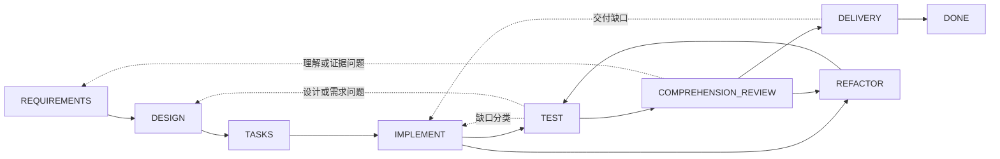

# Dev Flow

[中文](README.md) | [English](README_en.md)

> 防止 AI 把“小改动”做成“大工程”。

[](https://www.npmjs.com/package/dev-flow-codex)
[](https://www.npmjs.com/package/dev-flow-deepseek)
[](https://github.com/Innocent-children/dev-flow/actions/workflows/ci.yml)
[](LICENSE)

## 你可能已经遇到这些情况

- 只让 Agent 改一个接口，它却顺手重构相邻模块、抽象一套框架，再补一堆没有要求的文档。
- 只需要一个定向测试，它开始跑全量回归、平台矩阵和边界测试，时间与 token 不断消耗。
- 会话被压缩、Host 重启或任务隔天继续后，它忘了做到哪，重新扫描仓库，甚至重复执行已经完成的操作。
- 测试虽然通过，但实现复杂得没人能解释，只能继续依赖 AI 才敢维护。
- 一次写操作中断后，不知道它究竟有没有生效，只能冒险重试。

问题通常不是 Agent 不会写代码，而是缺少一条独立于聊天记录的开发边界：**当前只该做什么、
做到什么算完成、验证到什么程度，以及什么时候应该停。**

## Dev Flow 做什么

Dev Flow 是 AI 开发的本地过程导航与恢复层。它把需求、设计、任务拆分、实现、测试、理解审查、
重构和交付放进由 Go Core 管理的状态图，让 Codex、DeepSeek Harness 等 Host 每次只围绕当前
节点工作，并始终知道完成条件、允许的副作用、所需证据、验证预算和合法下一步。

| 程序员痛点 | Dev Flow 的约束 |
| --- | --- |
| 小需求不断扩大 | 保存不可变的原始意图和当前需求、设计基线；范围发生实质变化时必须回到正确节点，并使下游旧证据失效 |
| 方案越做越复杂 | 测试通过后仍要经过 `COMPREHENSION_REVIEW`；无法解释或维护的实现会回到 `DESIGN` 或 `REFACTOR` |
| 测试越跑越多 | 每个 Task 携带验证预算；检查必须关联当前节点、改动表面或验收条件，完整套件和平台矩阵不是默认动作 |
| 中断后上下文丢失 | 当前节点、基线、证据、阻塞原因和合法流转保存在本地 SQLite，而不是只存在于聊天记录 |
| 写操作结果不确定 | 先读取权威状态，再按五分类 Recovery 决定恢复或重试，禁止盲目重复 mutation |

Dev Flow 不是新的大模型、通用编程 Agent 或另一套规格格式。Codex 和 DeepSeek 仍负责读代码、
改代码和运行工具；Dev Flow 负责让它们**不丢进度、不偷换范围、不无限验证，也不把“测试通过”
误当成“可以交付”。**

它最适合需要跨越多个开发步骤、可能返工、或需要在多次会话之间继续推进的真实仓库任务。
对于一次性问答、无需过程记录的单文件小改动，直接使用 Codex 或 DeepSeek 通常更简单。

## 一次任务如何推进

1. 开发者在当前 Git 仓库中用显式 selector 描述任务。
2. Core 创建或恢复该仓库的 Task，返回当前节点、完成条件、允许副作用、证据要求、验证预算和全部合法流转。
3. Host 只完成当前节点的工作；发现需求扩大、设计不成立或实现缺陷时，走状态图返回正确节点，而不是悄悄扩展范围。
4. Core 校验精确的 `transition_id` 后推进任务；测试失败、理解失败或交付拒绝都会回到对应位置。
5. 如果写操作响应不确定，Host 先读取权威状态，再按 Recovery 结论处理，而不是重新执行碰运气。

开发者始终可以看到：任务为什么停在这里、什么才算完成、已经验证到什么程度，以及下一步有哪些
真实选择。

## 快速开始

当前公开制品支持 macOS arm64、Node.js `>=24`。Core `0.5.0` 独立打包在 Codex `0.5.1` 和
DeepSeek `0.5.1` Host 产品中；三个产品版本分别演进。

### Codex

```bash
npm install -g dev-flow-codex@0.5.1
dev-flow-codex setup
dev-flow-codex --version
```

在 Codex 中使用唯一显式 selector 发起任务：

```text
$dev-flow-codex:dev-flow 为当前仓库实现用户登录失败次数限制。
```

普通对话不会自动启动 Dev Flow。完整的安装、移除、数据保留和调用边界见
[Codex package README](packages/codex/README.md)。

### DeepSeek Harness

先从 npm 获取官方 tarball，再把绝对路径交给 DSH profile：

```bash
npm pack dev-flow-deepseek@0.5.1
dsh plugin --profile <profile> add "$PWD/dev-flow-deepseek-0.5.1.tgz"
```

按 DSH 的 profile 生命周期重启该 profile 后，通过 `/dev-flow` 显式进入 Dev Flow。安装、
重启、移除和数据边界见 [DeepSeek package README](packages/deepseek/README.md)。

## 它在工具链中的位置

| 组件 | 负责什么 |
| --- | --- |
| Codex / DeepSeek Harness | 阅读仓库、修改代码、运行工具，并与开发者协作完成当前节点 |
| Spec Kit / OpenSpec | 为需求、设计、任务等节点提供方法和制品 |
| 测试与 CI | 产生行为是否正确的验证证据 |
| Dev Flow | 保存唯一过程游标、完成条件、验证预算、合法流转、恢复结论和终态 |

这些工具可以一起使用，但只有 Go Core 保存任务当前位于哪里以及可以去哪里。Spec Kit、OpenSpec、
checkbox 或一次命令成功都不能自行推进 Task。

## 开发过程图

当前 Core 只提供内建的 `standard-development`：8 个工作节点、`DONE` 终态，以及
`BLOCKED`、`CANCELLED` 两个异常节点。29 条流转覆盖正常推进与真实返工。



虚线用于概括多条受控回退。精确节点、29 条流转、guard 和 reason 规则由
[`internal/workflow/`](internal/workflow/) 定义。Host 只提交 Core 返回的 `transition_id`，
destination 由 Core 推导。

每次读取当前 Action，调用者都能获得：

- 当前 process、node、revision 和 action identity；
- 节点目的、进入假设、完成条件、允许副作用、所需证据和验证预算；
- 当前 method profile 对应的 semantic method steps；
- 全部合法 transitions 及其 destination、guard、选择条件和 reason 规则。

## 运行边界

Core 通过 local STDIO MCP 暴露恰好六个工具：

```text
dev_flow_server_info
dev_flow_open_task
dev_flow_get_task
dev_flow_get_next_action
dev_flow_apply_action
dev_flow_cancel_task
```

Core 可以有界、只读地观察一个现有 Git 仓库，用于建立 repository binding 和判断变更事实。
Git 修改由获得用户授权的 Host 执行；Core 不提供通用 shell，也不执行 checkout、commit、push、
merge、rebase、tag 或发布操作。

## 数据与恢复

默认任务数据位于 Host 产品管理的本地数据目录，也可以通过 `DEV_FLOW_DATA_DIR` 指向一个已存在、
可用的绝对目录。卸载或移除 Host 集成会保留任务数据。

当前图运行时只接受当前 SQLite Schema 和严格 snapshot。检测到不兼容或 pre-graph 数据时，
Core 返回 `SCHEMA_UNSUPPORTED` 并保持零写入。用户可以选择新的数据目录，或在 Core 外部手工
归档、改名或删除旧目录；任何 lifecycle 命令都不会自动清理它。

## 当前支持

| 产品 | 当前公开版本 | Bundled Core | 已验证环境 |
| --- | --- | --- | --- |
| `dev-flow-codex` | `0.5.1` | `0.5.0` | macOS arm64、Node.js `>=24`、Codex `>=0.147.0` |
| `dev-flow-deepseek` | `0.5.1` | `0.5.0` | macOS arm64、Node.js `>=24`、DSH `>=0.1.0-rc.6` |

两次 `0.5.1` 发布均通过 registry package 安装、真实 Host/Core handshake、移除、卸载和仓库
不变性门禁；DeepSeek 还完成显式触发、重启恢复、`DONE` 与 retained reopen 旅程。精确状态、
制品摘要和证据入口见 [Support Matrix](docs/SUPPORT-MATRIX.md) 与对应 GitHub Release。

## 从这里继续

| 想了解什么 | 文档 |
| --- | --- |
| 产品解决的问题、能力和非目标 | [Product](docs/PRODUCT.md) |
| Core、Adapter、Store 与 Recovery 如何协作 | [Architecture](docs/ARCHITECTURE.md) |
| 当前支持版本和平台 | [Support Matrix](docs/SUPPORT-MATRIX.md) |
| 已交付能力与后续方向 | [Roadmap](docs/ROADMAP.md) |
| 三个产品如何独立版本化 | [Versioning](docs/VERSIONING.md) |
| 本地开发工具链 | [Toolchain Baselines](docs/TOOLCHAIN-BASELINES.md) |
| Feature 开发规范 | [Spec Kit Workflow](docs/SPEC-KIT-WORKFLOW.md) |
| 如何提交问题和 Pull Request | [Contributing](CONTRIBUTING.md) |
| 维护者发布入口 | [Release](release/README.md) |

## 本地开发

需要 Go `>=1.26`、Node.js `>=24` 和 pnpm `>=11 <12`：

```bash
pnpm install --frozen-lockfile
pnpm run validate
```

`pnpm run validate` 运行仓库的有界验证，不安装真实 Host 产品，也不发布 npm、Tag 或 GitHub
Release。目录职责见 [Architecture](docs/ARCHITECTURE.md)，脚本入口见
[Repository Scripts](scripts/README.md)。

## 参与贡献

欢迎提交可复现的缺陷、文档改进、有最终制品证据的平台支持，以及边界明确的产品提案。开始前
请阅读 [贡献指南](CONTRIBUTING.md)；产品行为变更需要完整 Feature 规格，普通文档修正不需要。
版本提升和公开发布由维护者在功能合并后通过独立流程完成。

## License

[Apache License 2.0](LICENSE)
