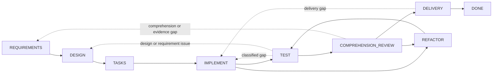

# Dev Flow

[简体中文](README.md) · [English](README_en.md) · [繁體中文](README_zh-TW.md) · [日本語](README_ja.md) · [한국어](README_ko.md) · [Español](README_es.md) · [Français](README_fr.md) · [Deutsch](README_de.md) · [Português (Brasil)](README_pt-BR.md)

> 为 AI 编程任务提供显式范围、验证预算与可恢复状态。

[](https://www.npmjs.com/package/dev-flow-codex)
[](https://www.npmjs.com/package/dev-flow-deepseek)
[](https://github.com/Innocent-children/dev-flow/actions/workflows/ci.yml)
[](LICENSE)

Dev Flow 是 AI 辅助软件开发的本地过程控制与恢复层。它将需求、设计、任务拆分、实现、测试、
理解审查、重构和交付组织为由 Go Core 管理的状态图。Codex、DeepSeek Harness 等 Host Adapter
负责修改仓库和运行工具；Core 保存 Task、当前节点、节点合同、验证预算、合法流转和恢复结论。

## Agent 工作流的常见失效模式

| 失效模式 | 典型表现 |
| --- | --- |
| 范围漂移 | 局部修改扩展为相邻模块重构、通用抽象、额外文档或未要求的未来能力 |
| 无界验证 | 定向检查扩展为全量回归、平台矩阵、压力测试或不断追加的边界用例 |
| 过程状态丢失 | 会话压缩、Host 重启或跨天继续后，当前进度只能从聊天记录和工作区重新推断 |
| 可维护性缺口 | 测试通过，但实现无法由开发者清楚解释、审查或接手维护 |
| 不确定 mutation | 写操作响应丢失或中断后，无法确认操作是否已提交，重放可能造成重复副作用 |

这些问题不能仅靠在 Prompt 中反复增加“不要重构”“不要多测试”等限制稳定解决。开发过程需要
独立于会话上下文的持久状态，以及对当前步骤、完成条件和合法下一步的闭合合同。

## 控制模型

| 失效模式 | Dev Flow 机制 |
| --- | --- |
| 范围漂移 | `TaskIntent` 保存不可变原始意图；Action 暴露 completion conditions 与 `allowed_effects`；实质范围变化必须通过合法 transition 返回相应节点，并由 Core 使下游旧 authority 失效 |
| 无界验证 | 每个 Task 保存 verification budget；检查必须关联当前节点、改动表面、验收条件或已知恢复风险，完整套件和平台矩阵不是默认动作 |
| 过程状态丢失 | 当前节点、requirements/design/task-plan baselines、证据、blocker 和合法流转持久化到本地 SQLite |
| 可维护性缺口 | `TEST` 之后必须经过 `COMPREHENSION_REVIEW`；无法解释或维护的实现返回 `DESIGN`、`IMPLEMENT` 或 `REFACTOR`，仓库变化后重新经过 `TEST` |
| 不确定 mutation | mutation 携带 revision、action identity、source cursor 和 repository binding；调用者必须 read-before-retry，并遵循五分类 Recovery |

Core 不会静态拦截 Host 对仓库的每一次修改。它提供权威 Action 合同并校验 Task 流转；Host
Adapter 必须在当前节点的允许副作用和验证预算内执行工作。

## 适用范围

Dev Flow 适合需要跨越多个开发节点、可能发生返工、需要保留验证证据，或必须跨会话恢复的真实
仓库任务。一次性问答、无需状态保留的单文件机械修改，直接使用 Codex 或 DeepSeek 通常更简单。

## 快速开始

当前公开制品支持 macOS arm64、Node.js `>=24`。Core `0.5.0` 独立打包在 Codex `0.5.1` 和
DeepSeek `0.5.1` Host 产品中；三个产品版本分别演进。

### Codex

```bash
npm install -g dev-flow-codex@0.5.1
dev-flow-codex setup
dev-flow-codex --version
```

在 Codex 中使用唯一显式 selector 发起任务：

```text
$dev-flow-codex:dev-flow Add a failed-login attempt limit to this repository.
```

普通对话不会自动启动 Dev Flow。完整的安装、移除、数据保留和调用边界见
[Codex package README](packages/codex/README.md)。

### DeepSeek Harness

先从 npm 获取官方 tarball，再把绝对路径交给 DSH profile：

```bash
npm pack dev-flow-deepseek@0.5.1
dsh plugin --profile <profile> add "$PWD/dev-flow-deepseek-0.5.1.tgz"
```

按 DSH 的 profile 生命周期重启该 profile 后，通过 `/dev-flow` 显式进入 Dev Flow。安装、
重启、移除和数据边界见 [DeepSeek package README](packages/deepseek/README.md)。

## 执行模型

1. 开发者在当前 Git 仓库中通过显式 selector 描述任务。
2. Core 创建或恢复该仓库的 Task，返回当前节点、完成条件、允许副作用、证据要求、验证预算和全部合法流转。
3. Host 执行当前 Action。需求、设计或实现发生实质变化时，Host 通过 Core 返回的 transition 报告，而不是在当前节点中隐式扩大范围。
4. Core 校验 `transition_id`、guard、revision 和 payload 后推进 Task；测试失败、理解失败或交付拒绝返回相应节点。
5. mutation 响应不确定时，Host 先读取 Task 与 Recovery assessment，再决定恢复、阻塞或安全重试。

## 组件边界

| 组件 | 职责 |
| --- | --- |
| Codex / DeepSeek Harness | 读取仓库、修改代码、运行工具，并提交当前节点结果与证据 |
| Spec Kit / OpenSpec | 为 requirements、design、tasks 等节点提供方法与制品 |
| 测试与 CI | 产生行为验证证据 |
| Dev Flow Core | 保存唯一 process cursor、节点合同、verification budget、合法流转、Recovery 和终态 |

Spec Kit、OpenSpec、checkbox 或一次命令成功都不能自行推进 Task。只有一次有效的 Core action
submission 能改变权威状态。

## 开发过程图

当前 Core 只提供内建的 `standard-development`：8 个工作节点、`DONE` 终态，以及
`BLOCKED`、`CANCELLED` 两个异常节点。29 条流转覆盖正常推进与真实返工。



虚线用于概括多条受控回退。精确节点、29 条流转、guard 和 reason 规则由
[`internal/workflow/`](internal/workflow/) 定义。Host 只提交 Core 返回的 `transition_id`，
destination 由 Core 推导。

每次读取当前 Action，调用者都能获得：

- 当前 process、node、revision 和 action identity；
- 节点 purpose、entry assumptions、completion conditions、`allowed_effects`、`required_evidence` 和 verification budget；
- 当前 method profile 对应的 semantic method steps；
- 全部合法 transitions 及其 destination、guard、选择条件和 reason 规则。

## 运行边界

Core 通过 local STDIO MCP 暴露恰好六个工具：

```text
dev_flow_server_info
dev_flow_open_task
dev_flow_get_task
dev_flow_get_next_action
dev_flow_apply_action
dev_flow_cancel_task
```

Core 可以有界、只读地观察一个现有 Git 仓库，用于建立 repository binding 和判断变更事实。
Git 修改由获得用户授权的 Host 执行；Core 不提供通用 shell，也不执行 checkout、commit、push、
merge、rebase、tag 或发布操作。

## 数据与恢复

默认任务数据位于 Host 产品管理的本地数据目录，也可以通过 `DEV_FLOW_DATA_DIR` 指向一个已存在、
可用的绝对目录。卸载或移除 Host 集成会保留任务数据。

当前图运行时只接受当前 SQLite Schema 和严格 snapshot。检测到不兼容或 pre-graph 数据时，
Core 返回 `SCHEMA_UNSUPPORTED` 并保持零写入。用户可以选择新的数据目录，或在 Core 外部手工
归档、改名或删除旧目录；任何 lifecycle 命令都不会自动清理它。

## 当前支持

| 产品 | 当前公开版本 | Bundled Core | 已验证环境 |
| --- | --- | --- | --- |
| `dev-flow-codex` | `0.5.1` | `0.5.0` | macOS arm64、Node.js `>=24`、Codex `>=0.147.0` |
| `dev-flow-deepseek` | `0.5.1` | `0.5.0` | macOS arm64、Node.js `>=24`、DSH `>=0.1.0-rc.6` |

两次 `0.5.1` 发布均通过 registry package 安装、真实 Host/Core handshake、移除、卸载和仓库
不变性门禁；DeepSeek 还完成显式触发、重启恢复、`DONE` 与 retained reopen 旅程。精确状态、
制品摘要和证据入口见 [Support Matrix](docs/SUPPORT-MATRIX.md) 与对应 GitHub Release。

## 文档

| 主题 | 文档 |
| --- | --- |
| 产品问题、能力与边界 | [Product](docs/PRODUCT.md) |
| Core、Adapter、Store 与 Recovery 架构 | [Architecture](docs/ARCHITECTURE.md) |
| 当前支持版本和平台 | [Support Matrix](docs/SUPPORT-MATRIX.md) |
| 已交付能力与后续方向 | [Roadmap](docs/ROADMAP.md) |
| 三个产品的独立版本治理 | [Versioning](docs/VERSIONING.md) |
| 文档 locale 与同步规则 | [I18n](docs/I18N.md) |
| 本地开发工具链 | [Toolchain Baselines](docs/TOOLCHAIN-BASELINES.md) |
| Feature 开发规范 | [Spec Kit Workflow](docs/SPEC-KIT-WORKFLOW.md) |
| 如何提交问题和 Pull Request | [Contributing](CONTRIBUTING.md) |
| 维护者发布入口 | [Release](release/README.md) |

## 本地开发

需要 Go `>=1.26`、Node.js `>=24` 和 pnpm `>=11 <12`：

```bash
pnpm install --frozen-lockfile
pnpm run validate
```

`pnpm run validate` 运行仓库的有界验证，不安装真实 Host 产品，也不发布 npm、Tag 或 GitHub
Release。目录职责见 [Architecture](docs/ARCHITECTURE.md)，脚本入口见
[Repository Scripts](scripts/README.md)。

## 参与贡献

欢迎提交可复现的缺陷、文档改进、有最终制品证据的平台支持，以及边界明确的产品提案。开始前
请阅读 [贡献指南](CONTRIBUTING.md)。产品功能变更必须同步更新根 README 的全部维护语言、
`docs/PRODUCT*` 和受影响的技术文档；精确规则见 [I18n](docs/I18N.md)。

## License

[Apache License 2.0](LICENSE)
