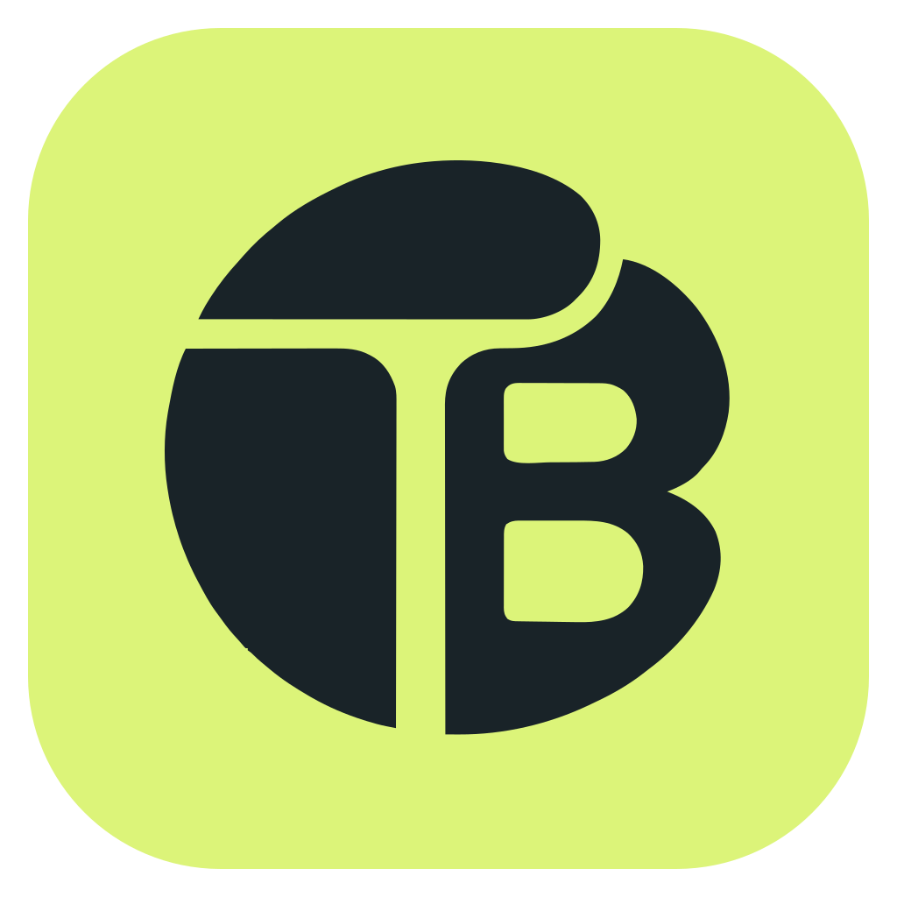

<p align="center">
  
</p>

<h1 align="center">TaskBelay</h1>

<p align="center"><strong>Long-running AI coding, on belay.</strong></p>

<p align="center">
  <a href="README.md">English</a> · <a href="README_zh-CN.md">简体中文</a> · <a href="README_zh-TW.md">繁體中文</a> · <a href="README_ja.md">日本語</a> · <a href="README_ko.md">한국어</a> · <a href="README_es.md">Español</a> · <a href="README_fr.md">Français</a> · <a href="README_de.md">Deutsch</a> · <a href="README_pt-BR.md">Português (Brasil)</a>
</p>

## What TaskBelay helps you do

Your coding agent decides what to do next.<br />
TaskBelay keeps the task under control.

Use it with Codex, DeepSeek, Claude Code or ZCode. The agent reasons about the code and chooses the technical action; TaskBelay keeps the scope, verification limits, state and recovery records around that work.

In climbing, a belayer manages the rope while the climber chooses the route. TaskBelay applies that idea to coding: the agent makes technical decisions, while TaskBelay checks approved scope and verification limits and uses saved records to recover from failures or uncertain results. It is neither a sandbox nor another coding agent.

- **Explicit Scope:** Check actual changes against approved files. Work beyond the plan needs a decision.
- **Bounded Verification:** Plan relevant checks and their limits. More verification needs a concrete reason.
- **Durable State:** Keep the authoritative task state locally, across sessions.
- **Safe Recovery:** Use saved state and operation records to resolve failures or uncertain results before retrying.

It suits repository work that spans sessions or needs explicit scope and testing limits. For one-off
questions, code explanations, and small edits that need no saved progress, using Codex, DeepSeek, Claude Code or ZCode
directly is usually simpler.

## Quick start

> Use Node.js `>=24` and install the Host you intend to use. Check Host versions and validated platforms in the [Support Matrix](docs/SUPPORT-MATRIX_en.md).

### 1. Install TaskBelay

These commands use the TaskBelay package names and require the packages to be published. Before their first release, use the [local source installer](scripts/README_en.md#local-installation-testing), then follow the activation instructions for [Codex](docs/CODEX_en.md), [DeepSeek](docs/DEEPSEEK_en.md), [Claude Code](docs/CLAUDE_en.md), or [ZCode](docs/ZCODE_en.md). Local packages target Windows x64 and macOS arm64; native macOS ZCode validation remains pending.

```sh
npm install -g @imotong/taskbelay@latest
taskbelay
```

Choose your Host from the options offered by your installation entry. After setup, review and trust the TaskBelay hook in Codex `/hooks`, restart the selected DeepSeek Profile, or reload Claude plugins/start a new Claude session and review its permission prompts.

In ZCode, install and enable the plugin in Settings → Plugins, then start a new session to activate its hooks. Local preparation does not confirm that ZCode has loaded the plugin.

### 2. Start a task

After completing the appropriate installation, send one of these messages in your Host conversation:

**Codex**

```text
$taskbelay-codex:taskbelay Add failed-login rate limiting. Change only auth files and run at most 4 targeted checks.
```

**DeepSeek Harness**

```text
/taskbelay Add failed-login rate limiting. Change only auth files and run at most 4 targeted checks.
```

**Claude Code**

```text
/taskbelay-claude:taskbelay Add failed-login rate limiting. Change only auth files and run at most 4 targeted checks.
```

**ZCode**

Select `taskbelay` from the input’s `/` → Skills menu, then describe your task.

```text
Use TaskBelay to add failed-login rate limiting. Change only auth files and run at most 4 targeted checks.
```

Send these in the conversation, not a terminal. Describe your goal, acceptance conditions, file
scope, and testing limit.

The first reply assesses the request and asks whether to work directly or use TaskBelay. Choosing
TaskBelay defaults to a new task branch from the current HEAD in the current directory. Confirm the
new branch and whether existing uncommitted changes belong to the task. Your dependencies, local
configuration, files and staged state stay in place; the current session continues when it can access
all participating directories.

You can explicitly choose to use the current branch or create a dedicated Git worktree. A dedicated
worktree additionally selects a local or remote source and a starting branch. Codex opens the new
directory when supported; DeepSeek and Claude Code provide a relaunch command.

One directory supports one active Task. Local manual or external edits are also observed, and changing
branches during a Task pauses progress. Local directories and branches remain after completion;
uncommitted work must be accounted for when starting the next Task.

Before implementation, review and discuss the requirements, design, work items, expected files and verification plan. Development starts after you explicitly approve the complete plan. Revisions or expanded file scope require approval again; choosing TaskBelay or a worktree does not replace plan approval.

### 3. Resume and view progress

After a session restart, return to the task's original directory and ask to continue it. TaskBelay
resumes from the saved progress. If that directory is missing or replaced, the task pauses until you
restore it or explicitly abandon the task.

In DeepSeek Harness, include `/taskbelay` in the message asking to resume.

For Claude, reopen the original workspace and conversation and invoke `/taskbelay-claude:taskbelay` to continue the saved task.

For ZCode, reopen the original workspace, select the TaskBelay Skill and ask to continue the saved task. For a new directory, follow the returned workspace-opening instructions.

These commands use an installed global manager. For source installations, use the corresponding entry in the source guide.

```bash
# Inspect installed integrations
taskbelay status --host all

# Open the local task view
taskbelay webui start
```

For non-interactive installation, custom DSH Profiles, upgrades, repair, and removal, see the
[Command Reference](docs/COMMANDS_en.md).

## Desktop pet

The pet requires both a configured Adapter and an installed desktop application. Installing an Adapter alone does not install the desktop app.

The desktop pet shows multiple tasks in stacked bubbles and opens each task's WebUI. It prioritizes blocked tasks and automatically follows unfinished work after a task completes; you can also pin a task. Customize its appearance, control animations, resize it, and start or stop it independently.

```bash
taskbelay pet start
taskbelay pet stop
```

Desktop applications target macOS arm64 and Windows 10/11 x64. See the
[pet guide](docs/DESKTOP-PETS_en.md) for installation and controls, and the
[Support Matrix](docs/SUPPORT-MATRIX_en.md) for verified availability.

## Usage limits

TaskBelay controls the task workflow, not OS permissions. It does not intercept every file operation or shell command.

A dedicated worktree separates code changes. Processes, network access, credentials, and external
services remain shared with your environment.

Completing a task does not automatically commit, push, or delete its worktree. Those operations
require your separate authorization.

## Documentation

- **Usage:** [Codex](docs/CODEX_en.md) · [DeepSeek](docs/DEEPSEEK_en.md) · [Claude Code](docs/CLAUDE_en.md) · [ZCode](docs/ZCODE_en.md) · [Commands](docs/COMMANDS_en.md) · [Control Center](docs/WEBUI_en.md)
- **Project:** [Product](docs/PRODUCT_en.md) · [Support Matrix](docs/SUPPORT-MATRIX_en.md) · [Security](SECURITY.md)
- **Development and contributions:** [Documentation index](MANIFEST_en.md) · [Contributing](CONTRIBUTING.md)

## Community

[LINUX DO](https://linux.do/)

## License

[Apache License 2.0](LICENSE)
