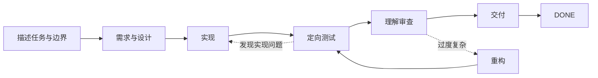

# Dev Flow

[简体中文](README.md) · [English](README_en.md) · [繁體中文](README_zh-TW.md) · [日本語](README_ja.md) · [한국어](README_ko.md) · [Español](README_es.md) · [Français](README_fr.md) · [Deutsch](README_de.md) · [Português (Brasil)](README_pt-BR.md)

> 让 Codex 和 DeepSeek 在长任务中守住范围、控制验证，并在中断后继续。

[](https://www.npmjs.com/package/dev-flow-codex)
[](https://www.npmjs.com/package/dev-flow-deepseek)
[](https://github.com/Innocent-children/dev-flow/actions/workflows/ci.yml)
[](LICENSE)

Dev Flow 为 AI 编程任务提供一份**独立于聊天记录的本地任务状态**。它记住：

- 这次任务允许改什么，不允许扩展到什么；
- 当前进行到需求、设计、实现、测试还是交付；
- 约定了多少验证，哪些证据已经完成；
- 会话中断或写入结果不确定时，应该恢复、阻塞还是安全重试。

**它不是另一个编程 Agent，也不是任务编排器。** Codex 和 DeepSeek 仍负责读代码、改代码和运行
命令；Dev Flow 只管理一个开发任务的范围、阶段、验证强度、证据和恢复。

**从这里开始：** [两分钟看懂一次完整任务](docs/DEMO.md) ·
[查看当前版本与真实证据](docs/PROJECT-STATUS.md) · [安装稳定版](#安装稳定版)

> 本 README 介绍当前 `main` 的能力。npm `@latest` 是经过最终制品验证的稳定版，可能晚于
> `main`；稳定版、beta 和源码的准确差异见[项目状态页](docs/PROJECT-STATUS.md)。

## 30 秒理解

| 直接使用 Agent 时 | Dev Flow 增加的能力 |
| --- | --- |
| Prompt 反复强调“不要扩大范围” | Task 保存原始意图，每一步明确允许做什么 |
| 会话重启后重新扫描仓库、猜测进度 | 当前阶段、证据和阻塞原因保存在本地，可直接恢复 |
| 定向检查逐渐扩成全量回归或平台矩阵 | 每个 Task 都有明确的 verification budget |
| 测试通过，但实现仍难以解释和接手 | 交付前经过 `COMPREHENSION_REVIEW` |
| 写操作响应丢失后直接重试，可能重复副作用 | 先读取权威状态，再依据 Recovery 结论行动 |

## 看一次任务如何运行



如果 Host 在实现后重启，新会话读取同一个 Task，仍能得到当前阶段、已完成证据、剩余验证预算和
合法下一步，而不是从聊天记录重新推断。仓库中保留了真实 Codex 与 DeepSeek Journey 的结构化证据；
详见[两分钟演示](docs/DEMO.md)。

## 它在工具链中的位置

| 工具 | 负责什么 |
| --- | --- |
| Codex / DeepSeek Harness | 读取仓库、修改代码、运行命令 |
| Spec Kit / OpenSpec | 提供需求、设计和任务拆分方法 |
| Dev Flow | 保存一个任务的范围、阶段、验证预算、返工路径和恢复状态 |

一个 Spec Kit 文档、OpenSpec checkbox 或成功的测试命令都不会自行推进 Task；状态只由 Go Core
在校验当前 Action 后更新。

## 安装稳定版

当前稳定制品支持 **macOS arm64** 和 **Node.js `>=24`**。精确版本与 Host 兼容范围见
[Support Matrix](docs/SUPPORT-MATRIX.md)。

安装、升级、修复、重装、卸载和清空后重装统一使用下方的 `dev-flow` 入口；Host
原生命令保留为诊断恢复入口。
交互界面按当前 locale 显示：`zh*` 使用简体中文，其余 locale 统一使用英文。

### Codex

```bash
npm install -g @imotong/dev-flow@latest
dev-flow
```

进入 Git 仓库后，使用精确 selector 启动 Dev Flow：

```text
$dev-flow-codex:dev-flow Fix idempotency in the order-creation endpoint and run targeted tests.
```

完整安装、升级和移除方式见 [Codex 使用说明](packages/codex/README.md)。

### DeepSeek Harness

```bash
npm install -g @imotong/dev-flow@latest
dev-flow
```

重启 profile 后，在对话中输入：

```text
/dev-flow Fix idempotency in the order-creation endpoint and run targeted tests.
```

完整说明见 [DeepSeek 使用说明](packages/deepseek/README.md)。

## 适合什么任务

Dev Flow 适合：

- 需要经历需求、设计、实现、测试和交付多个阶段的真实仓库任务；
- 可能返工，并需要保留验证证据的修改；
- 会跨会话、跨天或在 Host 重启后继续的工作；
- 需要明确限制测试强度，或要求开发者在交付前真正理解实现的任务；
- 由一个主仓库和少量显式附加仓库共同完成的有界任务。

一次性问答、无需保留状态的机械性单文件修改，直接使用 Codex 或 DeepSeek 通常更简单。

## 核心能力

### 显式范围

`TaskIntent` 保存最初请求、验收条件和范围外事项。实质性需求或设计变化必须通过受控流转返回相应
阶段，不能悄悄扩大当前步骤的权限。

### 有界验证

每个 Task 都保存 verification budget。检查应直接关联当前阶段、变更范围、验收条件或已知恢复风险；
完整回归、平台矩阵和压力测试不是默认动作。

### 跨会话恢复

当前阶段、需求/设计/任务基线、证据、阻塞原因和合法下一步保存在本地 SQLite。卸载 Host 集成时，
Task 数据默认保留。

### 理解审查

测试通过后仍需经过 `COMPREHENSION_REVIEW`。无法清楚解释或维护的实现可以回到设计、实现或重构，
任何仓库变更都必须重新通过测试。

### 不确定写入恢复

写操作携带 revision、Action identity、source cursor 和 repository binding。响应丢失或中断时，
Core 使用提交前保存的规范化 Action 输入给出五分类 Recovery 结论；调用者只需保留 Task ID 和
Action ID，不再保存或重建原始 payload。

允许写入的 Action 在结果中提交相对当前 Action 签发状态新产生的精确 `changed_paths`，或在本节点未改文件时提交 `no_file_changes`。Core 以签发基线、当前
`allowed_effects` 和 fresh Git observation 验证；合法 worktree 结果可由原 Action 提交，branch、
HEAD、repository identity 或未声明路径变化仍返回 `REPOSITORY_DRIFT`。若仓库状态完全一致但结果声明了文件变化，Core 返回 `repository_effect_not_observed` 字段错误，Host 可将本节点结果纠正为无文件变化。
节点结果在暂存 Action 提交前还会按当前 Task 做语义预检；revision、record、evidence 集合和 acceptance 等可从 Core 唯一复制的错误返回 `allowed_paths`，Host 只可纠正这些字段一次。测试结论、用户确认和工作内容等不能安全推导的错误只返回字段信息，不授权自动纠正。

### 有界多仓库范围

当前源码允许一个 Task 显式声明一个主仓库和最多七个附加仓库。所有仓库共享同一个阶段、Action、
revision、验证预算和结果；系统不会扫描相邻目录、依赖或代码索引来自动扩大范围。该能力是否已进入
稳定版，请以[项目状态页](docs/PROJECT-STATUS.md)为准。

## 边界

- Core 只对 Git 做有界、只读观察；不会执行 commit、push、merge、rebase、tag 或发布。
- 真正的文件修改和命令执行仍由用户授权的 Host 完成。
- Dev Flow 不会拦截 Host 的每一次文件读写，也不是通用安全沙箱。
- 当前源码包含仅监听 loopback 的共享 WebUI，前端支持简体中文/英文、首次跟随系统语言并允许浏览器内切换；不包含远程 MCP、遥测、用户自定义流程图或自动历史数据迁移。
- 可选代码索引只提供检索结果，不能决定仓库范围、权限、Recovery 或流程状态。

安全边界见 [Security Policy](SECURITY.md) 和 [Threat Model](docs/THREAT-MODEL.md)。

## 当前稳定支持

| 产品 | 稳定版本 | Bundled Core | 已验证环境 |
| --- | --- | --- | --- |
| `dev-flow-codex` | `0.7.5` | `0.6.4` | macOS arm64、Node.js `>=24`、Codex `>=0.147.0` |
| `dev-flow-deepseek` | `0.7.5` | `0.6.4` | macOS arm64、Node.js `>=24`、DSH `>=0.1.0-rc.6` |

这些声明来自公开制品和最终 Host Journey，而不是只来自“源码可构建”或“测试通过”。完整证据与
beta/source 状态见 [Project Status](docs/PROJECT-STATUS.md) 和
[Support Matrix](docs/SUPPORT-MATRIX.md)。

## 文档

| 想了解什么 | 入口 |
| --- | --- |
| 两分钟理解真实流程 | [Demo](docs/DEMO.md) |
| 当前稳定版、beta、源码和证据 | [Project Status](docs/PROJECT-STATUS.md) |
| 产品能力与边界 | [Product](docs/PRODUCT.md) |
| Core、Adapter、Store 与 Recovery | [Architecture](docs/ARCHITECTURE.md) |
| 支持版本和平台 | [Support Matrix](docs/SUPPORT-MATRIX.md) |
| 用户命令与 MCP 工具 | [Command Reference](docs/COMMANDS.md) |
| 本地 WebUI 与 CLI-only reset | [WebUI](docs/WEBUI.md) |
| 后续方向 | [Roadmap](docs/ROADMAP.md) |
| 安全报告与威胁模型 | [Security](SECURITY.md) · [Threat Model](docs/THREAT-MODEL.md) |
| 提交 Issue 或 Pull Request | [Contributing](CONTRIBUTING.md) |
| 维护者发布流程 | [Release](release/README.md) |

## 本地开发

需要 Go `>=1.26`、Node.js `>=24` 和 pnpm `>=11 <12`：

```bash
pnpm install --frozen-lockfile
pnpm run validate
```

## License

[Apache License 2.0](LICENSE)
