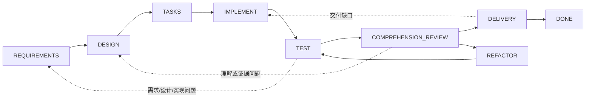

# Dev Flow

Dev Flow 是一个由 Go Core 状态图驱动的开发过程管理工具。它记录开发者当前位于需求、
设计、任务拆分、实现、测试、理解审查、重构或交付中的哪个节点，并返回该节点的目标、完成
条件、证据要求和全部合法下一流转。Codex 等 Host 负责执行用户明确授权的工作；Core 是任务、
过程、流转、恢复和终态的唯一权威。

Dev Flow 解决的是开发过程容易失去上下文的问题：开发者或 AI 可能跳过需求和设计、在测试
通过后直接交付难以维护的实现，或在中断和不确定 mutation 后凭聊天记录猜测下一步。一个
Core 读取即可回答“当前在哪里、需要完成什么、可以去哪里以及为什么”。

当前产品版本是 `0.5.0`，公开产品仍只有 Codex-only macOS arm64。Feature 009 的 `0.4.0`
发布以及更早的 Tag、npm 包、Release 和 Features 001–008 证据保持冻结。当前公开状态与精确
制品摘要以 npm `dev-flow-codex@0.5.0` 和 GitHub Release `v0.5.0` 的发布记录为准。Feature 010
只授权 DeepSeek 的 source-local 实施与验收，不构成公开 DeepSeek 版本或支持声明。

## 开发过程图

当前源码只包含内建的 `standard-development@1`，共有 9 个正常工作节点、`DONE` 终态以及
`BLOCKED`、`CANCELLED` 两个异常节点，合计 11 个节点和 29 条正常流转。



图中的虚线只概括受控回退。精确的 29 条边、guard、问题分类和 reason 规则见
[Development Process Graph Contract](specs/008-refactor-to-development-process-graph/contracts/process-graph.md)。
调用者只提交 Core 返回的 `transition_id`；目标节点由 Core 推导，Adapter 不能提供或发明
destination。

每个当前 Action 至少返回：

- 当前 process、节点和 action identity；
- 节点目的、进入条件和完成条件；
- 允许的 Host 副作用与所需证据；
- 选定的 method profile 和 tool-neutral semantic method steps；
- 全部合法 transitions，以及每条 transition 的 destination、guard、选择条件和 reason 规则。

需求修订、设计返工、测试失败、理解失败、重构和交付拒绝都会通过显式边回到正确节点，并
使下游过期 authority 失效。状态图记录真实迭代，而不是假设开发只能线性成功。

## 理解审查与重构

```text
TEST 通过 ≠ 可以直接交付
```

测试通过后必须进入 `COMPREHENSION_REVIEW`。开发者明确确认能够解释和维护当前实现后，
任务才可进入 `DELIVERY`。如果结果难以理解，可以按 Core 返回的边进入：

- `REFACTOR`：代码存在不必要复杂度；
- `DESIGN`：设计本身过度复杂；
- `TEST`：验证证据不足；
- `REQUIREMENTS`：需求仍不清楚；
- `IMPLEMENT`：实现存在缺陷。

任何改变仓库内容的重构都必须回到 `TEST`，重新建立测试和理解证据。

## Method profiles

新任务选择且始终保留一个 profile：

```text
plain
spec-kit
openspec
```

三种 profile 共用同一个 Core 状态图。Spec Kit 和 OpenSpec 只帮助完成当前节点的 semantic
method steps；它们不保存第二个游标，checkbox、archive 或命令成功也不会直接推进 Core。
工具不可用时，Adapter 会诚实报告 capability unavailable，并可执行合同允许的
plain-equivalent work；只有一次有效的 Core apply 才能完成流转。

## 不确定 mutation 与 Recovery

调用者在 mutation 前保留 operation identity、source cursor、revision、action、repository
binding 和原始 closed payload。响应缺失、取消、损坏、截断或传输失败时不得盲目重试：先用
operation probe 读取 Core 的权威状态。Core 会给出以下五类之一：

```text
not_started
completed_and_recorded
completed_but_unrecorded
partially_completed
conflicting
```

只有 Core 能决定安全重试、recovery apply 或进入 `BLOCKED`。阻塞解除后，任务只返回保存的
resume node。详细合同见 [MCP Tools 0.2](specs/008-refactor-to-development-process-graph/contracts/mcp-tools-0.2.md)。

## 存储边界

当前图源码使用：

```text
SQLite Schema 2
Snapshot Version 2
standard-development@1
```

Feature 008 不兼容任何历史 Task。检测到 Schema 1 或其他 pre-graph 数据时，Core 返回
`SCHEMA_UNSUPPORTED`，并且不修改、不迁移、不删除也不自动 reset 旧数据。用户必须显式使用
新的 `DEV_FLOW_DATA_DIR`，或在 Core 外部手工 archive、rename 或 delete 旧目录。setup、update、
remove 和 uninstall 同样不会自动清除任务数据。完整边界见
[Storage Generation 2 Contract](specs/008-refactor-to-development-process-graph/contracts/storage-generation-2.md)。

## 使用入口与发布边界

Codex Skill 只接受精确显式 selector：

```text
$dev-flow-codex:dev-flow
```

Codex-only `0.5.0` 的标准安装入口是：

```bash
npm install -g dev-flow-codex@0.5.0
dev-flow-codex setup
```

版本、支持平台、历史数据边界和精确制品证据见对应 npm/GitHub Release 与
[Codex package README](packages/codex/README.md)。

Core 的公开 MCP 工具仍恰好六个：

```text
dev_flow_server_info
dev_flow_open_task
dev_flow_get_task
dev_flow_get_next_action
dev_flow_apply_action
dev_flow_cancel_task
```

传输仅限 local STDIO。Core 可以有界、只读地观察 Git，但不会 checkout、reset、clean、stash、
commit、merge、rebase、push、tag、publish 或暴露 generic shell。

## 开发与验证

工具链为 Go `>=1.26`、Node.js `>=24` 和 pnpm `>=11 <12`；具体基线见
[Toolchain Baselines](docs/TOOLCHAIN-BASELINES.md)。

Feature 008 的阶段性实现只运行活动任务批准的定向检查。最终门禁已经用以下入口完成唯一一次
repository-wide 验证：

```bash
pnpm run validate
```

该命令已通过；它不发布 npm、不创建 Tag/Release，也不执行真实 Host Journey。Feature 008 的
真实 Host graph-flow evidence 来自保留的 Attempt 3 session，package/data lifecycle 由同一精确
artifact 的 no-Codex deterministic acceptance 独立证明。

## 目录与权威

| 路径 | 职责 |
| --- | --- |
| `cmd/dev-flow/` | CLI、version 和 local STDIO server |
| `internal/domain/` | ProcessTask、TaskIntent、baselines、evidence、outcome 和 limits |
| `internal/workflow/` | `standard-development@1`、node/transition 和 payload authority |
| `internal/recovery/` | 五类 reconciliation、blocker 和 read-before-retry authority |
| `internal/repository/` | 只读 Git observation 和 binding digest |
| `internal/store/` | Fresh Schema 2、strict snapshot-v2、CAS、events 和 claims |
| `internal/application/` | Core use-case orchestration |
| `internal/mcp/` | Contract 0.2 六工具、closed JSON 和 typed envelope |
| `packages/codex/` | explicit-only Codex Adapter、Skill、method renderer 和 public package |
| `packages/deepseek/` | Feature 010 管理的 private source package；完成与发布前不构成支持声明 |
| `protocol/fixtures/` | 历史 0.1、当前 0.2、Host parity 和 Recovery fixtures |
| `tests/contract/`, `tests/journeys/` | deterministic contract 与 process evidence |

阅读顺序从 [Constitution](.specify/memory/constitution.md)、
[Spec Kit Workflow](docs/SPEC-KIT-WORKFLOW.md) 开始。当前 Feature 的完整规格入口是
[Feature 010](specs/010-deepseek-explicit-graph-host/README.md)；当前 Core 基线仍由
[Feature 008](specs/008-refactor-to-development-process-graph/README.md) 定义。稳定产品边界、
支持矩阵和实现结构分别见 [Product](docs/PRODUCT.md)、[Support Matrix](docs/SUPPORT-MATRIX.md)
与 [Architecture](docs/ARCHITECTURE.md)。
