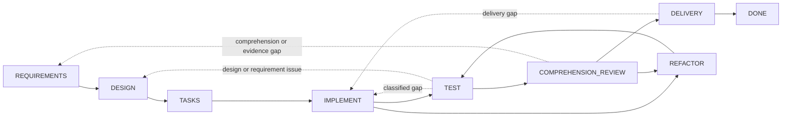

# Dev Flow

[简体中文](README.md) · [English](README_en.md) · [繁體中文](README_zh-TW.md) · [日本語](README_ja.md) · [한국어](README_ko.md) · [Español](README_es.md) · [Français](README_fr.md) · [Deutsch](README_de.md) · [Português (Brasil)](README_pt-BR.md)

> Expliziter Umfang, Verifikationsbudget und wiederherstellbarer Zustand für KI-gestützte Coding-Aufgaben.

[](https://www.npmjs.com/package/dev-flow-codex)
[](https://www.npmjs.com/package/dev-flow-deepseek)
[](https://github.com/Innocent-children/dev-flow/actions/workflows/ci.yml)
[](LICENSE)

Dev Flow ist eine lokale Prozesssteuerungs- und Recovery-Schicht für KI-gestützte Softwareentwicklung. Es
organisiert Anforderungen, Design, Aufgabenplanung, Implementierung, Tests, Verständlichkeitsprüfung,
Refactoring und Auslieferung als Zustandsgraph, der von einem Go Core verwaltet wird. Codex, DeepSeek Harness
und andere Host Adapter ändern Repositories und führen Werkzeuge aus; Core hält Task, aktuellen Knoten,
Knotenvertrag, Verifikationsbudget, zulässige Transitionen und das Recovery-Ergebnis.

## Typische Fehlermodi in Agent-Workflows

| Fehlermodus | Typisches Verhalten |
| --- | --- |
| Scope Drift | Eine lokale Änderung wächst zu Refactorings benachbarter Module, generischen Abstraktionen, zusätzlicher Dokumentation oder nicht angeforderten Zukunftsfunktionen |
| Unbegrenzte Verifikation | Ein gezielter Check wächst zu vollständiger Regression, Plattformmatrix, Lasttests oder einer ständig wachsenden Menge an Randfällen |
| Verlust des Prozesszustands | Nach Kontextkomprimierung, Host-Neustart oder Fortsetzung in einer späteren Sitzung muss der Fortschritt aus Chatverlauf und Worktree rekonstruiert werden |
| Wartbarkeitslücke | Tests bestehen, aber ein Entwickler kann die Implementierung nicht klar erklären, reviewen oder übernehmen |
| Unklare Mutation | Eine fehlende oder unterbrochene Schreibantwort lässt offen, ob die Operation committed wurde, und macht Replay riskant |

Diese Probleme werden nicht zuverlässig gelöst, indem der Prompt um weitere Klauseln wie „nicht refactoren“ oder
„keine zusätzlichen Tests ausführen“ ergänzt wird. Der Entwicklungsprozess benötigt dauerhaften Zustand außerhalb
der Konversation sowie einen geschlossenen Vertrag für den aktuellen Schritt, seine Abschlussbedingungen und
seine zulässigen nächsten Transitionen.

## Steuerungsmodell

| Fehlermodus | Dev-Flow-Mechanismus |
| --- | --- |
| Scope Drift | `TaskIntent` hält die unveränderliche ursprüngliche Absicht; jede Action veröffentlicht completion conditions und `allowed_effects`; eine materielle Umfangsänderung muss eine zulässige Transition zum passenden Knoten verwenden, wo Core veraltete downstream authority invalidiert |
| Unbegrenzte Verifikation | Jeder Task trägt ein verification budget; Checks müssen zum aktuellen Knoten, zur geänderten Oberfläche, zu Akzeptanzkriterien oder einem bekannten Recovery-Risiko gehören; vollständige Suites und Plattformmatrizen sind keine Standardarbeit |
| Verlust des Prozesszustands | Aktueller Knoten, requirements/design/task-plan baselines, Evidenz, blocker und zulässige Transitionen werden in lokalem SQLite persistiert |
| Wartbarkeitslücke | Auf `TEST` folgt `COMPREHENSION_REVIEW`; eine nicht erklärbare oder wartbare Implementierung kehrt zu `DESIGN`, `IMPLEMENT` oder `REFACTOR` zurück und durchläuft nach Repository-Änderungen erneut `TEST` |
| Unklare Mutation | Mutationen tragen revision, action identity, source cursor und repository binding; Aufrufer müssen read-before-retry einhalten und dem fünfklassigen Recovery-Ergebnis folgen |

Core blockiert nicht statisch jede Repository-Änderung eines Hosts. Es stellt den autoritativen Action-Vertrag
bereit und validiert Task-Transitionen. Host Adapter müssen innerhalb der `allowed_effects` und des verification
budget des aktuellen Knotens arbeiten.

## Geeignete Einsatzfälle

Dev Flow eignet sich für reale Repository-Arbeit, die mehrere Entwicklungsknoten durchläuft, Nacharbeit erfordern
kann, Verifikationsevidenz bewahren muss oder sitzungsübergreifend fortgesetzt wird. Für eine einmalige Frage oder
eine mechanische Einzeldateiänderung ohne persistenten Prozesszustand ist Codex oder DeepSeek direkt meist
einfacher.

## Multi-Repository-Tasks und optionale Code-Indizierung

Ein Task kann das aktuelle Git-Repository ausdrücklich als primäres Repository verwenden und null
bis sieben zusätzliche Repositories aufnehmen. Alle Repositories teilen genau einen current node,
eine Action, revision, verification budget, Recovery, Blocker und Outcome. Dev Flow durchsucht keine
übergeordneten oder benachbarten Verzeichnisse, Abhängigkeiten oder Code-Indizes, um den Umfang zu
erweitern. Aufrufe für ein einzelnes Repository und normale relative Pfade bleiben kompatibel;
Multi-Repository-Pfade verwenden `<repository-key>::<repository-relative-path>` zur Zuordnung.

Optionale Präferenzen für die Code-Indizierung stammen aus der schreibgeschützten Datei
`$HOME/.dev-flow/config.json`:

```json
{
  "codex": { "codebase_memory": false },
  "deepseek": { "codebase_memory": true }
}
```

Fehlt das Verzeichnis oder die Datei, sind beide Werte `false`. `dev-flow-codex setup` erstellt die
vollständige Standardkonfiguration; DeepSeek behält den schreibgeschützten Standardwert bei. Setup
schreibt eine vorhandene Konfiguration nie um. Bei `true` verwendet der Host codebase-memory nur, wenn es bereits installiert und
verfügbar ist. Fehlt es oder fällt es aus, meldet der Host dies höchstens einmal pro Sitzung und
wechselt zur integrierten Suche, ohne den Task zu blockieren. Zusätzliche Codex-Repositories müssen
beim Sitzungsstart bereits autorisierte writable roots sein; Dev Flow ändert die Sandbox nicht. Alle
DeepSeek-Repositories müssen innerhalb des aktuellen Workspace Root liegen, das ein gemeinsames
Nicht-Git-Elternverzeichnis sein darf.

## Installation, Aktualisierung und Deinstallation

Öffentliche Artefakte unterstützen macOS arm64 und Node.js `>=24`; die Beispiele verwenden npm `latest`.
Codex und DeepSeek teilen die Standard-Task-Daten unter
`$HOME/Library/Application Support/dev-flow/data`.

### Codex

#### Installation und Prüfung

```bash
npm install -g dev-flow-codex@latest
dev-flow-codex setup
dev-flow-codex --version
```

Fehlt die Konfiguration, erstellt `setup` `$HOME/.dev-flow/config.json` und zeigt die tatsächlich
erstellten oder aktualisierten Konfigurations- und Receipt-Dateien, den Bereitschaftsstatus und genau
einen nächsten Schritt. Interaktive Ausgabe folgt vereinfachtem Chinesisch oder Englisch; nicht
interaktive Ausgabe und `NO_COLOR` sind Klartext, `setup --json` liefert undekorierte Maschinendaten.

`setup` registriert oder aktualisiert Codex marketplace, Plugin und MCP. Verwenden Sie im Git-Repository den
einzigen expliziten selector:

```text
$dev-flow-codex:dev-flow Add a failed-login attempt limit to this repository.
```

#### Aktualisierung

```bash
npm install -g dev-flow-codex@latest
dev-flow-codex setup
dev-flow-codex --version
```

#### Deinstallation mit Aufbewahrung der Task-Daten

```bash
dev-flow-codex remove
npm uninstall -g dev-flow-codex
```

Führen Sie `remove` immer zuerst aus. Eine kompatible Installation mit `setup` kann die Daten fortsetzen.

### DeepSeek Harness

#### Installation und Prüfung

Installieren Sie zuerst DSH und fügen Sie Dev Flow dann einem echten Profil hinzu. Das Beispiel nutzt `web`;
ändern Sie `PROFILE` für ein anderes Profil und geben Sie `<profile>` nicht wörtlich in die Shell ein.

```bash
npm install -g @deepseek-ai/dsh@latest
dsh --version
PROFILE=web
TARBALL="$(npm pack dev-flow-deepseek@latest --silent)"
dsh plugin --profile "$PROFILE" add "$PWD/$TARBALL"
rm -f "$PWD/$TARBALL"
dsh --profile "$PROFILE" --dump-config
```

Starten Sie das Profil neu; für `web` mit `dsh web`. Nutzen Sie im Gespräch `/dev-flow <Aufgabe>`.

#### Aktualisierung

Stoppen Sie das Profil und führen Sie aus:

```bash
PROFILE=web
dsh plugin --profile "$PROFILE" remove dev-flow-deepseek
TARBALL="$(npm pack dev-flow-deepseek@latest --silent)"
dsh plugin --profile "$PROFILE" add "$PWD/$TARBALL"
rm -f "$PWD/$TARBALL"
dsh --profile "$PROFILE" --dump-config
```

Starten Sie das Profil neu. DSH selbst wird mit `npm install -g @deepseek-ai/dsh@latest` aktualisiert.

#### Deinstallation mit Aufbewahrung der Task-Daten

Führen Sie dies in jedem betroffenen Profil aus:

```bash
PROFILE=web
dsh plugin --profile "$PROFILE" remove dev-flow-deepseek
dsh --profile "$PROFILE" --dump-config
```

Wenn DSH nicht mehr benötigt wird: `npm uninstall -g @deepseek-ai/dsh`; `$HOME/.dsh` bleibt erhalten.

### Daten dauerhaft löschen

Entfernen Sie Dev Flow zuerst aus Codex und allen DSH-Profilen und bestätigen Sie, dass kein Task benötigt wird:

```bash
rm -rf "$HOME/Library/Application Support/dev-flow"
```

Dies ist nicht rückgängig zu machen. Bei `DEV_FLOW_DATA_DIR` prüfen und löschen Sie das genaue absolute
Verzeichnis separat. Das Löschen von `$HOME/.dsh` entfernt auch alle DSH-Profile, Sitzungen und anderen Plugins.
Details: [Codex package README](docs/CODEX_en.md), [DeepSeek package README](docs/DEEPSEEK_en.md) und
[Command Reference](docs/COMMANDS_en.md).

## Ausführungsmodell

1. Der Entwickler beschreibt einen Task im aktuellen Git-Repository über einen expliziten selector.
2. Core öffnet oder setzt den Task des Repositories fort und liefert aktuellen Knoten, Abschlussbedingungen, `allowed_effects`, Evidenzanforderungen, verification budget und alle zulässigen Transitionen.
3. Der Host führt die aktuelle Action aus. Eine materielle Änderung von Anforderungen, Design oder Implementierung wird über eine von Core gelieferte Transition gemeldet statt im aktuellen Knoten verborgen.
4. Core validiert `transition_id`, guard, revision und payload, bevor der Task fortgesetzt wird. Fehlgeschlagene Tests, fehlende Verständlichkeit oder abgelehnte Auslieferung führen zum entsprechenden Knoten zurück.
5. Ist eine Mutation-Antwort unklar, liest der Host zuerst Task und Recovery assessment, bevor Recovery, Blockierung oder sicherer retry gewählt wird.

## Komponentengrenzen

| Komponente | Verantwortung |
| --- | --- |
| Codex / DeepSeek Harness | Repository lesen, Code ändern, Werkzeuge ausführen und Ergebnisse sowie Evidenz des aktuellen Knotens einreichen |
| Spec Kit / OpenSpec | Methoden und Artefakte für requirements, design, tasks und verwandte Knoten bereitstellen |
| Tests / CI | Evidenz für Verhaltensverifikation erzeugen |
| Dev Flow Core | Einzigen process cursor, Knotenvertrag, verification budget, zulässige Transitionen, Recovery und terminales Ergebnis halten |

Ein Spec-Kit-Artefakt, eine OpenSpec checkbox oder ein erfolgreicher Befehl kann einen Task nicht selbstständig
fortsetzen. Nur eine gültige Core action submission ändert den autoritativen Zustand.

## Entwicklungsgraph

Core stellt einen integrierten Prozess bereit, `standard-development`: acht Arbeitsknoten, den terminalen Knoten
`DONE` sowie die Ausnahmeknoten `BLOCKED` und `CANCELLED`. 29 Transitionen decken Fortschritt und reale Nacharbeit
ab.



Gepunktete Linien fassen mehrere kontrollierte Rücksprünge zusammen. Exakte Knoten, alle 29 Transitionen, guards
und reason rules sind in [`internal/workflow/`](internal/workflow/) definiert. Ein Host sendet nur eine von Core
zurückgegebene `transition_id`; Core leitet die destination ab.

Jede aktuelle Action liefert:

- process, node, revision und action identity;
- purpose, entry assumptions, completion conditions, `allowed_effects`, `required_evidence` und verification budget;
- semantic method steps des gewählten method profile;
- alle zulässigen Transitionen mit destination, guard, Auswahlbedingung und reason rule.

## Runtime-Grenze

Core stellt exakt sechs Werkzeuge über lokales STDIO MCP bereit:

```text
dev_flow_server_info
dev_flow_open_task
dev_flow_get_task
dev_flow_get_next_action
dev_flow_apply_action
dev_flow_cancel_task
```

Die Lese-/Schreibklassifikation, Eingaberolle und das Verhalten jedes Werkzeugs stehen in der
[Command Reference](docs/COMMANDS_en.md).

Core darf die ein bis acht von einem Task ausdrücklich deklarierten bestehenden Git-Repositories in fester
Reihenfolge begrenzt und schreibgeschützt beobachten, um repository bindings herzustellen und Änderungsfakten
auszuwerten. Git-Mutationen führt ein vom Benutzer autorisierter Host aus. Core stellt keine generische Shell bereit
und führt weder checkout, commit, push, merge, rebase, tag noch Veröffentlichung aus.

## Daten und Recovery

Task-Daten liegen standardmäßig in einem vom Host-Produkt verwalteten lokalen Datenverzeichnis.
`DEV_FLOW_DATA_DIR` kann auf ein vorhandenes, nutzbares absolutes Verzeichnis zeigen. Entfernen oder Deinstallieren
einer Host-Integration behält Task-Daten bei.

Die Graph-Runtime akzeptiert nur das aktuelle SQLite Schema und einen strikten snapshot. Inkompatible oder
pre-graph-Daten liefern `SCHEMA_UNSUPPORTED` ohne Schreibvorgang. Der Benutzer kann ein neues Datenverzeichnis
wählen oder das alte außerhalb von Core archivieren, umbenennen oder löschen. Lifecycle-Befehle führen diese
Bereinigung niemals automatisch aus.

## Aktueller Support

| Produkt | Öffentliche Version | Bundled Core | Verifizierte Umgebung |
| --- | --- | --- | --- |
| `dev-flow-codex` | `0.5.3` | `0.5.1` | macOS arm64, Node.js `>=24`, Codex `>=0.147.0` |
| `dev-flow-deepseek` | `0.5.2` | `0.5.1` | macOS arm64, Node.js `>=24`, DSH `>=0.1.0-rc.6` |

Die aktuellen Releases beider Host-Produkte bestanden Installation aus dem registry package, realen Host/Core handshake, Entfernung,
Deinstallation und repository-unchanged gate. Der DeepSeek journey umfasste zusätzlich explizite Aktivierung,
Recovery nach Neustart, `DONE` und retained reopen. Exakte Artefaktidentitäten und Evidenz stehen in der
[Support Matrix](docs/SUPPORT-MATRIX_en.md) und den zugehörigen GitHub Releases.

## Dokumentation

Technische Referenzdokumente werden derzeit auf Englisch und vereinfachtem Chinesisch gepflegt.

| Thema | Dokument |
| --- | --- |
| Produktprobleme, Fähigkeiten und Grenzen | [Product](docs/PRODUCT_en.md) |
| Architektur von Core, Adapter, Store und Recovery | [Architecture](docs/ARCHITECTURE_en.md) |
| Unterstützte Versionen und Plattformen | [Support Matrix](docs/SUPPORT-MATRIX_en.md) |
| Alle Benutzerbefehle, verwalteten Core-Befehle und MCP-Werkzeuge | [Command Reference](docs/COMMANDS_en.md) |
| Gelieferte Fähigkeiten und zukünftige Richtung | [Roadmap](docs/ROADMAP_en.md) |
| Unabhängige Produktversionierung | [Versioning](docs/VERSIONING.md) |
| Dokumentations-locales und Synchronisationsregeln | [I18n](docs/I18N_en.md) |
| Lokale Entwicklungs-Toolchains | [Toolchain Baselines](docs/TOOLCHAIN-BASELINES.md) |
| Product-Feature-Governance | [Spec Kit Workflow](docs/SPEC-KIT-WORKFLOW.md) |
| Issue melden oder Pull Request öffnen | [Contributing](CONTRIBUTING_en.md) |
| Release-Einstieg für Maintainer | [Release](release/README.md) |

## Lokale Entwicklung

Dev Flow benötigt Go `>=1.26`, Node.js `>=24` und pnpm `>=11 <12`:

```bash
pnpm install --frozen-lockfile
pnpm run validate
```

`pnpm run validate` führt begrenzte Repository-Validierung aus. Es installiert keine realen Host-Produkte und
veröffentlicht keine npm-Pakete, Tags oder GitHub Releases. Siehe
[Architecture](docs/ARCHITECTURE_en.md) für Verzeichnisverantwortung und
[Repository Scripts](scripts/README_en.md) für Skript-Einstiegspunkte.

## Mitwirken

Reproduzierbare Fehler, Dokumentationsverbesserungen, Plattformunterstützung mit finaler Artefaktevidenz und
klar begrenzte Produktvorschläge sind willkommen. Lesen Sie vorab den
[Beitragsleitfaden](CONTRIBUTING_en.md). Product-Feature-Änderungen müssen alle gepflegten root-README-locales,
`docs/PRODUCT*` und betroffene technische Referenzen synchronisieren; die genaue Regel steht unter
[I18n](docs/I18N_en.md).

## License

[Apache License 2.0](LICENSE)
