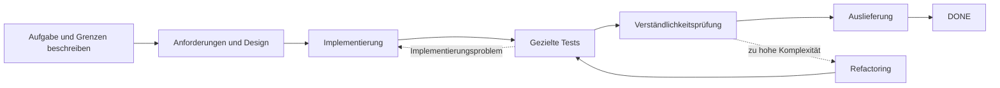

# Dev Flow

[简体中文](README.md) · [English](README_en.md) · [繁體中文](README_zh-TW.md) · [日本語](README_ja.md) · [한국어](README_ko.md) · [Español](README_es.md) · [Français](README_fr.md) · [Deutsch](README_de.md) · [Português (Brasil)](README_pt-BR.md)

> Hält Codex und DeepSeek im Umfang, begrenzt Verifikation und setzt unterbrochene Aufgaben fort.

[](https://www.npmjs.com/package/dev-flow-codex)
[](https://www.npmjs.com/package/dev-flow-deepseek)
[](https://github.com/Innocent-children/dev-flow/actions/workflows/ci.yml)
[](LICENSE)

Dev Flow gibt KI-Coding-Aufgaben einen **lokalen, dauerhaften Zustand außerhalb des Chats**. Es merkt sich:

- was diese Aufgabe ändern darf und was ausdrücklich außerhalb des Umfangs liegt;
- ob die Arbeit bei Anforderungen, Design, Implementierung, Tests oder Auslieferung steht;
- wie viel Verifikation vereinbart wurde und welche Evidenz bereits vorhanden ist;
- ob eine unterbrochene oder unklare Schreiboperation wiederhergestellt, blockiert oder sicher wiederholt werden soll.

**Es ist weder ein weiterer Coding-Agent noch ein Task-Orchestrator.** Codex und DeepSeek lesen weiterhin
Repositories, ändern Code und führen Befehle aus. Dev Flow verwaltet Umfang, Phase, Verifikationsaufwand,
Evidenz und Recovery einer einzelnen Entwicklungsaufgabe.

**Hier beginnen:** [Zwei-Minuten-Ablauf](docs/DEMO_en.md) ·
[aktuelle Versionen und reale Evidenz](docs/PROJECT-STATUS_en.md) ·
[stabile Version installieren](#stabile-version-installieren)

> Dieses README beschreibt die Fähigkeiten von `main`. npm `@latest` ist die mit dem finalen Artefakt
> verifizierte stabile Version und kann hinter `main` liegen. Die genaue Trennung von stable, beta und
> source steht unter [Project Status](docs/PROJECT-STATUS_en.md).

## In 30 Sekunden verstehen

| Ohne Dev Flow | Was Dev Flow ergänzt |
| --- | --- |
| Der Prompt wiederholt „Umfang nicht erweitern“ | Der Task behält die ursprüngliche Absicht und jede Phase nennt erlaubte Änderungen |
| Eine neu gestartete Sitzung scannt erneut und errät den Fortschritt | Phase, Evidenz und blocker werden lokal gespeichert |
| Ein gezielter Check wächst zu kompletter Suite oder Plattformmatrix | Jeder Task hat ein explizites verification budget |
| Tests bestehen, aber das Ergebnis bleibt schwer erklärbar oder wartbar | Vor der Auslieferung steht `COMPREHENSION_REVIEW` |
| Eine verlorene Schreibantwort wird riskant wiederholt | Vor dem retry wird der autoritative Zustand gelesen |

## Ablauf einer Aufgabe



Nach einem Host-Neustart liest die neue Sitzung denselben Task und erhält aktuelle Phase, abgeschlossene
Evidenz, verbleibendes Budget und zulässige nächste Schritte. Der Prozess muss nicht aus dem Chatverlauf
rekonstruiert werden. Siehe [Demo](docs/DEMO_en.md).

## Rolle in der Werkzeugkette

| Werkzeug | Verantwortung |
| --- | --- |
| Codex / DeepSeek Harness | Repositories lesen, Code ändern und Befehle ausführen |
| Spec Kit / OpenSpec | Methoden für Anforderungen, Design und Aufgabenplanung liefern |
| Dev Flow | Umfang, Phase, Budget, Nacharbeitswege und Recovery einer Aufgabe speichern |

## Stabile Version installieren

Aktuelle stabile Artefakte unterstützen **macOS arm64** und **Node.js `>=24`**. Exakte Versionen und
Host-Kompatibilität stehen in der [Support Matrix](docs/SUPPORT-MATRIX_en.md).

Nach der separaten Veröffentlichung verwaltet der folgende `create-dev-flow`-Einstieg Installation, Upgrade,
Reparatur, Neuinstallation, Deinstallation und saubere Neuinstallation. Das aktuelle öffentliche npm-Stable enthält
dieses neue Package noch nicht; native Host-Befehle bleiben der Vorab- und Diagnose-Recovery-Weg.

### Codex

```bash
npx @imotong/create-dev-flow@latest
```

Dev Flow erzwingen:

```text
$dev-flow-codex:dev-flow Fix idempotency in the order-creation endpoint and run targeted tests.
```

Details im [Codex-Leitfaden](docs/CODEX_en.md).

### DeepSeek Harness

```bash
npx @imotong/create-dev-flow@latest
```

Profil neu starten und eingeben:

```text
/dev-flow Fix idempotency in the order-creation endpoint and run targeted tests.
```

Details im [DeepSeek-Leitfaden](docs/DEEPSEEK_en.md).

## Geeignete Aufgaben

- reale Repository-Arbeit über Anforderungen, Design, Implementierung, Tests und Auslieferung;
- Änderungen mit möglicher Nacharbeit und aufzubewahrender Evidenz;
- Aufgaben über mehrere Sitzungen, Tage, Kontextkomprimierungen oder Host-Neustarts;
- Arbeit mit explizitem Verifikationslimit oder Verständlichkeitsprüfung;
- begrenzte Aufgaben über ein primäres und wenige ausdrücklich genannte zusätzliche Repositories.

Eine einmalige Frage oder mechanische Einzeldateiänderung ohne dauerhaften Zustand ist meist direkt mit
Codex oder DeepSeek einfacher.

## Hauptfähigkeiten

- **Expliziter Umfang:** `TaskIntent` hält Anfrage, Akzeptanzkriterien und Ausschlüsse fest.
- **Begrenzte Verifikation:** Jeder Task hat ein verification budget; vollständige Matrizen sind nicht Standard.
- **Sitzungsübergreifende Recovery:** Phase, Evidenz, blocker und nächste Schritte liegen in lokalem SQLite.
- **Verständlichkeitsprüfung:** Nach Tests folgt `COMPREHENSION_REVIEW`; nicht wartbare Ergebnisse gehen zurück.
- **Unklare Schreiboperation:** Core speichert die normalisierte Action-Eingabe; nach einer verlorenen Antwort genügen Task ID und Action ID, ohne den Payload neu aufzubauen.
- **Begrenzte Multi-Repository-Scope:** Der aktuelle Source verwaltet ein primäres und bis zu sieben zusätzliche Repositories in einem Zustand.

Ob Multi-Repository bereits stabil ist, steht unter [Project Status](docs/PROJECT-STATUS_en.md).

## Grenzen

- Core beobachtet Git begrenzt und schreibgeschützt; kein commit, push, merge, rebase, tag oder publish.
- Dateiänderungen und Befehle bleiben Verantwortung des vom Benutzer autorisierten Hosts.
- Dev Flow fängt nicht jede Host-Operation ab und ist keine allgemeine Sicherheits-Sandbox.
- Der aktuelle Quellcode enthält eine gemeinsame, nur über Loopback erreichbare WebUI mit vereinfachtem Chinesisch/Englisch, Systemsprachenauswahl und lokaler Browser-Umschaltung; remote MCP, telemetry, benutzerdefinierte Graphen und automatische Alt-Datenmigration bleiben ausgeschlossen.
- Ein optionaler Code-Index unterstützt nur die Suche und entscheidet nicht Umfang, Berechtigung, Recovery oder Zustand.
- Eine schreibberechtigte Action meldet exakte `changed_paths` oder `no_file_changes`. Core prüft sie gegen die Ausgabebaseline und eine fresh Git observation; autorisierte Änderungen können mit der ursprünglichen Action abgeschlossen werden, während Änderungen an branch, HEAD, repository identity oder nicht deklarierte Pfade weiterhin `REPOSITORY_DRIFT` ergeben.

Siehe [Security Policy](SECURITY.md) und [Threat Model](docs/THREAT-MODEL_en.md).

## Aktueller stabiler Support

| Produkt | Stabile Version | Bundled Core | Verifizierte Umgebung |
| --- | --- | --- | --- |
| `dev-flow-codex` | `0.7.3` | `0.6.2` | macOS arm64, Node.js `>=24`, Codex `>=0.147.0` |
| `dev-flow-deepseek` | `0.7.2` | `0.6.1` | macOS arm64, Node.js `>=24`, DSH `>=0.1.0-rc.6` |

Exakte Evidenz und beta/source-Status stehen unter [Project Status](docs/PROJECT-STATUS_en.md) und
[Support Matrix](docs/SUPPORT-MATRIX_en.md).

## Dokumentation

| Gesucht | Einstieg |
| --- | --- |
| Eine reale Aufgabe in zwei Minuten verstehen | [Demo](docs/DEMO_en.md) |
| stable, beta, source und Evidenz | [Project Status](docs/PROJECT-STATUS_en.md) |
| Produktfähigkeiten und Grenzen | [Product](docs/PRODUCT_en.md) |
| Architektur | [Architecture](docs/ARCHITECTURE_en.md) |
| Versionen und Plattformen | [Support Matrix](docs/SUPPORT-MATRIX_en.md) |
| Befehle und MCP-Werkzeuge | [Command Reference](docs/COMMANDS_en.md) |
| Lokale WebUI und Reset nur per CLI | [WebUI](docs/WEBUI_en.md) |
| Sicherheit | [Security](SECURITY.md) · [Threat Model](docs/THREAT-MODEL_en.md) |
| Mitwirken | [Contributing](CONTRIBUTING_en.md) |

## License

[Apache License 2.0](LICENSE)
