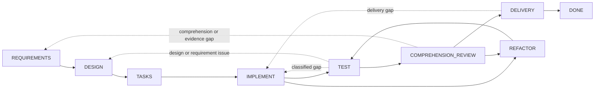

# Dev Flow

[中文](README.md) | [English](README_en.md)

> Keep a small AI coding task from turning into a sprawling project.

[](https://www.npmjs.com/package/dev-flow-codex)
[](https://www.npmjs.com/package/dev-flow-deepseek)
[](https://github.com/Innocent-children/dev-flow/actions/workflows/ci.yml)
[](LICENSE)

## You may have seen this already

- You ask an agent to change one endpoint. It also refactors neighboring modules, invents an abstraction,
  and adds documentation you never requested.
- You need one targeted test. It starts a full regression suite, platform matrix, and extra edge-case work,
  consuming time and tokens without a stopping rule.
- Chat context is compacted, the host restarts, or the task resumes the next day. The agent no longer knows
  where it stopped, rescans the repository, or repeats completed work.
- Tests pass, but the implementation is too complex for a developer to explain or maintain without asking
  another model.
- A write operation is interrupted, and nobody knows whether it committed. Retrying becomes a gamble.

The missing piece is usually not another model. It is a process boundary outside chat history that answers:
**what may be done now, what completes the step, how much verification is enough, and when the agent should stop.**

## What Dev Flow does

Dev Flow is a local navigation and recovery layer for AI-assisted development. It places requirements,
design, task planning, implementation, testing, comprehension review, refactoring, and delivery in a
Go Core-managed state graph. Codex, DeepSeek Harness, and other hosts work against the current node with
explicit completion conditions, allowed effects, required evidence, a verification budget, and legal next
transitions.

| Developer pain | Dev Flow constraint |
| --- | --- |
| A small request keeps expanding | Retain immutable original intent plus current requirements and design baselines; material scope changes return to the appropriate node and invalidate stale downstream evidence |
| The solution becomes increasingly elaborate | Passing tests still leads to `COMPREHENSION_REVIEW`; code that cannot be explained or maintained returns to `DESIGN` or `REFACTOR` |
| Testing never seems to end | Every Task carries a verification budget; checks must relate to the current node, changed surface, or acceptance criteria, while full suites and platform matrices are not default work |
| Context disappears after an interruption | The current node, baselines, evidence, blockers, and legal transitions live in local SQLite rather than only in chat history |
| A write result is uncertain | Read authoritative state first, then use five-class Recovery to decide whether to recover or retry; blind mutation replay is prohibited |

Dev Flow is not another model, a general-purpose coding agent, or a new specification format. Codex and
DeepSeek still read code, modify repositories, and run tools. Dev Flow keeps that work from **losing its
place, silently changing scope, validating without a limit, or treating “tests passed” as “ready to ship.”**

It is most useful for real repository tasks that span several development steps, may require rework, or
must continue across multiple sessions. For one-off questions or tiny single-file changes that need no
retained process state, using Codex or DeepSeek directly is usually simpler.

## How a task progresses

1. The developer describes a task in the current Git repository with an explicit selector.
2. Core opens or resumes that repository's Task and returns the current node, completion conditions,
   allowed effects, evidence requirements, verification budget, and every legal transition.
3. The host performs only the current node's work. A larger requirement, invalid design, or implementation
   defect follows the graph back to the appropriate node instead of being hidden inside the current step.
4. Core validates the exact `transition_id` before advancing. Failed tests, failed comprehension, or rejected
   delivery return the Task to the corresponding earlier node.
5. If a mutation response is uncertain, the host reads authoritative state first and follows the Recovery
   result instead of replaying the write blindly.

The developer can always see why the task is here, what completes the node, how much verification remains,
and which next steps are actually available.

## Quick start

Current public artifacts support macOS arm64 and Node.js `>=24`. Core `0.5.0` is bundled
independently in the Codex `0.5.1` and DeepSeek `0.5.1` host products; all three products have
independent versions.

### Codex

```bash
npm install -g dev-flow-codex@0.5.1
dev-flow-codex setup
dev-flow-codex --version
```

Start a task in Codex with the only explicit selector:

```text
$dev-flow-codex:dev-flow Add a failed-login attempt limit to this repository.
```

Ordinary conversation does not activate Dev Flow. See the
[Codex package README](docs/CODEX_en.md) for installation, removal, retained data, and
invocation boundaries.

### DeepSeek Harness

Download the official tarball from npm, then give its absolute path to a DSH profile:

```bash
npm pack dev-flow-deepseek@0.5.1
dsh plugin --profile <profile> add "$PWD/dev-flow-deepseek-0.5.1.tgz"
```

Restart the profile according to the DSH profile lifecycle, then enter Dev Flow explicitly with
`/dev-flow`. See the [DeepSeek package README](docs/DEEPSEEK_en.md) for installation,
restart, removal, and data boundaries.

## Where it fits

| Component | Responsibility |
| --- | --- |
| Codex / DeepSeek Harness | Read the repository, change code, run tools, and collaborate with the developer on the current node |
| Spec Kit / OpenSpec | Provide methods and artifacts for requirements, design, task planning, and related nodes |
| Tests and CI | Produce evidence that behavior is correct |
| Dev Flow | Retain the single process cursor, completion conditions, verification budget, legal transitions, recovery result, and outcome |

These tools may work together, but only Go Core records where the Task is and where it may go. A Spec Kit
artifact, OpenSpec checkbox, or successful command does not advance the Task by itself.

## Development graph

Core provides one built-in process, `standard-development`: eight working nodes, the `DONE`
terminal node, and the exceptional `BLOCKED` and `CANCELLED` nodes. Twenty-nine transitions cover
forward progress and real rework.



The dotted lines summarize multiple controlled backtracks. Exact nodes, all 29 transitions, guards,
and reason rules are defined by [`internal/workflow/`](internal/workflow/). A host submits only a
Core-returned `transition_id`; Core derives the destination.

Every current Action exposes:

- process, node, revision, and action identity;
- node purpose, entry assumptions, completion conditions, allowed effects, required evidence, and
  verification budget;
- semantic method steps for the selected method profile;
- every legal transition with its destination, guard, selection condition, and reason rule.

## Runtime boundary

Core exposes exactly six tools over local STDIO MCP:

```text
dev_flow_server_info
dev_flow_open_task
dev_flow_get_task
dev_flow_get_next_action
dev_flow_apply_action
dev_flow_cancel_task
```

Core may inspect one existing Git repository through bounded, read-only observation to establish a
repository binding and evaluate change facts. A user-authorized host performs Git mutations. Core
does not expose a generic shell or run checkout, commit, push, merge, rebase, tag, or publication
operations.

## Data and recovery

Task data lives in a host-managed local data directory by default. `DEV_FLOW_DATA_DIR` may point
to an existing, usable absolute directory. Removing or uninstalling a host integration retains task
data.

The graph runtime accepts only the current SQLite Schema and strict snapshot. Incompatible or
pre-graph data returns `SCHEMA_UNSUPPORTED` with zero writes. The user may select a fresh data
directory or archive, rename, or delete the old directory outside Core. Lifecycle commands never
perform this cleanup automatically.

## Current support

| Product | Public version | Bundled Core | Verified environment |
| --- | --- | --- | --- |
| `dev-flow-codex` | `0.5.1` | `0.5.0` | macOS arm64, Node.js `>=24`, Codex `>=0.147.0` |
| `dev-flow-deepseek` | `0.5.1` | `0.5.0` | macOS arm64, Node.js `>=24`, DSH `>=0.1.0-rc.6` |

Both `0.5.1` releases passed registry-package installation, real host/Core handshake, removal,
uninstallation, and repository-unchanged gates. The DeepSeek journey also covered explicit
activation, restart recovery, `DONE`, and retained reopen. See the
[Support Matrix](docs/SUPPORT-MATRIX_en.md) and the corresponding GitHub Releases for exact artifact
identities and evidence.

## Documentation

| Topic | Document |
| --- | --- |
| Product problem, capabilities, and boundaries | [Product](docs/PRODUCT_en.md) |
| Core, Adapter, Store, and Recovery architecture | [Architecture](docs/ARCHITECTURE_en.md) |
| Current supported versions and platforms | [Support Matrix](docs/SUPPORT-MATRIX_en.md) |
| Delivered capabilities and future direction | [Roadmap](docs/ROADMAP_en.md) |
| Independent product versioning | [Versioning](docs/VERSIONING.md) |
| Local development toolchains | [Toolchain Baselines](docs/TOOLCHAIN-BASELINES.md) |
| Feature development governance | [Spec Kit Workflow](docs/SPEC-KIT-WORKFLOW.md) |
| How to report an issue or open a pull request | [Contributing](CONTRIBUTING_en.md) |
| Maintainer release entrypoint | [Release](release/README.md) |

## Local development

Dev Flow requires Go `>=1.26`, Node.js `>=24`, and pnpm `>=11 <12`:

```bash
pnpm install --frozen-lockfile
pnpm run validate
```

`pnpm run validate` performs bounded repository validation. It does not install real host products
or publish npm packages, Tags, or GitHub Releases. See [Architecture](docs/ARCHITECTURE_en.md) for
directory ownership and [Repository Scripts](scripts/README_en.md) for script entrypoints.

## Contributing

Reproducible bug reports, documentation improvements, platform support backed by final-artifact
evidence, and bounded product proposals are welcome. Read the [contribution guide](CONTRIBUTING_en.md)
before starting. Product-behavior changes require a complete Feature specification; ordinary
documentation corrections do not. Version changes and public releases are performed separately by
maintainers after product work is merged.

## License

[Apache License 2.0](LICENSE)
