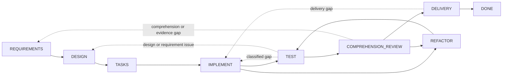

# Dev Flow

[中文](README.md) | [English](README_en.md)

> Keep AI-assisted development grounded: know where the task is, what completes the current step, and where it may go next.

[](https://www.npmjs.com/package/dev-flow-codex)
[](https://www.npmjs.com/package/dev-flow-deepseek)
[](https://github.com/Innocent-children/dev-flow/actions/workflows/ci.yml)
[](LICENSE)

Dev Flow is a local development-process manager driven by a Go Core. It organizes requirements,
design, task planning, implementation, testing, comprehension review, refactoring, and delivery into
a state graph that supports controlled backtracking, recovery, and evidence-based transitions.
Codex, DeepSeek Harness, and future hosts share the same process authority.

Its purpose is not to produce more code. It keeps a real development task answerable after rework,
interruptions, and context switches:

- Which node is the task in?
- What work and evidence complete this node?
- Which transitions are currently legal?
- If the last mutation is uncertain, should the host read, recover, or retry?

## Why Dev Flow

### A development thread that survives context loss

Task state is stored in local SQLite. When chat context is compacted, a host restarts, or work is
interrupted, Core retains the current node, requirements and design baselines, verification records,
blockers, and legal transitions.

### Comprehension is a delivery gate

Dev Flow treats `COMPREHENSION_REVIEW` as a first-class delivery gate. Tests establish behavior;
the developer confirms that the design and code can be explained and maintained. Excess complexity
routes the task to `REFACTOR`, and repository-changing refactors return through `TEST`.

### Recovery follows recorded facts

When a mutation response is missing, cancelled, truncated, or malformed, the caller reads Core
before taking another write action. Core classifies the operation as not started, completed and
recorded, completed but unrecorded, partially completed, or conflicting, then returns the safe action.

### Multiple methods, one process authority

Each task selects `plain`, `spec-kit`, or `openspec`. These method tools help perform the current
node's work. Go Core remains the sole authority for tasks, nodes, transitions, recovery, and outcomes.

## Quick start

Current public artifacts support macOS arm64 and Node.js `>=24`. Core `0.5.0` is bundled
independently in the Codex `0.5.1` and DeepSeek `0.5.1` host products; all three products have
independent versions.

### Codex

```bash
npm install -g dev-flow-codex@0.5.1
dev-flow-codex setup
dev-flow-codex --version
```

Start a task in Codex with the only explicit selector:

```text
$dev-flow-codex:dev-flow Add a failed-login attempt limit to this repository.
```

Ordinary conversation does not activate Dev Flow. See the
[Codex package README](docs/CODEX_en.md) for installation, removal, retained data, and
invocation boundaries.

### DeepSeek Harness

Download the official tarball from npm, then give its absolute path to a DSH profile:

```bash
npm pack dev-flow-deepseek@0.5.1
dsh plugin --profile <profile> add "$PWD/dev-flow-deepseek-0.5.1.tgz"
```

Restart the profile according to the DSH profile lifecycle, then enter Dev Flow explicitly with
`/dev-flow`. See the [DeepSeek package README](docs/DEEPSEEK_en.md) for installation,
restart, removal, and data boundaries.

## Development graph

Core provides one built-in process, `standard-development`: eight working nodes, the `DONE`
terminal node, and the exceptional `BLOCKED` and `CANCELLED` nodes. Twenty-nine transitions cover
forward progress and real rework.



The dotted lines summarize multiple controlled backtracks. Exact nodes, all 29 transitions, guards,
and reason rules are defined by [`internal/workflow/`](internal/workflow/). A host submits only a
Core-returned `transition_id`; Core derives the destination.

Every current Action exposes:

- process, node, revision, and action identity;
- node purpose, entry assumptions, completion conditions, allowed effects, and required evidence;
- semantic method steps for the selected method profile;
- every legal transition with its destination, guard, selection condition, and reason rule.

## Runtime boundary

Core exposes exactly six tools over local STDIO MCP:

```text
dev_flow_server_info
dev_flow_open_task
dev_flow_get_task
dev_flow_get_next_action
dev_flow_apply_action
dev_flow_cancel_task
```

Core may inspect one existing Git repository through bounded, read-only observation to establish a
repository binding and evaluate change facts. A user-authorized host performs Git mutations. Core
does not expose a generic shell or run checkout, commit, push, merge, rebase, tag, or publication
operations.

## Data and recovery

Task data lives in a host-managed local data directory by default. `DEV_FLOW_DATA_DIR` may point
to an existing, usable absolute directory. Removing or uninstalling a host integration retains task
data.

The graph runtime accepts only the current SQLite Schema and strict snapshot. Incompatible or
pre-graph data returns `SCHEMA_UNSUPPORTED` with zero writes. The user may select a fresh data
directory or archive, rename, or delete the old directory outside Core. Lifecycle commands never
perform this cleanup automatically.

## Current support

| Product | Public version | Bundled Core | Verified environment |
| --- | --- | --- | --- |
| `dev-flow-codex` | `0.5.1` | `0.5.0` | macOS arm64, Node.js `>=24`, Codex `>=0.147.0` |
| `dev-flow-deepseek` | `0.5.1` | `0.5.0` | macOS arm64, Node.js `>=24`, DSH `>=0.1.0-rc.6` |

Both `0.5.1` releases passed registry-package installation, real host/Core handshake, removal,
uninstallation, and repository-unchanged gates. The DeepSeek journey also covered explicit
activation, restart recovery, `DONE`, and retained reopen. See the
[Support Matrix](docs/SUPPORT-MATRIX_en.md) and the corresponding GitHub Releases for exact artifact
identities and evidence.

## Documentation

| Topic | Document |
| --- | --- |
| Product problem, capabilities, and boundaries | [Product](docs/PRODUCT_en.md) |
| Core, Adapter, Store, and Recovery architecture | [Architecture](docs/ARCHITECTURE_en.md) |
| Current supported versions and platforms | [Support Matrix](docs/SUPPORT-MATRIX_en.md) |
| Delivered capabilities and future direction | [Roadmap](docs/ROADMAP_en.md) |
| Independent product versioning | [Versioning](docs/VERSIONING.md) |
| Local development toolchains | [Toolchain Baselines](docs/TOOLCHAIN-BASELINES.md) |
| Feature development governance | [Spec Kit Workflow](docs/SPEC-KIT-WORKFLOW.md) |
| Maintainer release entrypoint | [Release](release/README.md) |

## Local development

Dev Flow requires Go `>=1.26`, Node.js `>=24`, and pnpm `>=11 <12`:

```bash
pnpm install --frozen-lockfile
pnpm run validate
```

`pnpm run validate` performs bounded repository validation. It does not install real host products
or publish npm packages, Tags, or GitHub Releases. See [Architecture](docs/ARCHITECTURE_en.md) for
directory ownership and [Repository Scripts](scripts/README_en.md) for script entrypoints.

## License

[Apache License 2.0](LICENSE)
