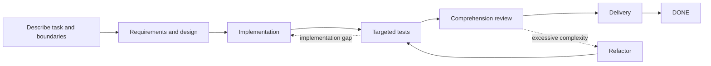

# Dev Flow

[简体中文](README.md) · [English](README_en.md) · [繁體中文](README_zh-TW.md) · [日本語](README_ja.md) · [한국어](README_ko.md) · [Español](README_es.md) · [Français](README_fr.md) · [Deutsch](README_de.md) · [Português (Brasil)](README_pt-BR.md)

> Keep Codex and DeepSeek in scope, bound verification, and resume after interruptions.

[](https://www.npmjs.com/package/dev-flow-codex)
[](https://www.npmjs.com/package/dev-flow-deepseek)
[](https://github.com/Innocent-children/dev-flow/actions/workflows/ci.yml)
[](LICENSE)

Dev Flow gives AI coding tasks a **local, durable state outside the chat**. It remembers:

- what this task may change and what is explicitly out of scope;
- whether the work is in requirements, design, implementation, testing, or delivery;
- how much verification was agreed and which evidence already exists;
- whether an interrupted or uncertain write should be recovered, blocked, or retried safely.

**It is not another coding agent or a task orchestrator.** Codex and DeepSeek still read repositories,
edit code, and run commands. Dev Flow manages one development task's scope, stage, verification
effort, evidence, and recovery.

**Start here:** [See a complete task in two minutes](docs/DEMO_en.md) ·
[Check current versions and real evidence](docs/PROJECT-STATUS_en.md) ·
[Install the stable release](#install-the-stable-release)

> This README describes capabilities on `main`. npm `@latest` is the final-artifact-verified stable
> release and may lag behind `main`; see [Project Status](docs/PROJECT-STATUS_en.md) for the exact
> stable, beta, and source distinction.

## Understand it in 30 seconds

| Without Dev Flow | What Dev Flow adds |
| --- | --- |
| Prompts repeatedly say “do not expand the scope” | The Task retains original intent and each step states what may change |
| A restarted session rescans the repository and guesses progress | The current stage, evidence, and blockers persist locally |
| A targeted check grows into a full suite or platform matrix | Every Task has an explicit verification budget |
| Tests pass, but the result is still difficult to explain or own | Delivery is preceded by `COMPREHENSION_REVIEW` |
| A lost write response is replayed and may duplicate effects | The caller reads authoritative state before deciding whether retry is safe |

## See one task run



When a Host restarts after implementation, the next session reads the same Task and receives the
current stage, completed evidence, remaining verification budget, and legal next steps instead of
reconstructing them from chat history. The repository contains structured evidence from real Codex
and DeepSeek journeys; see the [two-minute walkthrough](docs/DEMO_en.md).

## Where it fits

| Tool | Responsibility |
| --- | --- |
| Codex / DeepSeek Harness | Read repositories, change code, and run commands |
| Spec Kit / OpenSpec | Provide methods for requirements, design, and task planning |
| Dev Flow | Retain one task's scope, stage, verification budget, rework paths, and recovery state |

A Spec Kit artifact, OpenSpec checkbox, or successful test command does not advance the Task by
itself. The Go Core updates state only after validating the current Action.

## Install the stable release

Current stable artifacts support **macOS arm64** and **Node.js `>=24`**. See the
[Support Matrix](docs/SUPPORT-MATRIX_en.md) for exact versions and Host compatibility.

### Codex

```bash
npm install -g dev-flow-codex@latest
dev-flow-codex setup
dev-flow-codex --version
```

From a Git repository, start Dev Flow with the exact selector:

```text
$dev-flow-codex:dev-flow Fix idempotency in the order-creation endpoint and run targeted tests.
```

See the [Codex guide](docs/CODEX_en.md) for installation, updates, and removal.

### DeepSeek Harness

```bash
npm install -g @deepseek-ai/dsh@latest
PROFILE=web
TARBALL="$(npm pack dev-flow-deepseek@latest --silent)"
dsh plugin --profile "$PROFILE" add "$PWD/$TARBALL"
rm -f "$PWD/$TARBALL"
dsh --profile "$PROFILE" --dump-config
```

Restart the profile, then enter:

```text
/dev-flow Fix idempotency in the order-creation endpoint and run targeted tests.
```

See the [DeepSeek guide](docs/DEEPSEEK_en.md).

## When to use it

Dev Flow fits:

- real repository work that crosses requirements, design, implementation, testing, and delivery;
- changes that may require rework and must retain verification evidence;
- work resumed across sessions, days, context compaction, or Host restarts;
- tasks that need an explicit verification limit or a developer comprehension gate;
- bounded work across one primary repository and a small number of explicit additional repositories.

A one-off question or mechanical single-file edit with no retained state is usually simpler with
Codex or DeepSeek directly.

## Core capabilities

### Explicit scope

`TaskIntent` retains the original request, acceptance criteria, and out-of-scope work. Material
requirement or design changes use controlled transitions back to the relevant stage instead of
silently expanding the current step's authority.

### Bounded verification

Every Task retains a verification budget. Checks should relate directly to the current stage, changed
surface, acceptance criteria, or a known recovery risk. Full regressions, platform matrices, and
stress tests are not default work.

### Cross-session recovery

The current stage, requirements/design/task baselines, evidence, blockers, and legal next steps are
stored in local SQLite. Removing a Host integration retains Task data by default.

### Comprehension review

Passing tests is not the final gate. `COMPREHENSION_REVIEW` asks the developer to confirm that the
result can be explained and maintained. A failed review may return to design, implementation, or
refactoring, and repository changes pass through testing again.

### Uncertain-write recovery

Writes carry the revision, Action identity, source cursor, and repository binding. When a response is
lost or interrupted, the caller reads Core's five-class Recovery result before choosing recovery,
blocking, or safe retry.

### Bounded multi-repository scope

Current source lets one Task declare one primary repository and up to seven additional repositories.
All repositories share one stage, Action, revision, verification budget, and outcome. Neighboring
directories, dependencies, and indexes cannot expand scope automatically. Check
[Project Status](docs/PROJECT-STATUS_en.md) to see whether this capability is in the stable release.

## Boundaries

- Core observes Git through bounded, read-only operations; it does not commit, push, merge, rebase,
  tag, or publish.
- File changes and command execution remain the responsibility of the user-authorized Host.
- Dev Flow does not intercept every Host file operation and is not a general security sandbox.
- There is currently no Web UI, remote MCP, telemetry, user-defined graph, or automatic historical
  data migration.
- An optional code index may assist retrieval but cannot decide repository scope, permission,
  Recovery, or process state.

See the [Security Policy](SECURITY.md) and [Threat Model](docs/THREAT-MODEL_en.md).

## Current stable support

| Product | Stable version | Bundled Core | Verified environment |
| --- | --- | --- | --- |
| `dev-flow-codex` | `0.6.0` | `0.5.1` | macOS arm64, Node.js `>=24`, Codex `>=0.147.0` |
| `dev-flow-deepseek` | `0.6.0` | `0.5.1` | macOS arm64, Node.js `>=24`, DSH `>=0.1.0-rc.6` |

These claims come from public artifacts and final Host journeys, not merely from buildable source or
passing tests. See [Project Status](docs/PROJECT-STATUS_en.md) and the
[Support Matrix](docs/SUPPORT-MATRIX_en.md) for exact evidence and beta/source status.

## Documentation

| What you need | Start here |
| --- | --- |
| Understand a real task in two minutes | [Demo](docs/DEMO_en.md) |
| Stable, beta, source, and evidence status | [Project Status](docs/PROJECT-STATUS_en.md) |
| Product capabilities and boundaries | [Product](docs/PRODUCT_en.md) |
| Core, Adapter, Store, and Recovery | [Architecture](docs/ARCHITECTURE_en.md) |
| Supported versions and platforms | [Support Matrix](docs/SUPPORT-MATRIX_en.md) |
| User commands and MCP tools | [Command Reference](docs/COMMANDS_en.md) |
| Future direction | [Roadmap](docs/ROADMAP_en.md) |
| Security reporting and threat model | [Security](SECURITY.md) · [Threat Model](docs/THREAT-MODEL_en.md) |
| Report an issue or open a pull request | [Contributing](CONTRIBUTING_en.md) |
| Maintainer release flow | [Release](release/README.md) |

## Local development

Dev Flow requires Go `>=1.26`, Node.js `>=24`, and pnpm `>=11 <12`:

```bash
pnpm install --frozen-lockfile
pnpm run validate
```

## License

[Apache License 2.0](LICENSE)
