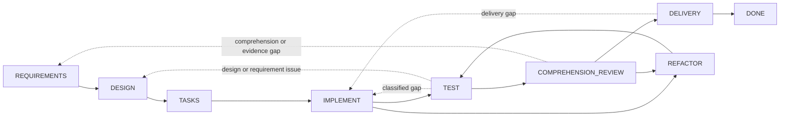

# Dev Flow

[简体中文](README.md) · [English](README_en.md) · [繁體中文](README_zh-TW.md) · [日本語](README_ja.md) · [한국어](README_ko.md) · [Español](README_es.md) · [Français](README_fr.md) · [Deutsch](README_de.md) · [Português (Brasil)](README_pt-BR.md)

> Explicit scope, verification budgets, and recoverable state for AI-assisted coding tasks.

[](https://www.npmjs.com/package/dev-flow-codex)
[](https://www.npmjs.com/package/dev-flow-deepseek)
[](https://github.com/Innocent-children/dev-flow/actions/workflows/ci.yml)
[](LICENSE)

Dev Flow is a local process-control and recovery layer for AI-assisted software development. It
organizes requirements, design, task planning, implementation, testing, comprehension review,
refactoring, and delivery as a state graph managed by a Go Core. Codex, DeepSeek Harness, and other
host adapters modify repositories and run tools; Core retains the Task, current node, node contract,
verification budget, legal transitions, and recovery result.

## Common failure modes in agent workflows

| Failure mode | Typical behavior |
| --- | --- |
| Scope drift | A local change expands into neighboring-module refactoring, a generic abstraction, extra documentation, or an unrequested future capability |
| Unbounded verification | A targeted check expands into a full regression suite, platform matrix, stress testing, or a growing set of edge cases |
| Lost process state | After context compaction, a host restart, or a later session, progress must be reconstructed from chat history and the worktree |
| Maintainability gap | Tests pass, but a developer cannot clearly explain, review, or take ownership of the implementation |
| Uncertain mutation | A missing or interrupted write response leaves the caller unable to determine whether the operation committed, making replay risky |

These problems are not reliably solved by adding more “do not refactor” or “do not run extra tests”
clauses to a prompt. The development process needs durable state outside the conversation plus a
closed contract for the current step, its completion conditions, and its legal next transitions.

## Control model

| Failure mode | Dev Flow mechanism |
| --- | --- |
| Scope drift | `TaskIntent` retains immutable original intent; each Action exposes completion conditions and `allowed_effects`; a material scope change must use a legal transition to the relevant node, where Core invalidates stale downstream authority |
| Unbounded verification | Every Task carries a verification budget; checks must relate to the current node, changed surface, acceptance criteria, or a known recovery risk, while full suites and platform matrices are not default work |
| Lost process state | The current node, requirements/design/task-plan baselines, evidence, blockers, and legal transitions are persisted in local SQLite |
| Maintainability gap | `TEST` is followed by `COMPREHENSION_REVIEW`; an implementation that cannot be explained or maintained returns to `DESIGN`, `IMPLEMENT`, or `REFACTOR`, and repository-changing work passes through `TEST` again |
| Uncertain mutation | Mutations carry revision, action identity, source cursor, and repository binding; callers must read before retry and follow the five-class Recovery result |

Core does not statically intercept every repository change made by a host. It exposes the
authoritative Action contract and validates Task transitions. Host adapters are required to operate
within the current node's allowed effects and verification budget.

## When to use it

Dev Flow fits real repository work that crosses multiple development nodes, may require rework, must
retain verification evidence, or needs to resume across sessions. A one-off question or mechanical
single-file edit with no retained process state is usually simpler with Codex or DeepSeek directly.

## Multi-repository Tasks and optional code indexing

A Task can explicitly use the current Git repository as its primary repository and add zero to seven
additional repositories. All repositories share one current node, Action, revision, verification
budget, Recovery, Blocker, and Outcome. Dev Flow never scans parent or neighboring directories,
dependencies, or a code index to expand the scope. Single-repository calls and ordinary relative
paths remain compatible; multi-repository paths use
`<repository-key>::<repository-relative-path>` to identify ownership.

Optional code-index preferences come from the read-only `$HOME/.dev-flow/config.json` file:

```json
{
  "codex": { "codebase_memory": false },
  "deepseek": { "codebase_memory": true }
}
```

Both values default to `false` when the directory or file is absent. `dev-flow-codex setup` creates
the complete default configuration; DeepSeek retains the read-only default. Setup never rewrites an
existing configuration. When a preference is `true`, the host uses codebase-memory only if it is already
installed and available. If it is missing or becomes unavailable, the host reports that once per
session at most and falls back to built-in search without blocking the Task. Codex additional
repositories must already be authorized writable roots when the session starts; Dev Flow does not
change the sandbox. Every DeepSeek repository must be inside the current Workspace Root, which may
be a non-Git common parent.

## Install, update, and remove

Current public artifacts support macOS arm64 and Node.js `>=24`. Installation examples select npm's
`latest` dist-tag; support tables retain exact verified versions. Codex and DeepSeek share the
default Task data directory at `$HOME/Library/Application Support/dev-flow/data`.

### Codex

#### Install and verify

```bash
npm install -g dev-flow-codex@latest
dev-flow-codex setup
dev-flow-codex --version
```

When configuration is absent, `setup` creates `$HOME/.dev-flow/config.json` and reports the actual
configuration and registration-receipt files created or updated, readiness, and one next step.
Interactive output follows Simplified Chinese or English; non-interactive and `NO_COLOR` output is
plain, while `setup --json` emits undecorated machine facts.

The global npm install provides the `dev-flow-codex` command. `setup` registers the Codex
marketplace, Plugin, and MCP integration. From a Git repository, start a task in Codex with the only
explicit selector:

```text
$dev-flow-codex:dev-flow Add a failed-login attempt limit to this repository.
```

#### Update

```bash
npm install -g dev-flow-codex@latest
dev-flow-codex setup
dev-flow-codex --version
```

Running `setup` again validates and updates the package-owned registration. Compatible existing Task
data is retained.

#### Uninstall while retaining Task data

```bash
dev-flow-codex remove
npm uninstall -g dev-flow-codex
```

Run `remove` before uninstalling the npm package; npm uninstall alone does not remove the Codex
registration. These commands retain Task data and the target Git repository, so a compatible
installation can resume the data after `setup`.

### DeepSeek Harness

#### Install and verify

Install DSH first, then add Dev Flow to a real profile. This directly runnable example uses the
`web` profile. Change the value of `PROFILE` for another profile; do not enter `<profile>` literally
in a shell.

```bash
npm install -g @deepseek-ai/dsh@latest
dsh --version

PROFILE=web
TARBALL="$(npm pack dev-flow-deepseek@latest --silent)"
dsh plugin --profile "$PROFILE" add "$PWD/$TARBALL"
rm -f "$PWD/$TARBALL"
dsh --profile "$PROFILE" --dump-config
```

Restart the profile. For the `web` profile above, run `dsh web`. Then enter Dev Flow explicitly in a
DeepSeek conversation:

```text
/dev-flow Add a failed-login attempt limit to this repository.
```

#### Update

Stop the running profile, then run:

```bash
PROFILE=web
dsh plugin --profile "$PROFILE" remove dev-flow-deepseek
TARBALL="$(npm pack dev-flow-deepseek@latest --silent)"
dsh plugin --profile "$PROFILE" add "$PWD/$TARBALL"
rm -f "$PWD/$TARBALL"
dsh --profile "$PROFILE" --dump-config
```

Restart the profile afterward. Update DSH itself with
`npm install -g @deepseek-ai/dsh@latest`.

#### Uninstall while retaining Task data

```bash
PROFILE=web
dsh plugin --profile "$PROFILE" remove dev-flow-deepseek
dsh --profile "$PROFILE" --dump-config
```

Repeat this for every profile that contains Dev Flow. It retains shared Task data, other plugins in
the DSH profile, the target Git repository, and Codex configuration. If DSH is no longer needed,
uninstall it separately with `npm uninstall -g @deepseek-ai/dsh`; this does not remove profile data
under `$HOME/.dsh`.

### Permanently delete Dev Flow data

This operation cannot be undone. First remove Dev Flow from Codex and every DSH profile and uninstall
the related npm packages. After confirming that no Task is needed, delete the shared default data
and any remaining registration receipt:

```bash
rm -rf "$HOME/Library/Application Support/dev-flow"
```

If `DEV_FLOW_DATA_DIR` was set, data outside the default directory lives at the exact absolute path
chosen for that variable; verify and delete that directory separately. Dev Flow never deletes it
automatically. To delete every DSH profile, session, and unrelated plugin as well, remove
`$HOME/.dsh` after uninstalling DSH; that directory belongs to DSH as a whole, not only to Dev Flow.

See the [Codex package README](docs/CODEX_en.md),
[DeepSeek package README](docs/DEEPSEEK_en.md), and
[Command Reference](docs/COMMANDS_en.md) for the complete lifecycle and command contracts.

## Execution model

1. The developer describes a task in the current Git repository through an explicit selector.
2. Core opens or resumes that repository's Task and returns the current node, completion conditions,
   allowed effects, evidence requirements, verification budget, and every legal transition.
3. The host executes the current Action. A material requirement, design, or implementation change is
   reported through a Core-returned transition instead of being hidden inside the current node.
4. Core validates the `transition_id`, guard, revision, and payload before advancing the Task. Failed
   tests, failed comprehension, or rejected delivery return to the corresponding node.
5. If a mutation response is uncertain, the host reads the Task and Recovery assessment before
   deciding whether to recover, block, or retry safely.

## Component boundaries

| Component | Responsibility |
| --- | --- |
| Codex / DeepSeek Harness | Read the repository, modify code, run tools, and submit the current node's results and evidence |
| Spec Kit / OpenSpec | Provide methods and artifacts for requirements, design, task planning, and related nodes |
| Tests and CI | Produce behavioral verification evidence |
| Dev Flow Core | Retain the single process cursor, node contract, verification budget, legal transitions, Recovery, and terminal outcome |

A Spec Kit artifact, OpenSpec checkbox, or successful command cannot advance a Task by itself. Only a
valid Core action submission changes authoritative state.

## Development graph

Core provides one built-in process, `standard-development`: eight working nodes, the `DONE`
terminal node, and the exceptional `BLOCKED` and `CANCELLED` nodes. Twenty-nine transitions cover
forward progress and real rework.



The dotted lines summarize multiple controlled backtracks. Exact nodes, all 29 transitions, guards,
and reason rules are defined by [`internal/workflow/`](internal/workflow/). A host submits only a
Core-returned `transition_id`; Core derives the destination.

Every current Action exposes:

- process, node, revision, and action identity;
- node purpose, entry assumptions, completion conditions, `allowed_effects`, `required_evidence`, and
  verification budget;
- semantic method steps for the selected method profile;
- every legal transition with its destination, guard, selection condition, and reason rule.

## Runtime boundary

Core exposes exactly six tools over local STDIO MCP:

```text
dev_flow_server_info
dev_flow_open_task
dev_flow_get_task
dev_flow_get_next_action
dev_flow_apply_action
dev_flow_cancel_task
```

See the [Command Reference](docs/COMMANDS_en.md) for each tool's read/write classification, input role,
and behavior.

Core may inspect the one to eight existing Git repositories explicitly declared by a Task through
bounded, ordered, read-only observation to establish repository bindings and evaluate change facts.
A user-authorized host performs Git mutations. Core does not expose a generic shell or run checkout,
commit, push, merge, rebase, tag, or publication operations.

## Data and recovery

Task data lives in a host-managed local data directory by default. `DEV_FLOW_DATA_DIR` may point to
an existing, usable absolute directory. Removing or uninstalling a host integration retains Task data.

The graph runtime accepts only the current SQLite Schema and strict snapshot. Incompatible or
pre-graph data returns `SCHEMA_UNSUPPORTED` with zero writes. The user may select a fresh data
directory or archive, rename, or delete the old directory outside Core. Lifecycle commands never
perform this cleanup automatically.

## Current support

| Product | Public version | Bundled Core | Verified environment |
| --- | --- | --- | --- |
| `dev-flow-codex` | `0.5.3` | `0.5.1` | macOS arm64, Node.js `>=24`, Codex `>=0.147.0` |
| `dev-flow-deepseek` | `0.5.2` | `0.5.1` | macOS arm64, Node.js `>=24`, DSH `>=0.1.0-rc.6` |

The current releases of both host products passed registry-package installation, real host/Core handshake, removal,
uninstallation, and repository-unchanged gates. The DeepSeek journey also covered explicit
activation, restart recovery, `DONE`, and retained reopen. See the
[Support Matrix](docs/SUPPORT-MATRIX_en.md) and the corresponding GitHub Releases for exact artifact
identities and evidence.

## Documentation

Technical reference documents are currently maintained in English and Simplified Chinese.

| Topic | Document |
| --- | --- |
| Product problems, capabilities, and boundaries | [Product](docs/PRODUCT_en.md) |
| Core, Adapter, Store, and Recovery architecture | [Architecture](docs/ARCHITECTURE_en.md) |
| Current supported versions and platforms | [Support Matrix](docs/SUPPORT-MATRIX_en.md) |
| Every user command, managed Core command, and MCP tool | [Command Reference](docs/COMMANDS_en.md) |
| Delivered capabilities and future direction | [Roadmap](docs/ROADMAP_en.md) |
| Independent product versioning | [Versioning](docs/VERSIONING.md) |
| Documentation locales and synchronization rules | [I18n](docs/I18N_en.md) |
| Local development toolchains | [Toolchain Baselines](docs/TOOLCHAIN-BASELINES.md) |
| Feature development governance | [Spec Kit Workflow](docs/SPEC-KIT-WORKFLOW.md) |
| How to report an issue or open a pull request | [Contributing](CONTRIBUTING_en.md) |
| Maintainer release entrypoint | [Release](release/README.md) |

## Local development

Dev Flow requires Go `>=1.26`, Node.js `>=24`, and pnpm `>=11 <12`:

```bash
pnpm install --frozen-lockfile
pnpm run validate
```

`pnpm run validate` performs bounded repository validation. It does not install real host products
or publish npm packages, Tags, or GitHub Releases. See [Architecture](docs/ARCHITECTURE_en.md) for
directory ownership and [Repository Scripts](scripts/README_en.md) for script entrypoints.

## Contributing

Reproducible bug reports, documentation improvements, platform support backed by final-artifact
evidence, and bounded product proposals are welcome. Read the [contribution guide](CONTRIBUTING_en.md)
before starting. Product-feature changes must synchronize every maintained root README locale,
`docs/PRODUCT*`, and the affected technical references; see [I18n](docs/I18N_en.md) for the exact rule.

## License

[Apache License 2.0](LICENSE)
