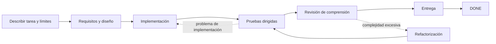

# Dev Flow

[简体中文](README.md) · [English](README_en.md) · [繁體中文](README_zh-TW.md) · [日本語](README_ja.md) · [한국어](README_ko.md) · [Español](README_es.md) · [Français](README_fr.md) · [Deutsch](README_de.md) · [Português (Brasil)](README_pt-BR.md)

> Mantiene a Codex y DeepSeek dentro del alcance, limita la verificación y permite reanudar tareas interrumpidas.

[](https://www.npmjs.com/package/dev-flow-codex)
[](https://www.npmjs.com/package/dev-flow-deepseek)
[](https://github.com/Innocent-children/dev-flow/actions/workflows/ci.yml)
[](LICENSE)

Dev Flow añade a las tareas de programación con IA un **estado local y duradero, independiente del chat**.
Conserva:

- qué puede modificar la tarea y qué queda explícitamente fuera de alcance;
- si el trabajo está en requisitos, diseño, implementación, pruebas o entrega;
- cuánta verificación se acordó y qué evidencia ya existe;
- si una escritura interrumpida o incierta debe recuperarse, bloquearse o reintentarse de forma segura.

**No es otro Agent de programación ni un orquestador de tareas.** Codex y DeepSeek siguen leyendo
repositorios, modificando código y ejecutando comandos. Dev Flow administra el alcance, la etapa, el
esfuerzo de verificación, la evidencia y la recuperación de una tarea de desarrollo.

**Empieza aquí:** [recorrido de dos minutos](docs/DEMO_en.md) ·
[versiones actuales y evidencia real](docs/PROJECT-STATUS_en.md) ·
[instalar la versión estable](#instalar-la-versión-estable)

> Este README describe las capacidades de `main`. npm `@latest` es la versión estable verificada con
> el artefacto final y puede ir por detrás de `main`. Consulta
> [Project Status](docs/PROJECT-STATUS_en.md) para distinguir stable, beta y source.

## Entenderlo en 30 segundos

| Sin Dev Flow | Lo que añade Dev Flow |
| --- | --- |
| El Prompt repite «no amplíes el alcance» | El Task conserva la intención original y cada etapa declara qué puede cambiar |
| Una sesión reiniciada vuelve a explorar el repositorio y adivina el progreso | La etapa actual, la evidencia y los blockers se guardan localmente |
| Una prueba dirigida crece hasta una suite completa o matriz de plataformas | Cada Task tiene un verification budget explícito |
| Las pruebas pasan, pero el resultado sigue siendo difícil de explicar o mantener | Antes de entregar se ejecuta `COMPREHENSION_REVIEW` |
| Se repite una escritura cuya respuesta se perdió | Se lee el estado autoritativo antes de decidir si el retry es seguro |

## Cómo avanza una tarea



Si el Host se reinicia después de implementar, la nueva sesión lee el mismo Task y recibe la etapa
actual, la evidencia terminada, el presupuesto restante y los siguientes pasos legales. No reconstruye
el proceso desde el historial del chat. Consulta la [demostración](docs/DEMO_en.md).

## Papel en la cadena de herramientas

| Herramienta | Responsabilidad |
| --- | --- |
| Codex / DeepSeek Harness | Leer repositorios, modificar código y ejecutar comandos |
| Spec Kit / OpenSpec | Proporcionar métodos para requisitos, diseño y planificación |
| Dev Flow | Conservar alcance, etapa, presupuesto, rutas de retrabajo y recuperación de una tarea |

## Instalar la versión estable

Los artefactos estables actuales admiten **macOS arm64** y **Node.js `>=24`**. Consulta
[Support Matrix](docs/SUPPORT-MATRIX_en.md) para versiones y compatibilidad exactas.

La entrada `dev-flow` gestiona instalación, actualización, reparación, reinstalación,
desinstalación y reinstalación limpia. Los comandos nativos del Host siguen disponibles para recuperación diagnóstica.
La interfaz interactiva usa chino simplificado para locales `zh*` e inglés para cualquier otro locale.

### Codex

```bash
npm install -g @imotong/dev-flow@latest
dev-flow
```

Para forzar Dev Flow:

```text
$dev-flow-codex:dev-flow Fix idempotency in the order-creation endpoint and run targeted tests.
```

Más detalles en [Codex guide](docs/CODEX_en.md).

### DeepSeek Harness

```bash
npm install -g @imotong/dev-flow@latest
dev-flow
```

Reinicia el profile y escribe:

```text
/dev-flow Fix idempotency in the order-creation endpoint and run targeted tests.
```

Más detalles en [DeepSeek guide](docs/DEEPSEEK_en.md).

## Cuándo usarlo

- trabajo real que cruza requisitos, diseño, implementación, pruebas y entrega;
- cambios que pueden requerir retrabajo y deben conservar evidencia;
- tareas que continúan entre sesiones, días, compactación de contexto o reinicios;
- trabajo que necesita un límite de verificación o una revisión explícita de comprensión;
- tareas acotadas entre un repositorio principal y pocos repositorios adicionales explícitos.

Para una pregunta puntual o una edición mecánica de un solo archivo sin estado duradero, suele ser más
sencillo usar Codex o DeepSeek directamente.

## Capacidades principales

- **Alcance explícito:** `TaskIntent` conserva la solicitud, los criterios y lo que queda fuera.
- **Verificación acotada:** cada Task conserva un verification budget; las matrices completas no son predeterminadas.
- **Recuperación entre sesiones:** etapa, evidencia, blockers y siguientes pasos se guardan en SQLite local.
- **Revisión de comprensión:** después de las pruebas se exige `COMPREHENSION_REVIEW`.
- **Recuperación de escrituras inciertas:** Core conserva la entrada Action normalizada; tras perder una respuesta bastan Task ID y Action ID, sin reconstruir el payload.
- **Alcance multirrepositorio acotado:** el source actual admite un principal y hasta siete adicionales con un único estado.

Consulta [Project Status](docs/PROJECT-STATUS_en.md) para saber si el soporte multirrepositorio ya está
incluido en la versión estable.

## Límites

- Core observa Git de forma acotada y de solo lectura; no hace commit, push, merge, rebase, tag ni publish.
- Los cambios de archivos y comandos siguen siendo responsabilidad del Host autorizado por el usuario.
- Dev Flow no intercepta cada operación del Host y no es un sandbox de seguridad general.
- El código fuente actual incluye una WebUI compartida y limitada a loopback, con chino simplificado/inglés, idioma inicial del sistema y cambio local en el navegador; no incluye remote MCP, telemetry, graph definido por el usuario ni migración histórica automática.
- Un índice opcional solo ayuda a buscar; no decide alcance, permisos, Recovery ni estado.
- Una Action con escritura permitida informa solo los `changed_paths` nuevos desde la emisión de esa Action, o `no_file_changes` cuando este nodo no modificó archivos. Core los valida contra la línea base de emisión y una fresh Git observation; los cambios autorizados se completan con la Action original, mientras que los cambios de branch, HEAD, repository identity o rutas no declaradas siguen devolviendo `REPOSITORY_DRIFT`. Si el repositorio está intacto pero el resultado declara cambios, Core devuelve la regla de campo `repository_effect_not_observed`.
- Antes de guardar el envío de una Action, Core también valida la semántica del resultado del nodo contra la Task actual. Los errores en revision, record, conjuntos de evidence y acceptance que pueden copiarse exactamente desde Core devuelven `allowed_paths` para una única corrección limitada. Las conclusiones de pruebas, la confirmación del usuario y el contenido del trabajo solo reciben información de campo, sin autorización de corrección automática.

Consulta [Security Policy](SECURITY.md) y [Threat Model](docs/THREAT-MODEL_en.md).

## Soporte estable actual

| Producto | Versión estable | Bundled Core | Entorno verificado |
| --- | --- | --- | --- |
| `dev-flow-codex` | `0.7.5` | `0.6.4` | macOS arm64, Node.js `>=24`, Codex `>=0.147.0` |
| `dev-flow-deepseek` | `0.7.5` | `0.6.4` | macOS arm64, Node.js `>=24`, DSH `>=0.1.0-rc.6` |

Consulta [Project Status](docs/PROJECT-STATUS_en.md) y
[Support Matrix](docs/SUPPORT-MATRIX_en.md) para evidencia exacta y estado beta/source.

## Documentación

| Necesidad | Entrada |
| --- | --- |
| Entender una tarea real en dos minutos | [Demo](docs/DEMO_en.md) |
| Estado stable, beta, source y evidencia | [Project Status](docs/PROJECT-STATUS_en.md) |
| Capacidades y límites | [Product](docs/PRODUCT_en.md) |
| Arquitectura | [Architecture](docs/ARCHITECTURE_en.md) |
| Versiones y plataformas | [Support Matrix](docs/SUPPORT-MATRIX_en.md) |
| Comandos y herramientas MCP | [Command Reference](docs/COMMANDS_en.md) |
| WebUI local y reset solo por CLI | [WebUI](docs/WEBUI_en.md) |
| Seguridad | [Security](SECURITY.md) · [Threat Model](docs/THREAT-MODEL_en.md) |
| Contribuir | [Contributing](CONTRIBUTING_en.md) |

## License

[Apache License 2.0](LICENSE)
