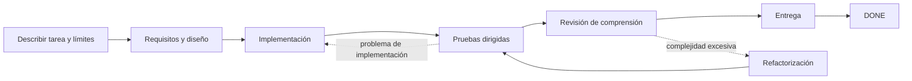

<p align="center">
  
</p>

<h1 align="center">Dev Flow</h1>

<p align="center"><strong>Mantiene a Codex y DeepSeek dentro del alcance, limita la verificación y permite reanudar tareas interrumpidas.</strong></p>

<p align="center">
  <a href="https://www.npmjs.com/package/dev-flow-codex"></a>
  <a href="https://www.npmjs.com/package/dev-flow-deepseek"></a>
  <a href="https://github.com/Innocent-children/dev-flow/actions/workflows/ci.yml"></a>
  <a href="LICENSE"></a>
</p>

<p align="center">
  <a href="README.md">简体中文</a> · <a href="README_en.md">English</a> · <a href="README_zh-TW.md">繁體中文</a> · <a href="README_ja.md">日本語</a> · <a href="README_ko.md">한국어</a> · <a href="README_es.md">Español</a> · <a href="README_fr.md">Français</a> · <a href="README_de.md">Deutsch</a> · <a href="README_pt-BR.md">Português (Brasil)</a>
</p>

Dev Flow añade a las tareas de programación con IA un **estado local y duradero, independiente del chat**.
Conserva:

- qué puede modificar la tarea y qué queda explícitamente fuera de alcance;
- si el trabajo está en requisitos, diseño, implementación, pruebas o entrega;
- cuánta verificación se acordó y qué evidencia ya existe;
- si una escritura interrumpida o incierta debe recuperarse, bloquearse o reintentarse de forma segura.

**No es otro Agent de programación ni un orquestador de tareas.** Codex y DeepSeek siguen leyendo
repositorios, modificando código y ejecutando comandos. Dev Flow administra el alcance, la etapa, el
esfuerzo de verificación, la evidencia y la recuperación de una tarea de desarrollo.

**Empieza aquí:** [recorrido de dos minutos](docs/DEMO_en.md) ·
[versiones actuales y evidencia real](docs/PROJECT-STATUS_en.md) ·
[instalar la versión estable](#instalar-la-versión-estable)

> Este README describe las capacidades de `main`. npm `@latest` es la versión estable verificada con
> el artefacto final y puede ir por detrás de `main`. Consulta
> [Project Status](docs/PROJECT-STATUS_en.md) para distinguir stable, beta y source.

## Entenderlo en 30 segundos

| Sin Dev Flow | Lo que añade Dev Flow |
| --- | --- |
| El Prompt repite «no amplíes el alcance» | El Task conserva la intención original y cada etapa declara qué puede cambiar |
| Una sesión reiniciada vuelve a explorar el repositorio y adivina el progreso | La etapa actual, la evidencia y los blockers se guardan localmente |
| Una prueba dirigida crece hasta una suite completa o matriz de plataformas | Cada Task tiene un verification budget explícito |
| Las pruebas pasan, pero el resultado sigue siendo difícil de explicar o mantener | Antes de entregar se ejecuta `COMPREHENSION_REVIEW` |
| Se repite una escritura cuya respuesta se perdió | Se lee el estado autoritativo antes de decidir si el retry es seguro |

## Cómo avanza una tarea



Si el Host se reinicia después de implementar, la nueva sesión lee el mismo Task y recibe la etapa
actual, la evidencia terminada, el presupuesto restante y los siguientes pasos legales. No reconstruye
el proceso desde el historial del chat. Consulta la [demostración](docs/DEMO_en.md).

## Papel en la cadena de herramientas

| Herramienta | Responsabilidad |
| --- | --- |
| Codex / DeepSeek Harness | Leer repositorios, modificar código y ejecutar comandos |
| Spec Kit / OpenSpec | Proporcionar métodos para requisitos, diseño y planificación |
| Dev Flow | Conservar alcance, etapa, presupuesto, rutas de retrabajo y recuperación de una tarea |

## Instalar la versión estable

Los artefactos estables actuales admiten **macOS arm64** y **Node.js `>=24`**. Consulta
[Support Matrix](docs/SUPPORT-MATRIX_en.md) para versiones y compatibilidad exactas.

La entrada `dev-flow` gestiona instalación, actualización, reparación, reinstalación,
desinstalación y reinstalación limpia. Los comandos nativos del Host siguen disponibles para recuperación diagnóstica.
Durante la ejecución, el instalador muestra cada acción del Host y los pasos completados, como la instalación del package, la configuración del registro, la verificación del artefacto y la comprobación del estado listo; `--json` sigue emitiendo un único objeto de resultado.
La interfaz interactiva usa chino simplificado para locales `zh*` e inglés para cualquier otro locale.

### Codex

```bash
npm install -g @imotong/dev-flow@latest
dev-flow
```

Para forzar Dev Flow:

```text
$dev-flow-codex:dev-flow Fix idempotency in the order-creation endpoint and run targeted tests.
```

Más detalles en [Codex guide](docs/CODEX_en.md).

### DeepSeek Harness

```bash
npm install -g @imotong/dev-flow@latest
dev-flow
```

Reinicia el profile y escribe:

```text
/dev-flow Fix idempotency in the order-creation endpoint and run targeted tests.
```

Más detalles en [DeepSeek guide](docs/DEEPSEEK_en.md).

## Cuándo usarlo

- trabajo real que cruza requisitos, diseño, implementación, pruebas y entrega;
- cambios que pueden requerir retrabajo y deben conservar evidencia;
- tareas que continúan entre sesiones, días, compactación de contexto o reinicios;
- trabajo que necesita un límite de verificación o una revisión explícita de comprensión;
- tareas acotadas entre un repositorio principal y pocos repositorios adicionales explícitos.

Para una pregunta puntual o una edición mecánica de un solo archivo sin estado duradero, suele ser más
sencillo usar Codex o DeepSeek directamente.

## Capacidades principales

- **Alcance explícito:** `TaskIntent` conserva la solicitud, los criterios y lo que queda fuera.
- **Verificación acotada:** cada Task conserva un verification budget; las matrices completas no son predeterminadas.
- **Recuperación entre sesiones:** etapa, evidencia, blockers y siguientes pasos se guardan en SQLite local.
- **Desinstalación segura:** la desinstalación de Codex valida el runtime receipt y detiene primero la WebUI correspondiente; si no puede detenerla, conserva el registro y el package para impedir que una versión eliminada siga escuchando en un puerto.
- **Revisión de comprensión:** después de las pruebas se exige `COMPREHENSION_REVIEW`.
- **Recuperación de escrituras inciertas:** Core valida por completo la siguiente Task y conserva la entrada Action normalizada en un registro de operación independiente; tras perder una respuesta bastan Task ID y Action ID, sin reconstruir el payload.
- **Alcance multirrepositorio acotado:** el source actual admite un principal y hasta siete adicionales con un único estado.
- **Tasks paralelas en un mismo repositorio:** un repositorio Git lógico puede ejecutar varias Tasks independientes al mismo tiempo mediante linked worktrees. Cada worktree físico conserva como máximo una Task activa. Cuando el Host ofrece una capacidad task/thread respaldada por worktrees, Codex crea un hijo por elemento acotado antes de admission para un lote paralelo explícito; si `dev_flow_open_task` de una única solicitud nueva devuelve `ACTIVE_TASK_CONFLICT`, crea exactamente un hijo después de ese resultado. El hijo del conflicto usa `target.environment.type="worktree"` sin `startingState`, parte solo del estado confirmado de la rama predeterminada y no recibe el index, los cambios rastreados del árbol de trabajo ni los archivos no rastreados del checkout ocupado. El resume explícito, `HOST_OWNERSHIP_CONFLICT` y los demás errores conservan su comportamiento de parada. Core no crea, cambia ni limpia worktrees, y la Task activa y el worktree originales permanecen intactos.

Consulta [Project Status](docs/PROJECT-STATUS_en.md) para saber si el soporte multirrepositorio ya está
incluido en la versión estable.

## Límites

- Core observa Git de forma acotada y de solo lectura; no hace commit, push, merge, rebase, tag ni publish.
- Los cambios de archivos y comandos siguen siendo responsabilidad del Host autorizado por el usuario.
- Dev Flow no intercepta cada operación del Host y no es un sandbox de seguridad general.
- El código fuente actual incluye una WebUI compartida y limitada a loopback, con chino simplificado/inglés, idioma inicial del sistema y cambio local en el navegador. El marco de página compartido reorganiza la navegación, los filtros, las listas de Tasks, los detalles, los formularios y el estado del sistema según el ancho, aprovechando pantallas amplias y mostrando directamente la información esencial en pantallas estrechas; no incluye remote MCP, telemetry, graph definido por el usuario ni migración histórica automática.
- Un índice opcional solo ayuda a buscar; no decide alcance, permisos, Recovery ni estado.
- Una Action con escritura permitida informa solo los `changed_paths` nuevos desde la emisión de esa Action, o `no_file_changes` cuando este nodo no modificó archivos. Core los valida contra la línea base de emisión y una fresh Git observation; los cambios autorizados se completan con la Action original, mientras que los cambios de branch, HEAD, repository identity o rutas no declaradas siguen devolviendo `REPOSITORY_DRIFT`. Si el repositorio está intacto pero el resultado declara cambios, Core devuelve la regla de campo `repository_effect_not_observed`.
- Los envíos de Design, Tasks e Implementation omiten, respectivamente, `requirements_revision`, `design_revision` y `task_plan_revision`; después de validar la identidad de la Action actual, Core completa esos campos desde la misma Task snapshot. Los envíos de Delivery no incluyen acceptance, identificadores de evidence automated/manual ni identificadores de record de Test/Comprehension; Core los genera desde la Task actual y rechaza su envío como `unknown_member`. Antes de guardar, Core sigue validando la semántica del resultado contra la Task actual. Un `required_member_missing` con cero escrituras demostrado en un envío de nodo puede corregirse una vez en su ruta exacta, usando solo hechos ya confirmados durante el trabajo del nodo actual. Si falta una nueva decisión del usuario, el Host debe detenerse y solicitarla; los demás valores que no puedan derivarse con seguridad no autorizan corrección automática.
- La Skill de Codex exige volver a leer el live schema del `submission_tool` actual antes de cada envío ordinario y del único envío corregido permitido, y comparar campo por campo el borrador completo: miembros obligatorios o adicionales, tipos de valores anidados y elementos de arrays, nullability, enums y consts. Si no coincide exactamente, se detiene antes de llamar a la herramienta y no deduce tipos del nombre del campo ni del texto del error.

Consulta [Security Policy](SECURITY.md) y [Threat Model](docs/THREAT-MODEL_en.md).

## Soporte estable actual

| Producto | Entorno verificado |
| --- | --- |
| `dev-flow-codex` | macOS arm64, Node.js `>=24`, Codex `>=0.147.0` |
| `dev-flow-deepseek` | macOS arm64, Node.js `>=24`, DSH `>=0.1.0-rc.6` |

Consulta [Project Status](docs/PROJECT-STATUS_en.md) y
[Support Matrix](docs/SUPPORT-MATRIX_en.md) para evidencia exacta y estado beta/source.

## Documentación

| Necesidad | Entrada |
| --- | --- |
| Entender una tarea real en dos minutos | [Demo](docs/DEMO_en.md) |
| Estado stable, beta, source y evidencia | [Project Status](docs/PROJECT-STATUS_en.md) |
| Capacidades y límites | [Product](docs/PRODUCT_en.md) |
| Arquitectura | [Architecture](docs/ARCHITECTURE_en.md) |
| Versiones y plataformas | [Support Matrix](docs/SUPPORT-MATRIX_en.md) |
| Comandos y herramientas MCP | [Command Reference](docs/COMMANDS_en.md) |
| WebUI local y reset solo por CLI | [WebUI](docs/WEBUI_en.md) |
| Seguridad | [Security](SECURITY.md) · [Threat Model](docs/THREAT-MODEL_en.md) |
| Contribuir | [Contributing](CONTRIBUTING_en.md) |

## License

[Apache License 2.0](LICENSE)
