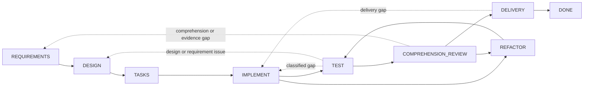

# Dev Flow

[简体中文](README.md) · [English](README_en.md) · [繁體中文](README_zh-TW.md) · [日本語](README_ja.md) · [한국어](README_ko.md) · [Español](README_es.md) · [Français](README_fr.md) · [Deutsch](README_de.md) · [Português (Brasil)](README_pt-BR.md)

> Alcance explícito, presupuesto de verificación y estado recuperable para tareas de programación asistidas por IA.

[](https://www.npmjs.com/package/dev-flow-codex)
[](https://www.npmjs.com/package/dev-flow-deepseek)
[](https://github.com/Innocent-children/dev-flow/actions/workflows/ci.yml)
[](LICENSE)

Dev Flow es una capa local de control de proceso y recuperación para el desarrollo de software asistido
por IA. Organiza requisitos, diseño, planificación de tareas, implementación, pruebas, revisión de
comprensión, refactorización y entrega como un grafo de estados administrado por un Go Core. Codex,
DeepSeek Harness y otros Host Adapter modifican repositorios y ejecutan herramientas; Core conserva el
Task, el nodo actual, el contrato del nodo, el presupuesto de verificación, las transiciones legales y
el resultado de Recovery.

## Modos de fallo frecuentes en flujos de Agent

| Modo de fallo | Comportamiento típico |
| --- | --- |
| Deriva de alcance | Un cambio local se amplía a refactorizaciones de módulos vecinos, abstracciones genéricas, documentación adicional o capacidades futuras no solicitadas |
| Verificación sin límites | Una comprobación dirigida se amplía a regresión completa, matriz de plataformas, pruebas de carga o una lista creciente de casos límite |
| Pérdida del estado del proceso | Tras compactar el contexto, reiniciar el Host o continuar en otra sesión, el progreso debe reconstruirse a partir del historial y el worktree |
| Brecha de mantenibilidad | Las pruebas pasan, pero un desarrollador no puede explicar, revisar o asumir claramente la implementación |
| Mutation incierta | Una respuesta de escritura perdida o interrumpida impide saber si la operación se confirmó y hace peligroso repetirla |

Estos problemas no se resuelven de forma fiable añadiendo más cláusulas como “no refactorizar” o “no ejecutar
pruebas adicionales” al Prompt. El proceso de desarrollo necesita estado duradero fuera de la conversación y
un contrato cerrado para el paso actual, sus condiciones de finalización y sus siguientes transiciones legales.

## Modelo de control

| Modo de fallo | Mecanismo de Dev Flow |
| --- | --- |
| Deriva de alcance | `TaskIntent` conserva la intención original inmutable; cada Action expone completion conditions y `allowed_effects`; un cambio material de alcance debe usar una transition legal hacia el nodo correspondiente, donde Core invalida authority downstream obsoleta |
| Verificación sin límites | Cada Task conserva un verification budget; las comprobaciones deben relacionarse con el nodo actual, la superficie modificada, los criterios de aceptación o un riesgo de recuperación conocido; las suites completas y matrices de plataforma no son trabajo predeterminado |
| Pérdida del estado del proceso | El nodo actual, los baselines de requirements/design/task-plan, la evidencia, los blocker y las transiciones legales se guardan en SQLite local |
| Brecha de mantenibilidad | Después de `TEST` se exige `COMPREHENSION_REVIEW`; una implementación que no puede explicarse o mantenerse vuelve a `DESIGN`, `IMPLEMENT` o `REFACTOR`, y cualquier cambio del repositorio pasa de nuevo por `TEST` |
| Mutation incierta | Las mutation incluyen revision, action identity, source cursor y repository binding; el llamador debe aplicar read-before-retry y seguir el resultado de Recovery de cinco clases |

Core no intercepta estáticamente cada cambio de repositorio realizado por un Host. Expone el contrato Action
autoritativo y valida las transiciones del Task. Los Host Adapter deben operar dentro de los `allowed_effects`
y el verification budget del nodo actual.

## Cuándo utilizarlo

Dev Flow es adecuado para trabajo real en repositorios que atraviesa varios nodos de desarrollo, puede requerir
retrabajo, debe conservar evidencia de verificación o necesita reanudarse entre sesiones. Para una pregunta
puntual o una edición mecánica de un solo archivo sin estado persistente, suele ser más sencillo usar Codex o
DeepSeek directamente.

## Inicio rápido

Los artefactos públicos actuales admiten macOS arm64 y Node.js `>=24`. Core `0.5.0` se incluye de forma
independiente en los productos Host Codex `0.5.1` y DeepSeek `0.5.1`; los tres productos tienen versiones
independientes. Las tablas de compatibilidad conservan las versiones verificadas exactas, mientras que los
ejemplos de instalación usan el dist-tag npm `latest`.

### Codex

```bash
npm install -g dev-flow-codex@latest
dev-flow-codex setup
dev-flow-codex --version
```

Inicia un Task en Codex con el único selector explícito:

```text
$dev-flow-codex:dev-flow Add a failed-login attempt limit to this repository.
```

La conversación normal no activa Dev Flow. Consulta el [Codex package README](docs/CODEX_en.md) para la
instalación, eliminación, conservación de datos y límites de invocación.

### DeepSeek Harness

Obtén el package oficial indicado por npm `latest` y proporciona la ruta absoluta del tarball a un perfil DSH:

```bash
TARBALL="$(npm pack dev-flow-deepseek@latest --silent)"
dsh plugin --profile <profile> add "$PWD/$TARBALL"
```

Reinicia el perfil según el lifecycle de DSH y entra explícitamente en Dev Flow con `/dev-flow`. Consulta
[DeepSeek package README](docs/DEEPSEEK_en.md) para instalación, reinicio, eliminación y límites de datos.
El catálogo completo de comandos Codex, DeepSeek, Core, selectors y herramientas MCP está en la
[Referencia de comandos](docs/COMMANDS_en.md).

## Modelo de ejecución

1. El desarrollador describe un Task en el repositorio Git actual mediante un selector explícito.
2. Core abre o reanuda el Task de ese repositorio y devuelve el nodo actual, condiciones de finalización, `allowed_effects`, requisitos de evidencia, verification budget y todas las transiciones legales.
3. El Host ejecuta la Action actual. Un cambio material de requisitos, diseño o implementación se informa mediante una transition devuelta por Core, en lugar de ocultarse dentro del nodo actual.
4. Core valida `transition_id`, guard, revision y payload antes de avanzar el Task. Las pruebas fallidas, la comprensión insuficiente o la entrega rechazada vuelven al nodo correspondiente.
5. Si una respuesta de mutation es incierta, el Host lee primero el Task y el Recovery assessment antes de decidir si recuperar, bloquear o reintentar de forma segura.

## Límites de componentes

| Componente | Responsabilidad |
| --- | --- |
| Codex / DeepSeek Harness | Leer el repositorio, modificar código, ejecutar herramientas y enviar resultados y evidencia del nodo actual |
| Spec Kit / OpenSpec | Proporcionar métodos y artefactos para requirements, design, tasks y otros nodos |
| Tests / CI | Producir evidencia de verificación del comportamiento |
| Dev Flow Core | Conservar el único process cursor, contrato del nodo, verification budget, transiciones legales, Recovery y resultado terminal |

Un artefacto de Spec Kit, un checkbox de OpenSpec o un comando correcto no pueden avanzar un Task por sí solos.
Solo una Core action submission válida cambia el estado autoritativo.

## Grafo de desarrollo

Core ofrece un único proceso integrado, `standard-development`: ocho nodos de trabajo, el nodo terminal `DONE`
y los nodos excepcionales `BLOCKED` y `CANCELLED`. Veintinueve transiciones cubren el avance y el retrabajo real.



Las líneas discontinuas resumen varios retrocesos controlados. Los nodos exactos, las 29 transiciones, guards y
reason rules están definidos en [`internal/workflow/`](internal/workflow/). Un Host solo envía un
`transition_id` devuelto por Core; Core deriva el destination.

Cada Action actual expone:

- process, node, revision y action identity;
- purpose, entry assumptions, completion conditions, `allowed_effects`, `required_evidence` y verification budget;
- semantic method steps del method profile seleccionado;
- todas las transitions legales con destination, guard, condición de selección y reason rule.

## Límite de runtime

Core expone exactamente seis herramientas mediante MCP STDIO local:

```text
dev_flow_server_info
dev_flow_open_task
dev_flow_get_task
dev_flow_get_next_action
dev_flow_apply_action
dev_flow_cancel_task
```

Consulta la [Referencia de comandos](docs/COMMANDS_en.md) para la clasificación de lectura/escritura, el papel de
las entradas y el comportamiento de cada herramienta.

Core puede observar un repositorio Git existente de forma acotada y de solo lectura para establecer un
repository binding y evaluar hechos de cambio. Un Host autorizado por el usuario realiza las mutation Git.
Core no expone un shell genérico ni ejecuta checkout, commit, push, merge, rebase, tag o publicación.

## Datos y recuperación

Los datos de Task se almacenan por defecto en un directorio local administrado por el producto Host.
`DEV_FLOW_DATA_DIR` puede apuntar a un directorio absoluto existente y utilizable. Eliminar o desinstalar una
integración Host conserva los datos de Task.

El runtime del grafo solo acepta el SQLite Schema actual y un snapshot estricto. Los datos incompatibles o
pre-graph devuelven `SCHEMA_UNSUPPORTED` sin escrituras. El usuario puede seleccionar un directorio nuevo o
archivar, renombrar o eliminar el directorio antiguo fuera de Core. Los comandos lifecycle nunca realizan esta
limpieza automáticamente.

## Compatibilidad actual

| Producto | Versión pública | Bundled Core | Entorno verificado |
| --- | --- | --- | --- |
| `dev-flow-codex` | `0.5.1` | `0.5.0` | macOS arm64, Node.js `>=24`, Codex `>=0.147.0` |
| `dev-flow-deepseek` | `0.5.1` | `0.5.0` | macOS arm64, Node.js `>=24`, DSH `>=0.1.0-rc.6` |

Ambas versiones `0.5.1` superaron instalación desde registry package, handshake real Host/Core, eliminación,
desinstalación y repository-unchanged gate. El journey de DeepSeek también cubrió activación explícita,
recuperación tras reinicio, `DONE` y retained reopen. Consulta [Support Matrix](docs/SUPPORT-MATRIX_en.md) y
las GitHub Releases correspondientes para identidades y evidencia exactas.

## Documentación

La documentación técnica de referencia se mantiene actualmente en inglés y chino simplificado.

| Tema | Documento |
| --- | --- |
| Problemas, capacidades y límites del producto | [Product](docs/PRODUCT_en.md) |
| Arquitectura de Core, Adapter, Store y Recovery | [Architecture](docs/ARCHITECTURE_en.md) |
| Versiones y plataformas compatibles | [Support Matrix](docs/SUPPORT-MATRIX_en.md) |
| Todos los comandos de usuario, comandos Core administrados y herramientas MCP | [Command Reference](docs/COMMANDS_en.md) |
| Capacidades entregadas y dirección futura | [Roadmap](docs/ROADMAP_en.md) |
| Versionado independiente de productos | [Versioning](docs/VERSIONING.md) |
| Locales y reglas de sincronización | [I18n](docs/I18N_en.md) |
| Toolchains de desarrollo local | [Toolchain Baselines](docs/TOOLCHAIN-BASELINES.md) |
| Gobernanza de Product Feature | [Spec Kit Workflow](docs/SPEC-KIT-WORKFLOW.md) |
| Informar un Issue o abrir un Pull Request | [Contributing](CONTRIBUTING_en.md) |
| Entrada de release para mantenedores | [Release](release/README.md) |

## Desarrollo local

Dev Flow requiere Go `>=1.26`, Node.js `>=24` y pnpm `>=11 <12`:

```bash
pnpm install --frozen-lockfile
pnpm run validate
```

`pnpm run validate` ejecuta una validación acotada del repositorio. No instala productos Host reales ni publica
paquetes npm, Tags o GitHub Releases. Consulta [Architecture](docs/ARCHITECTURE_en.md) para responsabilidades de
directorio y [Repository Scripts](scripts/README_en.md) para puntos de entrada de scripts.

## Contribuciones

Se aceptan defectos reproducibles, mejoras de documentación, compatibilidad de plataformas respaldada por
evidencia de artefacto final y propuestas de producto con alcance acotado. Lee la
[guía de contribución](CONTRIBUTING_en.md) antes de comenzar. Los cambios de Product Feature deben sincronizar
todos los locales mantenidos del root README, `docs/PRODUCT*` y las referencias técnicas afectadas; consulta
[I18n](docs/I18N_en.md) para la regla exacta.

## License

[Apache License 2.0](LICENSE)
