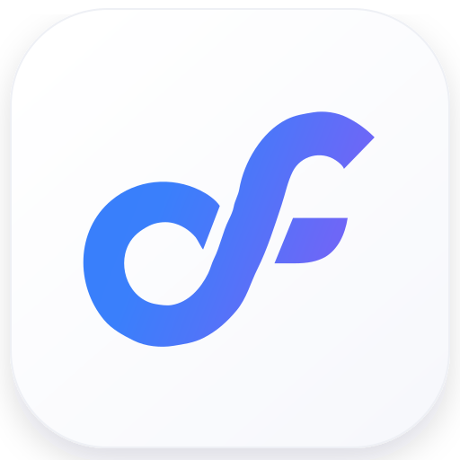

<p align="center">
  
</p>

<h1 align="center">Dev Flow</h1>

<p align="center"><strong>Conserva el alcance, los límites de verificación y el progreso de las tareas largas de programación con IA entre sesiones.</strong></p>

<p align="center">
  <a href="README.md">English</a> · <a href="README_zh-CN.md">简体中文</a> · <a href="README_zh-TW.md">繁體中文</a> · <a href="README_ja.md">日本語</a> · <a href="README_ko.md">한국어</a> · <a href="README_es.md">Español</a> · <a href="README_fr.md">Français</a> · <a href="README_de.md">Deutsch</a> · <a href="README_pt-BR.md">Português (Brasil)</a>
</p>

## Evita que las tareas largas se desvíen

Cuanto más dura una tarea de programación, más fácil es que cambie poco a poco: aparecen más archivos,
una comprobación dirigida se convierte en una ejecución de pruebas sin límite, el mismo fallo provoca
otro intento parecido o una sesión reiniciada tiene que reconstruir el avance desde el chat.

Dev Flow guarda en una sola tarea local la petición acordada, las rutas previstas, los límites de
verificación, la etapa actual y los resultados. Codex o DeepSeek sigue encargándose de modificar el código.

- **El alcance permanece claro.** Registra las rutas previstas, pide confirmación antes de que las
  herramientas estructuradas compatibles escriban fuera del plan y vuelve a comprobar los cambios reales
  antes de las pruebas y la entrega.
- **La verificación tiene límites.** Restringe el número de comandos automáticos, exige permiso previo
  para la suite completa y se detiene en la tercera repetición exacta.
- **El trabajo continúa después de un reinicio.** Una nueva sesión recupera la misma tarea, las
  comprobaciones pendientes y la decisión actual sin reconstruirlas desde la conversación.
- **Solo se reutilizan resultados vigentes.** Los cambios en la petición, el plan, la implementación o
  el repositorio invalidan las comprobaciones antiguas; el desarrollador revisa el resultado antes de entregarlo.

## Inicio rápido

> La versión estable publicada en npm bajo `@latest` está verificada actualmente en macOS arm64. Instala primero Node.js `>=24`
> y una versión compatible de Codex o DeepSeek Harness. Consulta las versiones exactas y otros entornos
> en la [Support Matrix](docs/SUPPORT-MATRIX_en.md).

### 1. Instala Dev Flow

```bash
npm install -g @imotong/dev-flow@latest
dev-flow
```

Elige Codex, DeepSeek o ambos en la configuración interactiva. Antes de iniciar la primera tarea,
completa también el último paso que indique el instalador:

- **Codex:** abre `/hooks`, revisa el hook incluido con Dev Flow y márcalo como confiable. La comprobación
  previa compatible de `apply_patch` no funciona hasta que confíes en el hook.
- **DeepSeek Harness:** reinicia el Profile de DSH elegido después de la instalación.

### 2. Inicia una tarea

Envía este mensaje de usuario en **Codex**:

```text
$dev-flow-codex:dev-flow Añade un límite de frecuencia para los inicios de sesión fallidos. Modifica solo archivos de autenticación y ejecuta como máximo 4 comprobaciones dirigidas.
```

O envía este mensaje en **DeepSeek Harness**:

```text
/dev-flow Añade un límite de frecuencia para los inicios de sesión fallidos. Modifica solo archivos de autenticación y ejecuta como máximo 4 comprobaciones dirigidas.
```

Son selectores de conversación, no comandos de shell. Incluye un objetivo concreto, las condiciones de
aceptación, el límite de archivos y el tope de pruebas.

### 3. Retoma y revisa el progreso

Después de un reinicio, vuelve al mismo directorio de trabajo del repositorio y utiliza de nuevo el mismo
selector. Dev Flow lee la tarea guardada y continúa desde su etapa actual.

```bash
# Consultar las integraciones instaladas
dev-flow status --host all

# Abrir la vista local de tareas
dev-flow webui start
```

Para instalación no interactiva, Profiles de DSH personalizados, actualizaciones, reparación y
eliminación, consulta la [Command Reference](docs/COMMANDS_en.md).

## Cuándo resulta útil

Dev Flow resulta útil para trabajo de repositorio que abarca varias sesiones, necesita un límite real
de archivos, restringe el esfuerzo de pruebas o puede requerir retrabajo sin reutilizar resultados obsoletos.

Para preguntas puntuales, explicaciones de código, consultas de estado y pequeños cambios mecánicos que
no necesitan guardar el progreso, suele ser más sencillo usar Codex o DeepSeek directamente.

## Documentación

- **Uso:** [Codex](docs/CODEX_en.md) · [DeepSeek](docs/DEEPSEEK_en.md) · [Commands](docs/COMMANDS_en.md) · [Control Center](docs/WEBUI_en.md)
- **Proyecto:** [Product](docs/PRODUCT_en.md) · [Support Matrix](docs/SUPPORT-MATRIX_en.md) · [Security](SECURITY.md) · [Contributing](CONTRIBUTING_en.md)

## Licencia

[Apache License 2.0](LICENSE)
