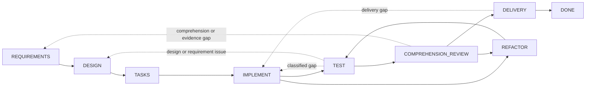

# Dev Flow

[简体中文](README.md) · [English](README_en.md) · [繁體中文](README_zh-TW.md) · [日本語](README_ja.md) · [한국어](README_ko.md) · [Español](README_es.md) · [Français](README_fr.md) · [Deutsch](README_de.md) · [Português (Brasil)](README_pt-BR.md)

> Périmètre explicite, budget de vérification et état récupérable pour les tâches de développement assistées par IA.

[](https://www.npmjs.com/package/dev-flow-codex)
[](https://www.npmjs.com/package/dev-flow-deepseek)
[](https://github.com/Innocent-children/dev-flow/actions/workflows/ci.yml)
[](LICENSE)

Dev Flow est une couche locale de contrôle de processus et de récupération pour le développement logiciel
assisté par IA. Il organise exigences, conception, planification, implémentation, tests, revue de compréhension,
refactorisation et livraison sous forme d'un graphe d'état géré par un Go Core. Codex, DeepSeek Harness et les
autres Host Adapter modifient les dépôts et exécutent les outils ; Core conserve le Task, le nœud courant, le
contrat du nœud, le budget de vérification, les transitions légales et le résultat de Recovery.

## Modes de défaillance courants des workflows Agent

| Mode de défaillance | Comportement typique |
| --- | --- |
| Dérive de périmètre | Une modification locale s'étend à la refactorisation de modules voisins, une abstraction générique, de la documentation supplémentaire ou une capacité future non demandée |
| Vérification non bornée | Un contrôle ciblé s'étend à une régression complète, une matrice de plateformes, des tests de charge ou une liste croissante de cas limites |
| Perte de l'état du processus | Après compression du contexte, redémarrage du Host ou reprise dans une autre session, la progression doit être reconstruite depuis l'historique et le worktree |
| Déficit de maintenabilité | Les tests passent, mais un développeur ne peut pas expliquer, relire ou reprendre clairement l'implémentation |
| Mutation incertaine | Une réponse d'écriture perdue ou interrompue empêche de savoir si l'opération a été validée et rend la répétition risquée |

Ces problèmes ne sont pas résolus de façon fiable en ajoutant au Prompt davantage de clauses telles que « ne pas
refactoriser » ou « ne pas exécuter de tests supplémentaires ». Le processus de développement nécessite un état
durable hors de la conversation et un contrat fermé pour l'étape courante, ses conditions de fin et ses
transitions suivantes autorisées.

## Modèle de contrôle

| Mode de défaillance | Mécanisme Dev Flow |
| --- | --- |
| Dérive de périmètre | `TaskIntent` conserve l'intention initiale immuable ; chaque Action expose les completion conditions et `allowed_effects` ; un changement matériel de périmètre doit utiliser une transition légale vers le nœud concerné, où Core invalide l'authority downstream devenue obsolète |
| Vérification non bornée | Chaque Task possède un verification budget ; les contrôles doivent être liés au nœud courant, à la surface modifiée, aux critères d'acceptation ou à un risque de récupération connu ; les suites complètes et matrices de plateformes ne sont pas des actions par défaut |
| Perte de l'état du processus | Le nœud courant, les baselines requirements/design/task-plan, les preuves, blockers et transitions légales sont persistés dans SQLite local |
| Déficit de maintenabilité | `TEST` est suivi de `COMPREHENSION_REVIEW` ; une implémentation impossible à expliquer ou maintenir retourne vers `DESIGN`, `IMPLEMENT` ou `REFACTOR`, puis repasse par `TEST` si le dépôt a changé |
| Mutation incertaine | Les mutation transportent revision, action identity, source cursor et repository binding ; l'appelant doit appliquer read-before-retry et suivre le résultat Recovery à cinq classes |

Core n'intercepte pas statiquement chaque modification de dépôt effectuée par un Host. Il expose le contrat Action
autoritatif et valide les transitions du Task. Les Host Adapter doivent travailler dans les `allowed_effects` et
le verification budget du nœud courant.

## Cas d'utilisation

Dev Flow convient aux travaux réels sur dépôt qui traversent plusieurs nœuds de développement, peuvent nécessiter
des reprises, doivent conserver des preuves de vérification ou reprendre entre plusieurs sessions. Pour une
question ponctuelle ou une modification mécanique d'un seul fichier sans état durable, utiliser directement Codex
ou DeepSeek est généralement plus simple.

## Démarrage rapide

Les artefacts publics actuels prennent en charge macOS arm64 et Node.js `>=24`. Core est inclus
indépendamment dans les produits Host Codex et DeepSeek ; les trois produits ont des versions
indépendantes. Les tableaux de support conservent les versions exactes vérifiées, tandis que les exemples
d'installation utilisent le dist-tag npm `latest`.

### Codex

```bash
npm install -g dev-flow-codex@latest
dev-flow-codex setup
dev-flow-codex --version
```

Démarrez un Task dans Codex avec l'unique selector explicite :

```text
$dev-flow-codex:dev-flow Add a failed-login attempt limit to this repository.
```

Une conversation ordinaire n'active pas Dev Flow. Consultez le [Codex package README](docs/CODEX_en.md) pour
l'installation, la suppression, la conservation des données et les limites d'invocation.

### DeepSeek Harness

Récupérez le package officiel désigné par npm `latest`, puis fournissez le chemin absolu du tarball à un profil
DSH :

```bash
TARBALL="$(npm pack dev-flow-deepseek@latest --silent)"
dsh plugin --profile <profile> add "$PWD/$TARBALL"
```

Redémarrez le profil selon le lifecycle DSH, puis entrez explicitement dans Dev Flow avec `/dev-flow`. Consultez
[DeepSeek package README](docs/DEEPSEEK_en.md) pour l'installation, le redémarrage, la suppression et les limites
de données. Le catalogue complet des commandes Codex, DeepSeek, Core, selectors et outils MCP se trouve dans la
[référence des commandes](docs/COMMANDS_en.md).

## Modèle d'exécution

1. Le développeur décrit un Task dans le dépôt Git courant au moyen d'un selector explicite.
2. Core ouvre ou reprend le Task du dépôt et retourne le nœud courant, les conditions de fin, les `allowed_effects`, les preuves requises, le verification budget et toutes les transitions légales.
3. Le Host exécute l'Action courante. Une modification matérielle des exigences, de la conception ou de l'implémentation est déclarée par une transition retournée par Core, plutôt que masquée dans le nœud courant.
4. Core valide `transition_id`, guard, revision et payload avant d'avancer le Task. Échec des tests, échec de compréhension ou livraison refusée retournent vers le nœud correspondant.
5. Si une réponse de mutation est incertaine, le Host lit d'abord le Task et le Recovery assessment avant de choisir récupération, blocage ou retry sûr.

## Frontières des composants

| Composant | Responsabilité |
| --- | --- |
| Codex / DeepSeek Harness | Lire le dépôt, modifier le code, exécuter des outils et soumettre résultats et preuves du nœud courant |
| Spec Kit / OpenSpec | Fournir méthodes et artefacts aux nœuds requirements, design, tasks et associés |
| Tests / CI | Produire des preuves de vérification comportementale |
| Dev Flow Core | Conserver l'unique process cursor, le contrat du nœud, le verification budget, les transitions légales, Recovery et le résultat terminal |

Un artefact Spec Kit, une checkbox OpenSpec ou une commande réussie ne peut pas avancer seul un Task. Seule une
Core action submission valide modifie l'état autoritatif.

## Graphe de développement

Core fournit un processus intégré unique, `standard-development` : huit nœuds de travail, le nœud terminal
`DONE`, ainsi que les nœuds exceptionnels `BLOCKED` et `CANCELLED`. Vingt-neuf transitions couvrent la progression
et les reprises réelles.



Les lignes pointillées résument plusieurs retours contrôlés. Les nœuds exacts, les 29 transitions, guards et
reason rules sont définis dans [`internal/workflow/`](internal/workflow/). Un Host soumet uniquement un
`transition_id` retourné par Core ; Core dérive la destination.

Chaque Action courante expose :

- process, node, revision et action identity ;
- purpose, entry assumptions, completion conditions, `allowed_effects`, `required_evidence` et verification budget ;
- les semantic method steps du method profile sélectionné ;
- toutes les transitions légales avec destination, guard, condition de sélection et reason rule.

## Frontière runtime

Core expose exactement six outils via MCP STDIO local :

```text
dev_flow_server_info
dev_flow_open_task
dev_flow_get_task
dev_flow_get_next_action
dev_flow_apply_action
dev_flow_cancel_task
```

Consultez la [référence des commandes](docs/COMMANDS_en.md) pour la classification lecture/écriture, le rôle des
entrées et le comportement de chaque outil.

Core peut observer un dépôt Git existant de façon bornée et en lecture seule afin d'établir un repository binding
et d'évaluer les faits de modification. Les mutation Git sont effectuées par un Host autorisé par l'utilisateur.
Core n'expose pas de shell générique et n'exécute pas checkout, commit, push, merge, rebase, tag ou publication.

## Données et récupération

Les données Task résident par défaut dans un répertoire local géré par le produit Host. `DEV_FLOW_DATA_DIR` peut
pointer vers un répertoire absolu existant et utilisable. Supprimer ou désinstaller une intégration Host conserve
les données Task.

Le runtime du graphe n'accepte que le SQLite Schema courant et un snapshot strict. Les données incompatibles ou
pre-graph retournent `SCHEMA_UNSUPPORTED` sans écriture. L'utilisateur peut sélectionner un nouveau répertoire ou
archiver, renommer ou supprimer l'ancien en dehors de Core. Les commandes lifecycle n'effectuent jamais ce
nettoyage automatiquement.

## Support actuel

| Produit | Version publique | Bundled Core | Environnement vérifié |
| --- | --- | --- | --- |
| `dev-flow-codex` | `0.5.2` | `0.5.0` | macOS arm64, Node.js `>=24`, Codex `>=0.147.0` |
| `dev-flow-deepseek` | `0.5.1` | `0.5.0` | macOS arm64, Node.js `>=24`, DSH `>=0.1.0-rc.6` |

Les versions actuelles des deux produits Host ont passé l'installation depuis le registry package, le handshake réel Host/Core, la
suppression, la désinstallation et le repository-unchanged gate. Le journey DeepSeek couvre aussi l'activation
explicite, la récupération après redémarrage, `DONE` et retained reopen. Consultez
[Support Matrix](docs/SUPPORT-MATRIX_en.md) et les GitHub Releases correspondantes pour les identités et preuves
exactes.

## Documentation

La documentation technique de référence est actuellement maintenue en anglais et en chinois simplifié.

| Sujet | Document |
| --- | --- |
| Problèmes, capacités et limites du produit | [Product](docs/PRODUCT_en.md) |
| Architecture Core, Adapter, Store et Recovery | [Architecture](docs/ARCHITECTURE_en.md) |
| Versions et plateformes prises en charge | [Support Matrix](docs/SUPPORT-MATRIX_en.md) |
| Toutes les commandes utilisateur, commandes Core gérées et outils MCP | [Command Reference](docs/COMMANDS_en.md) |
| Capacités livrées et orientations futures | [Roadmap](docs/ROADMAP_en.md) |
| Versionnement indépendant des produits | [Versioning](docs/VERSIONING.md) |
| Locales documentaires et règles de synchronisation | [I18n](docs/I18N_en.md) |
| Chaînes d'outils de développement local | [Toolchain Baselines](docs/TOOLCHAIN-BASELINES.md) |
| Gouvernance des Product Feature | [Spec Kit Workflow](docs/SPEC-KIT-WORKFLOW.md) |
| Signaler un Issue ou ouvrir une Pull Request | [Contributing](CONTRIBUTING_en.md) |
| Entrée release pour les mainteneurs | [Release](release/README.md) |

## Développement local

Dev Flow nécessite Go `>=1.26`, Node.js `>=24` et pnpm `>=11 <12` :

```bash
pnpm install --frozen-lockfile
pnpm run validate
```

`pnpm run validate` exécute une validation bornée du dépôt. Il n'installe pas de produits Host réels et ne publie
ni package npm, ni Tag, ni GitHub Release. Consultez [Architecture](docs/ARCHITECTURE_en.md) pour les responsabilités
de répertoire et [Repository Scripts](scripts/README_en.md) pour les points d'entrée des scripts.

## Contribution

Les défauts reproductibles, améliorations documentaires, prises en charge de plateformes appuyées par une preuve
d'artefact final et propositions produit à périmètre borné sont bienvenus. Lisez le
[guide de contribution](CONTRIBUTING_en.md) avant de commencer. Les modifications de Product Feature doivent
synchroniser tous les locales maintenus du root README, `docs/PRODUCT*` et les références techniques affectées ;
consultez [I18n](docs/I18N_en.md) pour la règle exacte.

## License

[Apache License 2.0](LICENSE)
