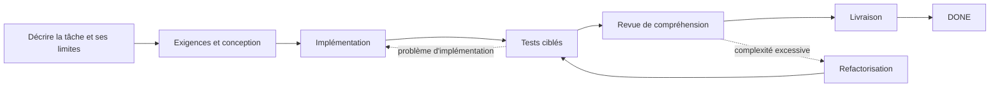

# Dev Flow

[简体中文](README.md) · [English](README_en.md) · [繁體中文](README_zh-TW.md) · [日本語](README_ja.md) · [한국어](README_ko.md) · [Español](README_es.md) · [Français](README_fr.md) · [Deutsch](README_de.md) · [Português (Brasil)](README_pt-BR.md)

> Maintient Codex et DeepSeek dans le périmètre, borne la vérification et reprend après une interruption.

[](https://www.npmjs.com/package/dev-flow-codex)
[](https://www.npmjs.com/package/dev-flow-deepseek)
[](https://github.com/Innocent-children/dev-flow/actions/workflows/ci.yml)
[](LICENSE)

Dev Flow ajoute aux tâches de programmation assistées par IA un **état local et durable, indépendant du chat**.
Il mémorise :

- ce que la tâche peut modifier et ce qui est explicitement hors périmètre ;
- si le travail se trouve en exigences, conception, implémentation, tests ou livraison ;
- le volume de vérification convenu et les preuves déjà obtenues ;
- si une écriture interrompue ou incertaine doit être récupérée, bloquée ou relancée sans risque.

**Ce n’est ni un autre Agent de programmation ni un orchestrateur de tâches.** Codex et DeepSeek
continuent de lire les dépôts, modifier le code et exécuter les commandes. Dev Flow gère le périmètre,
l’étape, l’effort de vérification, les preuves et la récupération d’une tâche de développement.

**Commencer ici :** [parcours en deux minutes](docs/DEMO_en.md) ·
[versions actuelles et preuves réelles](docs/PROJECT-STATUS_en.md) ·
[installer la version stable](#installer-la-version-stable)

> Ce README décrit les capacités de `main`. npm `@latest` est la version stable validée sur
> l’artefact final et peut être en retard sur `main`. Voir
> [Project Status](docs/PROJECT-STATUS_en.md) pour distinguer stable, beta et source.

## Comprendre en 30 secondes

| Sans Dev Flow | Ce que Dev Flow ajoute |
| --- | --- |
| Le Prompt répète « ne pas élargir le périmètre » | Le Task conserve l’intention initiale et chaque étape indique ce qui peut changer |
| Une session redémarrée rescane le dépôt et devine la progression | L’étape, les preuves et les blockers sont persistés localement |
| Un test ciblé devient une suite complète ou une matrice de plateformes | Chaque Task possède un verification budget explicite |
| Les tests passent, mais le résultat reste difficile à expliquer ou reprendre | `COMPREHENSION_REVIEW` précède la livraison |
| Une réponse d’écriture perdue est rejouée dangereusement | L’état autoritatif est lu avant de décider si le retry est sûr |

## Déroulement d’une tâche



Si le Host redémarre après l’implémentation, la nouvelle session lit le même Task et retrouve l’étape,
les preuves terminées, le budget restant et les prochaines transitions légales. Elle ne reconstruit pas
le processus depuis l’historique. Voir la [démonstration](docs/DEMO_en.md).

## Place dans la chaîne d’outils

| Outil | Responsabilité |
| --- | --- |
| Codex / DeepSeek Harness | Lire les dépôts, modifier le code et exécuter les commandes |
| Spec Kit / OpenSpec | Fournir des méthodes pour exigences, conception et planification |
| Dev Flow | Conserver périmètre, étape, budget, chemins de reprise et état de récupération d’une tâche |

## Installer la version stable

Les artefacts stables actuels prennent en charge **macOS arm64** et **Node.js `>=24`**. Voir la
[Support Matrix](docs/SUPPORT-MATRIX_en.md) pour les versions et compatibilités exactes.

Après sa publication indépendante, l’entrée `create-dev-flow` ci-dessous gérera installation, mise à niveau,
réparation, réinstallation, désinstallation et réinstallation propre. La version npm stable publique actuelle
n’inclut pas encore ce nouveau package ; les commandes natives du Host restent la voie de prépublication et de reprise.

### Codex

```bash
npx create-dev-flow@latest
```

Pour forcer Dev Flow :

```text
$dev-flow-codex:dev-flow Fix idempotency in the order-creation endpoint and run targeted tests.
```

Détails dans le [guide Codex](docs/CODEX_en.md).

### DeepSeek Harness

```bash
npx create-dev-flow@latest
```

Redémarrer le profile, puis saisir :

```text
/dev-flow Fix idempotency in the order-creation endpoint and run targeted tests.
```

Détails dans le [guide DeepSeek](docs/DEEPSEEK_en.md).

## Quand l’utiliser

- travail réel traversant exigences, conception, implémentation, tests et livraison ;
- changement susceptible de nécessiter des reprises et devant conserver ses preuves ;
- tâche reprise entre sessions, jours, compactage du contexte ou redémarrage du Host ;
- travail nécessitant une limite de vérification ou une confirmation de compréhension ;
- tâche bornée sur un dépôt principal et quelques dépôts supplémentaires explicites.

Une question ponctuelle ou une modification mécanique d’un fichier sans état persistant est généralement
plus simple avec Codex ou DeepSeek directement.

## Capacités principales

- **Périmètre explicite :** `TaskIntent` conserve la demande, les critères d’acceptation et le hors-périmètre.
- **Vérification bornée :** chaque Task possède un verification budget ; les matrices complètes ne sont pas la norme.
- **Récupération intersession :** étape, preuves, blockers et prochaines actions sont stockés dans SQLite local.
- **Revue de compréhension :** `COMPREHENSION_REVIEW` suit les tests et peut renvoyer vers une reprise.
- **Écriture incertaine :** le résultat Recovery de Core est lu avant toute nouvelle tentative.
- **Multi-dépôts borné :** le source actuel gère un dépôt principal et jusqu’à sept dépôts supplémentaires dans un état unique.

Vérifier dans [Project Status](docs/PROJECT-STATUS_en.md) si le multi-dépôts est déjà inclus dans la
version stable.

## Limites

- Core observe Git de façon bornée et en lecture seule ; il ne fait ni commit, push, merge, rebase, tag ni publish.
- Les changements de fichiers et commandes restent sous la responsabilité du Host autorisé par l’utilisateur.
- Dev Flow n’intercepte pas chaque opération du Host et n’est pas un sandbox de sécurité général.
- Il n’existe actuellement ni Web UI, remote MCP, telemetry, graph utilisateur ni migration historique automatique.
- Un index optionnel aide seulement à rechercher ; il ne décide ni périmètre, ni permission, ni Recovery, ni état.
- Une Action autorisée à écrire fournit les `changed_paths` exacts ou `no_file_changes`. Core les valide par rapport à la base d’émission et à une fresh Git observation ; les changements autorisés se terminent avec l’Action d’origine, tandis qu’un changement de branch, HEAD, repository identity ou de chemin non déclaré renvoie toujours `REPOSITORY_DRIFT`.

Voir [Security Policy](SECURITY.md) et [Threat Model](docs/THREAT-MODEL_en.md).

## Support stable actuel

| Produit | Version stable | Bundled Core | Environnement vérifié |
| --- | --- | --- | --- |
| `dev-flow-codex` | `0.7.0` | `0.6.0` | macOS arm64, Node.js `>=24`, Codex `>=0.147.0` |
| `dev-flow-deepseek` | `0.7.0` | `0.6.0` | macOS arm64, Node.js `>=24`, DSH `>=0.1.0-rc.6` |

Voir [Project Status](docs/PROJECT-STATUS_en.md) et
[Support Matrix](docs/SUPPORT-MATRIX_en.md) pour les preuves et l’état beta/source.

## Documentation

| Besoin | Entrée |
| --- | --- |
| Comprendre une tâche réelle en deux minutes | [Demo](docs/DEMO_en.md) |
| État stable, beta, source et preuves | [Project Status](docs/PROJECT-STATUS_en.md) |
| Capacités et limites | [Product](docs/PRODUCT_en.md) |
| Architecture | [Architecture](docs/ARCHITECTURE_en.md) |
| Versions et plateformes | [Support Matrix](docs/SUPPORT-MATRIX_en.md) |
| Commandes et outils MCP | [Command Reference](docs/COMMANDS_en.md) |
| Sécurité | [Security](SECURITY.md) · [Threat Model](docs/THREAT-MODEL_en.md) |
| Contribuer | [Contributing](CONTRIBUTING_en.md) |

## License

[Apache License 2.0](LICENSE)
