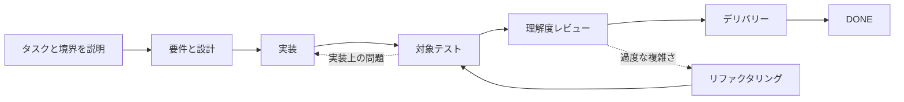

# Dev Flow

[简体中文](README.md) · [English](README_en.md) · [繁體中文](README_zh-TW.md) · [日本語](README_ja.md) · [한국어](README_ko.md) · [Español](README_es.md) · [Français](README_fr.md) · [Deutsch](README_de.md) · [Português (Brasil)](README_pt-BR.md)

> Codex と DeepSeek の長いタスクで、スコープを守り、検証を制限し、中断後に再開できるようにします。

[](https://www.npmjs.com/package/dev-flow-codex)
[](https://www.npmjs.com/package/dev-flow-deepseek)
[](https://github.com/Innocent-children/dev-flow/actions/workflows/ci.yml)
[](LICENSE)

Dev Flow は、AI コーディングタスクに**チャット履歴とは独立したローカルの永続状態**を追加します。
次の情報を保持します。

- このタスクで変更してよい範囲と、明示的に対象外とした作業
- requirements、design、implementation、test、delivery のどこまで進んだか
- 合意した検証量と、すでに得られた証拠
- セッション中断や不確実な書き込みの後に、復旧・ブロック・安全な再試行のどれを選ぶべきか

**別のコーディング Agent やタスクオーケストレーターではありません。** Codex と DeepSeek が
リポジトリを読み、コードを変更し、コマンドを実行します。Dev Flow は 1 つの開発タスクの
スコープ、段階、検証量、証拠、復旧だけを管理します。

**まずはこちら：** [2 分のウォークスルー](docs/DEMO_en.md) ·
[現在のバージョンと実証](docs/PROJECT-STATUS_en.md) · [安定版のインストール](#安定版のインストール)

> この README は現在の `main` の機能を説明します。npm `@latest` は最終アーティファクトで
> 検証済みの安定版であり、`main` より遅れる場合があります。正確な区別は
> [Project Status](docs/PROJECT-STATUS_en.md) を参照してください。

## 30 秒で理解

| Dev Flow なし | Dev Flow が追加するもの |
| --- | --- |
| Prompt で「範囲を広げない」と繰り返す | Task が元の意図を保持し、各段階で変更可能範囲を示す |
| 再起動したセッションが進捗を推測する | 現在段階、証拠、blocker をローカルに保存して再開する |
| 対象テストが全スイートや平台マトリクスへ拡大する | 各 Task に明示的な verification budget を持たせる |
| テストは通るが、結果を説明・保守できない | delivery 前に `COMPREHENSION_REVIEW` を行う |
| 書き込み応答が失われ、危険な replay を行う | 権威状態を読んでから retry の安全性を判断する |

## 1 つのタスクの流れ



実装後に Host が再起動しても、新しいセッションは同じ Task から現在段階、完了済み証拠、
残りの検証予算、合法な次の手順を取得します。チャット履歴から推測し直す必要はありません。
詳しくは [2 分のデモ](docs/DEMO_en.md) を参照してください。

## ツールチェーンでの役割

| ツール | 責務 |
| --- | --- |
| Codex / DeepSeek Harness | リポジトリを読み、コードを変更し、コマンドを実行する |
| Spec Kit / OpenSpec | 要件、設計、タスク分解の方法を提供する |
| Dev Flow | 1 つのタスクのスコープ、段階、検証予算、手戻り経路、復旧状態を保持する |

## 安定版のインストール

現在の安定アーティファクトは **macOS arm64** と **Node.js `>=24`** をサポートします。正確な
バージョンと Host 互換性は [Support Matrix](docs/SUPPORT-MATRIX_en.md) を参照してください。

`dev-flow` 入口でインストール、アップグレード、修復、再インストール、
アンインストール、データ消去後の再インストールを管理します。Host のネイティブコマンドは診断復旧用に残ります。
インストーラーは実行中に各 Host アクションと、package のインストール、登録設定、成果物の検証、ready 状態の再確認など、実際に完了した手順を順に表示します。`--json` は引き続き単一の結果オブジェクトだけを出力します。
対話画面は `zh*` locale では簡体字中国語、それ以外の locale では英語を使用します。

### Codex

```bash
npm install -g @imotong/dev-flow@latest
dev-flow
```

Dev Flow を強制選択する場合：

```text
$dev-flow-codex:dev-flow Fix idempotency in the order-creation endpoint and run targeted tests.
```

詳細は [Codex guide](docs/CODEX_en.md) を参照してください。

### DeepSeek Harness

```bash
npm install -g @imotong/dev-flow@latest
dev-flow
```

profile を再起動後、次を入力します。

```text
/dev-flow Fix idempotency in the order-creation endpoint and run targeted tests.
```

詳細は [DeepSeek guide](docs/DEEPSEEK_en.md) を参照してください。

## 適したタスク

- requirements、design、implementation、test、delivery をまたぐ実リポジトリ作業
- 手戻りがあり、検証証拠を保持する必要がある変更
- 複数セッション、別日、context compaction、Host 再起動をまたぐ作業
- 検証量の上限や、開発者による理解確認が必要なタスク
- 1 つの主リポジトリと少数の明示的な追加リポジトリにまたがる限定作業

状態保持が不要な単発の質問や機械的な単一ファイル変更は、Codex または DeepSeek を直接使う方が
通常は簡単です。

## 主な機能

- **明示的なスコープ：** `TaskIntent` が元の依頼、受け入れ条件、対象外を保持します。
- **限定された検証：** 各 Task に verification budget があり、全回帰や平台マトリクスは既定ではありません。
- **セッション間の復旧：** 現在段階、証拠、blocker、次の手順をローカル SQLite に保存します。
- **理解度レビュー：** テスト通過後も `COMPREHENSION_REVIEW` を行い、保守できない結果は戻します。
- **不確実な書き込みの復旧：** Core は次の Task を完全に検証してから、正規化済み Action 入力を独立した操作レコードに保持します。応答喪失後は Task ID と Action ID だけで復旧でき、payload の再構築は不要です。
- **限定された複数リポジトリ：** 現在の source は主リポジトリ 1 つと追加 7 つまでを 1 つの状態で扱います。
- **同一リポジトリの並列 Task：** 同じ論理 Git リポジトリは、複数の linked worktree を使って独立した Task を同時実行できます。各物理 worktree が保持できる active Task は 1 つだけです。Codex は Host に worktree-backed task/thread 機能がある場合だけ自動で分配し、ない場合は別 worktree の開始を案内します。Core は worktree を作成、切り替え、削除しません。

複数リポジトリ機能が安定版に含まれるかは [Project Status](docs/PROJECT-STATUS_en.md) を確認してください。

## 境界

- Core の Git アクセスは限定された読み取り専用です。commit、push、merge、rebase、tag、publish は行いません。
- ファイル変更とコマンド実行は、ユーザーが許可した Host の責任です。
- Dev Flow は Host のすべてのファイル操作を遮断せず、一般的なセキュリティ sandbox ではありません。
- 現在のソースには loopback 限定の共有 WebUI があり、簡体字中国語/英語、システム言語による初期表示、ブラウザ内切り替えに対応します。remote MCP、telemetry、ユーザー定義 graph、自動的な旧データ移行は含みません。
- 任意のコード index は検索を補助するだけで、スコープ、権限、Recovery、状態を決定できません。
- 書き込み可能な Action は、その Action の発行後にこのノードで新たに変更した `changed_paths` だけを報告し、ファイルを変更していない場合は `no_file_changes` を報告します。Core は発行時の基準と fresh Git observation で検証し、許可された変更は元の Action で完了できますが、branch、HEAD、repository identity、未申告パスの変更は引き続き `REPOSITORY_DRIFT` になります。リポジトリが一致しているのに変更を申告した場合、Core はフィールド規則 `repository_effect_not_observed` を返します。
- Design、Tasks、Implementation の提出では、それぞれ `requirements_revision`、`design_revision`、`task_plan_revision` を省略します。Core は現在の Action identity を検証した後、同じ Task snapshot からこれらを補完します。保存前には現在の Task に対してノード結果の意味も検証し、revision、record、evidence 集合、acceptance など Core から正確にコピーできる値の誤りには `allowed_paths` を返します。ノード提出でゼロ書き込みが証明された `required_member_missing` も、現在のノード作業ですでに確認した事実だけを使い、正確なパスを一度だけ修正できます。欠落内容に新しいユーザー判断が必要なら Host は停止して入力を求め、それ以外の安全に導出できない値には自動修正を許可しません。

セキュリティ境界は [Security Policy](SECURITY.md) と [Threat Model](docs/THREAT-MODEL_en.md) を参照してください。

## 現在の安定サポート

| 製品 | 検証済み環境 |
| --- | --- |
| `dev-flow-codex` | macOS arm64、Node.js `>=24`、Codex `>=0.147.0` |
| `dev-flow-deepseek` | macOS arm64、Node.js `>=24`、DSH `>=0.1.0-rc.6` |

正確な証拠と beta/source の状態は [Project Status](docs/PROJECT-STATUS_en.md) と
[Support Matrix](docs/SUPPORT-MATRIX_en.md) を参照してください。

## ドキュメント

| 知りたいこと | 入口 |
| --- | --- |
| 実タスクを 2 分で理解する | [Demo](docs/DEMO_en.md) |
| stable、beta、source、実証 | [Project Status](docs/PROJECT-STATUS_en.md) |
| 製品機能と境界 | [Product](docs/PRODUCT_en.md) |
| アーキテクチャ | [Architecture](docs/ARCHITECTURE_en.md) |
| サポート対象 | [Support Matrix](docs/SUPPORT-MATRIX_en.md) |
| コマンドと MCP ツール | [Command Reference](docs/COMMANDS_en.md) |
| ローカル WebUI と CLI 専用 reset | [WebUI](docs/WEBUI_en.md) |
| セキュリティ報告 | [Security](SECURITY.md) · [Threat Model](docs/THREAT-MODEL_en.md) |
| コントリビューション | [Contributing](CONTRIBUTING_en.md) |

## License

[Apache License 2.0](LICENSE)
