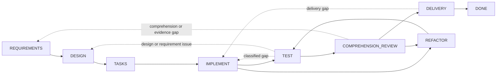

# Dev Flow

[简体中文](README.md) · [English](README_en.md) · [繁體中文](README_zh-TW.md) · [日本語](README_ja.md) · [한국어](README_ko.md) · [Español](README_es.md) · [Français](README_fr.md) · [Deutsch](README_de.md) · [Português (Brasil)](README_pt-BR.md)

> AI 支援コーディングタスクに、明示的なスコープ、検証予算、復旧可能な状態を提供します。

[](https://www.npmjs.com/package/dev-flow-codex)
[](https://www.npmjs.com/package/dev-flow-deepseek)
[](https://github.com/Innocent-children/dev-flow/actions/workflows/ci.yml)
[](LICENSE)

Dev Flow は、AI 支援ソフトウェア開発向けのローカルなプロセス制御・復旧レイヤーです。要件、
設計、タスク計画、実装、テスト、理解度レビュー、リファクタリング、デリバリーを Go Core が
管理する状態グラフとして構成します。Codex、DeepSeek Harness などの Host Adapter は
リポジトリの変更とツール実行を担当し、Core は Task、現在ノード、ノード契約、検証予算、
合法な遷移、Recovery 結果を保持します。

## Agent ワークフローでよく発生する失敗モード

| 失敗モード | 典型的な挙動 |
| --- | --- |
| スコープドリフト | 局所的な変更が、隣接モジュールのリファクタリング、汎用抽象、追加ドキュメント、未要求の将来機能へ拡大する |
| 無制限な検証 | 対象を限定したチェックが、完全回帰、プラットフォームマトリクス、負荷試験、増え続ける境界ケースへ拡大する |
| プロセス状態の喪失 | コンテキスト圧縮、Host 再起動、別セッションでの再開後に、進捗を会話履歴と worktree から再構成する必要がある |
| 保守性の欠落 | テストは通るが、開発者が実装を明確に説明、レビュー、引き継ぎできない |
| 不確実な mutation | 書き込み応答の欠落や中断により、操作が commit 済みか判断できず、再実行が危険になる |

これらは Prompt に「リファクタリングしない」「追加テストを実行しない」といった条件を増やす
だけでは安定して解決できません。開発プロセスには、会話の外部にある永続状態と、現在の手順、
完了条件、合法な次の遷移を閉じた契約として表す仕組みが必要です。

## 制御モデル

| 失敗モード | Dev Flow の仕組み |
| --- | --- |
| スコープドリフト | `TaskIntent` が不変の元の意図を保持し、Action が completion conditions と `allowed_effects` を公開します。実質的なスコープ変更は合法な transition で該当ノードへ戻し、Core が古くなった下流 authority を無効化します |
| 無制限な検証 | 各 Task は verification budget を保持します。チェックは現在ノード、変更面、受け入れ条件、既知の復旧リスクに関連していなければならず、完全スイートやプラットフォームマトリクスは既定作業ではありません |
| プロセス状態の喪失 | 現在ノード、requirements/design/task-plan baselines、証拠、blocker、合法な遷移をローカル SQLite に永続化します |
| 保守性の欠落 | `TEST` の後に `COMPREHENSION_REVIEW` を必須とします。説明または保守できない実装は `DESIGN`、`IMPLEMENT`、`REFACTOR` に戻り、リポジトリ変更後は再度 `TEST` を通過します |
| 不確実な mutation | mutation は revision、action identity、source cursor、repository binding を持ちます。呼び出し側は read-before-retry を守り、5 分類の Recovery 結果に従います |

Core は Host によるすべてのリポジトリ変更を静的に遮断するものではありません。Core は権威ある
Action 契約を公開し、Task 遷移を検証します。Host Adapter は現在ノードの allowed effects と
verification budget の範囲内で動作する必要があります。

## 適用対象

Dev Flow は、複数の開発ノードをまたぎ、手戻りが発生し得る、検証証拠を保持する必要がある、
または複数セッションにわたって再開する実リポジトリ作業に適しています。状態保持を必要としない
単発の質問や機械的な単一ファイル変更では、Codex または DeepSeek を直接使う方が簡単です。

## クイックスタート

現在の公開アーティファクトは macOS arm64 と Node.js `>=24` をサポートします。Core
は Codex と DeepSeek の各 Host 製品に独立してバンドルされ、3 製品は独立して
バージョン管理されます。サポート表は検証済みの正確なバージョンを保持し、インストール例では
npm の `latest` dist-tag を使用します。

### Codex

```bash
npm install -g dev-flow-codex@latest
dev-flow-codex setup
dev-flow-codex --version
```

Codex では唯一の明示的 selector を使って Task を開始します。

```text
$dev-flow-codex:dev-flow Add a failed-login attempt limit to this repository.
```

通常の会話では Dev Flow は起動しません。インストール、削除、データ保持、呼び出し境界は
[Codex package README](docs/CODEX_en.md) を参照してください。

### DeepSeek Harness

npm `latest` が指す公式 package を取得し、tarball の絶対パスを DSH profile に渡します。

```bash
TARBALL="$(npm pack dev-flow-deepseek@latest --silent)"
dsh plugin --profile <profile> add "$PWD/$TARBALL"
```

DSH profile lifecycle に従って profile を再起動し、`/dev-flow` で明示的に Dev Flow へ入ります。
インストール、再起動、削除、データ境界は [DeepSeek package README](docs/DEEPSEEK_en.md) を参照してください。
Codex、DeepSeek、Core、selector、MCP ツールの全コマンドは
[Command Reference](docs/COMMANDS_en.md) にあります。

## 実行モデル

1. 開発者が現在の Git リポジトリで明示的 selector を使い Task を記述します。
2. Core はそのリポジトリの Task を作成または再開し、現在ノード、完了条件、allowed effects、証拠要件、verification budget、すべての合法な遷移を返します。
3. Host は現在の Action を実行します。要件、設計、実装に実質的な変更がある場合、現在ノード内で暗黙に拡大せず、Core が返した transition で報告します。
4. Core は `transition_id`、guard、revision、payload を検証してから Task を進めます。テスト失敗、理解度レビュー失敗、デリバリー拒否は対応するノードへ戻ります。
5. mutation 応答が不確実な場合、Host は Task と Recovery assessment を先に読み、復旧、block、安全な retry を選択します。

## コンポーネント境界

| コンポーネント | 責務 |
| --- | --- |
| Codex / DeepSeek Harness | リポジトリを読み、コードを変更し、ツールを実行し、現在ノードの結果と証拠を提出する |
| Spec Kit / OpenSpec | requirements、design、tasks などのノードに方法とアーティファクトを提供する |
| Tests / CI | 振る舞いの検証証拠を生成する |
| Dev Flow Core | 単一の process cursor、ノード契約、verification budget、合法な遷移、Recovery、終端結果を保持する |

Spec Kit アーティファクト、OpenSpec checkbox、コマンド成功だけでは Task は進みません。有効な
Core action submission のみが権威状態を変更します。

## 開発グラフ

Core は組み込みの `standard-development` のみを提供します。8 つの作業ノード、終端ノード
`DONE`、例外ノード `BLOCKED` と `CANCELLED` を持ち、29 の遷移が前進と実際の手戻りを扱います。



点線は複数の制御された後退を要約します。正確なノード、29 の遷移、guard、reason rule は
[`internal/workflow/`](internal/workflow/) に定義されています。Host は Core が返す
`transition_id` のみを送信し、destination は Core が導出します。

現在の Action から取得できる情報：

- process、node、revision、action identity
- purpose、entry assumptions、completion conditions、`allowed_effects`、`required_evidence`、verification budget
- 選択した method profile の semantic method steps
- destination、guard、選択条件、reason rule を含むすべての合法な transitions

## Runtime 境界

Core は local STDIO MCP 経由で正確に 6 つのツールを公開します。

```text
dev_flow_server_info
dev_flow_open_task
dev_flow_get_task
dev_flow_get_next_action
dev_flow_apply_action
dev_flow_cancel_task
```

各ツールの読み取り・書き込み分類、入力の役割、動作は
[Command Reference](docs/COMMANDS_en.md) を参照してください。

Core は既存の 1 つの Git リポジトリを制限付き・読み取り専用で観測し、repository binding と
変更事実を評価できます。Git mutation はユーザーが承認した Host が実行します。Core は汎用
shell を公開せず、checkout、commit、push、merge、rebase、tag、公開操作を行いません。

## データと復旧

Task データは既定で Host 管理のローカルデータディレクトリに保存されます。
`DEV_FLOW_DATA_DIR` には既存で利用可能な絶対パスを指定できます。Host 統合の削除または
アンインストール後も Task データは保持されます。

グラフ runtime は現在の SQLite Schema と厳密な snapshot のみを受け入れます。互換性のない
データまたは pre-graph データには `SCHEMA_UNSUPPORTED` を返し、書き込みは行いません。
ユーザーは新しいデータディレクトリを選ぶか、Core 外部で旧ディレクトリを archive、rename、
delete できます。lifecycle コマンドは自動削除しません。

## 現在のサポート

| 製品 | 公開バージョン | Bundled Core | 検証済み環境 |
| --- | --- | --- | --- |
| `dev-flow-codex` | `0.5.2` | `0.5.0` | macOS arm64、Node.js `>=24`、Codex `>=0.147.0` |
| `dev-flow-deepseek` | `0.5.1` | `0.5.0` | macOS arm64、Node.js `>=24`、DSH `>=0.1.0-rc.6` |

両 Host 製品の現在のリリースは registry package のインストール、実 Host/Core handshake、削除、
アンインストール、repository-unchanged gate を通過しました。DeepSeek journey は明示的起動、
再起動復旧、`DONE`、retained reopen も対象にしています。正確なアーティファクト identity と
証拠は [Support Matrix](docs/SUPPORT-MATRIX_en.md) および対応する GitHub Release を参照してください。

## ドキュメント

技術リファレンスは現在、英語と簡体字中国語で保守されています。

| トピック | ドキュメント |
| --- | --- |
| 製品の問題、機能、境界 | [Product](docs/PRODUCT_en.md) |
| Core、Adapter、Store、Recovery のアーキテクチャ | [Architecture](docs/ARCHITECTURE_en.md) |
| 現在の対応バージョンとプラットフォーム | [Support Matrix](docs/SUPPORT-MATRIX_en.md) |
| すべてのユーザーコマンド、管理対象 Core コマンド、MCP ツール | [Command Reference](docs/COMMANDS_en.md) |
| 提供済み機能と今後の方向性 | [Roadmap](docs/ROADMAP_en.md) |
| 独立した製品バージョン管理 | [Versioning](docs/VERSIONING.md) |
| ドキュメント locale と同期ルール | [I18n](docs/I18N_en.md) |
| ローカル開発ツールチェーン | [Toolchain Baselines](docs/TOOLCHAIN-BASELINES.md) |
| Feature 開発ガバナンス | [Spec Kit Workflow](docs/SPEC-KIT-WORKFLOW.md) |
| Issue / Pull Request の提出 | [Contributing](CONTRIBUTING_en.md) |
| メンテナー向けリリース入口 | [Release](release/README.md) |

## ローカル開発

Dev Flow には Go `>=1.26`、Node.js `>=24`、pnpm `>=11 <12` が必要です。

```bash
pnpm install --frozen-lockfile
pnpm run validate
```

`pnpm run validate` は制限されたリポジトリ検証を実行します。実 Host 製品のインストールや npm、
Tag、GitHub Release の公開は行いません。ディレクトリ責務は
[Architecture](docs/ARCHITECTURE_en.md)、スクリプト入口は
[Repository Scripts](scripts/README_en.md) を参照してください。

## コントリビューション

再現可能な不具合、ドキュメント改善、最終アーティファクト証拠を伴うプラットフォーム対応、
範囲が明確な製品提案を歓迎します。開始前に [contribution guide](CONTRIBUTING_en.md) を確認してください。
Product Feature の変更は、保守対象の全 root README locale、`docs/PRODUCT*`、影響を受ける技術
リファレンスを同期する必要があります。詳細は [I18n](docs/I18N_en.md) を参照してください。

## License

[Apache License 2.0](LICENSE)
