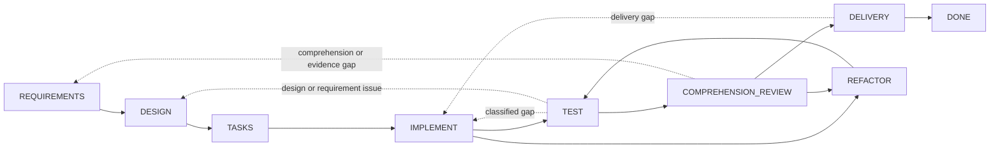

# Dev Flow

[简体中文](README.md) · [English](README_en.md) · [繁體中文](README_zh-TW.md) · [日本語](README_ja.md) · [한국어](README_ko.md) · [Español](README_es.md) · [Français](README_fr.md) · [Deutsch](README_de.md) · [Português (Brasil)](README_pt-BR.md)

> AI 지원 코딩 작업에 명시적 범위, 검증 예산, 복구 가능한 상태를 제공합니다.

[](https://www.npmjs.com/package/dev-flow-codex)
[](https://www.npmjs.com/package/dev-flow-deepseek)
[](https://github.com/Innocent-children/dev-flow/actions/workflows/ci.yml)
[](LICENSE)

Dev Flow는 AI 지원 소프트웨어 개발을 위한 로컬 프로세스 제어 및 복구 계층입니다. 요구사항,
설계, 작업 계획, 구현, 테스트, 이해도 검토, 리팩터링, 전달을 Go Core가 관리하는 상태 그래프로
구성합니다. Codex, DeepSeek Harness 등의 Host Adapter는 저장소 변경과 도구 실행을 담당하고,
Core는 Task, 현재 노드, 노드 계약, 검증 예산, 합법적 전이, Recovery 결과를 보존합니다.

## Agent 워크플로의 일반적인 실패 모드

| 실패 모드 | 일반적인 동작 |
| --- | --- |
| 범위 드리프트 | 국소 변경이 인접 모듈 리팩터링, 범용 추상화, 추가 문서 또는 요청하지 않은 미래 기능으로 확대됨 |
| 무제한 검증 | 대상이 한정된 검사가 전체 회귀, 플랫폼 매트릭스, 부하 테스트 또는 계속 늘어나는 경계 사례로 확대됨 |
| 프로세스 상태 손실 | 컨텍스트 압축, Host 재시작 또는 다음 세션 재개 후 진행 상태를 채팅 기록과 worktree에서 다시 추론해야 함 |
| 유지보수성 결함 | 테스트는 통과하지만 개발자가 구현을 명확히 설명, 검토 또는 인수할 수 없음 |
| 불확실한 mutation | 쓰기 응답이 누락되거나 중단되어 작업이 commit되었는지 알 수 없고 재실행이 위험해짐 |

이 문제들은 Prompt에 “리팩터링하지 말 것”, “추가 테스트를 실행하지 말 것” 같은 문구를 더하는
것만으로 안정적으로 해결되지 않습니다. 개발 프로세스에는 대화 밖의 영속 상태와 현재 단계,
완료 조건, 합법적 다음 전이를 나타내는 폐쇄형 계약이 필요합니다.

## 제어 모델

| 실패 모드 | Dev Flow 메커니즘 |
| --- | --- |
| 범위 드리프트 | `TaskIntent`가 변경 불가능한 원래 의도를 보존하고 Action이 completion conditions와 `allowed_effects`를 노출합니다. 실질적인 범위 변경은 합법적 transition으로 해당 노드에 돌아가야 하며, Core가 오래된 downstream authority를 무효화합니다 |
| 무제한 검증 | 각 Task는 verification budget을 보존합니다. 검사는 현재 노드, 변경 표면, 인수 조건 또는 알려진 복구 위험과 관련되어야 하며 전체 스위트와 플랫폼 매트릭스는 기본 작업이 아닙니다 |
| 프로세스 상태 손실 | 현재 노드, requirements/design/task-plan baselines, 증거, blocker, 합법적 전이를 로컬 SQLite에 영속화합니다 |
| 유지보수성 결함 | `TEST` 다음에 `COMPREHENSION_REVIEW`를 필수로 수행합니다. 설명하거나 유지보수할 수 없는 구현은 `DESIGN`, `IMPLEMENT`, `REFACTOR`로 돌아가고 저장소 변경 후 다시 `TEST`를 거칩니다 |
| 불확실한 mutation | mutation은 revision, action identity, source cursor, repository binding을 포함합니다. 호출자는 read-before-retry를 지키고 5분류 Recovery 결과를 따라야 합니다 |

Core는 Host가 수행하는 모든 저장소 변경을 정적으로 차단하지 않습니다. Core는 권위 있는 Action
계약을 노출하고 Task 전이를 검증합니다. Host Adapter는 현재 노드의 allowed effects와
verification budget 범위 내에서 동작해야 합니다.

## 적용 대상

Dev Flow는 여러 개발 노드를 거치고, 재작업 가능성이 있으며, 검증 증거를 보존해야 하거나 여러
세션에 걸쳐 재개해야 하는 실제 저장소 작업에 적합합니다. 상태 보존이 필요 없는 일회성 질문이나
기계적인 단일 파일 수정은 Codex 또는 DeepSeek를 직접 사용하는 편이 일반적으로 더 단순합니다.

## 다중 저장소 Task와 선택적 코드 인덱싱

하나의 Task는 현재 Git 저장소를 주 저장소로 명시하고 0~7개의 추가 저장소를 포함할 수 있습니다.
모든 저장소는 하나의 current node, Action, revision, verification budget, Recovery, Blocker,
Outcome을 공유합니다. 상위·인접 디렉터리, 종속성 또는 코드 인덱스를 탐색해 범위를 확장하지
않습니다. 단일 저장소 호출과 일반 상대 경로는 호환되며, 다중 저장소 경로는
`<repository-key>::<repository-relative-path>`로 소속을 표시합니다.

선택적 코드 인덱스 기본 설정은 읽기 전용 `$HOME/.dev-flow/config.json`에서 가져옵니다.

```json
{
  "codex": { "codebase_memory": false },
  "deepseek": { "codebase_memory": true }
}
```

디렉터리나 파일이 없으면 두 값은 모두 `false`입니다. `dev-flow-codex setup`은 완전한 기본 구성을
만들고 DeepSeek는 읽기 전용 기본값을 유지합니다. setup은 기존 구성을 다시 쓰지 않습니다.
값이 `true`여도 Host는 이미 설치되어 사용 가능한 codebase-memory만 사용합니다. 사용할 수 없으면
세션당 최대 한 번 알리고 기본 검색으로 전환하며 Task를 차단하지 않습니다. Codex 추가 저장소는
세션 시작 시 이미 허용된 writable root여야 하고 Dev Flow는 sandbox를 바꾸지 않습니다. DeepSeek의
모든 저장소는 현재 Workspace Root 안에 있어야 하며, Root는 Git 저장소가 아닌 공통 상위 디렉터리일
수 있습니다.

## 설치, 업데이트 및 제거

공개 아티팩트는 macOS arm64와 Node.js `>=24`를 지원하며 설치 예시는 npm `latest`를 사용합니다.
Codex와 DeepSeek는 기본 Task 데이터 디렉터리
`$HOME/Library/Application Support/dev-flow/data`를 공유합니다.

### Codex

#### 설치 및 확인

```bash
npm install -g dev-flow-codex@latest
dev-flow-codex setup
dev-flow-codex --version
```

구성이 없으면 `setup`이 `$HOME/.dev-flow/config.json`을 만들고 실제로 생성·수정한 구성과 registration
receipt, 준비 상태, 하나의 다음 단계를 표시합니다. 대화형 출력은 중국어 간체 또는 영어를 따르며,
비대화형과 `NO_COLOR`는 일반 텍스트, `setup --json`은 장식 없는 기계용 사실을 출력합니다.

`setup`은 Codex marketplace, Plugin, MCP를 등록하거나 업데이트합니다. Git 저장소에서 유일한
명시적 selector를 사용합니다.

```text
$dev-flow-codex:dev-flow Add a failed-login attempt limit to this repository.
```

#### 업데이트

```bash
npm install -g dev-flow-codex@latest
dev-flow-codex setup
dev-flow-codex --version
```

#### Task 데이터를 보존한 제거

```bash
dev-flow-codex remove
npm uninstall -g dev-flow-codex
```

항상 `remove`를 먼저 실행합니다. 호환 package를 다시 설치하고 `setup`을 실행하면 재개할 수 있습니다.

### DeepSeek Harness

#### 설치 및 확인

DSH를 먼저 설치한 뒤 실제 profile에 추가합니다. 예시는 `web`입니다. 다른 profile은 `PROFILE` 값을
바꾸고 `<profile>`을 shell에 그대로 입력하지 마십시오.

```bash
npm install -g @deepseek-ai/dsh@latest
dsh --version
PROFILE=web
TARBALL="$(npm pack dev-flow-deepseek@latest --silent)"
dsh plugin --profile "$PROFILE" add "$PWD/$TARBALL"
rm -f "$PWD/$TARBALL"
dsh --profile "$PROFILE" --dump-config
```

profile을 재시작합니다. `web`은 `dsh web`을 실행하고 대화에서 `/dev-flow <작업 설명>`을 입력합니다.

#### 업데이트

profile을 중지한 뒤 실행합니다.

```bash
PROFILE=web
dsh plugin --profile "$PROFILE" remove dev-flow-deepseek
TARBALL="$(npm pack dev-flow-deepseek@latest --silent)"
dsh plugin --profile "$PROFILE" add "$PWD/$TARBALL"
rm -f "$PWD/$TARBALL"
dsh --profile "$PROFILE" --dump-config
```

profile을 재시작합니다. DSH 자체는 `npm install -g @deepseek-ai/dsh@latest`로 업데이트할 수 있습니다.

#### Task 데이터를 보존한 제거

Dev Flow가 설치된 각 profile에서 실행합니다.

```bash
PROFILE=web
dsh plugin --profile "$PROFILE" remove dev-flow-deepseek
dsh --profile "$PROFILE" --dump-config
```

DSH가 필요 없으면 `npm uninstall -g @deepseek-ai/dsh`를 실행할 수 있으며 `$HOME/.dsh`는 보존됩니다.

### 데이터 영구 삭제

Codex와 모든 DSH profile에서 Dev Flow를 제거하고 Task가 필요 없음을 확인한 뒤 실행합니다.

```bash
rm -rf "$HOME/Library/Application Support/dev-flow"
```

이 작업은 복구할 수 없습니다. `DEV_FLOW_DATA_DIR`을 사용했다면 정확한 절대 디렉터리를 별도로 확인해
삭제하십시오. `$HOME/.dsh`를 삭제하면 모든 DSH profile, 세션, 기타 plugin도 삭제됩니다. 자세한 내용은
[Codex package README](docs/CODEX_en.md), [DeepSeek package README](docs/DEEPSEEK_en.md),
[Command Reference](docs/COMMANDS_en.md)를 참고하십시오.

## 실행 모델

1. 개발자가 현재 Git 저장소에서 명시적 selector로 Task를 설명합니다.
2. Core는 해당 저장소의 Task를 열거나 재개하고 현재 노드, 완료 조건, allowed effects, 증거 요구사항, verification budget, 모든 합법적 전이를 반환합니다.
3. Host는 현재 Action을 실행합니다. 요구사항, 설계 또는 구현에 실질적인 변경이 있으면 현재 노드 안에서 암묵적으로 범위를 넓히지 않고 Core가 반환한 transition으로 보고합니다.
4. Core는 `transition_id`, guard, revision, payload를 검증한 후 Task를 진행합니다. 테스트 실패, 이해도 검토 실패, 전달 거부는 해당 노드로 돌아갑니다.
5. mutation 응답이 불확실하면 Host는 Task와 Recovery assessment를 먼저 읽은 후 복구, 차단 또는 안전한 retry를 결정합니다.

## 컴포넌트 경계

| 컴포넌트 | 책임 |
| --- | --- |
| Codex / DeepSeek Harness | 저장소를 읽고 코드를 수정하며 도구를 실행하고 현재 노드의 결과와 증거를 제출함 |
| Spec Kit / OpenSpec | requirements, design, tasks 등의 노드에 방법과 아티팩트를 제공함 |
| Tests / CI | 동작 검증 증거를 생성함 |
| Dev Flow Core | 단일 process cursor, 노드 계약, verification budget, 합법적 전이, Recovery, 종료 결과를 보존함 |

Spec Kit 아티팩트, OpenSpec checkbox 또는 성공한 명령만으로 Task를 진행할 수 없습니다. 유효한 Core
action submission만 권위 상태를 변경합니다.

## 개발 그래프

Core는 내장 `standard-development` 프로세스 하나만 제공합니다. 8개의 작업 노드, 종료 노드
`DONE`, 예외 노드 `BLOCKED`와 `CANCELLED`가 있으며 29개의 전이가 정상 진행과 실제 재작업을
처리합니다.



점선은 여러 제어된 후퇴를 요약합니다. 정확한 노드, 29개의 전이, guard, reason rule은
[`internal/workflow/`](internal/workflow/)에 정의되어 있습니다. Host는 Core가 반환한
`transition_id`만 제출하고 destination은 Core가 계산합니다.

현재 Action은 다음을 제공합니다.

- process, node, revision, action identity
- purpose, entry assumptions, completion conditions, `allowed_effects`, `required_evidence`, verification budget
- 선택된 method profile의 semantic method steps
- destination, guard, 선택 조건, reason rule을 포함한 모든 합법적 transitions

## Runtime 경계

Core는 local STDIO MCP를 통해 정확히 6개의 도구를 노출합니다.

```text
dev_flow_server_info
dev_flow_open_task
dev_flow_get_task
dev_flow_get_next_action
dev_flow_apply_action
dev_flow_cancel_task
```

각 도구의 읽기/쓰기 분류, 입력 역할과 동작은 [Command Reference](docs/COMMANDS_en.md)를 참고하십시오.

Core는 Task가 명시한 1~8개의 기존 Git 저장소를 고정 순서로 제한된 읽기 전용 방식으로 관찰하여
repository bindings를 만들고 변경 사실을 평가할 수 있습니다. Git mutation은 사용자 승인을 받은
Host가 수행합니다. Core는 범용 shell을 노출하지 않으며 checkout, commit, push, merge, rebase,
tag 또는 publish 작업을 수행하지 않습니다.

## 데이터와 복구

Task 데이터는 기본적으로 Host가 관리하는 로컬 데이터 디렉터리에 저장됩니다.
`DEV_FLOW_DATA_DIR`에는 이미 존재하고 사용 가능한 절대 경로를 지정할 수 있습니다. Host 통합을
제거하거나 삭제해도 Task 데이터는 유지됩니다.

그래프 runtime은 현재 SQLite Schema와 엄격한 snapshot만 허용합니다. 호환되지 않는 데이터 또는
pre-graph 데이터에는 `SCHEMA_UNSUPPORTED`를 반환하고 쓰기를 수행하지 않습니다. 사용자는 새 데이터
디렉터리를 선택하거나 Core 외부에서 기존 디렉터리를 archive, rename 또는 delete할 수 있습니다.
lifecycle 명령은 자동으로 정리하지 않습니다.

## 현재 지원

| 제품 | 공개 버전 | Bundled Core | 검증된 환경 |
| --- | --- | --- | --- |
| `dev-flow-codex` | `0.5.3` | `0.5.1` | macOS arm64, Node.js `>=24`, Codex `>=0.147.0` |
| `dev-flow-deepseek` | `0.5.2` | `0.5.1` | macOS arm64, Node.js `>=24`, DSH `>=0.1.0-rc.6` |

두 Host 제품의 현재 릴리스 모두 registry package 설치, 실제 Host/Core handshake, 제거, 삭제,
repository-unchanged gate를 통과했습니다. DeepSeek journey는 명시적 활성화, 재시작 복구, `DONE`,
retained reopen도 포함합니다. 정확한 아티팩트 identity와 증거는
[Support Matrix](docs/SUPPORT-MATRIX_en.md) 및 해당 GitHub Release를 참고하십시오.

## 문서

기술 참조 문서는 현재 영어와 중국어 간체로 유지됩니다.

| 주제 | 문서 |
| --- | --- |
| 제품 문제, 기능, 경계 | [Product](docs/PRODUCT_en.md) |
| Core, Adapter, Store, Recovery 아키텍처 | [Architecture](docs/ARCHITECTURE_en.md) |
| 현재 지원 버전과 플랫폼 | [Support Matrix](docs/SUPPORT-MATRIX_en.md) |
| 모든 사용자 명령, 관리되는 Core 명령 및 MCP 도구 | [Command Reference](docs/COMMANDS_en.md) |
| 제공된 기능과 향후 방향 | [Roadmap](docs/ROADMAP_en.md) |
| 독립 제품 버전 관리 | [Versioning](docs/VERSIONING.md) |
| 문서 locale과 동기화 규칙 | [I18n](docs/I18N_en.md) |
| 로컬 개발 도구 체인 | [Toolchain Baselines](docs/TOOLCHAIN-BASELINES.md) |
| Feature 개발 거버넌스 | [Spec Kit Workflow](docs/SPEC-KIT-WORKFLOW.md) |
| Issue 또는 Pull Request 제출 | [Contributing](CONTRIBUTING_en.md) |
| 유지보수자 릴리스 진입점 | [Release](release/README.md) |

## 로컬 개발

Dev Flow에는 Go `>=1.26`, Node.js `>=24`, pnpm `>=11 <12`가 필요합니다.

```bash
pnpm install --frozen-lockfile
pnpm run validate
```

`pnpm run validate`는 제한된 저장소 검증을 수행합니다. 실제 Host 제품을 설치하거나 npm, Tag,
GitHub Release를 게시하지 않습니다. 디렉터리 책임은 [Architecture](docs/ARCHITECTURE_en.md),
스크립트 진입점은 [Repository Scripts](scripts/README_en.md)를 참고하십시오.

## 기여

재현 가능한 결함, 문서 개선, 최종 아티팩트 증거가 있는 플랫폼 지원, 범위가 명확한 제품 제안을
환영합니다. 시작하기 전에 [contribution guide](CONTRIBUTING_en.md)를 읽으십시오. Product Feature
변경은 유지되는 모든 root README locale, `docs/PRODUCT*`, 영향을 받는 기술 참조를 동기화해야
합니다. 정확한 규칙은 [I18n](docs/I18N_en.md)을 참고하십시오.

## License

[Apache License 2.0](LICENSE)
