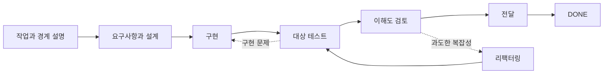

# Dev Flow

[简体中文](README.md) · [English](README_en.md) · [繁體中文](README_zh-TW.md) · [日本語](README_ja.md) · [한국어](README_ko.md) · [Español](README_es.md) · [Français](README_fr.md) · [Deutsch](README_de.md) · [Português (Brasil)](README_pt-BR.md)

> Codex와 DeepSeek의 긴 작업에서 범위를 지키고, 검증을 제한하며, 중단 후 다시 시작할 수 있게 합니다.

[](https://www.npmjs.com/package/dev-flow-codex)
[](https://www.npmjs.com/package/dev-flow-deepseek)
[](https://github.com/Innocent-children/dev-flow/actions/workflows/ci.yml)
[](LICENSE)

Dev Flow는 AI 코딩 작업에 **채팅 기록과 분리된 로컬 영속 상태**를 제공합니다. 다음을 기억합니다.

- 이번 작업에서 변경해도 되는 범위와 명시적으로 제외한 작업
- requirements, design, implementation, test, delivery 중 현재 단계
- 합의한 검증량과 이미 확보한 증거
- 세션 중단이나 불확실한 쓰기 후 복구, 차단, 안전한 재시도 중 무엇을 해야 하는지

**또 다른 코딩 Agent나 작업 오케스트레이터가 아닙니다.** Codex와 DeepSeek가 저장소를 읽고,
코드를 수정하고, 명령을 실행합니다. Dev Flow는 하나의 개발 작업에 대한 범위, 단계, 검증량,
증거, 복구만 관리합니다.

**바로 시작하기:** [2분 워크스루](docs/DEMO_en.md) ·
[현재 버전과 실제 증거](docs/PROJECT-STATUS_en.md) · [안정 버전 설치](#안정-버전-설치)

> 이 README는 현재 `main`의 기능을 설명합니다. npm `@latest`는 최종 아티팩트로 검증된 안정
> 버전이며 `main`보다 늦을 수 있습니다. 정확한 stable, beta, source 구분은
> [Project Status](docs/PROJECT-STATUS_en.md)를 참고하십시오.

## 30초 이해

| Dev Flow 없이 | Dev Flow가 추가하는 것 |
| --- | --- |
| Prompt에서 “범위를 넓히지 말 것”을 반복 | Task가 원래 의도를 보존하고 각 단계의 허용 범위를 제시 |
| 재시작한 세션이 저장소를 다시 훑고 진행 상태를 추측 | 현재 단계, 증거, blocker를 로컬에 보존하고 재개 |
| 대상 검사가 전체 suite나 플랫폼 매트릭스로 확대 | 각 Task에 명시적 verification budget 적용 |
| 테스트는 통과하지만 결과를 설명하거나 인수하기 어려움 | delivery 전에 `COMPREHENSION_REVIEW` 수행 |
| 쓰기 응답이 유실되어 위험한 replay 수행 | 권위 상태를 먼저 읽고 retry 안전성을 결정 |

## 한 작업의 흐름



구현 후 Host가 재시작되어도 새 세션은 같은 Task에서 현재 단계, 완료한 증거, 남은 검증 예산,
합법적인 다음 단계를 읽습니다. 채팅 기록에서 다시 추론하지 않습니다. 자세한 내용은
[2분 데모](docs/DEMO_en.md)를 참고하십시오.

## 도구 체인에서의 역할

| 도구 | 책임 |
| --- | --- |
| Codex / DeepSeek Harness | 저장소 읽기, 코드 변경, 명령 실행 |
| Spec Kit / OpenSpec | 요구사항, 설계, 작업 계획 방법 제공 |
| Dev Flow | 하나의 작업에 대한 범위, 단계, 검증 예산, 재작업 경로, 복구 상태 보존 |

## 안정 버전 설치

현재 안정 아티팩트는 **macOS arm64**와 **Node.js `>=24`**를 지원합니다. 정확한 버전과 Host
호환성은 [Support Matrix](docs/SUPPORT-MATRIX_en.md)를 참고하십시오.

### Codex

```bash
npm install -g dev-flow-codex@latest
dev-flow-codex setup
dev-flow-codex --version
```

Dev Flow를 강제로 선택하려면:

```text
$dev-flow-codex:dev-flow Fix idempotency in the order-creation endpoint and run targeted tests.
```

자세한 내용은 [Codex guide](docs/CODEX_en.md)를 참고하십시오.

### DeepSeek Harness

```bash
npm install -g @deepseek-ai/dsh@latest
PROFILE=web
TARBALL="$(npm pack dev-flow-deepseek@latest --silent)"
dsh plugin --profile "$PROFILE" add "$PWD/$TARBALL"
rm -f "$PWD/$TARBALL"
dsh --profile "$PROFILE" --dump-config
```

profile을 재시작한 뒤 입력합니다.

```text
/dev-flow Fix idempotency in the order-creation endpoint and run targeted tests.
```

자세한 내용은 [DeepSeek guide](docs/DEEPSEEK_en.md)를 참고하십시오.

## 적합한 작업

- requirements, design, implementation, test, delivery를 거치는 실제 저장소 작업
- 재작업 가능성이 있고 검증 증거를 보존해야 하는 변경
- 여러 세션, 날짜, context compaction, Host 재시작을 넘나드는 작업
- 명시적 검증 한도나 개발자 이해도 확인이 필요한 작업
- 하나의 주 저장소와 소수의 명시적 추가 저장소에 걸친 제한된 작업

상태 보존이 필요 없는 일회성 질문이나 기계적인 단일 파일 수정은 Codex 또는 DeepSeek를 직접
사용하는 편이 보통 더 단순합니다.

## 주요 기능

- **명시적 범위:** `TaskIntent`가 원래 요청, 인수 조건, 범위 밖 작업을 보존합니다.
- **제한된 검증:** 각 Task에 verification budget이 있으며 전체 회귀와 플랫폼 매트릭스는 기본 작업이 아닙니다.
- **세션 간 복구:** 현재 단계, 증거, blocker, 다음 단계를 로컬 SQLite에 보존합니다.
- **이해도 검토:** 테스트 이후 `COMPREHENSION_REVIEW`를 수행하고 유지보수하기 어려운 결과는 되돌립니다.
- **불확실한 쓰기 복구:** 응답이 유실되면 Core의 Recovery 결과를 읽은 후 재시도합니다.
- **제한된 다중 저장소:** 현재 source는 주 저장소 1개와 추가 저장소 최대 7개를 하나의 상태로 관리합니다.

다중 저장소 기능이 안정 버전에 포함되었는지는
[Project Status](docs/PROJECT-STATUS_en.md)에서 확인하십시오.

## 경계

- Core의 Git 접근은 제한된 읽기 전용이며 commit, push, merge, rebase, tag, publish를 수행하지 않습니다.
- 파일 변경과 명령 실행은 사용자가 승인한 Host의 책임입니다.
- Dev Flow는 Host의 모든 파일 작업을 차단하지 않으며 일반 보안 sandbox가 아닙니다.
- 현재 Web UI, remote MCP, telemetry, 사용자 정의 graph, 자동 과거 데이터 마이그레이션은 없습니다.
- 선택적 코드 index는 검색만 보조하며 범위, 권한, Recovery, 상태를 결정할 수 없습니다.

보안 경계는 [Security Policy](SECURITY.md)와 [Threat Model](docs/THREAT-MODEL_en.md)을 참고하십시오.

## 현재 안정 지원

| 제품 | 안정 버전 | Bundled Core | 검증된 환경 |
| --- | --- | --- | --- |
| `dev-flow-codex` | `0.6.0` | `0.5.1` | macOS arm64, Node.js `>=24`, Codex `>=0.147.0` |
| `dev-flow-deepseek` | `0.6.0` | `0.5.1` | macOS arm64, Node.js `>=24`, DSH `>=0.1.0-rc.6` |

정확한 증거와 beta/source 상태는 [Project Status](docs/PROJECT-STATUS_en.md)와
[Support Matrix](docs/SUPPORT-MATRIX_en.md)를 참고하십시오.

## 문서

| 알고 싶은 내용 | 시작 위치 |
| --- | --- |
| 실제 작업을 2분 안에 이해 | [Demo](docs/DEMO_en.md) |
| stable, beta, source, 증거 | [Project Status](docs/PROJECT-STATUS_en.md) |
| 제품 기능과 경계 | [Product](docs/PRODUCT_en.md) |
| 아키텍처 | [Architecture](docs/ARCHITECTURE_en.md) |
| 지원 범위 | [Support Matrix](docs/SUPPORT-MATRIX_en.md) |
| 명령과 MCP 도구 | [Command Reference](docs/COMMANDS_en.md) |
| 보안 보고 | [Security](SECURITY.md) · [Threat Model](docs/THREAT-MODEL_en.md) |
| 기여 | [Contributing](CONTRIBUTING_en.md) |

## License

[Apache License 2.0](LICENSE)
