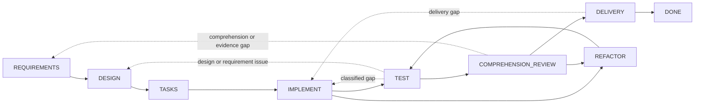

# Dev Flow

[简体中文](README.md) · [English](README_en.md) · [繁體中文](README_zh-TW.md) · [日本語](README_ja.md) · [한국어](README_ko.md) · [Español](README_es.md) · [Français](README_fr.md) · [Deutsch](README_de.md) · [Português (Brasil)](README_pt-BR.md)

> Escopo explícito, orçamento de verificação e estado recuperável para tarefas de programação assistidas por IA.

[](https://www.npmjs.com/package/dev-flow-codex)
[](https://www.npmjs.com/package/dev-flow-deepseek)
[](https://github.com/Innocent-children/dev-flow/actions/workflows/ci.yml)
[](LICENSE)

Dev Flow é uma camada local de controle de processo e recuperação para desenvolvimento de software assistido
por IA. Ele organiza requisitos, design, planejamento de tarefas, implementação, testes, revisão de compreensão,
refatoração e entrega como um grafo de estados gerenciado por um Go Core. Codex, DeepSeek Harness e outros Host
Adapter modificam repositórios e executam ferramentas; Core preserva o Task, o nó atual, o contrato do nó, o
orçamento de verificação, as transições legais e o resultado de Recovery.

## Modos de falha comuns em workflows de Agent

| Modo de falha | Comportamento típico |
| --- | --- |
| Desvio de escopo | Uma alteração local se expande para refatoração de módulos vizinhos, abstração genérica, documentação adicional ou capacidade futura não solicitada |
| Verificação sem limites | Uma verificação direcionada se expande para regressão completa, matriz de plataformas, teste de carga ou uma coleção crescente de casos de borda |
| Perda do estado do processo | Após compactação de contexto, reinício do Host ou retomada em outra sessão, o progresso precisa ser reconstruído do histórico e do worktree |
| Lacuna de manutenibilidade | Os testes passam, mas um desenvolvedor não consegue explicar, revisar ou assumir claramente a implementação |
| Mutation incerta | Uma resposta de escrita ausente ou interrompida impede saber se a operação foi commitada e torna o replay arriscado |

Esses problemas não são resolvidos de forma confiável adicionando mais cláusulas como “não refatore” ou “não
execute testes extras” ao Prompt. O processo de desenvolvimento precisa de estado durável fora da conversa e de
um contrato fechado para a etapa atual, suas condições de conclusão e suas próximas transições legais.

## Modelo de controle

| Modo de falha | Mecanismo do Dev Flow |
| --- | --- |
| Desvio de escopo | `TaskIntent` preserva a intenção original imutável; cada Action expõe completion conditions e `allowed_effects`; uma alteração material de escopo deve usar uma transition legal para o nó correspondente, onde Core invalida authority downstream obsoleta |
| Verificação sem limites | Cada Task possui um verification budget; as verificações devem se relacionar ao nó atual, superfície alterada, critérios de aceitação ou risco de recuperação conhecido; suites completas e matrizes de plataforma não são trabalho padrão |
| Perda do estado do processo | Nó atual, baselines de requirements/design/task-plan, evidências, blockers e transições legais são persistidos em SQLite local |
| Lacuna de manutenibilidade | `TEST` é seguido por `COMPREHENSION_REVIEW`; uma implementação que não pode ser explicada ou mantida retorna a `DESIGN`, `IMPLEMENT` ou `REFACTOR`, e alterações no repositório passam novamente por `TEST` |
| Mutation incerta | Mutations carregam revision, action identity, source cursor e repository binding; o chamador deve aplicar read-before-retry e seguir o resultado de Recovery de cinco classes |

Core não intercepta estaticamente cada alteração de repositório feita por um Host. Ele expõe o contrato Action
autoritativo e valida as transições do Task. Host Adapter devem operar dentro dos `allowed_effects` e do
verification budget do nó atual.

## Quando usar

Dev Flow é adequado para trabalho real em repositórios que atravessa vários nós de desenvolvimento, pode exigir
retrabalho, precisa preservar evidências de verificação ou deve ser retomado entre sessões. Para uma pergunta
pontual ou uma edição mecânica de um único arquivo sem estado persistente, normalmente é mais simples usar Codex
ou DeepSeek diretamente.

## Tasks com vários repositórios e indexação de código opcional

Um Task pode declarar explicitamente o repositório Git atual como principal e adicionar de zero a
sete repositórios. Todos compartilham um único current node, Action, revision, verification budget,
Recovery, Blocker e Outcome. O Dev Flow não examina diretórios pais ou vizinhos, dependências nem
índices de código para ampliar o escopo. Chamadas de um único repositório e caminhos relativos comuns
continuam compatíveis; caminhos de vários repositórios usam
`<repository-key>::<repository-relative-path>` para indicar a qual repositório pertencem.

As preferências opcionais de indexação vêm do arquivo somente leitura
`$HOME/.dev-flow/config.json`:

```json
{
  "codex": { "codebase_memory": false },
  "deepseek": { "codebase_memory": true }
}
```

Se o diretório ou o arquivo não existir, os dois valores serão `false` e o Dev Flow não criará nem
modificará o arquivo. Com `true`, o Host só usa codebase-memory quando ele já está instalado e
disponível. Se estiver ausente ou ficar indisponível, o Host avisa no máximo uma vez por sessão e
volta à busca integrada sem bloquear o Task. Os repositórios adicionais do Codex devem ser writable
roots já autorizados no início da sessão; o Dev Flow não altera o sandbox. Todos os repositórios do
DeepSeek devem estar dentro do Workspace Root atual, que pode ser um pai comum que não seja Git.

## Instalação, atualização e desinstalação

Os artefatos públicos oferecem suporte a macOS arm64 e Node.js `>=24`; os exemplos usam npm `latest`.
Codex e DeepSeek compartilham os dados Task padrão em
`$HOME/Library/Application Support/dev-flow/data`.

### Codex

#### Instalação e verificação

```bash
npm install -g dev-flow-codex@latest
dev-flow-codex setup
dev-flow-codex --version
```

`setup` registra ou atualiza marketplace, Plugin e MCP do Codex. Em um repositório Git, use o único selector:

```text
$dev-flow-codex:dev-flow Add a failed-login attempt limit to this repository.
```

#### Atualização

```bash
npm install -g dev-flow-codex@latest
dev-flow-codex setup
dev-flow-codex --version
```

#### Desinstalação preservando dados Task

```bash
dev-flow-codex remove
npm uninstall -g dev-flow-codex
```

Execute `remove` primeiro. Uma instalação compatível seguida de `setup` pode retomar os dados.

### DeepSeek Harness

#### Instalação e verificação

Instale primeiro o DSH e adicione Dev Flow a um profile real. O exemplo usa `web`; altere `PROFILE` para
outro profile e não digite `<profile>` literalmente no shell.

```bash
npm install -g @deepseek-ai/dsh@latest
dsh --version
PROFILE=web
TARBALL="$(npm pack dev-flow-deepseek@latest --silent)"
dsh plugin --profile "$PROFILE" add "$PWD/$TARBALL"
rm -f "$PWD/$TARBALL"
dsh --profile "$PROFILE" --dump-config
```

Reinicie o profile; para `web`, use `dsh web`. Na conversa, use `/dev-flow <descrição>`.

#### Atualização

Pare o profile e execute:

```bash
PROFILE=web
dsh plugin --profile "$PROFILE" remove dev-flow-deepseek
TARBALL="$(npm pack dev-flow-deepseek@latest --silent)"
dsh plugin --profile "$PROFILE" add "$PWD/$TARBALL"
rm -f "$PWD/$TARBALL"
dsh --profile "$PROFILE" --dump-config
```

Reinicie o profile. Atualize o DSH com `npm install -g @deepseek-ai/dsh@latest`.

#### Desinstalação preservando dados Task

Execute em cada profile que contenha Dev Flow:

```bash
PROFILE=web
dsh plugin --profile "$PROFILE" remove dev-flow-deepseek
dsh --profile "$PROFILE" --dump-config
```

Se DSH não for mais necessário, use `npm uninstall -g @deepseek-ai/dsh`; `$HOME/.dsh` é preservado.

### Exclusão permanente dos dados

Após remover Dev Flow do Codex e de todos os profiles DSH e confirmar que nenhum Task é necessário:

```bash
rm -rf "$HOME/Library/Application Support/dev-flow"
```

Esta operação é irreversível. Se `DEV_FLOW_DATA_DIR` foi usado, verifique e exclua separadamente seu diretório
absoluto. Excluir `$HOME/.dsh` também remove todos os profiles, sessões e outros plugins DSH. Consulte
[Codex package README](docs/CODEX_en.md), [DeepSeek package README](docs/DEEPSEEK_en.md) e
[Referência de comandos](docs/COMMANDS_en.md).

## Modelo de execução

1. O desenvolvedor descreve um Task no repositório Git atual por meio de um selector explícito.
2. Core abre ou retoma o Task desse repositório e retorna o nó atual, condições de conclusão, `allowed_effects`, requisitos de evidência, verification budget e todas as transições legais.
3. O Host executa a Action atual. Uma alteração material de requisito, design ou implementação é reportada por uma transition retornada por Core, em vez de ficar oculta dentro do nó atual.
4. Core valida `transition_id`, guard, revision e payload antes de avançar o Task. Falha de teste, falha de compreensão ou entrega rejeitada retornam ao nó correspondente.
5. Se uma resposta de mutation for incerta, o Host lê primeiro o Task e o Recovery assessment antes de decidir por recuperação, bloqueio ou retry seguro.

## Limites de componentes

| Componente | Responsabilidade |
| --- | --- |
| Codex / DeepSeek Harness | Ler o repositório, modificar código, executar ferramentas e enviar resultados e evidências do nó atual |
| Spec Kit / OpenSpec | Fornecer métodos e artefatos para requirements, design, tasks e nós relacionados |
| Tests / CI | Produzir evidência de verificação de comportamento |
| Dev Flow Core | Preservar o único process cursor, contrato do nó, verification budget, transições legais, Recovery e resultado terminal |

Um artefato Spec Kit, uma checkbox OpenSpec ou um comando bem-sucedido não pode avançar um Task sozinho. Apenas
uma Core action submission válida altera o estado autoritativo.

## Grafo de desenvolvimento

Core fornece um único processo integrado, `standard-development`: oito nós de trabalho, o nó terminal `DONE` e
os nós excepcionais `BLOCKED` e `CANCELLED`. Vinte e nove transições cobrem avanço e retrabalho real.



As linhas pontilhadas resumem vários retornos controlados. Os nós exatos, as 29 transições, guards e reason rules
são definidos em [`internal/workflow/`](internal/workflow/). Um Host envia somente um `transition_id` retornado
por Core; Core deriva o destination.

Cada Action atual expõe:

- process, node, revision e action identity;
- purpose, entry assumptions, completion conditions, `allowed_effects`, `required_evidence` e verification budget;
- semantic method steps do method profile selecionado;
- todas as transitions legais com destination, guard, condição de seleção e reason rule.

## Limite de runtime

Core expõe exatamente seis ferramentas por MCP STDIO local:

```text
dev_flow_server_info
dev_flow_open_task
dev_flow_get_task
dev_flow_get_next_action
dev_flow_apply_action
dev_flow_cancel_task
```

Consulte a [Referência de comandos](docs/COMMANDS_en.md) para a classificação de leitura/escrita, o papel das
entradas e o comportamento de cada ferramenta.

Core pode observar, de forma limitada, ordenada e somente leitura, de um a oito repositórios Git existentes
declarados explicitamente por um Task para estabelecer repository bindings e avaliar fatos de alteração. Um Host
autorizado pelo usuário executa as mutations Git. Core não expõe shell genérico nem executa checkout, commit,
push, merge, rebase, tag ou publicação.

## Dados e recuperação

Os dados de Task ficam por padrão em um diretório local gerenciado pelo produto Host. `DEV_FLOW_DATA_DIR` pode
apontar para um diretório absoluto existente e utilizável. Remover ou desinstalar uma integração Host preserva os
dados de Task.

O runtime do grafo aceita somente o SQLite Schema atual e snapshot estrito. Dados incompatíveis ou pre-graph
retornam `SCHEMA_UNSUPPORTED` sem escrita. O usuário pode selecionar um diretório novo ou arquivar, renomear ou
excluir o antigo fora de Core. Comandos lifecycle nunca executam essa limpeza automaticamente.

## Suporte atual

| Produto | Versão pública | Bundled Core | Ambiente verificado |
| --- | --- | --- | --- |
| `dev-flow-codex` | `0.5.3` | `0.5.1` | macOS arm64, Node.js `>=24`, Codex `>=0.147.0` |
| `dev-flow-deepseek` | `0.5.2` | `0.5.1` | macOS arm64, Node.js `>=24`, DSH `>=0.1.0-rc.6` |

As versões atuais de ambos os produtos Host passaram por instalação via registry package, handshake real Host/Core, remoção,
desinstalação e repository-unchanged gate. O journey do DeepSeek também cobriu ativação explícita, recuperação
após reinício, `DONE` e retained reopen. Consulte [Support Matrix](docs/SUPPORT-MATRIX_en.md) e as GitHub Releases
correspondentes para identidades e evidências exatas.

## Documentação

A referência técnica é mantida atualmente em inglês e chinês simplificado.

| Tema | Documento |
| --- | --- |
| Problemas, capacidades e limites do produto | [Product](docs/PRODUCT_en.md) |
| Arquitetura de Core, Adapter, Store e Recovery | [Architecture](docs/ARCHITECTURE_en.md) |
| Versões e plataformas suportadas | [Support Matrix](docs/SUPPORT-MATRIX_en.md) |
| Todos os comandos de usuário, comandos Core gerenciados e ferramentas MCP | [Command Reference](docs/COMMANDS_en.md) |
| Capacidades entregues e direção futura | [Roadmap](docs/ROADMAP_en.md) |
| Versionamento independente de produtos | [Versioning](docs/VERSIONING.md) |
| Locales de documentação e regras de sincronização | [I18n](docs/I18N_en.md) |
| Toolchains de desenvolvimento local | [Toolchain Baselines](docs/TOOLCHAIN-BASELINES.md) |
| Governança de Product Feature | [Spec Kit Workflow](docs/SPEC-KIT-WORKFLOW.md) |
| Reportar Issue ou abrir Pull Request | [Contributing](CONTRIBUTING_en.md) |
| Entrada de release para mantenedores | [Release](release/README.md) |

## Desenvolvimento local

Dev Flow requer Go `>=1.26`, Node.js `>=24` e pnpm `>=11 <12`:

```bash
pnpm install --frozen-lockfile
pnpm run validate
```

`pnpm run validate` executa validação limitada do repositório. Não instala produtos Host reais nem publica
pacotes npm, Tags ou GitHub Releases. Consulte [Architecture](docs/ARCHITECTURE_en.md) para responsabilidades de
diretório e [Repository Scripts](scripts/README_en.md) para pontos de entrada de scripts.

## Contribuição

Defeitos reproduzíveis, melhorias de documentação, suporte de plataforma com evidência de artefato final e
propostas de produto com escopo limitado são bem-vindos. Leia o [guia de contribuição](CONTRIBUTING_en.md) antes
de começar. Alterações de Product Feature devem sincronizar todos os locales mantidos do root README,
`docs/PRODUCT*` e as referências técnicas afetadas; consulte [I18n](docs/I18N_en.md) para a regra exata.

## License

[Apache License 2.0](LICENSE)
