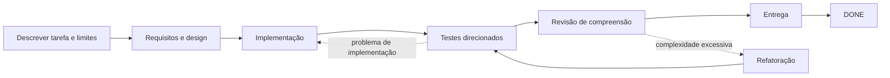

# Dev Flow

[简体中文](README.md) · [English](README_en.md) · [繁體中文](README_zh-TW.md) · [日本語](README_ja.md) · [한국어](README_ko.md) · [Español](README_es.md) · [Français](README_fr.md) · [Deutsch](README_de.md) · [Português (Brasil)](README_pt-BR.md)

> Mantém Codex e DeepSeek dentro do escopo, limita a verificação e retoma tarefas interrompidas.

[](https://www.npmjs.com/package/dev-flow-codex)
[](https://www.npmjs.com/package/dev-flow-deepseek)
[](https://github.com/Innocent-children/dev-flow/actions/workflows/ci.yml)
[](LICENSE)

Dev Flow adiciona às tarefas de programação com IA um **estado local e durável, independente do chat**.
Ele preserva:

- o que a tarefa pode alterar e o que está explicitamente fora do escopo;
- se o trabalho está em requisitos, design, implementação, testes ou entrega;
- quanto de verificação foi acordado e quais evidências já existem;
- se uma escrita interrompida ou incerta deve ser recuperada, bloqueada ou repetida com segurança.

**Não é outro Agent de programação nem um orquestrador de tarefas.** Codex e DeepSeek continuam lendo
repositórios, alterando código e executando comandos. Dev Flow gerencia o escopo, a etapa, o esforço de
verificação, as evidências e a recuperação de uma tarefa de desenvolvimento.

**Comece aqui:** [percurso de dois minutos](docs/DEMO_en.md) ·
[versões atuais e evidências reais](docs/PROJECT-STATUS_en.md) ·
[instalar a versão estável](#instalar-a-versão-estável)

> Este README descreve as capacidades de `main`. npm `@latest` é a versão estável verificada com o
> artefato final e pode ficar atrás de `main`. Consulte
> [Project Status](docs/PROJECT-STATUS_en.md) para distinguir stable, beta e source.

## Entenda em 30 segundos

| Sem Dev Flow | O que Dev Flow adiciona |
| --- | --- |
| O Prompt repete “não amplie o escopo” | O Task preserva a intenção original e cada etapa declara o que pode mudar |
| Uma sessão reiniciada reexamina o repositório e adivinha o progresso | Etapa, evidências e blockers são persistidos localmente |
| Um teste direcionado cresce para suite completa ou matriz de plataformas | Cada Task tem um verification budget explícito |
| Testes passam, mas o resultado continua difícil de explicar ou manter | `COMPREHENSION_REVIEW` vem antes da entrega |
| Uma resposta de escrita perdida é repetida com risco | O estado autoritativo é lido antes de decidir se o retry é seguro |

## Fluxo de uma tarefa



Se o Host reiniciar depois da implementação, a nova sessão lê o mesmo Task e recebe a etapa atual,
evidências concluídas, orçamento restante e próximos passos legais. Não reconstrói o processo a partir
do histórico do chat. Consulte a [demonstração](docs/DEMO_en.md).

## Papel na cadeia de ferramentas

| Ferramenta | Responsabilidade |
| --- | --- |
| Codex / DeepSeek Harness | Ler repositórios, alterar código e executar comandos |
| Spec Kit / OpenSpec | Fornecer métodos de requisitos, design e planejamento |
| Dev Flow | Preservar escopo, etapa, orçamento, caminhos de retrabalho e recuperação de uma tarefa |

## Instalar a versão estável

Os artefatos estáveis atuais oferecem suporte a **macOS arm64** e **Node.js `>=24`**. Consulte
[Support Matrix](docs/SUPPORT-MATRIX_en.md) para versões e compatibilidade exatas.

### Codex

```bash
npm install -g dev-flow-codex@latest
dev-flow-codex setup
dev-flow-codex --version
```

Para forçar Dev Flow:

```text
$dev-flow-codex:dev-flow Fix idempotency in the order-creation endpoint and run targeted tests.
```

Detalhes no [guia Codex](docs/CODEX_en.md).

### DeepSeek Harness

```bash
npm install -g @deepseek-ai/dsh@latest
PROFILE=web
TARBALL="$(npm pack dev-flow-deepseek@latest --silent)"
dsh plugin --profile "$PROFILE" add "$PWD/$TARBALL"
rm -f "$PWD/$TARBALL"
dsh --profile "$PROFILE" --dump-config
```

Reinicie o profile e digite:

```text
/dev-flow Fix idempotency in the order-creation endpoint and run targeted tests.
```

Detalhes no [guia DeepSeek](docs/DEEPSEEK_en.md).

## Quando usar

- trabalho real que atravessa requisitos, design, implementação, testes e entrega;
- mudanças que podem exigir retrabalho e precisam preservar evidências;
- tarefas retomadas entre sessões, dias, compactação de contexto ou reinícios;
- trabalho que exige limite de verificação ou confirmação explícita de compreensão;
- tarefas limitadas entre um repositório principal e poucos repositórios adicionais explícitos.

Para uma pergunta pontual ou edição mecânica de um arquivo sem estado persistente, normalmente é mais
simples usar Codex ou DeepSeek diretamente.

## Capacidades principais

- **Escopo explícito:** `TaskIntent` preserva pedido, critérios de aceitação e itens fora do escopo.
- **Verificação limitada:** cada Task tem verification budget; matrizes completas não são padrão.
- **Recuperação entre sessões:** etapa, evidências, blockers e próximos passos ficam em SQLite local.
- **Revisão de compreensão:** depois dos testes há `COMPREHENSION_REVIEW`; resultados difíceis de manter retornam.
- **Escrita incerta:** o resultado Recovery do Core é lido antes de repetir.
- **Escopo multirrepositório limitado:** o source atual gerencia um principal e até sete adicionais em um único estado.

Consulte [Project Status](docs/PROJECT-STATUS_en.md) para saber se o suporte multirrepositório já está
na versão estável.

## Limites

- Core observa Git de forma limitada e somente leitura; não faz commit, push, merge, rebase, tag ou publish.
- Alterações de arquivos e comandos permanecem responsabilidade do Host autorizado pelo usuário.
- Dev Flow não intercepta cada operação do Host e não é um sandbox geral de segurança.
- Não há Web UI, remote MCP, telemetry, graph definido pelo usuário nem migração histórica automática.
- Um índice opcional apenas ajuda na busca; não decide escopo, permissões, Recovery ou estado.
- Uma Action com escrita permitida informa `changed_paths` exatos ou `no_file_changes`. Core valida esses dados contra a linha de base de emissão e uma fresh Git observation; alterações autorizadas concluem com a Action original, enquanto mudanças de branch, HEAD, repository identity ou caminhos não declarados continuam retornando `REPOSITORY_DRIFT`.

Consulte [Security Policy](SECURITY.md) e [Threat Model](docs/THREAT-MODEL_en.md).

## Suporte estável atual

| Produto | Versão estável | Bundled Core | Ambiente verificado |
| --- | --- | --- | --- |
| `dev-flow-codex` | `0.6.0` | `0.5.1` | macOS arm64, Node.js `>=24`, Codex `>=0.147.0` |
| `dev-flow-deepseek` | `0.6.0` | `0.5.1` | macOS arm64, Node.js `>=24`, DSH `>=0.1.0-rc.6` |

Consulte [Project Status](docs/PROJECT-STATUS_en.md) e
[Support Matrix](docs/SUPPORT-MATRIX_en.md) para evidências e estado beta/source.

## Documentação

| Necessidade | Entrada |
| --- | --- |
| Entender uma tarefa real em dois minutos | [Demo](docs/DEMO_en.md) |
| Estado stable, beta, source e evidências | [Project Status](docs/PROJECT-STATUS_en.md) |
| Capacidades e limites | [Product](docs/PRODUCT_en.md) |
| Arquitetura | [Architecture](docs/ARCHITECTURE_en.md) |
| Versões e plataformas | [Support Matrix](docs/SUPPORT-MATRIX_en.md) |
| Comandos e ferramentas MCP | [Command Reference](docs/COMMANDS_en.md) |
| Segurança | [Security](SECURITY.md) · [Threat Model](docs/THREAT-MODEL_en.md) |
| Contribuir | [Contributing](CONTRIBUTING_en.md) |

## License

[Apache License 2.0](LICENSE)
