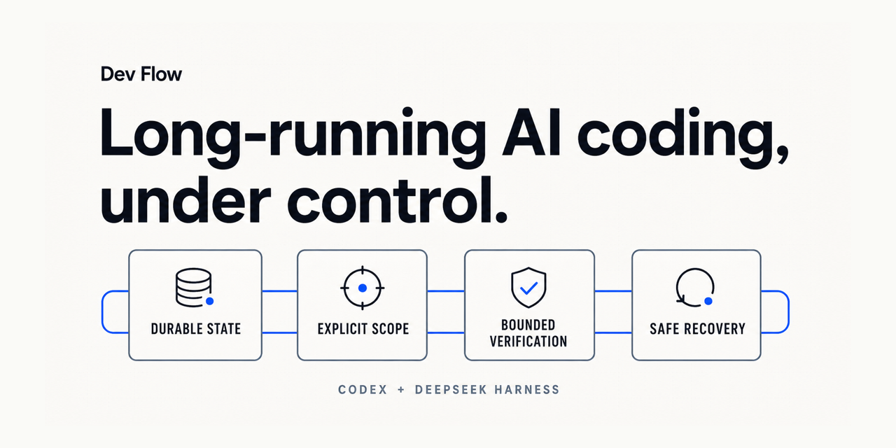

<h1 align="center">Dev Flow</h1>

<p align="center">
  
</p>

<p align="center"><strong>让 Codex 和 DeepSeek Harness 在中断后继续同一个任务，并保留范围、阶段和剩余验证。</strong></p>

<p align="center">
  <a href="https://www.npmjs.com/package/@imotong/dev-flow"></a>
  <a href="https://github.com/Innocent-children/dev-flow/actions/workflows/ci.yml"></a>
  <a href="LICENSE"></a>
</p>

<p align="center">
  <a href="#安装">安装</a> · <a href="docs/DEMO.md">两分钟演示</a> · <a href="https://dev-flow.top">官网</a>
</p>

<p align="center">
  <a href="README.md">English</a> · <a href="README_zh-CN.md">简体中文</a> · <a href="README_zh-TW.md">繁體中文</a> · <a href="README_ja.md">日本語</a> · <a href="README_ko.md">한국어</a> · <a href="README_es.md">Español</a> · <a href="README_fr.md">Français</a> · <a href="README_de.md">Deutsch</a> · <a href="README_pt-BR.md">Português (Brasil)</a>
</p>

Dev Flow 为长时 AI 编程任务保存持久的本地状态，让中断后的会话从同一个 Task 继续，而不是根据
聊天记录重新猜测进度。

## 它明确保存什么

| 能力 | 当前行为 |
| --- | --- |
| 继续 | 在聊天记录之外保存请求、当前阶段、已有记录、阻塞原因和结果 |
| 范围 | 按 Task Plan 检查支持的结构化写入，并在测试和交付前核对本 Task 实际修改的路径 |
| 验证 | 保存命令预算、完整测试与人工交接权限，以及最近的重复尝试 |
| 恢复 | 面对结果不确定的操作，先读取当前 Task 和 Action，再判断继续或重试 |
| 有效性 | 要求或实现变化后，让不再适用的测试和理解记录失效 |

Codex 和 DeepSeek 仍负责读代码、改文件和运行命令。Dev Flow 负责本地 Task 状态、合法流转、
恢复判断和交付条件。

## 安装

当前稳定 `@latest` 制品支持 macOS arm64。准确的 package、Host、Node.js、源码能力和稳定支持范围见
[支持矩阵](docs/SUPPORT-MATRIX.md)。

```bash
npm install -g @imotong/dev-flow@latest
dev-flow
```

Codex 明确入口：

```text
$dev-flow-codex:dev-flow 修复登录失败次数限制，只运行定向测试。
```

DeepSeek Harness 每个需要 Dev Flow 的直接用户消息都使用：

```text
/dev-flow 修复登录失败次数限制，只运行定向测试。
```

安装、状态、恢复和移除方式见 [Codex 使用说明](packages/codex/README.md)、
[DeepSeek 使用说明](packages/deepseek/README.md)和[命令参考](docs/COMMANDS.md)。

## 支持与边界

| 产品 | 稳定验证环境 |
| --- | --- |
| `dev-flow-codex` | macOS arm64、Node.js `>=24`、Codex `>=0.147.0` |
| `dev-flow-deepseek` | macOS arm64、Node.js `>=24`、DSH `>=0.1.0-rc.6` |
| `@imotong/dev-flow` | macOS arm64、Node.js `>=20` |

当前源码还为 Windows 10/11 桌面版 x64 选择 `win32-x64`，并已有 Windows 11 本机记录；这不会扩大
稳定 `@latest` 声明。不支持 Windows Server、32 位 Windows 或 Windows ARM64。

- Core 只读观察 Git，不执行 commit、push、merge、rebase、tag 或 publish。
- 文件修改和命令执行仍由用户授权的 Codex 或 DeepSeek 完成。
- 支持的结构化工具会执行写前范围检查，但 Core 不拦截全部 Host、Bash、外部进程或专用工具写入，
  也不是 shell 或文件系统沙箱。
- WebUI 是本机 loopback 的单用户查看与诊断入口，不是云端项目管理平台。
- Dev Flow 仍处于早期，外部采用有限；稳定支持只以 Support Matrix 中的公开制品和真实 Host Journey
  为准。

## 文档

| 主题 | 入口 |
| --- | --- |
| 产品定位、目标用户和非目标 | [产品定义](docs/PRODUCT.md) |
| 中断与继续演示 | [Demo](docs/DEMO.md) |
| 已交付、源码、未验证和缺口状态 | [项目状态](docs/PROJECT-STATUS.md) |
| 未来优先级 | [路线图](docs/ROADMAP.md) |
| Core、Adapter、Store、Recovery 与协议 | [架构](docs/ARCHITECTURE.md) |
| CLI、selector 和 MCP 工具 | [命令参考](docs/COMMANDS.md) |
| 本机 WebUI | [WebUI](docs/WEBUI.md) |
| 平台与 Host | [支持矩阵](docs/SUPPORT-MATRIX.md) |
| 文档与源码职责 | [Manifest](MANIFEST.md) |
| 安全边界 | [Security](SECURITY.md) · [威胁模型](docs/THREAT-MODEL.md) |
| 参与贡献 | [贡献指南](CONTRIBUTING.md) |

## License

[Apache License 2.0](LICENSE)
