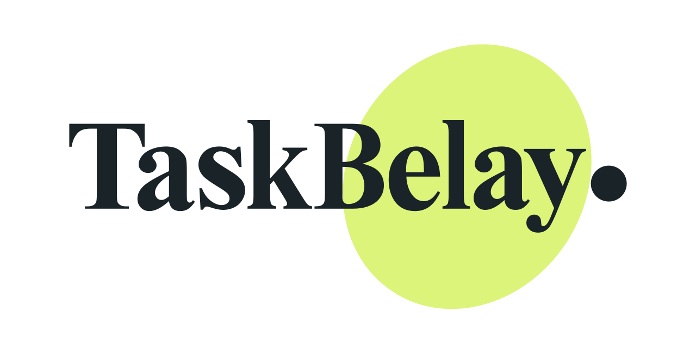

<p align="center">
  <picture>
    <source media="(prefers-color-scheme: dark)" srcset="packages/webui/src/assets/taskbelay-wordmark-dark.svg" />
    
  </picture>
</p>

<h1 align="center">TaskBelay</h1>

<p align="center"><strong>長時 AI 程式開發，始終有人確保。</strong></p>

<p align="center">
  <a href="README.md">English</a> · <a href="README_zh-CN.md">简体中文</a> · <a href="README_zh-TW.md">繁體中文</a> · <a href="README_ja.md">日本語</a> · <a href="README_ko.md">한국어</a> · <a href="README_es.md">Español</a> · <a href="README_fr.md">Français</a> · <a href="README_de.md">Deutsch</a> · <a href="README_pt-BR.md">Português (Brasil)</a>
</p>

## TaskBelay 能幫你做什麼

技術判斷，交給 Agent。<br />
任務邊界，交給 TaskBelay。

搭配 Codex、DeepSeek、Claude Code 或 ZCode 使用。

Belay 是攀岩中的繩索確保：攀登者自行選擇路線，確保者控制繩索並在失誤時防止墜落。TaskBelay 沿用這個分工：Agent 做技術判斷，TaskBelay 核對已核准範圍和驗證額度，並依持久記錄處理失敗或結果不確定的操作。它不是沙箱，也不是另一個 Coding Agent。

- **範圍明確：** 依已確認的檔案核對修改。計畫外的工作，另作決定。
- **驗證有度：** 檢查有計畫、有上限。增加驗證，先說明理由。
- **狀態持久：** 任務以本機保存的狀態為準，不隨會話消失。
- **安全復原：** 失敗或結果不明，先查記錄，再決定如何繼續。

適合跨會話、需要明確檔案範圍和測試投入的儲存庫任務。一次性問答、程式說明與不需保存進度的
小型修改，直接使用 Codex、DeepSeek、Claude Code 或 ZCode 通常更簡單。

## 快速開始

> 使用 Node.js `>=24`，並先安裝所使用的 Host。版本要求與已驗證平台見[支援矩陣](docs/SUPPORT-MATRIX.md)。

### 1. 安裝 TaskBelay

以下 npm 命令使用 TaskBelay 套件名稱，需要相應套件完成發布。首次發布前使用[原始碼本機安裝](scripts/README.md#本地安装测试)，再依 [Codex](packages/codex/README.md)、[DeepSeek](packages/deepseek/README.md)、[Claude Code](docs/CLAUDE.md) 或 [ZCode](docs/ZCODE.md) 指南啟用對應 Host。本機套件面向 Windows x64 和 macOS arm64；macOS ZCode 實機驗證仍待完成。

```sh
npm install -g taskbelay@latest
taskbelay
```

如果已全域安裝 `@imotong/taskbelay`，請先執行 `npm uninstall -g @imotong/taskbelay`，再安裝 `taskbelay`：兩個套件都提供同名命令。已儲存的 Task 資料不會因此刪除。

在所用安裝入口中選擇對應 Host。Codex 安裝後在 `/hooks` 檢查並信任 TaskBelay hook；DeepSeek 重新啟動所選 Profile；Claude Code 重新載入外掛或開始新會話，並依提示審閱權限。

ZCode 需在 Settings → Plugins 完成外掛安裝與啟用，再開始新會話讓 Hook 生效。本機套件準備完成不代表 ZCode 已載入外掛。

### 2. 啟動任務

完成對應安裝後，在所用 Host 的對話中傳送以下訊息之一：

**Codex**

```text
$taskbelay-codex:taskbelay 加入登入失敗限流。只修改驗證相關檔案，最多執行 4 項定向檢查。
```

**DeepSeek Harness**

```text
/taskbelay 加入登入失敗限流。只修改驗證相關檔案，最多執行 4 項定向檢查。
```

**Claude Code**

```text
/taskbelay-claude:taskbelay 加入登入失敗限流。只修改驗證相關檔案，最多執行 4 項定向檢查。
```

**ZCode**

在輸入框的 `/` → Skills 選擇 `taskbelay`，再描述任務。

```text
使用 TaskBelay 加入登入失敗限流。只修改驗證相關檔案，最多執行 4 項定向檢查。
```

這些訊息傳送到對話中，不在終端機執行。請盡量寫清楚目標、驗收條件、檔案範圍與測試上限。

首次回覆會評估請求，並詢問直接開發還是使用 TaskBelay。選擇 TaskBelay 後，預設從目前 HEAD
在目前目錄建立新的任務分支。確認新分支及是否將既有未提交修改納入任務；現有相依套件、本機設定、
檔案和暫存狀態都會保留。目前會話能存取所有參與目錄時，直接在原會話繼續。

你也可以明確選擇使用目前分支，或建立獨立 Git 工作樹。獨立工作樹還需選擇本機或遠端來源及起始
分支；Codex 在宿主支援時開啟新目錄，DeepSeek 和 Claude Code 提供對應的重新啟動命令。

同一目錄只能有一個進行中的 Task。手動或其他工具的本機編輯也會被觀察，任務中切換分支會暫停流程。
本機目錄和分支在任務結束後保留；開始下一個任務時仍需明確未提交修改的歸屬。

實作前，先查看並討論需求、方案、任務、預計檔案和驗證安排。完整計畫得到你的明確認可後才開始開發；方案修訂或檔案範圍擴大後需要再次確認。選擇 TaskBelay 或工作樹參數不能取代方案確認。

### 3. 恢復並查看進度

會話重新啟動後，回到任務的原工作目錄，明確要求繼續該任務。TaskBelay 會從已儲存的進度繼續。
原工作目錄遺失或被替換時，任務會暫停，直到你恢復它或明確放棄任務。

在 DeepSeek Harness 中，繼續任務的訊息也要帶上 `/taskbelay`。

Claude 使用者應回到原工作目錄與會話，使用 `/taskbelay-claude:taskbelay` 明確繼續已儲存的任務。

ZCode 使用者應重新開啟原工作目錄，選擇 TaskBelay Skill 並要求繼續已儲存的任務；準備新目錄時依回傳的工作區開啟說明接續。

下列命令使用已安裝的全域管理器；原始碼體驗請使用指南中的對應入口。

```bash
# 查看已安裝的整合
taskbelay status --host all

# 開啟本機任務介面
taskbelay webui start
```

非互動安裝、自訂 DSH Profile、升級、修復與移除方式見[命令參考](docs/COMMANDS.md)。

## 桌面寵物

寵物需要已設定的 Adapter 與已安裝的桌面應用程式。只安裝 Adapter 不會安裝桌面應用程式。

桌面寵物透過堆疊氣泡顯示多個任務，並可分別開啟對應 WebUI。它優先顯示受阻任務，目前任務完成後會自動關注其他未完成任務，也支援固定關注。你可以自訂外觀、控制動畫、調整大小，以及獨立啟動或停止寵物。

```bash
taskbelay pet start
taskbelay pet stop
```

桌面應用程式面向 macOS arm64 和 Windows 10/11 x64。安裝與操作見[桌面寵物指南](docs/DESKTOP-PETS.md)，
已驗證的可用範圍見[支援矩陣](docs/SUPPORT-MATRIX.md)。

## 使用限制

TaskBelay 管理任務流程，不接管系統權限，也不攔截每次檔案操作或命令執行。

專屬工作樹用於分開程式碼修改。程序、網路、憑證和外部服務仍與目前環境共用。

完成任務不會自動提交程式碼、推送或刪除工作樹；這些操作需要你另外授權。

## 文件

- **使用說明：** [Codex](packages/codex/README.md) · [DeepSeek](packages/deepseek/README.md) · [Claude Code](docs/CLAUDE_en.md) · [ZCode](docs/ZCODE_en.md) · [命令參考](docs/COMMANDS.md) · [Control Center](docs/WEBUI.md)
- **專案資料：** [產品定義](docs/PRODUCT.md) · [支援矩陣](docs/SUPPORT-MATRIX.md) · [安全政策](SECURITY.md)
- **開發與貢獻：** [文件目錄](MANIFEST.md) · [貢獻指南](CONTRIBUTING_zh-CN.md)

## 社群

[LINUX DO](https://linux.do/)

## 授權條款

[Apache License 2.0](LICENSE)
