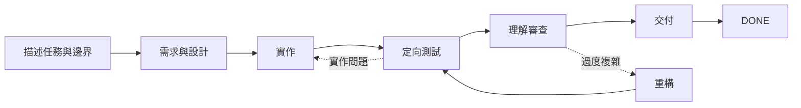

# Dev Flow

[简体中文](README.md) · [English](README_en.md) · [繁體中文](README_zh-TW.md) · [日本語](README_ja.md) · [한국어](README_ko.md) · [Español](README_es.md) · [Français](README_fr.md) · [Deutsch](README_de.md) · [Português (Brasil)](README_pt-BR.md)

> 讓 Codex 與 DeepSeek 在長任務中守住範圍、控制驗證，並在中斷後繼續。

[](https://www.npmjs.com/package/dev-flow-codex)
[](https://www.npmjs.com/package/dev-flow-deepseek)
[](https://github.com/Innocent-children/dev-flow/actions/workflows/ci.yml)
[](LICENSE)

Dev Flow 為 AI 程式設計任務提供一份**獨立於聊天記錄的本機持久狀態**。它會記住：

- 這次任務允許修改什麼，以及明確排除哪些工作；
- 目前處於需求、設計、實作、測試或交付階段；
- 已約定多少驗證，以及哪些證據已完成；
- 會話中斷或寫入結果不確定時，應恢復、阻塞或安全重試。

**它不是另一個程式設計 Agent，也不是任務編排器。** Codex 與 DeepSeek 仍負責讀取儲存庫、
修改程式碼和執行命令；Dev Flow 只管理單一開發任務的範圍、階段、驗證強度、證據與恢復。

**快速入口：** [兩分鐘看懂完整任務](docs/DEMO.md) ·
[查看目前版本與真實證據](docs/PROJECT-STATUS.md) · [安裝穩定版](#安裝穩定版)

> 本 README 說明目前 `main` 的能力。npm `@latest` 是通過最終製品驗證的穩定版，可能落後於
> `main`；穩定版、beta 與原始碼的精確差異請見[專案狀態頁](docs/PROJECT-STATUS.md)。

## 30 秒理解

| 直接使用 Agent 時 | Dev Flow 增加的能力 |
| --- | --- |
| Prompt 反覆強調「不要擴大範圍」 | Task 保存原始意圖，每一步明確允許做什麼 |
| 會話重啟後重新掃描儲存庫並猜測進度 | 目前階段、證據與阻塞原因保存在本機，可直接恢復 |
| 定向檢查逐漸擴成完整回歸或平台矩陣 | 每個 Task 都有明確的 verification budget |
| 測試通過，但結果仍難以解釋或接手 | 交付前經過 `COMPREHENSION_REVIEW` |
| 寫入回應遺失後直接重試，可能重複副作用 | 先讀取權威狀態，再依 Recovery 結論行動 |

## 看一次任務如何執行



Host 在實作後重新啟動時，新會話會讀取同一個 Task，取得目前階段、已完成證據、剩餘驗證預算
與合法下一步，而不是從聊天記錄重新推測。詳見[兩分鐘演示](docs/DEMO.md)。

## 在工具鏈中的位置

| 工具 | 負責什麼 |
| --- | --- |
| Codex / DeepSeek Harness | 讀取儲存庫、修改程式碼、執行命令 |
| Spec Kit / OpenSpec | 提供需求、設計與任務拆分方法 |
| Dev Flow | 保存單一任務的範圍、階段、驗證預算、返工路徑與恢復狀態 |

## 安裝穩定版

目前穩定製品支援 **macOS arm64** 與 **Node.js `>=24`**。精確版本與 Host 相容範圍請見
[Support Matrix](docs/SUPPORT-MATRIX.md)。

統一生命週期管理器完成獨立發布後，安裝、升級、修復、重裝、解除安裝與清除後重裝都使用下方的
`create-dev-flow` 入口。目前公開的 npm 穩定版尚未包含此新 package；Host 原生命令仍是發布前與
診斷復原入口。

### Codex

```bash
npx @imotong/create-dev-flow@latest
```

需要強制選擇 Dev Flow 時：

```text
$dev-flow-codex:dev-flow Fix idempotency in the order-creation endpoint and run targeted tests.
```

完整說明見 [Codex 使用指南](docs/CODEX_en.md)。

### DeepSeek Harness

```bash
npx @imotong/create-dev-flow@latest
```

重新啟動 profile 後輸入：

```text
/dev-flow Fix idempotency in the order-creation endpoint and run targeted tests.
```

完整說明見 [DeepSeek 使用指南](docs/DEEPSEEK_en.md)。

## 適合什麼任務

- 跨越需求、設計、實作、測試與交付多個階段的真實儲存庫工作；
- 可能返工，並需要保留驗證證據的修改；
- 跨會話、跨日或 Host 重新啟動後繼續的工作；
- 需要明確限制驗證強度，或要求開發者在交付前真正理解實作的任務；
- 一個主儲存庫與少量明確附加儲存庫共同完成的有界工作。

一次性問答或不需要保存狀態的機械式單檔修改，通常直接使用 Codex 或 DeepSeek 更簡單。

## 核心能力

- **明確範圍：** `TaskIntent` 保存原始請求、驗收條件與範圍外事項。
- **有界驗證：** 每個 Task 都保存 verification budget；完整回歸與平台矩陣不是預設工作。
- **跨會話恢復：** 目前階段、證據、阻塞原因與合法下一步保存在本機 SQLite。
- **理解審查：** 測試通過後仍需 `COMPREHENSION_REVIEW`，無法維護的結果可返回重構。
- **不確定寫入恢復：** Core 保存規範化 Action 輸入；回應遺失時只需 Task ID 與 Action ID 即可恢復，不必重建 payload。
- **有界多儲存庫：** 目前原始碼允許一個主儲存庫與最多七個附加儲存庫，共用同一流程狀態。

多儲存庫能力是否已進入穩定版，請以[專案狀態頁](docs/PROJECT-STATUS.md)為準。

## 邊界

- Core 只對 Git 進行有界、唯讀觀察，不執行 commit、push、merge、rebase、tag 或發布。
- 檔案修改與命令執行仍由使用者授權的 Host 負責。
- Dev Flow 不會攔截 Host 的每一次檔案操作，也不是通用安全沙箱。
- 目前原始碼包含僅監聽 loopback 的共享 WebUI，前端支援簡體中文/英文、首次跟隨系統語言並可在瀏覽器切換；不包含 remote MCP、telemetry、使用者自訂流程圖或自動歷史資料遷移。
- 可選程式碼索引只能協助檢索，不能決定範圍、權限、Recovery 或流程狀態。
- 允許寫入的 Action 以精確 `changed_paths` 或 `no_file_changes` 回報結果；Core 依簽發基線與 fresh Git observation 驗證，合法修改可用原 Action 完成，branch、HEAD、repository identity 或未宣告路徑變更仍回傳 `REPOSITORY_DRIFT`。

安全邊界見 [Security Policy](SECURITY.md) 與 [Threat Model](docs/THREAT-MODEL.md)。

## 目前穩定支援

| 產品 | 穩定版本 | Bundled Core | 已驗證環境 |
| --- | --- | --- | --- |
| `dev-flow-codex` | `0.7.2` | `0.6.1` | macOS arm64、Node.js `>=24`、Codex `>=0.147.0` |
| `dev-flow-deepseek` | `0.7.2` | `0.6.1` | macOS arm64、Node.js `>=24`、DSH `>=0.1.0-rc.6` |

完整證據與 beta/source 狀態見 [Project Status](docs/PROJECT-STATUS.md) 與
[Support Matrix](docs/SUPPORT-MATRIX.md)。

## 文件

| 想了解什麼 | 入口 |
| --- | --- |
| 兩分鐘理解真實流程 | [Demo](docs/DEMO.md) |
| 穩定版、beta、原始碼與證據 | [Project Status](docs/PROJECT-STATUS.md) |
| 產品能力與邊界 | [Product](docs/PRODUCT.md) |
| 架構 | [Architecture](docs/ARCHITECTURE.md) |
| 支援版本與平台 | [Support Matrix](docs/SUPPORT-MATRIX.md) |
| 命令與 MCP 工具 | [Command Reference](docs/COMMANDS.md) |
| 本機 WebUI 與僅限 CLI 的 reset | [WebUI](docs/WEBUI.md) |
| 安全報告與威脅模型 | [Security](SECURITY.md) · [Threat Model](docs/THREAT-MODEL.md) |
| 參與貢獻 | [Contributing](CONTRIBUTING.md) |

## License

[Apache License 2.0](LICENSE)
