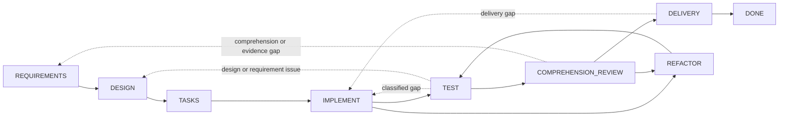

# Dev Flow

[简体中文](README.md) · [English](README_en.md) · [繁體中文](README_zh-TW.md) · [日本語](README_ja.md) · [한국어](README_ko.md) · [Español](README_es.md) · [Français](README_fr.md) · [Deutsch](README_de.md) · [Português (Brasil)](README_pt-BR.md)

> 為 AI 輔助程式設計任務提供明確範圍、驗證預算與可恢復狀態。

[](https://www.npmjs.com/package/dev-flow-codex)
[](https://www.npmjs.com/package/dev-flow-deepseek)
[](https://github.com/Innocent-children/dev-flow/actions/workflows/ci.yml)
[](LICENSE)

Dev Flow 是 AI 輔助軟體開發的本機流程控制與恢復層。它把需求、設計、任務拆分、實作、測試、
理解審查、重構與交付組織成由 Go Core 管理的狀態圖。Codex、DeepSeek Harness 等 Host Adapter
負責修改儲存庫與執行工具；Core 保存 Task、目前節點、節點合約、驗證預算、合法流轉與恢復結果。

## Agent 工作流程的常見失效模式

| 失效模式 | 典型表現 |
| --- | --- |
| 範圍漂移 | 區域修改擴大為相鄰模組重構、通用抽象、額外文件或未要求的未來能力 |
| 無界驗證 | 定向檢查擴大為完整回歸、平台矩陣、壓力測試或持續增加的邊界案例 |
| 流程狀態遺失 | 對話壓縮、Host 重啟或跨日繼續後，只能從聊天記錄與工作區重新推斷進度 |
| 可維護性缺口 | 測試通過，但開發者無法清楚解釋、審查或接手維護實作 |
| 不確定 mutation | 寫入回應遺失或中斷後，無法判斷操作是否已提交，重放具有風險 |

這些問題無法只靠在 Prompt 中反覆加入「不要重構」或「不要多跑測試」而穩定解決。開發流程需要
獨立於對話上下文的持久狀態，以及針對目前步驟、完成條件與合法下一步的閉合合約。

## 控制模型

| 失效模式 | Dev Flow 機制 |
| --- | --- |
| 範圍漂移 | `TaskIntent` 保存不可變原始意圖；Action 暴露 completion conditions 與 `allowed_effects`；實質範圍變更必須透過合法 transition 返回相應節點，由 Core 使下游舊 authority 失效 |
| 無界驗證 | 每個 Task 保存 verification budget；檢查必須關聯目前節點、變更表面、驗收條件或已知恢復風險，完整套件與平台矩陣不是預設工作 |
| 流程狀態遺失 | 目前節點、requirements/design/task-plan baselines、證據、blocker 與合法流轉持久化到本機 SQLite |
| 可維護性缺口 | `TEST` 後必須進入 `COMPREHENSION_REVIEW`；無法解釋或維護的實作返回 `DESIGN`、`IMPLEMENT` 或 `REFACTOR`，儲存庫變更後重新經過 `TEST` |
| 不確定 mutation | mutation 攜帶 revision、action identity、source cursor 與 repository binding；呼叫端必須 read-before-retry，並遵循五分類 Recovery |

Core 不會靜態攔截 Host 對儲存庫的每一次修改。它提供權威 Action 合約並驗證 Task 流轉；Host
Adapter 必須在目前節點的允許副作用與驗證預算內執行工作。

## 適用範圍

Dev Flow 適合需要跨越多個開發節點、可能返工、需要保留驗證證據，或必須跨對話恢復的真實
儲存庫任務。一次性問答或不需要保存流程狀態的單檔機械修改，通常直接使用 Codex 或 DeepSeek
更簡單。

## 快速開始

目前公開製品支援 macOS arm64、Node.js `>=24`。Core 分別打包在 Codex 與 DeepSeek Host
產品中；三個產品各自獨立版本化。

### Codex

```bash
npm install -g dev-flow-codex@latest
dev-flow-codex setup
dev-flow-codex --version
```

在 Codex 中使用唯一的明確 selector 啟動任務：

```text
$dev-flow-codex:dev-flow Add a failed-login attempt limit to this repository.
```

一般對話不會啟動 Dev Flow。安裝、移除、資料保留與呼叫邊界請參閱
[Codex package README](docs/CODEX_en.md)。

### DeepSeek Harness

從 npm 取得 `latest` 官方 tarball，再將絕對路徑交給 DSH profile：

```bash
TARBALL="$(npm pack dev-flow-deepseek@latest --silent)"
dsh plugin --profile <profile> add "$PWD/$TARBALL"
```

依照 DSH profile lifecycle 重新啟動該 profile，然後使用 `/dev-flow` 明確進入 Dev Flow。
安裝、重啟、移除與資料邊界請參閱 [DeepSeek package README](docs/DEEPSEEK_en.md)。完整 CLI、
selector、Core 命令與 MCP 工具說明請參閱 [命令參考](docs/COMMANDS.md)。

## 執行模型

1. 開發者在目前 Git 儲存庫中透過明確 selector 描述任務。
2. Core 建立或恢復該儲存庫的 Task，返回目前節點、完成條件、允許副作用、證據要求、驗證預算與全部合法流轉。
3. Host 執行目前 Action。需求、設計或實作發生實質變更時，Host 透過 Core 返回的 transition 回報，而不是在目前節點中隱式擴大範圍。
4. Core 驗證 `transition_id`、guard、revision 與 payload 後推進 Task；測試失敗、理解審查失敗或交付被拒絕時返回對應節點。
5. mutation 回應不確定時，Host 先讀取 Task 與 Recovery assessment，再決定恢復、阻塞或安全重試。

## 元件邊界

| 元件 | 職責 |
| --- | --- |
| Codex / DeepSeek Harness | 讀取儲存庫、修改程式碼、執行工具，並提交目前節點的結果與證據 |
| Spec Kit / OpenSpec | 為 requirements、design、tasks 等節點提供方法與製品 |
| 測試與 CI | 產生行為驗證證據 |
| Dev Flow Core | 保存唯一 process cursor、節點合約、verification budget、合法流轉、Recovery 與終態 |

Spec Kit 製品、OpenSpec checkbox 或一次成功命令都不能自行推進 Task。只有有效的 Core action
submission 能改變權威狀態。

## 開發流程圖

目前 Core 只提供內建的 `standard-development`：8 個工作節點、`DONE` 終態，以及
`BLOCKED`、`CANCELLED` 兩個例外節點。29 條流轉涵蓋正常推進與真實返工。



虛線概括多條受控回退。精確節點、全部 29 條流轉、guard 與 reason 規則由
[`internal/workflow/`](internal/workflow/) 定義。Host 只提交 Core 返回的 `transition_id`，
destination 由 Core 推導。

每次讀取目前 Action，呼叫端都能取得：

- process、node、revision 與 action identity；
- 節點 purpose、entry assumptions、completion conditions、`allowed_effects`、`required_evidence` 與 verification budget；
- 所選 method profile 的 semantic method steps；
- 全部合法 transitions 及其 destination、guard、選擇條件與 reason 規則。

## 執行邊界

Core 透過 local STDIO MCP 暴露恰好六個工具：

```text
dev_flow_server_info
dev_flow_open_task
dev_flow_get_task
dev_flow_get_next_action
dev_flow_apply_action
dev_flow_cancel_task
```

每個工具的讀寫性質、參數用途與行為說明見 [命令參考](docs/COMMANDS.md)。

Core 可以有界、唯讀地觀察一個既有 Git 儲存庫，用於建立 repository binding 與判斷變更事實。
Git 修改由獲得使用者授權的 Host 執行；Core 不提供通用 shell，也不執行 checkout、commit、
push、merge、rebase、tag 或發布操作。

## 資料與恢復

Task 資料預設位於 Host 產品管理的本機資料目錄，也可以透過 `DEV_FLOW_DATA_DIR` 指向一個已存在、
可用的絕對目錄。移除或解除安裝 Host 整合會保留 Task 資料。

圖形 runtime 只接受目前 SQLite Schema 與嚴格 snapshot。不相容或 pre-graph 資料會返回
`SCHEMA_UNSUPPORTED` 並保持零寫入。使用者可以選擇新的資料目錄，或在 Core 外部手動封存、
重新命名或刪除舊目錄；lifecycle 命令不會自動執行清理。

## 目前支援

| 產品 | 公開版本 | Bundled Core | 已驗證環境 |
| --- | --- | --- | --- |
| `dev-flow-codex` | `0.5.2` | `0.5.0` | macOS arm64、Node.js `>=24`、Codex `>=0.147.0` |
| `dev-flow-deepseek` | `0.5.1` | `0.5.0` | macOS arm64、Node.js `>=24`、DSH `>=0.1.0-rc.6` |

兩個 Host 產品的目前版本皆通過 registry package 安裝、真實 Host/Core handshake、移除、解除安裝與
repository-unchanged gate。DeepSeek journey 另外涵蓋明確啟動、重啟恢復、`DONE` 與 retained
reopen。精確製品身分與證據請參閱 [Support Matrix](docs/SUPPORT-MATRIX_en.md) 及對應 GitHub Release。

## 文件

技術參考文件目前維護英文與簡體中文版本。

| 主題 | 文件 |
| --- | --- |
| 產品問題、能力與邊界 | [Product](docs/PRODUCT.md) |
| Core、Adapter、Store 與 Recovery 架構 | [Architecture](docs/ARCHITECTURE.md) |
| 目前支援版本與平台 | [Support Matrix](docs/SUPPORT-MATRIX.md) |
| 所有使用者命令、內部 Core 命令與 MCP 工具 | [Command Reference](docs/COMMANDS.md) |
| 已交付能力與後續方向 | [Roadmap](docs/ROADMAP.md) |
| 獨立產品版本治理 | [Versioning](docs/VERSIONING.md) |
| 文件 locale 與同步規則 | [I18n](docs/I18N.md) |
| 本機開發工具鏈 | [Toolchain Baselines](docs/TOOLCHAIN-BASELINES.md) |
| Feature 開發治理 | [Spec Kit Workflow](docs/SPEC-KIT-WORKFLOW.md) |
| 提交 Issue 或 Pull Request | [Contributing](CONTRIBUTING.md) |
| 維護者發布入口 | [Release](release/README.md) |

## 本機開發

Dev Flow 需要 Go `>=1.26`、Node.js `>=24` 與 pnpm `>=11 <12`：

```bash
pnpm install --frozen-lockfile
pnpm run validate
```

`pnpm run validate` 執行有界儲存庫驗證，不會安裝真實 Host 產品，也不會發布 npm、Tag 或
GitHub Release。目錄責任請參閱 [Architecture](docs/ARCHITECTURE_en.md)，腳本入口請參閱
[Repository Scripts](scripts/README_en.md)。

## 參與貢獻

歡迎可重現的缺陷、文件改進、有最終製品證據的平台支援，以及範圍明確的產品提案。開始前請閱讀
[貢獻指南](CONTRIBUTING.md)。產品功能變更必須同步所有維護中的根 README locale、
`docs/PRODUCT*` 與受影響的技術文件；精確規則請參閱 [I18n](docs/I18N.md)。

## License

[Apache License 2.0](LICENSE)
