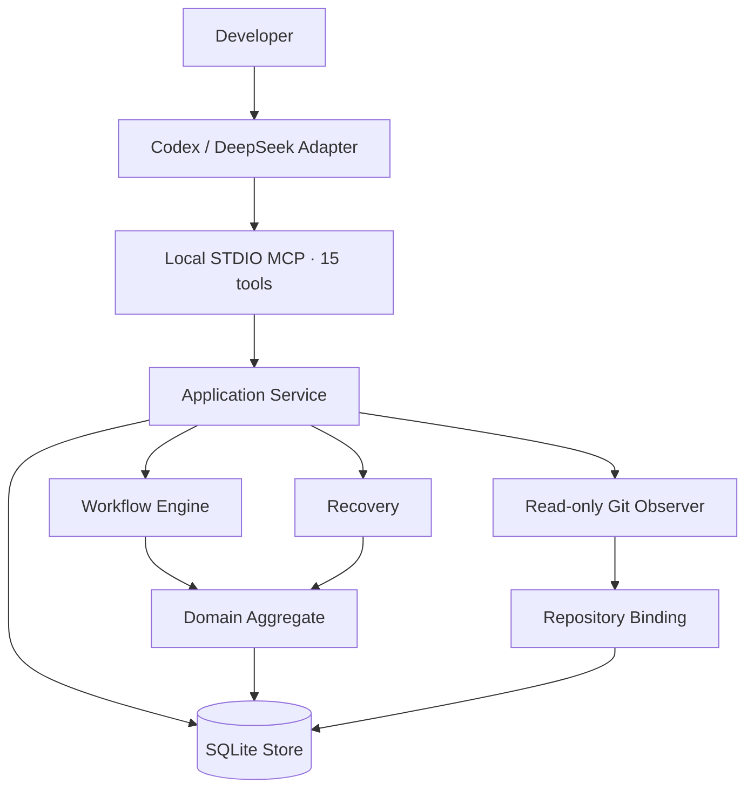
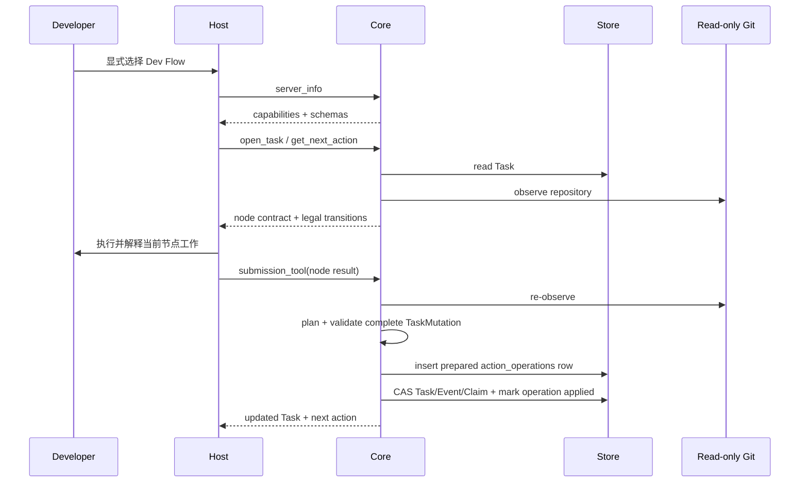

# Dev Flow 架构

[中文](ARCHITECTURE.md) | [English](ARCHITECTURE_en.md)

> 本文解释 Dev Flow 的实现与协议。判断项目是否适合使用，请先阅读
> [README](../README.md) 和[产品定义](PRODUCT.md)。

本页是从用户文档移出的状态图、提交协议、持久化、Recovery、多仓库、worktree、WebUI receipt 与
Host lifecycle 细节的主要归属。命令的完整调用形式仍以[命令参考](COMMANDS.md)为准。

## 用户概念与内部概念映射

| 用户概念 | 内部实现 |
| --- | --- |
| 当前任务 | `ProcessTask` |
| 当前阶段 | current node |
| 下一步 | current Action 与 transitions |
| 任务范围 | `TaskIntent` 与 Repository Scope |
| 验证限制 | verification budget |
| 已有验证 | `TestRecord` / evidence |
| 最近测试尝试 | `VerificationAttempt`，最多保留三条 |
| 恢复结论 | Recovery Assessment |
| 阻塞原因 | Blocker |
| 完成结果 | `ProcessOutcome` |

## 设计目标

Dev Flow 的架构围绕一个原则展开：过程事实只保存一次。Go Core 管理 Task、状态图、流转、
证据、恢复和终态；Codex 与 DeepSeek 负责把 Host 能力接到这个权威上。



## 组件职责

### Host Adapter

`packages/codex/` 和 `packages/deepseek/` 负责：

- 显式进入 Dev Flow；
- 启动 packaged Core 并完成 capability handshake；
- 呈现当前节点、合法 transitions 与理解审查请求；
- 把 semantic method steps 映射为 Host 中可用的操作；
- Codex 在 `apply_patch`、DeepSeek 在 `write`、`edit` 和变更型 `str_replace_editor` 执行前调用 packaged Core 的文件范围检查；
- 在普通提交和一次允许的修正提交前，按当前 `submission_tool` 的实时 schema 逐项核对完整草稿；
- 按当前 Action 的 `submission_tool` 提交节点结果；
- 在不确定 mutation 后保留 Task ID 与 Action ID，并读取 Core 保存的规范化提交后恢复。

Adapter 不保存 Task、current node、transition table、baseline、repository claim 或 recovery
classification，也不推断 completion 或 destination。

Codex 的提交前核对覆盖每层必填与额外成员、嵌套值和数组元素类型、nullability、enum 与 const。
草稿不能与实时 schema 精确匹配时，Adapter 在调用工具前停止，不根据字段名、参考说明或错误文本
猜测类型。实时工具 schema 仍是唯一的提交格式合同。

Codex Adapter 的 `setup` lifecycle 在任何 registration mutation 前创建或验证固定用户配置，并在
registration readback 后从配置与 receipt 的实际写入事实构造 setup result。rich/plain/JSON 只是该
结果的表现层；`mcp` STDIO、Core 和 DeepSeek Adapter 不参与该展示。

### MCP Contract

`internal/mcp/` 通过 local STDIO 暴露十五个工具：

```text
dev_flow_server_info
dev_flow_open_task
dev_flow_get_task
dev_flow_get_next_action
dev_flow_submit_requirements
dev_flow_submit_design
dev_flow_submit_tasks
dev_flow_submit_implementation
dev_flow_submit_test
dev_flow_submit_comprehension
dev_flow_submit_refactor
dev_flow_submit_delivery
dev_flow_resolve_blocker
dev_flow_recover_action
dev_flow_cancel_task
```

每个工具使用 closed JSON Schema 和 typed Result Envelope。Host 首先读取 server info 与 live
schema，再进行 task-bearing 调用。

### Application Service

`internal/application/` 协调 Store、Workflow、Recovery 和 Repository Observer。它负责 use case
顺序、事务输入与投影，不维护第二份流程定义。

### Workflow

`internal/workflow/` 是 `standard-development` 的可执行权威，定义：

- 11 个节点及其 contract；
- 29 条 transition、guard 与 reason rule；
- node-specific payload validator；
- authority invalidation；
- 三次精确重复测试的自动刹车判断；
- method semantic steps；
- process definition digest。

当前实现是直接、静态的 Go 定义，没有 runtime graph parser、registry、DSL 或 compatibility
process。

### Domain

`internal/domain/` 定义 `ProcessTask` 聚合及其不变量，主要 authority 包括：

```text
TaskIntent
RequirementsBaseline
DesignBaseline
TaskPlanBaseline
ImplementationRecord
TestRecord
VerificationAttempt
ComprehensionAssessment
ProcessOutcome
```

`TaskIntent` 保存初始授权与不可变 method profile。Requirements、Design 和 TaskPlan 使用递增
revision 表示当前 authority。上游变更会使对应下游记录失效，避免旧证据继续驱动新状态。

### Store

`internal/store/` 使用 CGo-free SQLite driver 保存：

- current Task snapshot；
- 独立的可恢复 Action 操作记录；
- append-only TaskEvent audit；
- bounded evidence；
- 最多三条近期 `VerificationAttempt`；
- 文件范围请求、用户决定、适用范围与 Task 累计修改路径；
- repository claim；
- LastOperation；
- revision CAS。

普通 mutation 在一个事务中更新 snapshot、event、evidence 与 claim。Task snapshot 用于当前
读取，TaskEvent 用于审计，不依赖 event replay 重建日常状态。

Core-retained Action 提交先在内存中完整构造并校验下一版 `TaskMutation`，再把有界、规范化的
payload 作为 BLOB 写入独立 `action_operations` 记录。随后一个事务以 revision CAS 更新 Task、
写入 Event、处理完整 Claim 集并填写该操作的 `applied_revision`。Task snapshot 不保存恢复 payload；
响应不确定时 Recovery 直接读取独立操作记录。

Store 在开放写能力前执行只读 preflight，验证当前精确 SQLite Schema、snapshot、process definition、
Task/Action-operation/Event/Claim 关联与当前节点 authority。任何非当前 Schema 返回通用
`SCHEMA_UNSUPPORTED`。

### Read-only Git Observer

`internal/repository/` 读取 canonical repository identity、branch、HEAD、index/worktree 与有界
changed paths，用于建立 repository binding 和判断 mutation 前后的仓库事实。

Action result 以相对当前 Action 签发状态新产生的 `changed_paths`，或本节点未改文件时的
`no_file_changes` 明确声明 mutation envelope；artifact references 只保留证据职责。Application
对照签发基线与 fresh observation 验证每仓路径，再决定 rebind 或 `REPOSITORY_DRIFT`。若 binding
完全一致但结果声明了文件变化，Application 返回 `repository_effect_not_observed` 字段错误，不把它
误报为真实仓库漂移。

节点专用 MCP 工具使用从内部完整 Schema 派生的提交 Schema；Design baseline 的
`requirements_revision`、Tasks baseline 的 `design_revision`、Implementation 的
`task_plan_revision`，以及 Delivery 的 acceptance、自动/人工 evidence ID 和
Test/Comprehension record ID 都从提交 Schema 中删除并由 Core 补齐；提交这些字段会按
`unknown_member` 拒绝。内部完整契约保持不变。MCP 边界按提交 Schema 递归检查必填字段，嵌套对象和
数组项缺失时返回准确路径。

`SubmitAction` 先确认当前 Action ID、kind 与 Task 状态，再拒绝重复 JSON member，并从同一 Task
快照填充系统 revision；Host 提交这些 Core-owned 字段会按 `unknown_member` 拒绝。随后 Workflow 校验完整内部
payload，Application 再按当前 Task 校验 revision、record、work item、测试通过条件、用户确认、
acceptance 与 evidence 集合。Delivery authority 字段在这一步已经由 Core 从同一 Task 快照写入完整
payload，不属于调用方纠正范围。失败返回不包含提交值的 `ContractViolation` 或 `GuardFailure`。节点
提交中已证明零写入且路径准确的 `required_member_missing` 可以进入一次
`correct_current_action`；缺失内容需要新的用户决定时 Host 必须停止。Application 还会在任何操作记录写入前构造并校验完整下一版 Task、Action、Event 与 Claim
mutation。全部通过后才暂存规范化 payload，Recovery 仍只重放该不可变提交。

Core 不执行 checkout、reset、clean、stash、commit、merge、rebase、push、tag、publish，也不
暴露 generic shell。Action 中的 `allowed_effects` 描述 Host 在用户授权下可执行的动作。

### 范围外文件先询问

Task Plan 中所有 WorkItem 的 `ExpectedPaths` 合集是当前文件计划范围。单仓库使用普通相对路径；
多仓库使用 `<repository-key>::<repository-relative-path>`。仓库契约路径在所有平台都固定使用 `/`
分隔，反斜杠会被拒绝；Host 的本机绝对路径在进入 Core 契约前完成规范化。精确文件名直接匹配，只有末尾
`directory/**` 表示该目录下的文件；它不是通用 glob 或 workflow DSL。写入 B、C 等附加仓库时，
只要仓库已在不可变 Repository Scope 中、Host 已有写权限且目标属于计划范围，就直接放行。

Codex Plugin 自带受信任后才运行的 `PreToolUse` hook，通过 `PATH` 中 package-owned
`dev-flow-codex hook pre-tool-use` 解析 `apply_patch` 的文件头；DeepSeek Adapter 在
`tools/pre-execute` 中读取结构化文件工具的路径。两者最终把规范化绝对路径和写入意图摘要交给内部
`dev-flow host-check pre-file-write`。这个 managed Core 命令只复用同一 Application/SQLite Task
权威，不执行目标写入，也不形成第二个流程状态。没有活动 Task 时普通写入不受影响；活动 Task 的
检查不可用时，支持的写入保守停止。

计划外路径在 Host 写入前生成一个 `FileScopeRecord`，Task 进入既有 `BLOCKED`：

- `allow_once` 绑定该路径集合、写入意图摘要、Task Plan revision 和解除后新签发的源 Action；不同写入再次询问；
- `expand_scope` 归档当前 Task Plan，清除下游 Implementation/Test/Comprehension 并返回 `TASKS`；若语义也变化，继续使用既有 `tasks_require_requirements`；
- `reject` 绑定当前 Task Plan revision，支持的 Host 工具继续拒绝同一路径。

`BLOCKED` 仍不是普通 transition。范围请求使用独立 TaskEvent 进入 `BLOCKED`，解除时使用现有
`RESOLVE_BLOCKER` Action；普通节点及其 29 条出边不变，process definition digest 不变。
`dev_flow_resolve_blocker` 对文件范围 blocker 额外接收 `choice` 与非空 `reason`，其他 blocker 仍只
接收原有身份字段。

每次成功 Action 都把相对签发状态由 Git 证明的新路径并入 `task_changed_paths`。进入
`implementation_ready_for_test`、`refactor_ready_for_test` 或 `delivery_complete` 时，Core 要求全部累计
路径属于当前 ExpectedPaths，或已有已使用的 `allow_once` 记录。未来未知字段继续被 strict codec 拒绝。

这两层检查不构成文件系统沙箱。Bash、外部进程和部分专用工具可能绕过 Host 写前入口；Core 会在
后续 Action 根据 Git 路径发现并阻止未说明文件继续流转，但只靠最终路径无法区分一次授权文件后来
是否又被绕过入口修改。

### 自动刹车

TEST 提交先按现有 verification budget 校验并保存本次 evidence。Task snapshot 同时保留最近三次
`VerificationAttempt`，每条记录所属 Task Plan、Implementation revision、原 transition 目标、
evidence ID、规范化结果摘要、失败摘要和修改路径。第一版只做精确匹配：

- 同一自动检查与失败连续出现三次；
- 三次测试的完整规范化结果相同；
- 三次测试都原本返回 IMPLEMENT，Implementation revision 连续增加，并且修改路径与失败摘要相同。

第三次结果仍然写入同一次 Task mutation，但 mutation 的当前节点改为 `BLOCKED`，`resume_node`
保存原 transition 目标，TaskEvent 不伪造新的标准 transition。Blocker condition 为
`allow_verification_retry`。Host 必须等用户明确允许后才能调用 `dev_flow_resolve_blocker`；解除后回到
保存的目标节点。最近三次尝试采用滑动窗口，因此下一次完全重复会再次暂停。

这项能力不增加节点、transition 或第二份流程游标，`standard-development` definition digest 不变。

### Recovery

`internal/recovery/` 根据独立 Action 操作记录中的规范化提交、Task 的 LastOperation 和一次只读
repository observation 生成五分类 Assessment：

```text
not_started
completed_and_recorded
completed_but_unrecorded
partially_completed
conflicting
```

普通读取自动返回这份提交对应的 Assessment。`dev_flow_recover_action` 可以完成原 transition，或为
partial/conflicting 创建 `BLOCKED`。Blocker 保存原 source node，解除后只回到该 resume node。

## Repository Scope、配置与持久化边界

`internal/webui` 是 Core 内的 loopback HTTP adapter；`packages/webui` 构建 React/TypeScript/Vite 静态资产并通过
`go:embed` 进入同一 binary。Application/Workflow/Recovery 继续决定 Task、Action、Guard、Recovery、Blocker
和 Outcome，浏览器只投影视图并提交当前身份。receipt 绑定 PID、进程启动身份、data-root digest 与 URL；
macOS 要求 mode `0600`，Windows 要求位于用户产品目录中的 regular non-symlink file。Codex 和 DeepSeek
携带的 Core 因此复用同一进程和 SQLite 权威。
前端 typed catalog 维护简体中文/英文；首次按 `navigator.languages` 选择，手工选择只进入 local site storage，
不形成 Core、Task、receipt 或账号状态。

package runtime selector 只接受 `darwin-arm64` 与 `win32-x64`。Windows executable 位于
`runtime/win32-x64/dev-flow.exe`；32 位、ARM64、Windows Server 和交叉 pair 不属于产品支持范围。
macOS 默认数据根为 `$HOME/Library/Application Support/dev-flow`，Windows 为
`%LOCALAPPDATA%\dev-flow`；配置分别从 `$HOME/.dev-flow/config.json` 或
`%USERPROFILE%\.dev-flow\config.json` 读取。POSIX 目录/receipt mode 在 macOS 强制检查；Windows 依赖
当前用户 profile 与 LocalAppData 的继承 ACL，同时保留 canonical、regular-file 与 symlink 检查。
WebUI 后台进程在 Windows 使用独立 process group、creation time 作为启动身份，并以 `CTRL_BREAK`
请求退出；不同 console 无法投递或进程未退出时，只终止 receipt 精确匹配的进程。

三个 npm package 都通过各自 package 内的小型平台实现选择上述目录、权限和 executable 规则；
Go 的进程、receipt 与 signal 行为分别由 `darwin`、`windows` build tag 文件实现。平台选择发生在
Core 语义之外，Domain、Workflow、Application 和 Recovery 不包含操作系统判断。

`ProcessTask.Repository` 继续保存主仓库 binding；`PrimaryRepositoryKey` 缺省为 `primary`，
`AdditionalRepositories` 保存零至七个按 key 严格升序排列的附加 binding。Scope 的成员、角色和 key
创建后不可变。单仓库的有效 `repository_binding_digest` 仍等于主 binding digest；多仓库的唯一
有效摘要按固定 domain、entry 数、主仓角色/key/component digest 和 sorted additions 进行长度前缀
SHA-256 聚合。Action、operation、Recovery、Blocker 与 Outcome 继续共用这个既有字段，不增加第二
Scope digest。

Application 创建 Task 时先观察主仓库，再按 key 顺序观察附加仓库；全部 identity 唯一且观察成功后
才构造一次 Store mutation。恢复可以从任一参与仓库的 claim 找到同一 Task，但不会改变主仓、key
或顺序。多仓库公共路径使用 `<repository-key>::<repository-relative-path>`，Application 将其分派为
各 Observer 使用的普通仓库相对路径；单仓库路径语法保持不变。这些公共契约路径始终使用 `/`，不随
Host 路径分隔符变化。

Repository binding 同时保留两个不同用途的身份：`GitCommonDirDigest` 把 linked worktree 归到同一
本地逻辑仓库组，`RepositoryIdentity` 由该 digest 与 canonical root 共同形成并表示实际 worktree。
Store 继续按后者排他 claim，因此不同 worktree 的 Task 可以并行，而同一 worktree 的第二个活动
Task 仍然冲突。Control Center 从 Task snapshot 投影主仓库组标识和 worktree path，不保存新状态。

SQLite 继续以一行 Task 和一个 revision CAS 保存整个流程聚合；每个 Task 至多保留一条最近的
`action_operations` 记录，用于 Core-retained submission 的幂等与恢复，不形成第二个流程游标。
活动 Task 为 Scope 中每个 identity
持有一条 `repository_claims` 记录；Acquire、Retain 和 Release 都在 Task snapshot/event 的同一事务
中处理完整、有序的 claim 集。任一冲突或集合不一致都会回滚或 safe-stop，不产生部分 claim、仓库级
revision 或第二状态机。

Codex Skill 在单 Task admission 之前识别用户明确声明的并行批次。协调路径只调用 Host 已提供的
worktree-backed task/thread 能力，为每个有界项创建独立 Codex task；协调者不调用 Core，也不创建
父 Task。每个子 task 在自己的 canonical worktree 中执行原有 handshake 和 Action loop。共享目录的
sub-agent、Core Git mutation 和自动合并都不属于这条路径。

单个新请求不进入这条 admission 前路径。它先在当前 worktree 调用一次 `dev_flow_open_task`；只有
调用携带非空 `new_task` 且完整结果为 `ACTIVE_TASK_CONFLICT` 时，Codex Skill 才使用同一 Host 能力
创建且只创建一个子 task。创建参数固定为 `target.environment.type="worktree"`，省略
`startingState`，由 Host 从项目默认分支的已提交状态建立 worktree；Skill 不读取、复制或应用占用中
checkout 的 index、已跟踪工作区改动或未跟踪文件。子 task 收到原有界请求和精确 selector 后独立
进入 handshake；协调者不再调用 Core，也不重试创建。显式 resume、`HOST_OWNERSHIP_CONFLICT` 和
其他错误仍然 safe-stop，原 Task、claim 与 worktree 不变。

`dev_flow_open_task` 在现有 `host`、`repository_path` 与 `new_task` 旁仅增加可选
`primary_repository_key` 和最多七项的 closed `additional_repositories[{key,repository_path}]`。
Task result 保留主 `repository`，并返回主 key 与 sorted `additional_repositories`。
`dev_flow_server_info({})` 返回进程启动时从只读配置（macOS 为 `$HOME/.dev-flow/config.json`，
Windows 为 `%USERPROFILE%\.dev-flow\config.json`）得到的
`host_preferences.codex.codebase_memory` 与 `host_preferences.deepseek.codebase_memory`。配置不存在时
均为 false；配置或索引状态不进入 Task 或流程摘要。

Store 在开放 writable connection 前以 immutable read-only preflight 校验当前精确 Schema、closed
snapshot 和完整 claim 集，只实现这一份当前持久化格式。

## 一次任务如何流动



如果最后一步响应不确定，Core-retained submission 的 Host 只保留 Task ID 与 Action ID，随后读取
独立操作记录对应的恢复结论；显式 operation-probe 路径继续由调用方携带其完整 probe。

## 版本与分发

Core、Codex、DeepSeek 是三个独立产品：

```text
Core      → CORE_VERSION
Codex     → packages/codex/package.json
DeepSeek  → packages/deepseek/package.json
```

Host package 内含 `runtime/darwin-arm64/dev-flow` 与 `runtime/win32-x64/dev-flow.exe` 两个 Core
executable；运行时只选择与当前 OS/CPU 精确匹配的一个。`scripts/build-core-runtimes.mjs` 一次构建
两个目标并返回按 runtime key 命名的 JSON 报告；本地打包、release staging 与真实 Journey 都按
该报告选择产物。构建与发布证据分别核对两者的 GOOS、GOARCH、Core 版本和 digest。Codex Plugin
manifest 只镜像 Codex package 版本。

发布工具位于 `release/` 与 `scripts/`，不进入 Core、MCP 或 SQLite。产品发布使用固定检查、精确
confirmation、仓库外 release directory，并通过远端回读安全重试。

## 源码导航

| 路径 | 责任 |
| --- | --- |
| `cmd/dev-flow/` | Core CLI、version、STDIO server lifecycle |
| `internal/domain/` | Task 聚合、baselines、actions、evidence、outcome、limits |
| `internal/workflow/` | process、node、transition、payload、guard、invalidation |
| `internal/application/` | use case orchestration |
| `internal/recovery/` | reconciliation、assessment、blocker |
| `internal/repository/` | read-only Git observation |
| `internal/store/` | SQLite bootstrap、strict codec、Action operations、CAS、events、claims |
| `internal/mcp/` | fifteen tools、closed JSON、Result Envelope |
| `packages/codex/` | Codex Plugin、Skill、lifecycle、平台实现与 package |
| `packages/deepseek/` | DSH bundle、Skill、guard、平台实现与 package |
| `packages/dev-flow/` | 统一 lifecycle、Control Center launcher 与平台实现 |
| `protocol/fixtures/` | public contract 与 Host parity fixtures |
| `tests/contract/`, `tests/journeys/` | deterministic contract 与 process evidence |
| `release/`, `scripts/` | 双 runtime 构建、standalone release contracts and tooling |

当前行为权威是代码、机器可读 Schema 与可执行测试。文档帮助读者理解系统，不作为运行、
构建或发布输入。

## Codex Skill 激活边界

`packages/codex/plugin/skills/dev-flow/agents/openai.yaml` 允许 Host 隐式选择 Skill，`SKILL.md` 的
description 提供任务型正向用途和非任务型排除边界。精确 `$dev-flow-codex:dev-flow` selector 与隐式
选择汇合到同一 admission；launcher 从 `packages/codex/lib/lifecycle.mjs` 复用同一 MCP instructions，
setup validator 校验 metadata、Skill 和 instructions 自洽。激活来源不进入 Core、Task、SQLite、
receipt 或用户配置。
