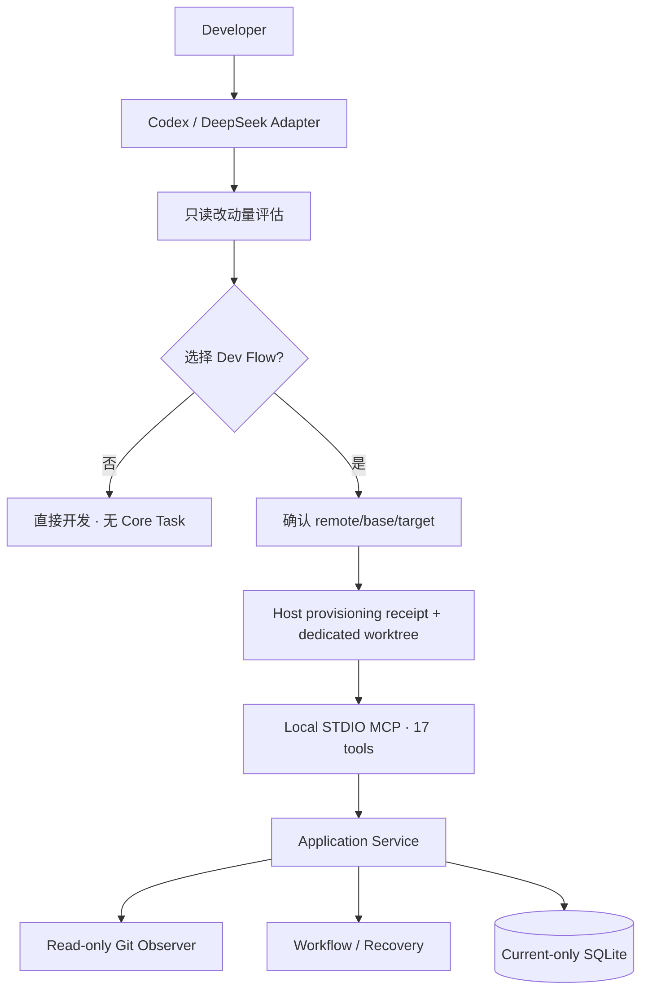

# Dev Flow 架构

[中文](ARCHITECTURE.md) | [English](ARCHITECTURE_en.md)

> 本文说明当前工作树优先实现、协议和持久化。判断是否适合使用，请先读
> [README](../README_zh-CN.md) 和[产品定义](PRODUCT.md)。完整命令见[命令参考](COMMANDS.md)。

## 核心原则

Dev Flow 只保存一份业务状态。Go Core 管理 Task、节点、合法流转、范围、验证、Recovery、Blocker、
claims 和 outcome；Codex、DeepSeek 与 WebUI 是 Host Adapter。Core 只读观察 Git，Host 才能在用户
确认后执行 fetch、branch、worktree、relaunch、handoff 和 cleanup。



## 创建 Task 之前

新请求、显式 selector 和并行批次先由 Host 做只读评估。允许读取请求、仓库说明、相关代码、调用方、
测试、manifest 与 Git 状态；不得调用 Dev Flow Core、运行测试、fetch 或创建 branch/worktree。输出包含：

```text
change_level: small | standard | large | uncertain
observed_repositories
candidate_components
candidate_paths
public_contract_flags
persistence_or_state_flags
host_or_platform_flags
verification_shape
unknowns
recommendation: direct | dev_flow | clarify
reasons
```

评估绑定 request、canonical root、HEAD 和 status digest。等待选择期间任一项变化都要重新评估。明确
resume 是唯一跳过评估的入口。

用户选择 Dev Flow 后，逐仓确认 `remote_name`、`base_branch` 和新的 `target_branch`。Host 使用参数
数组执行精确 fetch：

```text
fetch <remote> refs/heads/<base>:refs/remotes/<remote>/<base>
```

随后冻结 commit，创建专属工作树和目标分支，并验证 canonical root、Git common dir、worktree-specific
Git dir、HEAD、branch、clean、submodule 与 Host 写权限。源 checkout 可以 dirty，但其中 staged、
unstaged 和 untracked 内容不进入 Task worktree。

Host 在第一次 Git 写入前保存窄 provisioning receipt：launch/host/request digest、源仓库身份、repository
key、remote/base/target、fetched commit、worktree path、operation status 与时间。它不保存凭据、remote
URL、文件内容或流程节点。结果不确定时读取 receipt/Host 状态，禁止盲目再次 dispatch。

## WorkspaceOrigin 和 RepositoryBinding

创建新 Task 的 `dev_flow_open_task` 保存请求、初始范围、已知验收和 method profile，不接收最终
verification budget；为 primary 接收 `workspace_origin`，每个 additional
repository 也带一个同形字段：

```json
{
  "mode": "dedicated_worktree",
  "remote_name": "origin",
  "base_branch": "main",
  "base_commit": "<fetched SHA>",
  "task_branch": "feature/example",
  "provisioning_receipt_id": "launch-example"
}
```

Core 不信任这段文本本身。Observer 核对本地 branch、HEAD、remote-tracking ref、common dir、
worktree-specific Git dir 和 clean 状态，再补齐并保存 `WorkspaceOrigin`：

```text
mode
remote_name
base_branch
base_commit
task_branch
source_repository_group_digest
canonical_worktree_root
worktree_git_dir_digest
provisioning_receipt_id
```

当前 `RepositoryBinding` 是一次不可变观察：

```text
worktree_instance_digest
identity_digest
history_digest
content_digest
current_branch / detached
current_head
head_tree
history_relation
changed_entries
task_surface
observed_at
binding_digest
```

`changed_entries` 是有界排序的 path/change type/file mode/gitlink/content digest，不保存文件正文。
`task_surface` 是相对固定 base commit 的 committed diff，再叠加 index、worktree 和 untracked 状态；rename
按旧路径 deleted 与新路径 added 处理。`CurrentChangedPaths` 每次从当前 surface 推导，恢复到 base 的
路径不会继续阻塞交付。

`content_digest` 表示当前有效内容和 mode，而不是 commit ID 或 staged 标签。因此只把完全相同内容
提交成线性 commit 时摘要不变；内容变化才使 Test 与 Comprehension 失效。Action 绑定 issuance
identity/history/content digests，Recovery 也使用这些事实。

## 工作树观察和 Blocker

`dev_flow_open_task` 的显式 resume 与 `dev_flow_get_next_action` 在返回实际工作前观察所有 Task roots。
普通 Action、Recovery 和 cancel 也使用同一观察与分类路径。

| 观察 | 结果 |
| --- | --- |
| 源 checkout 变化 | 与 Task 无关 |
| task branch 线性前进 | 重新计算 surface，继续 |
| 相同内容被 commit | 保留 Test/Comprehension |
| 内容变化 | 使对应下游记录失效 |
| 计划外路径 | `file_scope_decision` Blocker |
| branch switch、detach、rewind、rewrite | `workspace_history_conflict` Blocker |
| 原 worktree 或其 Git dir 丢失/被替换 | `WORKSPACE_UNAVAILABLE`，不能普通 resolve |
| 两次读取期间继续变化 | 不稳定观察，零 Task 写入 |

结构化工具写计划外路径前仍调用 `host-check pre-file-write`；`allow_once` 绑定 source Action、精确路径
和 intent，`expand_scope` 回到 TASKS，reject/restore 要求实际恢复。Bash 或外部进程可能先写，Core 在
下一次观察中用当前内容摘要建立同样的范围决定。专属工作树没有“外部改动可忽略”分支。

## Action 提交

八个普通节点提交工具只接收 Host 的语义结果、artifact、method result、合法 transition、summary 和
reason。所有 node result 都不再含 `changed_paths` 或 `no_file_changes`。Core 在提交前观察 Git，计算
相对 Action issuance 的 delta 与完整 Task surface，检查当前节点 allowed effects、process artifact 和
ExpectedPaths，再构造一次完整 `TaskMutation`。

一次普通 mutation 的顺序是：

1. 校验 Task/Action/revision/process 和 closed payload；
2. 观察并分类全部工作树；
3. 计算 Action delta、当前 surface、记录失效与目标节点；
4. 在内存中验证完整 Task、Action、Event 与 Claim 结果；
5. 暂存规范化 Action operation；
6. 在一个 SQLite transaction 中 CAS Task、追加 Event、更新完整 claims，并标记 operation applied。

响应丢失时 Host 只保留 Task ID 与 Action ID，读取 Core retained operation 后按 `next_advice` 继续；不
重新拼装 payload，也不从文件状态猜测提交是否成功。

## 验证计划、预算增加和复核范围

最终验证预算不属于创建时的 `TaskIntent`。TASKS 已经完成 Requirements、Design、工作拆分、影响面和
现有测试结构分析，因此 `TaskPlanBaseline.verification_plan` 在这里保存：

```text
checks[]: name + rationale
initial_budget: level + max_automatic_commands + allow_full_suite + allow_manual_handoff
full_suite_expected
test_code_changes_expected
```

TASKS 还包含必需 method step `tasks.plan_verification`。没有完整计划不能进入 IMPLEMENT。

Evidence 绑定 `task_plan_revision`。自动命令消耗只统计当前 Task Plan revision；计划被正式重建后使用
新计划的初始预算，旧 Evidence 和调整仍保留为历史。当前容量不足时，Host 在运行额外命令前提交
`verification_budget_increased`。这是 TEST→TEST 自循环，要求：

- `basis` 只能是 `new_impact`、`new_risk`、`verification_failure` 或 `verification_gap`；
- transition reason 具体说明新事实，`additional_checks` 记录新增检查与理由；
- 自动命令数量和 full-suite/manual-handoff 权限只能单调增加，并且只增加当前所需部分；
- checks、失败、未验证、handoff 和 findings 列表为空；本次调整不生成 Evidence、TestRecord 或验证尝试。

Core 保存调整前后预算和原因，并签发新的 TEST Action。无具体原因、无新增检查或没有实际增加的提交
零写入拒绝。普通 TEST 结果必须发送 `budget_adjustment=null`。

完整套件结果的每个 check 还带非空 `full_suite_reason`；非完整套件该字段必须为空。这个字段保存本次
判断，但 Core 不解析 shell，也不能在执行前拦截全部命令。Codex/DeepSeek Skill 负责在每条命令前选择
与当前改动最接近的检查，在每次完整套件前重新判断影响、定向检查是否足够、待补风险和仓库检查点，
并在修改测试文件前判断长期价值。

修改后的代码复核同样属于 Host 语义判断：只读当前 diff、直接或间接影响的调用路径和验收所需内容。
修复复核发现后只重新确认原问题与相关回归。显式 code review 保持只读并在完整交付发现后停止；
无因果关系的历史问题不进入当前 Task。

## Relocation、取消和终态

`dev_flow_prepare_task_relocation` 把当前 Task 放入 `BLOCKED`，保存 relocation ID、源 bindings、base、
content、surface 和 resume node，源 claims 继续有效。Host 执行一次同机 handoff。随后
`dev_flow_resolve_blocker` 提交 relocation ID 与目标 repository paths；Core 验证同一 repository group、
base、等价 surface 和 claim 可用性，在一个 transaction 中替换全部 bindings 与 claims，再恢复节点。

普通 `dev_flow_cancel_task` 仍先观察工作树。原实例确实丢失时，只有
`dev_flow_abandon_task(host, task_id, revision, reason)` 可以保存最后已知 binding、进入 CANCELLED 并释放
claims；它不访问或删除 Git 对象。

DONE/CANCELLED 只结束 Task 和释放 claims。终态投影 remote/base/base commit、task branch/current
HEAD、worktree path、clean/dirty、当前 paths 和验证记录。keep/review/handoff/worktree cleanup/branch
cleanup 是 Host 后续操作，其中两个 cleanup 分别授权。

## MCP、Store 和 WebUI

当前 closed MCP catalog 共十七个工具：

```text
dev_flow_server_info
dev_flow_open_task
dev_flow_get_task
dev_flow_get_next_action
dev_flow_submit_requirements
dev_flow_submit_design
dev_flow_submit_tasks
dev_flow_submit_implementation
dev_flow_submit_test
dev_flow_submit_comprehension
dev_flow_submit_refactor
dev_flow_submit_delivery
dev_flow_resolve_blocker
dev_flow_recover_action
dev_flow_cancel_task
dev_flow_prepare_task_relocation
dev_flow_abandon_task
```

Store 只实现当前 SQLite Schema、严格 snapshot codec、Action operation、append-only TaskEvent、claims 和
revision CAS。没有迁移、旧 Schema reader、shared-checkout fallback 或 reset prompt。claim key 使用可直接
观察的 worktree instance identity，使写前 hook 即使遇到非法 branch switch 仍能找到 Task。

WebUI 是 loopback HTTP Adapter，只投影 WorkspaceOrigin、当前 observation/surface、blocker、relocation、
verification plan、当前预算/消耗、调整原因和 cleanup choices。它不再从任意 checkout 创建新 Task，
也不执行 Git 或 Host handoff。

## Host 差异

- Codex App 使用原生 managed worktree、snapshot、task creation 和 handoff；Skill 保存一次 launch 状态，
  child 初始化目标分支后才 open Core。Codex CLI 使用
  `codex -C <worktree> [--add-dir <additional-worktree>] -- <prompt>` relaunch。
- DeepSeek 的 Workspace Root 在进程启动时固定。WorkspaceCoordinator 创建安全 sibling worktree，输出
  `{command,arguments,cwd}` relaunch descriptor；新会话消费 receipt 后才 open Core。它不扩大旧会话权限，
  也不在源仓库内嵌套 worktree。
- 多仓库 Task 要求所有 roots 全部 provision、授权和验证；任一失败时不创建部分 Task 或 claims。

## 版本、构建和源码导航

Core、Codex、DeepSeek 和统一 lifecycle package 独立版本。Core 的机器可读权威是 `CORE_VERSION`；npm
版本由各自 `package.json` 管理，普通产品改造不执行发布。Host package 按精确 runtime pair 携带
`darwin-arm64/dev-flow` 与 `win32-x64/dev-flow.exe`。

| 路径 | 职责 |
| --- | --- |
| `internal/domain/` | Task、WorkspaceOrigin/Binding、verification plan/adjustment、records、blocker、outcome |
| `internal/repository/` | 固定、只读 Git observation 与摘要 |
| `internal/application/` | open/resume/read/submit/recover/relocate/cancel/abandon 编排 |
| `internal/workflow/` | 11 个节点、普通边、payload、guard、invalidation |
| `internal/store/` | current-only SQLite、codec、operations、events、claims |
| `internal/mcp/` | 十七工具、closed schemas、annotations、Result Envelope |
| `internal/webui/`, `packages/webui/` | loopback Adapter 与内嵌界面 |
| `packages/codex/`, `packages/deepseek/` | Host 准入、provisioning、relaunch/handoff 与 package |
| `protocol/fixtures/`, `tests/` | 公共合同、故障注入与 Host Journey |

源码、机器可读 Schema、package manifest、CLI parser 和可执行测试是当前行为权威。
