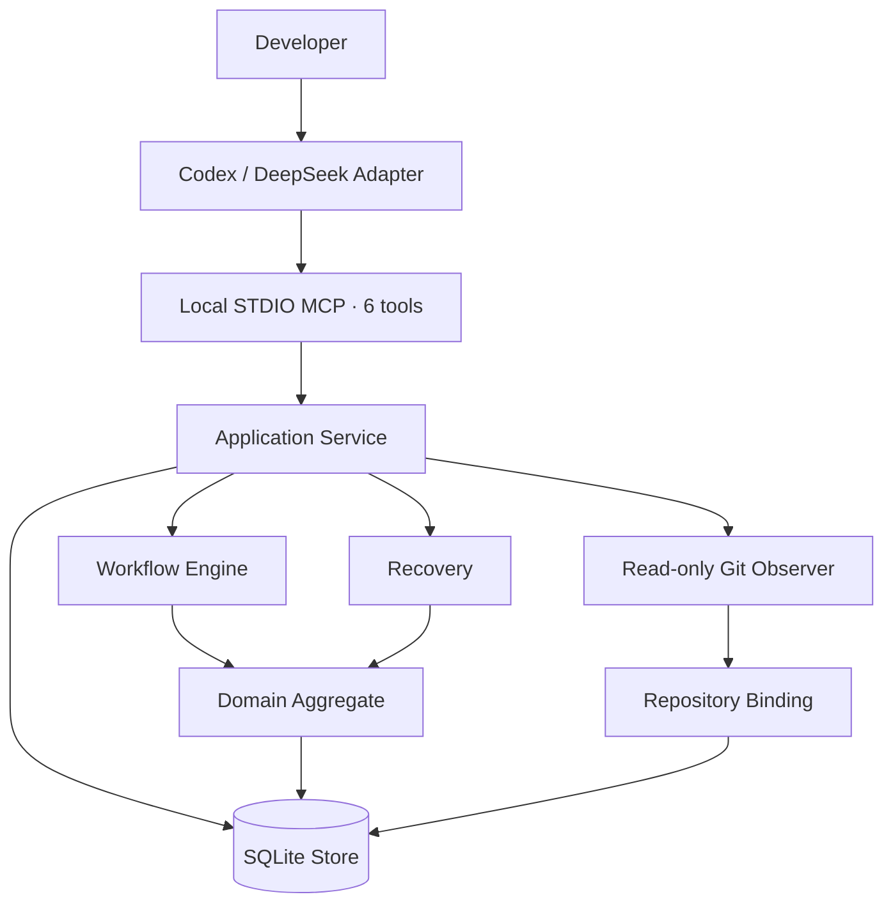
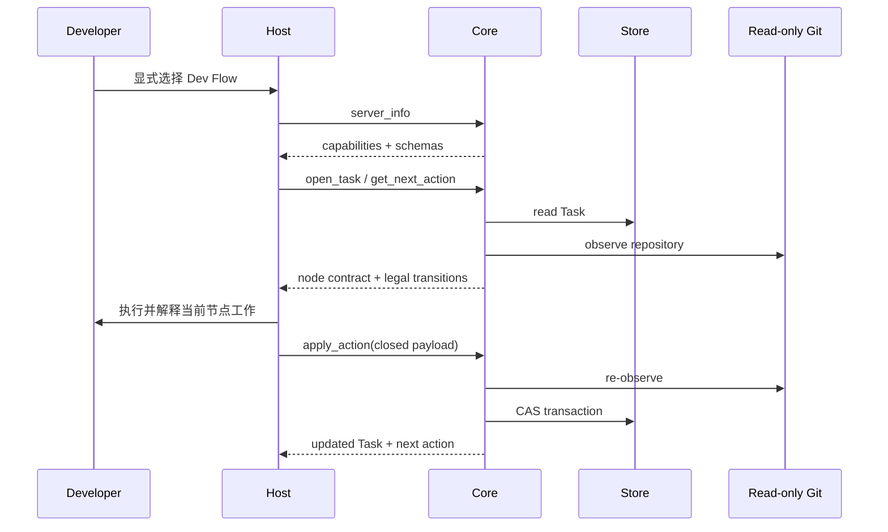

# Dev Flow 架构

[中文](ARCHITECTURE.md) | [English](ARCHITECTURE_en.md)

## 设计目标

Dev Flow 的架构围绕一个原则展开：过程事实只保存一次。Go Core 管理 Task、状态图、流转、
证据、恢复和终态；Codex 与 DeepSeek 负责把 Host 能力接到这个权威上。



## 组件职责

### Host Adapter

`packages/codex/` 和 `packages/deepseek/` 负责：

- 显式进入 Dev Flow；
- 启动 packaged Core 并完成 capability handshake；
- 呈现当前节点、合法 transitions 与理解审查请求；
- 把 semantic method steps 映射为 Host 中可用的操作；
- 构造并转发 closed node payload；
- 在不确定 mutation 后保留 operation identity 并先读取再恢复。

Adapter 不保存 Task、current node、transition table、baseline、repository claim 或 recovery
classification，也不推断 completion 或 destination。

### MCP Contract

`internal/mcp/` 通过 local STDIO 暴露六个工具：

```text
dev_flow_server_info
dev_flow_open_task
dev_flow_get_task
dev_flow_get_next_action
dev_flow_apply_action
dev_flow_cancel_task
```

每个工具使用 closed JSON Schema 和 typed Result Envelope。Host 首先读取 server info 与 live
schema，再进行 task-bearing 调用。

### Application Service

`internal/application/` 协调 Store、Workflow、Recovery 和 Repository Observer。它负责 use case
顺序、事务输入与投影，不维护第二份流程定义。

### Workflow

`internal/workflow/` 是 `standard-development` 的可执行权威，定义：

- 11 个节点及其 contract；
- 29 条 transition、guard 与 reason rule；
- node-specific payload validator；
- authority invalidation；
- method semantic steps；
- process definition digest。

当前实现是直接、静态的 Go 定义，没有 runtime graph parser、registry、DSL 或 compatibility
process。

### Domain

`internal/domain/` 定义 `ProcessTask` 聚合及其不变量，主要 authority 包括：

```text
TaskIntent
RequirementsBaseline
DesignBaseline
TaskPlanBaseline
ImplementationRecord
TestRecord
ComprehensionAssessment
ProcessOutcome
```

`TaskIntent` 保存初始授权与不可变 method profile。Requirements、Design 和 TaskPlan 使用递增
revision 表示当前 authority。上游变更会使对应下游记录失效，避免旧证据继续驱动新状态。

### Store

`internal/store/` 使用 CGo-free SQLite driver 保存：

- current Task snapshot；
- append-only TaskEvent audit；
- bounded evidence；
- repository claim；
- LastOperation；
- revision CAS。

正常 mutation 在一个事务中更新 snapshot、event、evidence 与 claim。Task snapshot 用于当前
读取，TaskEvent 用于审计，不依赖 event replay 重建日常状态。

Store 在开放写能力前执行只读 preflight，验证 SQLite Schema、snapshot、process definition、
Task/Event/Claim cardinality 与当前节点 authority。不兼容或 pre-graph 数据返回
`SCHEMA_UNSUPPORTED` 并保持零写入。

### Read-only Git Observer

`internal/repository/` 读取 canonical repository identity、branch、HEAD、index/worktree 与有界
changed paths，用于建立 repository binding 和判断 mutation 前后的仓库事实。

Core 不执行 checkout、reset、clean、stash、commit、merge、rebase、push、tag、publish，也不
暴露 generic shell。Action 中的 `allowed_effects` 描述 Host 在用户授权下可执行的动作。

### Recovery

`internal/recovery/` 根据 operation identity、当前 Task、LastOperation 和一次只读 repository
observation 生成五分类 Assessment：

```text
not_started
completed_and_recorded
completed_but_unrecorded
partially_completed
conflicting
```

Probe 始终零写入。显式 recovery apply 可以最多一次完成原 transition，或为 partial/conflicting
创建 `BLOCKED`。Blocker 保存原 source node，解除后只回到该 resume node。

## 一次任务如何流动



如果最后一步响应不确定，Host 保留原 request、operation、source cursor、revision、action 和
payload，随后使用 read/probe 获取 Core 的恢复结论。

## 版本与分发

Core、Codex、DeepSeek 是三个独立产品：

```text
Core      → CORE_VERSION
Codex     → packages/codex/package.json
DeepSeek  → packages/deepseek/package.json
```

Host package 内含一个 macOS arm64 Core executable，构建与发布证据从实际 executable 读取 Core
版本和 digest。Codex Plugin manifest 只镜像 Codex package 版本。

发布工具位于 `release/` 与 `scripts/`，不进入 Core、MCP 或 SQLite。产品发布使用独立的
`quick` 或 `normal` 流程、精确 confirmation、仓库外 release directory 和可恢复 publication
record。

## 源码导航

| 路径 | 责任 |
| --- | --- |
| `cmd/dev-flow/` | Core CLI、version、STDIO server lifecycle |
| `internal/domain/` | Task 聚合、baselines、actions、evidence、outcome、limits |
| `internal/workflow/` | process、node、transition、payload、guard、invalidation |
| `internal/application/` | use case orchestration |
| `internal/recovery/` | reconciliation、assessment、blocker |
| `internal/repository/` | read-only Git observation |
| `internal/store/` | SQLite bootstrap、strict codec、CAS、events、claims |
| `internal/mcp/` | six tools、closed JSON、Result Envelope |
| `packages/codex/` | Codex Plugin、Skill、lifecycle 与 package |
| `packages/deepseek/` | DSH bundle、Skill、guard 与 package |
| `protocol/fixtures/` | public contract 与 Host parity fixtures |
| `tests/contract/`, `tests/journeys/` | deterministic contract 与 process evidence |
| `release/`, `scripts/` | standalone release contracts and tooling |

当前行为权威是代码、机器可读 Schema 与可执行测试。文档帮助读者理解系统，不作为运行、
构建或发布输入。
