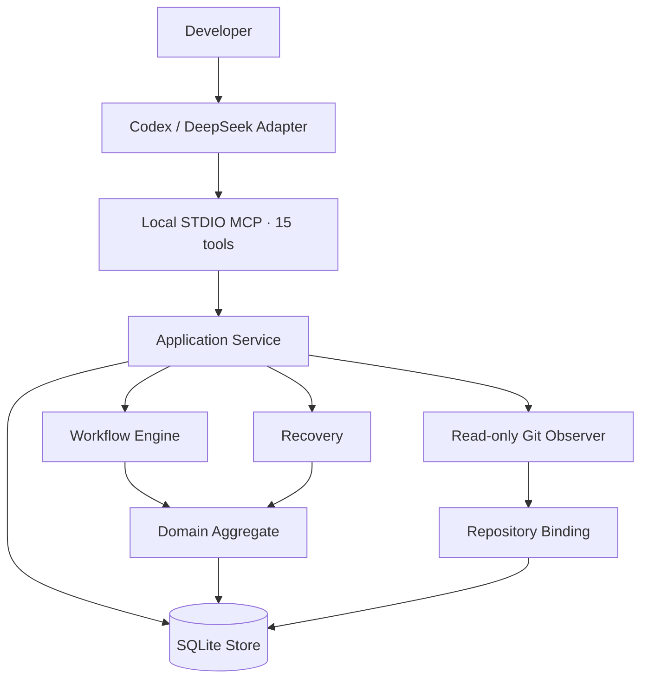
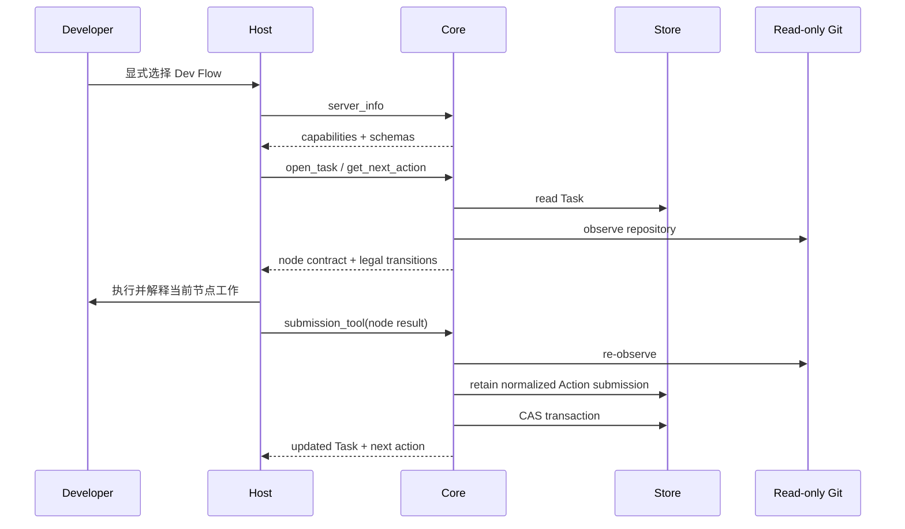

# Dev Flow 架构

[中文](ARCHITECTURE.md) | [English](ARCHITECTURE_en.md)

## 设计目标

Dev Flow 的架构围绕一个原则展开：过程事实只保存一次。Go Core 管理 Task、状态图、流转、
证据、恢复和终态；Codex 与 DeepSeek 负责把 Host 能力接到这个权威上。



## 组件职责

### Host Adapter

`packages/codex/` 和 `packages/deepseek/` 负责：

- 显式进入 Dev Flow；
- 启动 packaged Core 并完成 capability handshake；
- 呈现当前节点、合法 transitions 与理解审查请求；
- 把 semantic method steps 映射为 Host 中可用的操作；
- 按当前 Action 的 `submission_tool` 提交节点结果；
- 在不确定 mutation 后保留 Task ID 与 Action ID，并读取 Core 保存的规范化提交后恢复。

Adapter 不保存 Task、current node、transition table、baseline、repository claim 或 recovery
classification，也不推断 completion 或 destination。

Codex Adapter 的 `setup` lifecycle 在任何 registration mutation 前创建或验证固定用户配置，并在
registration readback 后从配置与 receipt 的实际写入事实构造 setup result。rich/plain/JSON 只是该
结果的表现层；`mcp` STDIO、Core 和 DeepSeek Adapter 不参与该展示。

### MCP Contract

`internal/mcp/` 通过 local STDIO 暴露十五个工具：

```text
dev_flow_server_info
dev_flow_open_task
dev_flow_get_task
dev_flow_get_next_action
dev_flow_submit_requirements
dev_flow_submit_design
dev_flow_submit_tasks
dev_flow_submit_implementation
dev_flow_submit_test
dev_flow_submit_comprehension
dev_flow_submit_refactor
dev_flow_submit_delivery
dev_flow_resolve_blocker
dev_flow_recover_action
dev_flow_cancel_task
```

每个工具使用 closed JSON Schema 和 typed Result Envelope。Host 首先读取 server info 与 live
schema，再进行 task-bearing 调用。

### Application Service

`internal/application/` 协调 Store、Workflow、Recovery 和 Repository Observer。它负责 use case
顺序、事务输入与投影，不维护第二份流程定义。

### Workflow

`internal/workflow/` 是 `standard-development` 的可执行权威，定义：

- 11 个节点及其 contract；
- 29 条 transition、guard 与 reason rule；
- node-specific payload validator；
- authority invalidation；
- method semantic steps；
- process definition digest。

当前实现是直接、静态的 Go 定义，没有 runtime graph parser、registry、DSL 或 compatibility
process。

### Domain

`internal/domain/` 定义 `ProcessTask` 聚合及其不变量，主要 authority 包括：

```text
TaskIntent
RequirementsBaseline
DesignBaseline
TaskPlanBaseline
ImplementationRecord
TestRecord
ComprehensionAssessment
ProcessOutcome
```

`TaskIntent` 保存初始授权与不可变 method profile。Requirements、Design 和 TaskPlan 使用递增
revision 表示当前 authority。上游变更会使对应下游记录失效，避免旧证据继续驱动新状态。

### Store

`internal/store/` 使用 CGo-free SQLite driver 保存：

- current Task snapshot；
- append-only TaskEvent audit；
- bounded evidence；
- repository claim；
- LastOperation；
- revision CAS。

正常 mutation 在一个事务中更新 snapshot、event、evidence 与 claim。Task snapshot 用于当前
读取，TaskEvent 用于审计，不依赖 event replay 重建日常状态。

Action 提交在推进 revision 前先把一份有界、规范化的 `ActionCommit` 写入当前 Task snapshot，
不新增 event 或流程游标。随后 Task mutation 保留最近一次提交，使 Recovery 可以直接读取原输入。

Store 在开放写能力前执行只读 preflight，验证 SQLite Schema、snapshot、process definition、
Task/Event/Claim cardinality 与当前节点 authority。不兼容或 pre-graph 数据返回
`SCHEMA_UNSUPPORTED` 并保持零写入。

### Read-only Git Observer

`internal/repository/` 读取 canonical repository identity、branch、HEAD、index/worktree 与有界
changed paths，用于建立 repository binding 和判断 mutation 前后的仓库事实。

Action result 以 `changed_paths`/`no_file_changes` 明确声明 mutation envelope；artifact references 只
保留证据职责。Application 对照签发基线与 fresh observation 验证每仓路径，再决定 rebind 或
`REPOSITORY_DRIFT`。

Core 不执行 checkout、reset、clean、stash、commit、merge、rebase、push、tag、publish，也不
暴露 generic shell。Action 中的 `allowed_effects` 描述 Host 在用户授权下可执行的动作。

### Recovery

`internal/recovery/` 根据 Task snapshot 中保存的规范化 Action 提交、LastOperation 和一次只读
repository observation 生成五分类 Assessment：

```text
not_started
completed_and_recorded
completed_but_unrecorded
partially_completed
conflicting
```

普通读取自动返回这份提交对应的 Assessment。`dev_flow_recover_action` 可以完成原 transition，或为
partial/conflicting 创建 `BLOCKED`。Blocker 保存原 source node，解除后只回到该 resume node。

## Repository Scope、配置与持久化边界

`internal/webui` 是 Core 内的 loopback HTTP adapter；`packages/webui` 构建 React/TypeScript/Vite 静态资产并通过
`go:embed` 进入同一 binary。Application/Workflow/Recovery 继续决定 Task、Action、Guard、Recovery、Blocker
和 Outcome，浏览器只投影视图并提交当前身份。mode `0600` receipt 绑定 PID、进程启动身份、data-root digest
与 URL，使 Codex 和 DeepSeek 携带的兼容 Core 复用同一进程和 SQLite 权威。reset 位于 CLI/Store 边界，
通过 target-bound plan、SQLite 独占访问和目标复核完成；HTTP route 集合中没有 reset mutation。
前端 typed catalog 维护简体中文/英文；首次按 `navigator.languages` 选择，手工选择只进入 local site storage，
不形成 Core、Task、receipt 或账号状态。

`ProcessTask.Repository` 继续保存主仓库 binding；`PrimaryRepositoryKey` 缺省为 `primary`，
`AdditionalRepositories` 保存零至七个按 key 严格升序排列的附加 binding。Scope 的成员、角色和 key
创建后不可变。单仓库的有效 `repository_binding_digest` 仍等于主 binding digest；多仓库的唯一
有效摘要按固定 domain、entry 数、主仓角色/key/component digest 和 sorted additions 进行长度前缀
SHA-256 聚合。Action、operation、Recovery、Blocker 与 Outcome 继续共用这个既有字段，不增加第二
Scope digest。

Application 创建 Task 时先观察主仓库，再按 key 顺序观察附加仓库；全部 identity 唯一且观察成功后
才构造一次 Store mutation。恢复可以从任一参与仓库的 claim 找到同一 Task，但不会改变主仓、key
或顺序。多仓库公共路径使用 `<repository-key>::<repository-relative-path>`，Application 将其分派为
各 Observer 使用的普通仓库相对路径；单仓库路径语法保持不变。

SQLite 继续以一行 Task 和一个 revision CAS 保存整个流程聚合。活动 Task 为 Scope 中每个 identity
持有一条 `repository_claims` 记录；Acquire、Retain 和 Release 都在 Task snapshot/event 的同一事务
中处理完整、有序的 claim 集。任一冲突或集合不一致都会回滚或 safe-stop，不产生部分 claim、仓库级
revision 或第二状态机。

`dev_flow_open_task` 在现有 `host`、`repository_path` 与 `new_task` 旁仅增加可选
`primary_repository_key` 和最多七项的 closed `additional_repositories[{key,repository_path}]`。
Task result 保留主 `repository`，并返回主 key 与 sorted `additional_repositories`。
`dev_flow_server_info({})` 返回进程启动时从只读 `$HOME/.dev-flow/config.json` 得到的
`host_preferences.codex.codebase_memory` 与 `host_preferences.deepseek.codebase_memory`。配置不存在时
均为 false；配置或索引状态不进入 Task 或流程摘要。

Store 在开放 writable connection 前以 immutable read-only preflight 校验当前精确 Schema、closed
snapshot 和完整 claim 集。旧或未知 Schema 使用 `reject-and-reset`：零写入拒绝，不迁移、不自动
删除、改名或覆盖。用户可以选择新的 `DEV_FLOW_DATA_DIR`，或在 Core 外手工归档旧目录。

## 一次任务如何流动



如果最后一步响应不确定，Host 保留原 request、operation、source cursor、revision、action 和
payload，随后使用 read/probe 获取 Core 的恢复结论。

## 版本与分发

Core、Codex、DeepSeek 是三个独立产品：

```text
Core      → CORE_VERSION
Codex     → packages/codex/package.json
DeepSeek  → packages/deepseek/package.json
```

Host package 内含一个 macOS arm64 Core executable，构建与发布证据从实际 executable 读取 Core
版本和 digest。Codex Plugin manifest 只镜像 Codex package 版本。

发布工具位于 `release/` 与 `scripts/`，不进入 Core、MCP 或 SQLite。产品发布使用独立的
`quick` 或 `normal` 流程、精确 confirmation、仓库外 release directory 和可恢复 publication
record。

## 源码导航

| 路径 | 责任 |
| --- | --- |
| `cmd/dev-flow/` | Core CLI、version、STDIO server lifecycle |
| `internal/domain/` | Task 聚合、baselines、actions、evidence、outcome、limits |
| `internal/workflow/` | process、node、transition、payload、guard、invalidation |
| `internal/application/` | use case orchestration |
| `internal/recovery/` | reconciliation、assessment、blocker |
| `internal/repository/` | read-only Git observation |
| `internal/store/` | SQLite bootstrap、strict codec、CAS、events、claims |
| `internal/mcp/` | fifteen tools、closed JSON、Result Envelope |
| `packages/codex/` | Codex Plugin、Skill、lifecycle 与 package |
| `packages/deepseek/` | DSH bundle、Skill、guard 与 package |
| `protocol/fixtures/` | public contract 与 Host parity fixtures |
| `tests/contract/`, `tests/journeys/` | deterministic contract 与 process evidence |
| `release/`, `scripts/` | standalone release contracts and tooling |

当前行为权威是代码、机器可读 Schema 与可执行测试。文档帮助读者理解系统，不作为运行、
构建或发布输入。

## Codex Skill 激活边界

`packages/codex/plugin/skills/dev-flow/agents/openai.yaml` 允许 Host 隐式选择 Skill，`SKILL.md` 的
description 提供任务型正向用途和非任务型排除边界。精确 `$dev-flow-codex:dev-flow` selector 与隐式
选择汇合到同一 admission；launcher 从 `packages/codex/lib/lifecycle.mjs` 复用同一 MCP instructions，
setup validator 校验 metadata、Skill 和 instructions 自洽。激活来源不进入 Core、Task、SQLite、
receipt 或用户配置。
