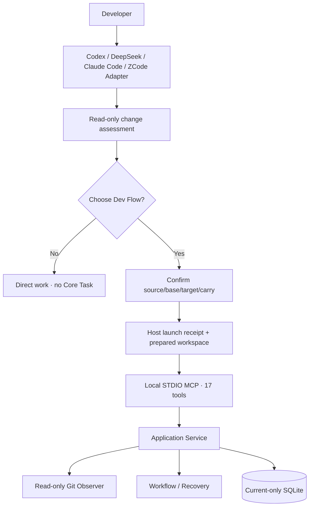

# Dev Flow Architecture

[中文](ARCHITECTURE.md) | [English](ARCHITECTURE_en.md)

> This document describes the current workspace and branch implementation, protocol, and persistence. Read
> the [README](../README.md) and [Product Definition](PRODUCT_en.md) first. Exact commands live in the
> [Command Reference](COMMANDS_en.md).

## Core rule

Dev Flow stores business state once. Go Core owns the Task, node, legal transitions, scope,
verification, Recovery, blockers, claims, and outcome. Codex, DeepSeek, Claude Code, ZCode, and WebUI are Host Adapters.
Core observes Git read-only; only a Host may perform developer-confirmed fetch, branch, worktree,
relaunch, handoff, and cleanup operations.



## Before Task creation

The Host discovers repository scope from current user instructions and applicable `AGENTS.md`.
When those instructions require a project index, it reads the index, candidate project documentation,
and relevant code/configuration within existing permissions, then includes the complete candidate set
in the assessment. Every repository still requires confirmation and provisioning; Core retains the
confirmed immutable Scope. The code-index preference applies only when user and AGENTS instructions
do not select a discovery method.

Every new request, exact selector, and parallel batch receives Host-side read-only assessment. The
Host may read the request, repository instructions, relevant code, callers, tests, manifests, and Git
state. It may not call Core, run tests, fetch, or create a branch/worktree. The result contains:

```text
change_level: small | standard | large | uncertain
observed_repositories
candidate_components
candidate_paths
public_contract_flags
persistence_or_state_flags
host_or_platform_flags
verification_shape
unknowns
recommendation: direct | dev_flow | clarify
reasons
```

Codex retains explicit choices and authorizations that remain valid for the current request and assessment. When no decision or required input is outstanding, it continues without an acknowledgment pause for progress updates or Skill-rule explanations. When input is needed, it asks the concrete question in the same response; development mode, worktree parameters, comprehension confirmation, separate operation authorization, and blockers keep their respective rules.

The assessment binds request, canonical root, HEAD, and status digest. A change while waiting makes it
stale. Explicit resume and bootstrap from a verified launch receipt do not repeat assessment.
Bootstrap reuses the saved assessment and confirmations, but still checks the receipt's surface and
phase, destination worktree identity, and permissions before choosing initialization, Task creation,
or Task resume.

After choosing Dev Flow, `workspace_mode` defaults to `new_branch`, creating a branch from current
HEAD in the existing directory. Explicit alternatives are `current_branch` and `dedicated_worktree`.
Core retains the same choice in `WorkspaceOrigin.mode`. Local modes use the local source, starting
current branch and HEAD. The Host owns branch creation; Core checks read-only. `carry_changes` accepts
initial contents and retains files/index in place rather than applying the snapshot. Core's read-only
`host-check workspace-available` checks claims before preparation and branch changes. Core still acquires
all claims together at creation. The check reserves no directory; the Host keeps one execution owner.
Existing content/history/instance digests are reused, and the SQL table layout is unchanged.

Codex local launches use `current_session`: `prepare -> local-provision -> scope -> open_task`, with
null `handoff_file`/`handoff_digest`, and continue the current authorized session. All-local DeepSeek
launches return `ready` and `open_task` in the existing Workspace Root. Dedicated launches continue to
relaunch/consume; mixed choices start from the common parent with every root actually authorized.

Explicit `dedicated_worktree` choices retain source/base/target/carry selection. Remote sources fetch
an exact ref after confirming the remote; local sources resolve a local ref. The Host freezes the base,
retains/applies selected snapshots and verifies the dedicated directory and HEAD. The source checkout
is preserved; conflicts stop Task creation and retain the destination. See [working directories and
branches](WORKTREE-SOURCES_en.md).

Before its first Git write, the Host retains a narrow provisioning receipt with launch/host/request
digest, `handoff_digest`, source repository identity, repository key, workspace mode, source/base/target/carry, frozen commit, worktree path,
operation status, and time. It contains no remote URL, credentials, file content, or workflow node.
Uncertain results read receipt/Host state instead of dispatching again.

The Host Adapter parses Codex creation results, including JSON in a single text block of the complete response. It saves `clientThreadId` as `host_client_thread_id` and enters `queued`; recording a valid retained result for the same launch can recover `uncertain` to `queued`, followed by `dispatched` when ready. Both transitions retain the original dispatch marker, and `dispatch-start` continues rejecting repeat dispatch. These Host record transitions do not change Core Task state.

## Codex requirements handoff

The source Codex session organizes the complete relevant discussion, including early requirements,
later corrections, explicitly accepted proposals, terminology and examples, scope constraints, code
findings, and working instructions. Confirmed requirements reference original user messages by ID;
unaccepted suggestions, assumptions, and open questions are separate. Original messages retain their
order, while later corrections determine current requirements. Starting development or confirming a
branch does not accept all assistant suggestions and adds no handoff-summary approval step.

Working instructions in the handoff contain only session-specific instructions and authorizations.
The destination Codex session loads global and repository `AGENTS.md` files normally; the handoff
duplicates neither their contents nor summaries and excludes automatically injected rule blocks from
original requirements discussion. Actual user requests to change a rule remain requirements.
Applicable rules unavailable through destination discovery identify their source path, scope, and
concrete discovery gap, preferably referencing a readable source file; if that file is unreadable,
include only the necessary task-specific rule text and exclude credentials. Record unverified
availability in `open_questions` instead of copying entire files as a precaution.

The sender owns content selection; format validation and rendering preserve supplied content without inferring instruction provenance or deleting text by keyword.

`packages/codex/lib/task-handoff.mjs` owns material format, storage, and prompt rendering;
`task-launch.mjs` invokes it within the existing launch steps. The source session assembles content
during read-only assessment, writes a JSON draft outside all assessed repositories after the existing
worktree confirmation, and supplies it through `prepare.handoff_file`. Before fetch, `prepare` saves
the complete JSON, Markdown, and material digest. Files live under the current Host product directory
at `provisioning/codex/<launch_id>/handoffs/<repository_key>.json` and `<repository_key>.md`. The receipt
adds only `handoff_digest`; material is outside both the source checkout and the Task worktree.

Desktop `dispatch-start` and `cli-provision` render the same saved material, and callers send the
returned content directly. A complete structured prompt of at most 24 KiB UTF-8 includes the body
inline; larger prompts provide complete file paths and reading instructions. Original discussion
remains in the files in both cases, without truncation. Missing or altered material causes sender
refusal before a desktop dispatch is recorded or a CLI worktree is created. The Core state graph and
worktree initialization retain their existing responsibilities.

The bootstrap prompt routes by receipt surface/phase, distinguishing first managed initialization
from continuation in provisioned worktrees. First initialization checks the frozen base and clean
destination; provisioned worktrees retain carried content and subsequent work without reapplying the
snapshot. The Host separately inspects current worktree identity and permissions, then chooses
creation or resume from actual Core state. Reading a receipt does not recheck Git.

Format checks establish fields and message references; the source session judges discussion coverage
and actual user acceptance from the conversation. It uses accessible original messages and records
unavailable history in `open_questions`, rather than reconstructing originals from summaries.

Acceptance uses `packages/codex/tests/task-handoff.test.mjs` for multi-turn corrections, source
references, Unicode, long files, and retained content integrity. With local temporary Git repositories,
`packages/codex/tests/task-launch.test.mjs` verifies consistent launch paths, sending after draft
removal, and refusal after material changes. These checks do not establish comprehension by an actual
new Codex session.

## WorkspaceOrigin and RepositoryBinding

For new Task creation, `dev_flow_open_task` retains the request, initial bounds, known acceptance,
and method profile, but accepts no final verification budget. It also accepts a primary
`workspace_origin` and the same member on each additional repository:

```json
{
  "mode": "dedicated_worktree",
  "source_type": "remote",
  "carry_changes": false,
  "remote_name": "origin",
  "base_branch": "main",
  "base_commit": "<frozen SHA>",
  "task_branch": "feature/example",
  "provisioning_receipt_id": "launch-example"
}
```

Core does not trust this text alone. The Observer verifies local branch, HEAD, source ref,
common directory, worktree-specific Git directory, and confirmed content choice, then fills and retains:

```text
mode
source_type
carry_changes
remote_name
base_branch
base_commit
task_branch
source_repository_group_digest
canonical_worktree_root
worktree_git_dir_digest
provisioning_receipt_id
```

The current `RepositoryBinding` is one immutable observation:

```text
worktree_instance_digest
identity_digest
history_digest
content_digest
current_branch / detached
current_head
head_tree
history_relation
changed_entries
task_surface
observed_at
binding_digest
```

`changed_entries` are bounded, sorted path/change-type/file-mode/gitlink/content-digest facts without
file bytes. `task_surface` combines the committed base-to-HEAD diff with index, worktree, and untracked
state. Rename/copy becomes old-path deletion plus new-path addition. `CurrentChangedPaths` is derived
from the current surface, so a path restored to base does not remain a delivery difference.

`content_digest` represents effective content and modes, not commit identity or staging labels. An
exact-content linear commit therefore preserves it; a real content change invalidates Test and
Comprehension. Actions bind issuance identity, history, and content digests, and Recovery uses the same facts.

Repository retains separate raw digests for the index and working file. When the path has neither
`assume-unchanged` nor `skip-worktree`, Git reports no unstaged change, the modes match, and converting
only CRLF to LF makes the working file match the index, effective
content uses the raw working-file digest. Git's line-ending conversion therefore does not invalidate
verification after staging or a linear commit. Actual working-file bytes, modes, and other staged-content
differences still affect the digest. Observation does not write the index.

## Observation and blockers

Explicit resume through `dev_flow_open_task` and `dev_flow_get_next_action` observe every Task root
before returning substantive work. Normal Action submission, Recovery, and cancellation use the same
observation/classification path.

| Observation | Result |
| --- | --- |
| Other edits in a directory | Local modes observe them; later edits to a dedicated worktree’s source checkout remain separate |
| Linear advance on the task branch | Recompute surface and continue |
| Identical content committed | Preserve Test/Comprehension |
| Content changed | Invalidate affected downstream records |
| Unplanned path | `file_scope_decision` blocker |
| Branch switch, detach, rewind, or rewrite | `workspace_history_conflict` blocker |
| Original worktree/Git directory missing or replaced | `WORKSPACE_UNAVAILABLE`, not normally resolvable |
| State changes during the two-pass observation | Unstable observation and zero Task writes |

Structured tools still call `host-check pre-file-write`; `allow_once` binds source Action, exact paths,
and intent, `expand_scope` returns to TASKS, and reject/restore requires actual restoration. Bash or
external processes may write first; Core uses the observed content digest for the same scope decision
on its next observation. A dedicated Task worktree has no "ignore external change" route.

Before a DeepSeek write into a new directory, the Host locates the target's nearest existing parent
directory and asks Core to identify its repository, retaining the full absolute target for scope checks.
This also locates the target repository beneath a shared multi-repository Workspace Root. If identification
fails, Core retains the input directory to check existing claims; timeouts, output limits, and similar
observation failures cannot count as an absent Task. Repositories without a Task and ordinary non-Git
directories still allow ordinary writes.

## Action submission

The eight ordinary node submission tools accept only semantic results, artifacts, method results, a
returned transition, summary, and reason. No node result contains `changed_paths` or `no_file_changes`.
Core observes Git before apply, derives the Action delta and complete Task surface, checks allowed
effects, process artifacts, and ExpectedPaths, then constructs one complete `TaskMutation`.

A normal mutation:

1. validates Task/Action/revision/process and checks that the payload contains only allowed fields;
2. observes and classifies every workspace;
3. derives Action delta, current surface, record invalidation, and destination;
4. validates the complete next Task, Action, Event, and Claim set in memory;
5. stages the normalized Action operation;
6. uses one SQLite transaction for revision CAS, Event append, complete claim update, and applied marker.

After a lost response, the Host retains only Task ID and Action ID and follows the `next_advice` backed
by Core's retained operation. It does not reconstruct the payload or infer success from files.

Ordinary blocker submission and retained recovery share `recovery.ValidateBlockerResolution`, which
checks file-scope decisions, accepted history and the saved repository observation. Application builds
the payload and mutation; Recovery makes the pure decision. Single- and multi-repository Tasks follow
the same rules, replaying the retained decision after stage succeeds but commit does not. Further
drift retains the existing blocker and pending operation rather than creating a blocker with BLOCKED
as its resume node. Relocation retains its separate destination observation and migration checks.

## Completion record relationships

`internal/domain/completion.go` validates the relationships among plans, implementation, acceptance and current checks. Application reports field or transition errors before writing and uses the same constraints when constructing a mutation. Persisted snapshots validate these relationships as well.

IMPLEMENT→TEST and REFACTOR→TEST require `completed_work_item_ids` to cover every current planned work item. Remediation transitions may retain partial implementation. DELIVERY requires caller-supplied semantic `acceptance` results containing `criterion`, `status`, `work_item_ids` and `evidence_ids`. Criteria completely match current Requirements in order. Linked work items must be completed and include the corresponding `acceptance_indexes`; check IDs must belong to the current Test, be passed and belong to the current Task Plan revision. Core fills only Test/Comprehension record IDs and aggregate evidence IDs, without generating passed acceptance results.

## Shared HTTP and MCP submission

Ordinary Actions use `Service.SubmitAction`; blockers use `Service.ResolveBlockerAction`. Both assemble canonical payloads in Core and use `StageActionOperation` followed by `CommitActionOperation`. HTTP retains the page revision check. `workflow.ActionSubmissionSchema` defines shared semantic fields; MCP adapts Host schema constraints, while WebUI uses the same semantic structure for its form.

`recovery.ActionCorrectionPaths` owns zero-write correction eligibility and allowed members for ordinary
Actions. MCP and HTTP project field paths and recovery responses; HTTP retains `payload.` and returns
`allowed_paths` without maintaining another correction-rule allowlist.

Task detail returns `pending_action_id` for a retained operation that has not been applied. HTTP recovery accepts only the Action ID; `GetTask` and `RecoverAction` read the retained payload and decide the next step. A browser network failure first queries Core, and ordinary submission is hidden while recovery is pending. Reloading the page reads the pending reference from Core. The browser no longer assembles an internal OperationProbe.

### Action HTTP fields

| Route | Request fields, in addition to csrf |
| --- | --- |
| `POST /api/tasks/{task_id}/actions/submit` | request_id, task_revision, action_id, payload; payload follows the current semantic form schema |
| `POST /api/tasks/{task_id}/recovery/assess` | action_id |
| `POST /api/tasks/{task_id}/recovery/apply` | action_id |

A null `pending_action_id` means the current detail read found no unapplied operation. A present ID exposes recovery controls. Core re-reads and validates the Action to decide the actual result.

## Verification plan, budget increases, and review scope

`standard-development` retains its 11 nodes. The Host presents and discusses REQUIREMENTS and DESIGN; their existing forward and return edges remain. TASKS has four outgoing edges: `tasks_plan_saved` → TASKS (complete baseline, empty findings, null confirmation), `tasks_ready` → IMPLEMENT (null baseline, current explicit approval), `tasks_require_design` → DESIGN and `tasks_require_requirements` → REQUIREMENTS (null baseline/confirmation, nonempty findings and a specific reason). Waiting creates no blocker.

`task_plan` stores `confirmation` and `confirmed_at`. Confirmation contains source=user, status=passed, summary, requirements_digest, design_digest, task_plan_digest and task_plan_revision, all matching the saved current content. Core supplies the timestamp. Saving a draft includes expected_paths, work items, acceptance mappings and verification_plan and increments the planning round; confirmation references that draft without replacing it. Resaving, upstream changes or expand_scope make old approval unusable. Execution nodes require valid confirmation; resuming the same draft requires no resave. The SQLite Schema and snapshot follow the current layout without historical readers.

Codex `prepare` accepts the complete `assessment` (including anchor) and `user_choice`, validating the assessment, root set, unknowns and explicit choice before receipt/Git preparation. receipt.admission retains both objects and repeated prepare must match them; status/bootstrap/scope continue the saved receipt. The Host owns actual presentation and user replies; validation does not prove that natural-language requests always trigger the Skill.

The final verification budget is not part of creation-time `TaskIntent`. TASKS runs after
Requirements, Design, work decomposition, impact discovery, and existing-test inspection, so
`TaskPlanBaseline.verification_plan` retains:

```text
checks[]: name + rationale
initial_budget: level + max_automatic_commands + allow_full_suite + allow_manual_handoff
full_suite_expected
test_code_changes_expected
```

TASKS also has the required `tasks.plan_verification` method step. An incomplete or unconfirmed plan cannot enter
IMPLEMENT.

Evidence binds `task_plan_revision`. Automatic-command consumption counts only the current Task Plan
revision; a formally rebuilt plan starts from its new initial budget while old Evidence and
adjustments remain historical records. Before running an extra command that does not fit, the Host
submits `verification_budget_increased`, a TEST-to-TEST self-transition requiring:

- one basis from `new_impact`, `new_risk`, `verification_failure`, or `verification_gap`;
- a concrete transition reason and `additional_checks` with their rationales;
- only monotonic automatic-command, full-suite, or manual-handoff capacity needed now;
- empty check, failure, unverified, handoff, and finding lists, so the adjustment creates no Evidence,
  TestRecord, or verification attempt.

Core retains the previous/resulting budgets and reason, then issues a fresh TEST Action. A request
without a concrete reason, check rationale, or actual increase is rejected with zero Task writes. Normal
TEST results send `budget_adjustment=null`.

Every full-suite check also carries a non-empty `full_suite_reason`; non-full checks keep it empty.
This records the current decision, but Core neither parses shell nor intercepts every command before
execution. Codex/DeepSeek Skills select the closest check before every command, reassess impact,
focused-check sufficiency, uncovered risk, and repository checkpoint before every full suite, and
decide lasting value before changing test code.

Post-change code review also requires the Host to assess the current changes: inspect only the current diff, causally affected
call paths, and acceptance needs. After fixing a review finding, recheck only that issue and related
regressions. Explicit code review remains read-only and stops after delivering its findings;
unrelated historical issues stay outside the current review, Task work, and delivery report.

## Relocation, cancellation, and terminal state

Workspace relocation requires all repositories to use `dedicated_worktree`. Local modes are rejected
before BLOCKED and retain the original directory; terminal local cleanup is not applicable.

`dev_flow_prepare_task_relocation` moves the Task to `BLOCKED` and retains relocation ID, source
bindings, base, content, surface, and resume node while source claims remain active. The Host performs
one same-machine handoff. `dev_flow_resolve_blocker` then supplies relocation ID and destination
repository paths. Core verifies repository group, base, equivalent surface, and claims, atomically
replaces every binding/claim, and resumes.

Ordinary `dev_flow_cancel_task` still observes the worktree. When the exact instance is genuinely gone,
only `dev_flow_abandon_task(host, task_id, revision, reason)` may retain the last known binding, enter
CANCELLED, and release claims. It never accesses or deletes Git resources.

DONE/CANCELLED end the Task and release claims only. Terminal projection shows source/base/base commit,
task branch/current HEAD, worktree path, clean/dirty, current paths, and verification. Keep, review,
handoff, worktree cleanup, and branch cleanup are Host actions; the two cleanup operations require
separate authorization.

## MCP, Store, and WebUI

The fixed MCP tool list contains seventeen tools:

```text
dev_flow_server_info
dev_flow_open_task
dev_flow_get_task
dev_flow_get_next_action
dev_flow_submit_requirements
dev_flow_submit_design
dev_flow_submit_tasks
dev_flow_submit_implementation
dev_flow_submit_test
dev_flow_submit_comprehension
dev_flow_submit_refactor
dev_flow_submit_delivery
dev_flow_resolve_blocker
dev_flow_recover_action
dev_flow_cancel_task
dev_flow_prepare_task_relocation
dev_flow_abandon_task
```

Store implements one current SQLite Schema, strict snapshot codec, Action operation, append-only
TaskEvent, claims, and revision CAS. Claim lookup uses directly observable worktree-instance identity so the prewrite hook
can still find a Task after an illicit branch switch.

Startup validation reads schema metadata, Tasks, Action operations, relocations, claims and events in
one read transaction. Both live preflight and ordinary read-only connections use SQLite `mode=ro`,
without declaring the changing database immutable. A concurrent commit is observed as one complete
version; it cannot mix a previously read Task with newer operations or claims. Unsupported schemas
and inconsistent records remain errors rather than triggering a fallback or retry.
Read-only preflight writes no Task or persistent database pages. Reading a live WAL can update reader
marks in the existing `-shm` file as part of SQLite lock coordination. Checks distinguish unchanged
database/WAL contents and sidecar membership from those shared-memory read locks.

WebUI is a loopback HTTP Adapter that projects WorkspaceOrigin, observation/surface, blockers,
relocation, the verification plan, current budget/usage, adjustment reasons, and cleanup choices. It
no longer creates a Task from an arbitrary checkout and performs no Git mutation or Host handoff.

## Host differences

- In dedicated mode, Codex App uses native managed worktrees, snapshots, task creation, and handoff. The Skill retains one
  launch, and the child initializes the target branch before Core open. Codex CLI uses
  `codex -C <worktree> [--add-dir <additional-worktree>] -- <prompt>`.
- DeepSeek fixes Workspace Root at process start. WorkspaceCoordinator creates a safe sibling worktree
  and emits a `{command,arguments,cwd}` relaunch descriptor. The new session consumes the receipt before
  Core open. The source session never widens permission or nests a worktree inside the source.
- Multi-repository Task creation requires every root to be provisioned, authorized, and verified; one
  failure creates no partial Task or claims.

### Claude Code

`packages/claude/` independently owns Claude plugin registration, MCP/Hook transport, sessions and launch records. The plugin root is the complete package root, containing lib, bin, runtime and Skills inside the cache; it must not reference sibling packages outside that cache. `packages/host-workspace/` maintains Git observation, preparation and snapshot functions copied into each Host by the build. It contains no Core nodes or Claude/Codex session decisions.

Claude Write/Edit/NotebookEdit inputs supply complete targets and original-input digests to Core file_scope. Allowing a path does not override Host permissions. Launch records retain requests, origins, operation status and Claude session identity, without a second workflow cursor. Dedicated-worktree relocation retains partial effects until Core verifies every new binding. The unified manager uses `hosts/claude.mjs` for package/registration operations and Claude-specific installation records; that driver supplies Core candidates to the common runtime for WebUI/pet selection.

### ZCode

`packages/zcode/` owns the native ZCode plugin, MCP/Hook transport, local preparation records and workspace continuation guidance. The distinct `zcode` identity participates in Core, MCP schemas, configuration preferences and Task ownership checks. It does not reuse another Host identity or change the SQLite layout, process definition, nodes or edges.

The package root contains `.zcode-plugin/plugin.json`, `marketplace.json`, `.mcp.json`, `skills/dev-flow/`, `hooks/hooks.json`, CLI and both Core runtimes as one self-contained artifact. ZCode's process executor uses separate command/args and `ZCODE_PLUGIN_ROOT`; hooks are discovered in the standard directory. Write/Edit provide the complete `tool_input.file_path` and original-input digest to Core. Explicit Core denial outputs `permissionDecision=deny` and exits 0; event parsing or check execution errors exit 2 to reject the protected operation. Exit 0 alone does not establish write permission. Shell and external writes remain subject to later observation.

The Adapter validates local files and Core before saving preparation records. The manager's `hosts/zcode.mjs` owns package discovery, lifecycle and Core candidates. These records establish only the local source, without observing UI installation, cache or enablement, so the result is `action_required`. Actual Host loading and model-session checks are recorded separately. Ordinary uninstall retains the Adapter and `removal_required` record; after UI removal and session closure, `remove --confirm-host-removed` clears the record before package removal. A remaining package or record blocks shared-data reset because source-package process checks cannot establish that all cached Core processes stopped.

Git workspace operations reuse `packages/host-workspace/`, and command invocation reuses `packages/host-command/`; generated copies depend only on their own package. `open`/`resume` return directories and a continuation prompt for the actual ZCode UI to open and authorize. They generate no fabricated session identity or second workflow cursor. Platform directories own path and process differences, while Core Task semantics remain free of OS decisions.

## Versions, distribution, and source map

Core, Codex, DeepSeek, Claude, ZCode, and the unified lifecycle package have independent versions. `CORE_VERSION` is
the machine-readable Core version file; npm versions remain in each `package.json`, and ordinary product
work performs no release. Host packages carry exact `darwin-arm64/dev-flow` and
`win32-x64/dev-flow.exe` runtime pairs.

| Path | Responsibility |
| --- | --- |
| `internal/domain/` | Task, WorkspaceOrigin/Binding, verification plan/adjustments, records, blockers, outcome |
| `internal/repository/` | fixed read-only Git observation and digests |
| `internal/application/` | open/resume/read/submit/recover/relocate/cancel/abandon orchestration |
| `internal/workflow/` | 11 nodes, ordinary edges, payloads, guards, invalidation |
| `internal/store/` | current-only SQLite, codec, operations, events, claims |
| `internal/mcp/` | seventeen tools, field restrictions, tool annotations, and the common response structure |
| `internal/webui/`, `packages/webui/` | loopback Adapter and embedded interface |
| `packages/codex/`, `packages/deepseek/`, `packages/claude/`, `packages/zcode/` | request assessment, worktree creation, session continuation/handoff, and packaging |
| `packages/host-workspace/` | Maintained Git observation, preparation and snapshot helpers; copied into consuming Host packages at build time |
| `packages/host-command/` | Maintained command execution shared by Codex, Claude and ZCode; generated into each package and assembled directly at build time |
| `protocol/fixtures/`, `tests/` | public contracts, fault injection, Host end-to-end tests |

Source, machine-readable schemas, package manifests, CLI parsers, and executable tests define current behavior.

## Desktop pet responsibilities

`packages/dev-flow/lib/pet.mjs` reuses installed Adapter Core selection and WebUI commands; macOS
invocation lives in `lib/platform/macos/pet.mjs`. `packages/desktop-pet/macos` owns AppKit windows,
read-only HTTP, presentation, process identity, the single instance, and preferences. Each observation
checks the same Core and service identities; cancellation invalidates old responses. Each round pages through blocked and active tasks and deduplicates by task ID. Detail reads confirm the state of previously observed tasks that disappear from the lists and of the pinned task. List absence alone does not mean completion. Failed reads retain the last successful collection, and stale responses cannot overwrite a newer choice. The chooser pages on demand.
`PetTaskCollection` and Windows `task-collection.cjs` own desktop focus, explicit pinning, and session-local completion prompts; Core owns lifecycle. Automatic focus prioritizes blocked tasks and remains stable at equal priority, then hands off to unfinished work after the completion prompt. `PetBubbleStackView` and the Windows renderer own the three-bubble stack, scrolling expansion, and per-task clicks. Navigation rechecks the same Core and data directory.
`productRoot/pet/settings.json` stores position, animation controls, `pinned_tasks` per data root, `selected_appearance`, the enabled-by-default `idle_activities_enabled`, and character scale `scale`. Automatic focus and unread completion prompts stay in memory; `runtime.json` records process identity.

The macOS pet derives `process_start_identity` from the kernel's process creation seconds and microseconds, stored as a decimal `seconds:microseconds` string independent of locale and timezone. Restore and stop also verify the PID, owning user and executable path; failed native reads leave the process unidentified. Stop the old instance before replacing the application; the new instance writes a runtime record in the current format.
Core data, the process graph, and MCP tools retain their owners.

`PetMenuBarIcon` draws the 18 pt Dev Flow mark using AppKit paths and supplies a template image. `PetMenu` installs it on the menu bar button, and macOS applies the appearance color.

`scripts/build-desktop-pet.mjs` owns macOS compilation, resources and ad-hoc signing; `scripts/build-desktop-pet-windows.mjs` owns Windows application assembly. Local development packages reuse those functions. `release/dev-flow/prepare.mjs` stages the source file list, builds the macOS application and assembles the locked Windows x64 Electron distribution. It packs both runtime directories, checks application versions and default artwork, preserves executable permissions and compares every extracted file before writing release records. The formal package contains no local Adapter archives; configured Adapters provide Core.

`plan.mjs` adds an explicit pet installation action for confirmed maintenance when the package provides an app, including when no Adapter update is needed. `lifecycle.mjs` stops the pet before maintenance and executes the action. Platform installers stage and replace the app directory while retaining settings and appearances. Startup prefers the user-directory app, then the bundled app. See the [desktop pet guide](DESKTOP-PETS_en.md#updating-the-program-and-artwork).

User appearances live in `productRoot/pet/appearances/<id>`. `PetAppearanceStore` owns bounded file
reads, validation, and replacement. Complete converted packs pass the same checks as loading in a
temporary directory before installation. `AppearanceImages` checks memory estimates from image
dimensions and bit depth before decoding pixels. `CodexPetImporter` crops standard Codex format 1/2
atlases and Dev Flow's own high-resolution extension during import, preserving all nine clips, 57 frames,
and cell resolution. `AnimationCatalog` defines five required task clips and four optional additional
clips, validating every supplied clip;
`PetAppearanceSelection` keeps successful loading and saved selection consistent; `PetCharacterView`
plays the common catalog. `selected_appearance` is independent of `pinned_tasks` per data root.
Preference updates share one lock and preserve the old value on write failure. Switching releases old
frames and shows the current state without replaying prompts.

`PresentationRules` derives task presentation and review-node artwork from Core snapshots. `PetActivityController` owns local idle activities,
cooldowns, and the next deadline; ordinary polling preserves current activities and deadlines. `PetController` connects window events,
one-shot wake timers, and playback requests. `PetAnimationTimeline` maps monotonic elapsed time and authored durations to frames.
`PetCharacterView` drives playback with the view's `CADisplayLink`, changes the image only when its frame changes, reports finite
completion once, and releases the display callback when stopped. `PetWindow` uses native animation for temporary walking positions.
`PetMotion` selects system animations: `NSAnimationContext.animate` with SwiftUI animations on macOS 15 and later, and
`NSAnimationContext` animation groups on macOS 14. `PetBubbleStackView` keeps card and scroll-container identity, measures the target
layout, and updates cards and the window in one animation transaction; revisions isolate stale completion callbacks.
The macOS 26 `NSGlassEffectContainerView` groups card glass. `PetBubbleView` places text and interaction views in
`NSGlassEffectView.contentView` and enables `effectIsInteractive` on macOS 27. `PetController` supplies animation and system Reduce Motion
settings and coordinates menus, hiding, sleep, and resuming. Character and bubble hover are handled separately, and task prompts can interrupt idle activities.
Only manual dragging updates the saved position; activity order, cooldowns, and temporary movement stay in memory.
`SVGArtwork` validates static vector contents and canvas dimensions; AppKit preserves the SVG representation and draws it at the display size. `PetCharacterView` converts the artwork anchor to AppKit coordinates.
`PetMenu` exposes size selection; `PetController` applies changes after saving scale and position; `PetContentView` adjusts character constraints while keeping bubble text unchanged, and `PetActivityController` computes walking speed from scale.
See the [desktop pet guide](DESKTOP-PETS_en.md) for usage, artwork, and trigger rules.

`scripts/build-desktop-pet.mjs` calls `scripts/desktop-pet-artwork.mjs` to copy the default SVG appearance from `packages/desktop-pet/default-appearance/` and compare every delivered file with its source. Users import custom appearances from external packs. `PetAppearanceStore` lists and loads appearances in the user directory, while `PetAppearanceSelection` switches between the default and imported appearances. Generated application bundles are stored outside the repository and are not tracked by Git.

## Platform responsibilities

The four Host Adapters and unified manager select their platform policies at `lib/platform.mjs`, with system implementations in `lib/platform/windows/` and `lib/platform/macos/`. Each Adapter maintains its policies in `policies.mjs` under the corresponding system directory. Claude and ZCode each retain their own small `platformPolicy()` interface; each Adapter continues to own Host registration, lifecycle and session rules. Go Core keeps platform mechanisms in platform-specific files within the responsible package and keeps task semantics platform-neutral.

`packages/host-command/` maintains command execution shared by Codex, Claude and ZCode. `command.mjs` provides the common entry point and selects the platform command implementation; `platform/windows/command.mjs` and `platform/macos/command.mjs` each handle command discovery, launcher identity and invocation arguments. `scripts/sync-host-commands.mjs` generates copies at the same paths under each Host's `lib/`, with headers identifying the source. Builds also assemble directly from the shared source, so installed packages depend only on their own files. The unified manager and DeepSeek retain their respective command interfaces. See [script maintenance](../scripts/README_en.md#shared-host-commands) for generation and consistency checks.

Windows Git processes hide console windows; Codex version/status preflight uses the selected executable policy, and PowerShell launchers use UTF-8. Native validation is recorded separately in the [Windows report](WINDOWS-ADAPTATION_en.md).

Windows Codex registration validates marketplace `name` and `root` together with Plugin identity; the Windows implementation normalizes the `\\?\` path prefix. macOS uses its own readback rules.

## Windows desktop responsibilities

`packages/desktop-pet/windows/` owns the Electron window, tray, renderer, local observation and artwork handling; macOS retains Swift/AppKit. Both read Core state. `scripts/build-desktop-pet-windows.mjs` assembles the Windows desktop distribution with the Codex, DeepSeek, Claude and ZCode Adapter packages. The launcher verifies bundled hashes and manages application replacement while preserving settings and artwork in `%LOCALAPPDATA%\dev-flow\pet`.

The Windows path implementation resolves existing AppData directories to actual paths, including aliases supplied by packaged desktop hosts, while rejecting symbolic links. GUI launch uses `Start-Process` and a per-launch acknowledgment, so the persistent desktop process does not retain the invoking terminal’s output handles. Platform maintenance identifies Core by full executable path, command and creation time before stopping instances for replacement.

## Current DSH interface

The current source DeepSeek Adapter requires DSH `>=0.1.2-rc.1`. It reads the current turn and direct user input through Session `snapshotEvents()` to check `/dev-flow`, worktree confirmations, and structured file writes; Core continues to own Task state.

The workspace command runner, `runClosedCommand()`, returns complete results after the child process exits and stdout/stderr close, so incomplete Git output cannot determine repository identity or content. Timeout, cancellation, or output overflow stops collection and rejects success, with bounded completion even when descendants retain output pipes after the parent exits. Mutating commands that have started report an uncertain outcome in these cases so the Host can preserve resources and recover.

## Lifecycle CLI responsibilities

`packages/dev-flow/lib/cli.mjs` parses arguments and organizes menus; `terminal.mjs` retains input across one interactive session, and `presentation.mjs` renders plans, progress and results. `plan.mjs` creates maintenance actions and confirmation requirements. `lifecycle.mjs` observes state, resolves target versions, presents the plan and obtains confirmation before executing and recording results. It calls drivers for the explicitly selected Host/Profile and recreates them after installation paths are canonicalized, so subsequent operations use the same paths. `diagnostics.mjs` collects installation and user-configuration checks. Retries observe actual installation state; installation records do not determine Core Task state.

| Module | Responsibility |
| --- | --- |
| `packages/dev-flow/lib/hosts/` | Codex, DeepSeek, Claude and ZCode drivers each own package discovery and private installation records; DeepSeek also owns Profile rules. Each driver executes confirmed Adapter operations. `runtimeCandidates()` supplies startup candidates; `maintenanceTargets()` supplies package and Core locations for registered installations and packages left by interrupted installation. |
| `packages/dev-flow/lib/core-runtime.mjs` | Check the common packaged runtime layout, package identity, canonical paths, executable file and Core version. |
| `packages/dev-flow/lib/core-maintenance.mjs` | Coordinate the known Core service locations for reset and use the existing WebUI status/stop protocol; platform implementations own process inspection and termination. |
| `packages/dev-flow/lib/runtime.mjs` | Collect driver candidates and call shared validation, select by Core version and source, prepare the data directory, and forward startup arguments and signals. |
| `packages/dev-flow/lib/platform/` | Receive resolved package and Core executable locations, then handle system paths, permissions, process shutdown, cleanup and command argument quoting. Windows maintenance identifies processes to stop by the actual executable, command and creation time. |

Reset keeps shared-service shutdown separate from executable replacement. After confirmation the manager
retains the managed Adapter locations, stops the pet, WebUI and identified STDIO Core instances, removes
the Adapters, then checks again before cleaning data. Failed shutdown, changed process identity or a
reconnecting matching Core stops cleanup. This covers identifiable managed installations, not arbitrary
Core executables started elsewhere by hand. Ordinary maintenance preserves Task data.
Confirmed Core paths remain in a private reset maintenance record until data cleanup succeeds.
Independent retries still check them after Adapter removal. A retained path whose package is gone
can block unsafe cleanup, but cannot authorize signalling a process without current ownership checks.

The plan deduplicates cleanup targets by canonical path while retaining explicit-data confirmation.
Display, confirmation and execution use those same targets. DeepSeek Profile location, format and
read/write/remove operations belong to `hosts/deepseek-receipts.mjs`; the shared ownership module handles
managed files and permissions without interpreting those Host fields.

## Shared user configuration

`internal/userconfig.Decode` owns configuration fields and defaults for Codex, DeepSeek, Claude and ZCode. Core uses it when loading configuration at startup; the read-only `config validate` command accepts raw JSON on stdin for installation and diagnostics. The command enforces a 16 KiB limit and reads no configuration file, Task store or Git state. Results and exit codes are specified in the [command reference](COMMANDS_en.md#configuration-validation).

Codex setup checks configuration paths, file types and permissions before passing existing file bytes to its packaged Core for validation; valid files remain unchanged. A missing configuration file is initialized with `{}`, leaving defaults to Core. The unified manager also initializes configuration with `{}` during factory-reset. Doctor validates existing files through the selected Core and explicitly reports that semantic validation is unavailable when no usable Core exists. Node installation and diagnostic code maintain no separate product-wide field allowlist or Host-default values.

The manager's `resolveManagerPaths()` obtains permission policy from the platform implementation and passes it to `configuration.mjs` as `paths.enforcePrivateModes`. Configuration validation requires an explicit boolean and rejects a missing or incorrectly typed value before reading the file. It checks permissions against that policy without identifying the operating system again or deriving a default policy. Core continues to validate configuration semantics.

## Artifact preparation

Before ordinary submission, Codex runs `dev-flow-codex artifacts collect` and `dev-flow-codex artifacts prepare`, reusing Core’s complete Git observation for the current Action. Codex supplies file purpose and summary; preparation checks the collection against the current observation and generates artifact arrays. Missing process files receive exact paths and one correction limited to artifact fields. Real repository failures retain their existing recovery rules. See [artifact collection and submission](ARTIFACTS_en.md).

## Host interface descriptions and recovery entry points

The Codex package owns command discovery in `lib/host-launch-contract.mjs`. `host-launch <operation> --help` returns input Schemas, field sources, output fields and next steps before reading stdin, resolving installation paths or executing an operation. `host-launch scope` reads the confirmed repository records and reuses coordinator validation to assemble Core repository arguments. The Host coordinator continues to own Git operations.

Core MCP `inputSchema` describes submissions; `outputSchema` describes the public result envelope and paths needed to continue, while Core domain validation owns retained record contents. `structuredContent` and text content carry the same JSON result. Hosts handle `recovery_assessment.next_advice` before the current Action and obtain the saved submission identity from `recovery_assessment.operation.action_id` on a fresh-session resume. Lifecycle operations read back Tasks, creation origins or relocation records through their own identities instead of using ordinary Action recovery.

Codex `dispatch-start` saves the complete `host_request` in `receipt.operation_status.host_request` and enters `dispatch_prepared`; repeated calls and `status` can read it back. `dispatch-call` uses the current `dispatch_attempt_id` to enter `dispatching`; only its first `should_dispatch=true` result permits one creation call. The caller writes complete command stdout to a private file, checks the exit code and parses JSON from that file before forwarding the request unchanged, avoiding display truncation.

When the previous caller has stopped and the creation tool was demonstrably never called, `dispatch-recover` accepts the current attempt ID, `host_call_not_made=true`, `previous_caller_stopped=true` and a specific `reason`, retains the request and issues a new claim ID for `dispatch-call`. Empty task IDs alone do not prove non-invocation. When creation was called but its result is unknown, the Host searches tasks and archived tasks using the saved title, launch ID and repository marker, reads complete initial messages and submits `candidates` (`thread_id`, `initial_prompt`) to `dispatch-reconcile`. Exactly one complete prompt match saves the task ID; zero matches, multiple matches or unavailable inspection never authorize another creation. Core continues to own Task state.

## Codex carried-path reconciliation

When Codex carries local changes, it records their preservation in REQUIREMENTS and reconciles the complete `current_changed_paths` with `expected_paths` and retained process artifacts in TASKS. New development and preservation receive separate work and checks; an empty current-Action file collection cannot replace the complete Task path comparison. Preservation checks compare the launch snapshot and do not certify existing behavior as tested. Existing file-scope blockers continue through the current Core choices and transitions. The Codex Host skill owns this comparison using the existing Requirements, Task Plan and file-scope rules; Core stores no second path-exemption list.

## Verification capacity for existing checks

When increasing verification capacity, `additional_checks` may refer to check names in the current plan or earlier adjustments; `rationale` explains the remaining work or rerun. Names remain unique within one submission, and concrete reasons, an actual increase and the existing limits are still required. Increasing capacity does not create passed results.

## Accepting known failures

Developers need to accept existing failures when related checks pass and a full-suite comparison shows no new failures. Core retains actual failures, the comparison and explicit acceptance. Core owns the only Task state; the Host performs the comparison and obtains the decision. Core verifies check references, current content and plan, rather than interpreting test logs.

`standard-development` retains 11 nodes and computes its digest from the updated complete definition. TEST has the complete outgoing set:

| transition | destination | guard | reason |
| --- | --- | --- | --- |
| `tests_passed` | COMPREHENSION_REVIEW | current_tests_pass | optional |
| `tests_accepted_with_known_failures` | COMPREHENSION_REVIEW | current_known_failures_accepted | required |
| `tests_failed_implementation` | IMPLEMENT | implementation_failure_identified | required |
| `tests_expose_design_issue` | DESIGN | test_design_failure_identified | required |
| `tests_expose_requirement_issue` | REQUIREMENTS | test_requirement_gap_identified | required |
| `verification_budget_increased` | TEST | verification_budget_adjustment_justified | required |

TEST still requires a current implementation, repository binding and verification plan. Effects permit reading the repository, running checks, editing process artifacts and requesting a user decision. Completion requires classified checks, valid capacity and no unexecuted or pending checks. Existing method steps run necessary checks, retain actual results, and classify new versus known failures; classification also obtains acceptance of the exact known-failure set.

TEST adds optional `known_failure_acceptance` for the new transition only: `source=user`, `summary`, `failed_checks`, `comparison_check`, `task_plan_revision`, `content_digest`. Its failure set must exactly cover all submitted failed checks, which must be automated; every other check must pass. The comparison must reference a separate automated/passed check in the same submission. Its Host explanation states that neither failure identities nor error contents changed. Acceptance binds the plan revision and content the user saw. Missing comparisons, new failures, missing decisions, stale acceptance, and skipped/not_run/observed results cannot pass this edge.

Core atomically saves acceptance with the original checks in the current TestRecord, using `completed_at`. Names resolve to evidence IDs within that record. Failures remain failed; acceptance produces no synthetic user/passed check. Passed checks demonstrate fulfilled requirements, while acceptance retains known problems and cannot substitute for a passed check.

COMPREHENSION_REVIEW and DELIVERY require a current completed Test satisfying ordinary passing or known-failure acceptance. Their full outgoing transitions, guards and reasons remain those in the existing definition: comprehension goes to DELIVERY, IMPLEMENT, REFACTOR, DESIGN, TEST or REQUIREMENTS; delivery goes to DONE, IMPLEMENT, TEST, COMPREHENSION_REVIEW, DESIGN or REQUIREMENTS. Delivery links each criterion to actual passed checks. TestRecord displays failures and acceptance; automated/manual result lists contain only passed checks. Existing content/plan invalidation also invalidates the attached acceptance.

The current persisted Schema changes without historical readers or migration. MCP, CLI and WebUI expose the same record and transitions. Errors follow the [Core response contract](CORE-RESPONSES_en.md).

Acceptance uses targeted Core and storage integration checks: ordinary passing, accepted known failures, missing comparison/decision, omitted new failures, stale acceptance, restart then delivery, actual limits, completed user checks, permission restrictions, and zero-write correction of missing check explanations. Shared Skill examples cover all four Hosts. One transition and attached record preserve truthful results and allow delivery; no additional node, second cursor, automatic log parser, generic waiver or release workflow is introduced. Scope covers workflow/domain/application/store, direct MCP/WebUI consumers, docs and Skills.
