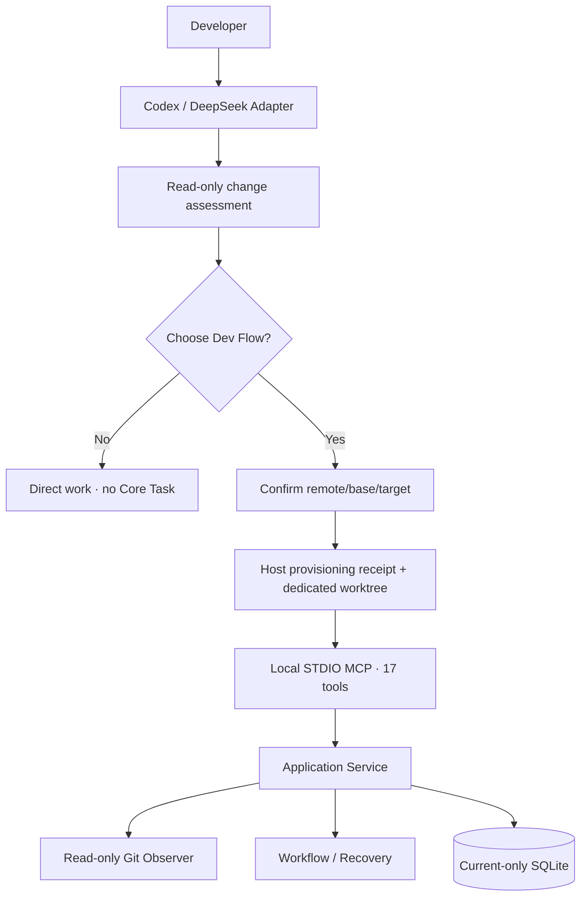

# Dev Flow Architecture

[中文](ARCHITECTURE.md) | [English](ARCHITECTURE_en.md)

> This document describes the current worktree-first implementation, protocol, and persistence. Read
> the [README](../README.md) and [Product Definition](PRODUCT_en.md) first. Exact commands live in the
> [Command Reference](COMMANDS_en.md).

## Core rule

Dev Flow stores business state once. Go Core owns the Task, node, legal transitions, scope,
verification, Recovery, blockers, claims, and outcome. Codex, DeepSeek, and WebUI are Host Adapters.
Core observes Git read-only; only a Host may perform developer-confirmed fetch, branch, worktree,
relaunch, handoff, and cleanup operations.



## Before Task creation

Every new request, exact selector, and parallel batch receives Host-side read-only assessment. The
Host may read the request, repository instructions, relevant code, callers, tests, manifests, and Git
state. It may not call Core, run tests, fetch, or create a branch/worktree. The result contains:

```text
change_level: small | standard | large | uncertain
observed_repositories
candidate_components
candidate_paths
public_contract_flags
persistence_or_state_flags
host_or_platform_flags
verification_shape
unknowns
recommendation: direct | dev_flow | clarify
reasons
```

The assessment binds request, canonical root, HEAD, and status digest. A change while waiting makes it
stale. Explicit resume is the only route that skips assessment.

After the developer chooses Dev Flow, they confirm `remote_name`, `base_branch`, and a new
`target_branch` for every repository. The Host runs one exact argv fetch:

```text
fetch <remote> refs/heads/<base>:refs/remotes/<remote>/<base>
```

It freezes the commit, creates the dedicated worktree/task branch, then verifies canonical root, Git
common directory, worktree-specific Git directory, HEAD, branch, clean/submodule state, and Host write
access. A source checkout may be dirty, but none of its staged, unstaged, or untracked content is copied.

Before its first Git write, the Host retains a narrow provisioning receipt with launch/host/request
digest, source repository identity, repository key, remote/base/target, fetched commit, worktree path,
operation status, and time. It contains no remote URL, credentials, file content, or workflow node.
Uncertain results read receipt/Host state instead of dispatching again.

## WorkspaceOrigin and RepositoryBinding

For new Task creation, `dev_flow_open_task` accepts a primary `workspace_origin` and the same member on
each additional repository:

```json
{
  "mode": "dedicated_worktree",
  "remote_name": "origin",
  "base_branch": "main",
  "base_commit": "<fetched SHA>",
  "task_branch": "feature/example",
  "provisioning_receipt_id": "launch-example"
}
```

Core does not trust this text alone. The Observer verifies local branch, HEAD, remote-tracking ref,
common directory, worktree-specific Git directory, and clean state, then fills and retains:

```text
mode
remote_name
base_branch
base_commit
task_branch
source_repository_group_digest
canonical_worktree_root
worktree_git_dir_digest
provisioning_receipt_id
```

The current `RepositoryBinding` is one immutable observation:

```text
worktree_instance_digest
identity_digest
history_digest
content_digest
current_branch / detached
current_head
head_tree
history_relation
changed_entries
task_surface
observed_at
binding_digest
```

`changed_entries` are bounded, sorted path/change-type/file-mode/gitlink/content-digest facts without
file bytes. `task_surface` combines the committed base-to-HEAD diff with index, worktree, and untracked
state. Rename/copy becomes old-path deletion plus new-path addition. `CurrentChangedPaths` is derived
from the current surface, so a path restored to base does not remain a delivery difference.

`content_digest` represents effective content and modes, not commit identity or staging labels. An
exact-content linear commit therefore preserves it; a real content change invalidates Test and
Comprehension. Actions bind issuance identity, history, and content digests, and Recovery uses the same facts.

## Observation and blockers

Explicit resume through `dev_flow_open_task` and `dev_flow_get_next_action` observe every Task root
before returning substantive work. Normal Action submission, Recovery, and cancellation use the same
observation/classification path.

| Observation | Result |
| --- | --- |
| Source-checkout change | Unrelated to the Task |
| Linear advance on the task branch | Recompute surface and continue |
| Identical content committed | Preserve Test/Comprehension |
| Content changed | Invalidate affected downstream records |
| Unplanned path | `file_scope_decision` blocker |
| Branch switch, detach, rewind, or rewrite | `workspace_history_conflict` blocker |
| Original worktree/Git directory missing or replaced | `WORKSPACE_UNAVAILABLE`, not normally resolvable |
| State changes during the two-pass observation | Unstable observation and zero Task writes |

Structured tools still call `host-check pre-file-write`; `allow_once` binds source Action, exact paths,
and intent, `expand_scope` returns to TASKS, and reject/restore requires actual restoration. Bash or
external processes may write first; Core uses the observed content digest for the same scope decision
on its next observation. A dedicated Task worktree has no "ignore external change" route.

## Action submission

The eight ordinary node submission tools accept only semantic results, artifacts, method results, a
returned transition, summary, and reason. No node result contains `changed_paths` or `no_file_changes`.
Core observes Git before apply, derives the Action delta and complete Task surface, checks allowed
effects, process artifacts, and ExpectedPaths, then constructs one complete `TaskMutation`.

A normal mutation:

1. validates Task/Action/revision/process and the closed payload;
2. observes and classifies every workspace;
3. derives Action delta, current surface, authority invalidation, and destination;
4. validates the complete next Task, Action, Event, and Claim set in memory;
5. stages the normalized Action operation;
6. uses one SQLite transaction for revision CAS, Event append, complete claim update, and applied marker.

After a lost response, the Host retains only Task ID and Action ID and follows the `next_advice` backed
by Core's retained operation. It does not reconstruct the payload or infer success from files.

## Relocation, cancellation, and terminal state

`dev_flow_prepare_task_relocation` moves the Task to `BLOCKED` and retains relocation ID, source
bindings, base, content, surface, and resume node while source claims remain active. The Host performs
one same-machine handoff. `dev_flow_resolve_blocker` then supplies relocation ID and destination
repository paths. Core verifies repository group, base, equivalent surface, and claims, atomically
replaces every binding/claim, and resumes.

Ordinary `dev_flow_cancel_task` still observes the worktree. When the exact instance is genuinely gone,
only `dev_flow_abandon_task(host, task_id, revision, reason)` may retain the last known binding, enter
CANCELLED, and release claims. It never accesses or deletes Git resources.

DONE/CANCELLED end the Task and release claims only. Terminal projection shows remote/base/base commit,
task branch/current HEAD, worktree path, clean/dirty, current paths, and verification. Keep, review,
handoff, worktree cleanup, and branch cleanup are Host actions; the two cleanup operations require
separate authorization.

## MCP, Store, and WebUI

The closed MCP catalog contains seventeen tools:

```text
dev_flow_server_info
dev_flow_open_task
dev_flow_get_task
dev_flow_get_next_action
dev_flow_submit_requirements
dev_flow_submit_design
dev_flow_submit_tasks
dev_flow_submit_implementation
dev_flow_submit_test
dev_flow_submit_comprehension
dev_flow_submit_refactor
dev_flow_submit_delivery
dev_flow_resolve_blocker
dev_flow_recover_action
dev_flow_cancel_task
dev_flow_prepare_task_relocation
dev_flow_abandon_task
```

Store implements one current SQLite Schema, strict snapshot codec, Action operation, append-only
TaskEvent, claims, and revision CAS. There is no migration, old-Schema reader, shared-checkout fallback,
or reset prompt. Claim lookup uses directly observable worktree-instance identity so the prewrite hook
can still find a Task after an illicit branch switch.

WebUI is a loopback HTTP Adapter that projects WorkspaceOrigin, observation/surface, blockers,
relocation, verification, and cleanup choices. It no longer creates a Task from an arbitrary checkout
and performs no Git mutation or Host handoff.

## Host differences

- Codex App uses native managed worktrees, snapshots, task creation, and handoff. The Skill retains one
  launch, and the child initializes the target branch before Core open. Codex CLI uses
  `codex -C <worktree> [--add-dir <additional-worktree>] -- <prompt>`.
- DeepSeek fixes Workspace Root at process start. WorkspaceCoordinator creates a safe sibling worktree
  and emits a `{command,arguments,cwd}` relaunch descriptor. The new session consumes the receipt before
  Core open. The source session never widens permission or nests a worktree inside the source.
- Multi-repository Task creation requires every root to be provisioned, authorized, and verified; one
  failure creates no partial Task or claims.

## Versions, distribution, and source map

Core, Codex, DeepSeek, and the unified lifecycle package have independent versions. `CORE_VERSION` is
the machine-readable Core authority; npm versions remain in each `package.json`, and ordinary product
work performs no release. Host packages carry exact `darwin-arm64/dev-flow` and
`win32-x64/dev-flow.exe` runtime pairs.

| Path | Responsibility |
| --- | --- |
| `internal/domain/` | Task, WorkspaceOrigin/Binding, records, blockers, outcome |
| `internal/repository/` | fixed read-only Git observation and digests |
| `internal/application/` | open/resume/read/submit/recover/relocate/cancel/abandon orchestration |
| `internal/workflow/` | 11 nodes, ordinary edges, payloads, guards, invalidation |
| `internal/store/` | current-only SQLite, codec, operations, events, claims |
| `internal/mcp/` | seventeen tools, closed schemas, annotations, Result Envelope |
| `internal/webui/`, `packages/webui/` | loopback Adapter and embedded interface |
| `packages/codex/`, `packages/deepseek/` | Host admission, provisioning, relaunch/handoff, package |
| `protocol/fixtures/`, `tests/` | public contracts, fault injection, Host journeys |

Source, machine-readable schemas, package manifests, CLI parsers, and executable tests define current behavior.
