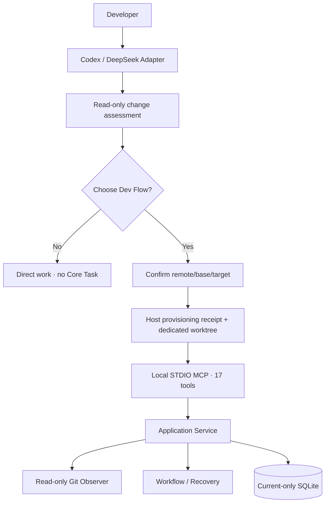

# Dev Flow Architecture

[中文](ARCHITECTURE.md) | [English](ARCHITECTURE_en.md)

> This document describes the current worktree-first implementation, protocol, and persistence. Read
> the [README](../README.md) and [Product Definition](PRODUCT_en.md) first. Exact commands live in the
> [Command Reference](COMMANDS_en.md).

## Core rule

Dev Flow stores business state once. Go Core owns the Task, node, legal transitions, scope,
verification, Recovery, blockers, claims, and outcome. Codex, DeepSeek, and WebUI are Host Adapters.
Core observes Git read-only; only a Host may perform developer-confirmed fetch, branch, worktree,
relaunch, handoff, and cleanup operations.



## Before Task creation

The Host discovers repository scope from current user instructions and applicable `AGENTS.md`.
When those instructions require a project index, it reads the index, candidate project documentation,
and relevant code/configuration within existing permissions, then includes the complete candidate set
in the assessment. Every repository still requires confirmation and provisioning; Core retains the
confirmed immutable Scope. The code-index preference applies only when user and AGENTS instructions
do not select a discovery method.

Every new request, exact selector, and parallel batch receives Host-side read-only assessment. The
Host may read the request, repository instructions, relevant code, callers, tests, manifests, and Git
state. It may not call Core, run tests, fetch, or create a branch/worktree. The result contains:

```text
change_level: small | standard | large | uncertain
observed_repositories
candidate_components
candidate_paths
public_contract_flags
persistence_or_state_flags
host_or_platform_flags
verification_shape
unknowns
recommendation: direct | dev_flow | clarify
reasons
```

The assessment binds request, canonical root, HEAD, and status digest. A change while waiting makes it
stale. Explicit resume is the only route that skips assessment.

After the developer chooses Dev Flow, they confirm `remote_name`, `base_branch`, and a new
`target_branch` for every repository. The Host runs one exact argv fetch:

```text
fetch <remote> refs/heads/<base>:refs/remotes/<remote>/<base>
```

It freezes the commit, creates the dedicated worktree/task branch, then verifies canonical root, Git
common directory, worktree-specific Git directory, HEAD, branch, clean/submodule state, and Host write
access. A source checkout may be dirty, but none of its staged, unstaged, or untracked content is copied.

Before its first Git write, the Host retains a narrow provisioning receipt with launch/host/request
digest, `handoff_digest`, source repository identity, repository key, remote/base/target, fetched commit, worktree path,
operation status, and time. It contains no remote URL, credentials, file content, or workflow node.
Uncertain results read receipt/Host state instead of dispatching again.

The Host Adapter parses Codex creation results, including JSON in a single text block of the complete response. It saves `clientThreadId` as `host_client_thread_id` and enters `queued`; recording a valid retained result for the same launch can recover `uncertain` to `queued`, followed by `dispatched` when ready. Both transitions retain the original dispatch marker, and `dispatch-start` continues rejecting repeat dispatch. These Host record transitions do not change Core Task state.

## Codex requirements handoff

The source Codex session organizes the complete relevant discussion, including early requirements,
later corrections, explicitly accepted proposals, terminology and examples, scope constraints, code
findings, and working instructions. Confirmed requirements reference original user messages by ID;
unaccepted suggestions, assumptions, and open questions are separate. Original messages retain their
order, while later corrections determine current requirements. Starting development or confirming a
branch does not accept all assistant suggestions and adds no handoff-summary approval step.

`packages/codex/lib/task-handoff.mjs` owns material format, storage, and prompt rendering;
`task-launch.mjs` invokes it within the existing launch steps. The source session assembles content
during read-only assessment, writes a JSON draft outside all assessed repositories after the existing
worktree confirmation, and supplies it through `prepare.handoff_file`. Before fetch, `prepare` saves
the complete JSON, Markdown, and material digest. Files live under the current Host product directory
at `provisioning/codex/<launch_id>/handoffs/<repository_key>.json` and `<repository_key>.md`. The receipt
adds only `handoff_digest`; material is outside both the source checkout and the Task worktree.

Desktop `dispatch-start` and `cli-provision` render the same saved material, and callers send the
returned content directly. A complete structured prompt of at most 24 KiB UTF-8 includes the body
inline; larger prompts provide complete file paths and reading instructions. Original discussion
remains in the files in both cases, without truncation. Missing or altered material causes sender
refusal before a desktop dispatch is recorded or a CLI worktree is created. The Core state graph and
worktree initialization retain their existing responsibilities.

Format checks establish fields and message references; the source session judges discussion coverage
and actual user acceptance from the conversation. It uses accessible original messages and records
unavailable history in `open_questions`, rather than reconstructing originals from summaries.

Acceptance uses `packages/codex/tests/task-handoff.test.mjs` for multi-turn corrections, source
references, Unicode, long files, and retained content integrity. With local temporary Git repositories,
`packages/codex/tests/task-launch.test.mjs` verifies consistent launch paths, sending after draft
removal, and refusal after material changes. These checks do not establish comprehension by an actual
new Codex session.

## WorkspaceOrigin and RepositoryBinding

For new Task creation, `dev_flow_open_task` retains the request, initial bounds, known acceptance,
and method profile, but accepts no final verification budget. It also accepts a primary
`workspace_origin` and the same member on each additional repository:

```json
{
  "mode": "dedicated_worktree",
  "remote_name": "origin",
  "base_branch": "main",
  "base_commit": "<fetched SHA>",
  "task_branch": "feature/example",
  "provisioning_receipt_id": "launch-example"
}
```

Core does not trust this text alone. The Observer verifies local branch, HEAD, remote-tracking ref,
common directory, worktree-specific Git directory, and clean state, then fills and retains:

```text
mode
remote_name
base_branch
base_commit
task_branch
source_repository_group_digest
canonical_worktree_root
worktree_git_dir_digest
provisioning_receipt_id
```

The current `RepositoryBinding` is one immutable observation:

```text
worktree_instance_digest
identity_digest
history_digest
content_digest
current_branch / detached
current_head
head_tree
history_relation
changed_entries
task_surface
observed_at
binding_digest
```

`changed_entries` are bounded, sorted path/change-type/file-mode/gitlink/content-digest facts without
file bytes. `task_surface` combines the committed base-to-HEAD diff with index, worktree, and untracked
state. Rename/copy becomes old-path deletion plus new-path addition. `CurrentChangedPaths` is derived
from the current surface, so a path restored to base does not remain a delivery difference.

`content_digest` represents effective content and modes, not commit identity or staging labels. An
exact-content linear commit therefore preserves it; a real content change invalidates Test and
Comprehension. Actions bind issuance identity, history, and content digests, and Recovery uses the same facts.

## Observation and blockers

Explicit resume through `dev_flow_open_task` and `dev_flow_get_next_action` observe every Task root
before returning substantive work. Normal Action submission, Recovery, and cancellation use the same
observation/classification path.

| Observation | Result |
| --- | --- |
| Source-checkout change | Unrelated to the Task |
| Linear advance on the task branch | Recompute surface and continue |
| Identical content committed | Preserve Test/Comprehension |
| Content changed | Invalidate affected downstream records |
| Unplanned path | `file_scope_decision` blocker |
| Branch switch, detach, rewind, or rewrite | `workspace_history_conflict` blocker |
| Original worktree/Git directory missing or replaced | `WORKSPACE_UNAVAILABLE`, not normally resolvable |
| State changes during the two-pass observation | Unstable observation and zero Task writes |

Structured tools still call `host-check pre-file-write`; `allow_once` binds source Action, exact paths,
and intent, `expand_scope` returns to TASKS, and reject/restore requires actual restoration. Bash or
external processes may write first; Core uses the observed content digest for the same scope decision
on its next observation. A dedicated Task worktree has no "ignore external change" route.

## Action submission

The eight ordinary node submission tools accept only semantic results, artifacts, method results, a
returned transition, summary, and reason. No node result contains `changed_paths` or `no_file_changes`.
Core observes Git before apply, derives the Action delta and complete Task surface, checks allowed
effects, process artifacts, and ExpectedPaths, then constructs one complete `TaskMutation`.

A normal mutation:

1. validates Task/Action/revision/process and checks that the payload contains only allowed fields;
2. observes and classifies every workspace;
3. derives Action delta, current surface, record invalidation, and destination;
4. validates the complete next Task, Action, Event, and Claim set in memory;
5. stages the normalized Action operation;
6. uses one SQLite transaction for revision CAS, Event append, complete claim update, and applied marker.

After a lost response, the Host retains only Task ID and Action ID and follows the `next_advice` backed
by Core's retained operation. It does not reconstruct the payload or infer success from files.

## Completion record relationships

`internal/domain/completion.go` validates the relationships among plans, implementation, acceptance and current checks. Application reports field or transition errors before writing and uses the same constraints when constructing a mutation. Persisted snapshots validate these relationships as well.

IMPLEMENT→TEST and REFACTOR→TEST require `completed_work_item_ids` to cover every current planned work item. Remediation transitions may retain partial implementation. DELIVERY requires caller-supplied semantic `acceptance` results containing `criterion`, `status`, `work_item_ids` and `evidence_ids`. Criteria completely match current Requirements in order. Linked work items must be completed and include the corresponding `acceptance_indexes`; check IDs must belong to the current Test, be passed and belong to the current Task Plan revision. Core fills only Test/Comprehension record IDs and aggregate evidence IDs, without generating passed acceptance results.

## Shared HTTP and MCP submission

Ordinary Actions use `Service.SubmitAction`; blockers use `Service.ResolveBlockerAction`. Both assemble canonical payloads in Core and use `StageActionOperation` followed by `CommitActionOperation`. HTTP retains the page revision check. `workflow.ActionSubmissionSchema` defines shared semantic fields; MCP adapts Host schema constraints, while WebUI uses the same semantic structure for its form.

Task detail returns `pending_action_id` for a retained operation that has not been applied. HTTP recovery accepts only the Action ID; `GetTask` and `RecoverAction` read the retained payload and decide the next step. A browser network failure first queries Core, and ordinary submission is hidden while recovery is pending. Reloading the page reads the pending reference from Core. The browser no longer assembles an internal OperationProbe.

## Verification plan, budget increases, and review scope

The final verification budget is not part of creation-time `TaskIntent`. TASKS runs after
Requirements, Design, work decomposition, impact discovery, and existing-test inspection, so
`TaskPlanBaseline.verification_plan` retains:

```text
checks[]: name + rationale
initial_budget: level + max_automatic_commands + allow_full_suite + allow_manual_handoff
full_suite_expected
test_code_changes_expected
```

TASKS also has the required `tasks.plan_verification` method step. An incomplete plan cannot enter
IMPLEMENT.

Evidence binds `task_plan_revision`. Automatic-command consumption counts only the current Task Plan
revision; a formally rebuilt plan starts from its new initial budget while old Evidence and
adjustments remain historical records. Before running an extra command that does not fit, the Host
submits `verification_budget_increased`, a TEST-to-TEST self-transition requiring:

- one basis from `new_impact`, `new_risk`, `verification_failure`, or `verification_gap`;
- a concrete transition reason and `additional_checks` with their rationales;
- only monotonic automatic-command, full-suite, or manual-handoff capacity needed now;
- empty check, failure, unverified, handoff, and finding lists, so the adjustment creates no Evidence,
  TestRecord, or verification attempt.

Core retains the previous/resulting budgets and reason, then issues a fresh TEST Action. A request
without a concrete reason, added check, or actual increase is rejected with zero Task writes. Normal
TEST results send `budget_adjustment=null`.

Every full-suite check also carries a non-empty `full_suite_reason`; non-full checks keep it empty.
This records the current decision, but Core neither parses shell nor intercepts every command before
execution. Codex/DeepSeek Skills select the closest check before every command, reassess impact,
focused-check sufficiency, uncovered risk, and repository checkpoint before every full suite, and
decide lasting value before changing test code.

Post-change code review also requires the Host to assess the current changes: inspect only the current diff, causally affected
call paths, and acceptance needs. After fixing a review finding, recheck only that issue and related
regressions. Explicit code review remains read-only and stops after delivering its findings;
unrelated historical issues stay outside the current review, Task work, and delivery report.

## Relocation, cancellation, and terminal state

`dev_flow_prepare_task_relocation` moves the Task to `BLOCKED` and retains relocation ID, source
bindings, base, content, surface, and resume node while source claims remain active. The Host performs
one same-machine handoff. `dev_flow_resolve_blocker` then supplies relocation ID and destination
repository paths. Core verifies repository group, base, equivalent surface, and claims, atomically
replaces every binding/claim, and resumes.

Ordinary `dev_flow_cancel_task` still observes the worktree. When the exact instance is genuinely gone,
only `dev_flow_abandon_task(host, task_id, revision, reason)` may retain the last known binding, enter
CANCELLED, and release claims. It never accesses or deletes Git resources.

DONE/CANCELLED end the Task and release claims only. Terminal projection shows remote/base/base commit,
task branch/current HEAD, worktree path, clean/dirty, current paths, and verification. Keep, review,
handoff, worktree cleanup, and branch cleanup are Host actions; the two cleanup operations require
separate authorization.

## MCP, Store, and WebUI

The fixed MCP tool list contains seventeen tools:

```text
dev_flow_server_info
dev_flow_open_task
dev_flow_get_task
dev_flow_get_next_action
dev_flow_submit_requirements
dev_flow_submit_design
dev_flow_submit_tasks
dev_flow_submit_implementation
dev_flow_submit_test
dev_flow_submit_comprehension
dev_flow_submit_refactor
dev_flow_submit_delivery
dev_flow_resolve_blocker
dev_flow_recover_action
dev_flow_cancel_task
dev_flow_prepare_task_relocation
dev_flow_abandon_task
```

Store implements one current SQLite Schema, strict snapshot codec, Action operation, append-only
TaskEvent, claims, and revision CAS. There is no migration, old-Schema reader, shared-checkout fallback,
or reset prompt. Claim lookup uses directly observable worktree-instance identity so the prewrite hook
can still find a Task after an illicit branch switch.

WebUI is a loopback HTTP Adapter that projects WorkspaceOrigin, observation/surface, blockers,
relocation, the verification plan, current budget/usage, adjustment reasons, and cleanup choices. It
no longer creates a Task from an arbitrary checkout and performs no Git mutation or Host handoff.

## Host differences

- Codex App uses native managed worktrees, snapshots, task creation, and handoff. The Skill retains one
  launch, and the child initializes the target branch before Core open. Codex CLI uses
  `codex -C <worktree> [--add-dir <additional-worktree>] -- <prompt>`.
- DeepSeek fixes Workspace Root at process start. WorkspaceCoordinator creates a safe sibling worktree
  and emits a `{command,arguments,cwd}` relaunch descriptor. The new session consumes the receipt before
  Core open. The source session never widens permission or nests a worktree inside the source.
- Multi-repository Task creation requires every root to be provisioned, authorized, and verified; one
  failure creates no partial Task or claims.

## Versions, distribution, and source map

Core, Codex, DeepSeek, and the unified lifecycle package have independent versions. `CORE_VERSION` is
the machine-readable Core version file; npm versions remain in each `package.json`, and ordinary product
work performs no release. Host packages carry exact `darwin-arm64/dev-flow` and
`win32-x64/dev-flow.exe` runtime pairs.

| Path | Responsibility |
| --- | --- |
| `internal/domain/` | Task, WorkspaceOrigin/Binding, verification plan/adjustments, records, blockers, outcome |
| `internal/repository/` | fixed read-only Git observation and digests |
| `internal/application/` | open/resume/read/submit/recover/relocate/cancel/abandon orchestration |
| `internal/workflow/` | 11 nodes, ordinary edges, payloads, guards, invalidation |
| `internal/store/` | current-only SQLite, codec, operations, events, claims |
| `internal/mcp/` | seventeen tools, field restrictions, tool annotations, and the common response structure |
| `internal/webui/`, `packages/webui/` | loopback Adapter and embedded interface |
| `packages/codex/`, `packages/deepseek/` | request assessment, worktree creation, session restart/handoff, and packaging |
| `protocol/fixtures/`, `tests/` | public contracts, fault injection, Host end-to-end tests |

Source, machine-readable schemas, package manifests, CLI parsers, and executable tests define current behavior.

## Desktop pet responsibilities

`packages/dev-flow/lib/pet.mjs` reuses installed Adapter Core selection and WebUI commands; macOS
invocation lives in `lib/platform/macos/pet.mjs`. `packages/desktop-pet/macos` owns AppKit windows,
read-only HTTP, presentation, process identity, the single instance, and preferences. Each observation
checks the same Core and service identities; cancellation invalidates old responses. While unselected, each observation searches blocked tasks, then active tasks; empty lists preserve the unselected state so later polls keep looking. With a selection, observation reads only that task until the user changes it; stale discovery responses cannot overwrite a newer selection. The chooser pages on demand.
`productRoot/pet/settings.json` stores position, the animation switch, and selection per data root;
`selected_appearance`, the enabled-by-default `idle_activities_enabled`, and the character scale `scale` are also saved. `runtime.json` records process identity.
Core data, the process graph, and MCP tools retain their owners.

`PetMenuBarIcon` draws the 18 pt Dev Flow mark using AppKit paths and supplies a template image. `PetMenu` installs it on the menu bar button, and macOS applies the appearance color.

`scripts/build-desktop-pet.mjs` compiles the macOS executable, assembles resources, and signs ad hoc.
Regular npm package lists and release preparation currently omit the native app. This script adds
`runtime/darwin-arm64/DevFlowPet.app` to the local unified-entry package. Running a built app requires neither Swift nor Xcode;
a configured Adapter provides Core. Installation helpers copy the app to `$HOME/.dev-flow/pet/DevFlowPet.app` only when
a candidate package contains it and the target is missing; existing targets are preserved. Startup prefers that user-directory app,
then the current unified-entry package's app. The program, installed app copy, and artwork update separately; see the
[desktop pet guide](DESKTOP-PETS_en.md#updating-the-program-and-artwork). Product files remain under `$HOME/.dev-flow`.

User appearances live in `productRoot/pet/appearances/<id>`. `PetAppearanceStore` owns bounded file
reads, validation, and replacement. Complete converted packs pass the same checks as loading in a
temporary directory before installation. `AppearanceImages` checks memory estimates from image
dimensions and bit depth before decoding pixels. `CodexPetImporter` crops standard Codex format 1/2
atlases and Dev Flow's own high-resolution extension during import, preserving all nine clips, 57 frames,
and cell resolution. `AnimationCatalog` defines five required task clips and four optional additional
clips, validating every supplied clip;
`PetAppearanceSelection` keeps successful loading and saved selection consistent; `PetCharacterView`
plays the common catalog. `selected_appearance` is independent of `selected_tasks` per data root.
Preference updates share one lock and preserve the old value on write failure. Switching releases old
frames and shows the current state without replaying prompts.

`PresentationRules` derives task presentation and review-node artwork from Core snapshots. `PetActivityController` owns local idle activities,
cooldowns, and the next deadline; ordinary polling preserves current activities and deadlines. `PetController` connects window events,
one-shot wake timers, and playback requests. `PetCharacterView` reports actual finite-loop completion, and `PetWindow` updates temporary
position only while walking. Character and bubble hover are handled separately, and task prompts can interrupt idle activities.
Only manual dragging updates the saved position; activity order, cooldowns, and temporary movement stay in memory.
`SVGArtwork` validates static vector contents and canvas dimensions; AppKit preserves the SVG representation and draws it at the display size. `PetCharacterView` converts the artwork anchor to AppKit coordinates.
`PetMenu` exposes size selection; `PetController` applies changes after saving scale and position; `PetContentView` adjusts character constraints while keeping bubble text unchanged, and `PetActivityController` computes walking speed from scale.
See the [desktop pet guide](DESKTOP-PETS_en.md) for usage, artwork, and trigger rules.

`scripts/build-desktop-pet.mjs` calls `scripts/desktop-pet-artwork.mjs` to copy the default SVG appearance from `packages/desktop-pet/default-appearance/` and compare every delivered file with its source. Users import custom appearances from external packs. `PetAppearanceStore` lists and loads appearances in the user directory, while `PetAppearanceSelection` switches between the default and imported appearances. Generated application bundles are stored outside the repository and are not tracked by Git.

## Windows platform boundaries and verification

Windows 10/11 x64 targets ordinary desktop PCs with Intel or AMD 64-bit processors. The three Node packages implement paths, permissions, commands and cleanup separately in `lib/platform/windows/` and `lib/platform/macos/`; selection entry points only dispatch to the current platform. Core keeps shared platform-neutral task semantics, while Windows Git processes hide console windows. Codex `--version` and `status` use the selected executable-file policy, and Windows PowerShell launchers output UTF-8. This change was tested only on native Windows; Windows 10, AMD hardware and macOS were not tested, and stable support claims remain unchanged. See the [Windows adaptation report](WINDOWS-ADAPTATION_en.md).

## Windows desktop features

The Windows 10/11 x64 desktop pet aligns with macOS task selection and status bubbles, WebUI navigation, tray/context menus, static and native animated PNG/SVG appearances, Codex PNG/WebP atlas imports, nine actions, dragging, six scale settings, hide/restore and independent start/stop. Windows uses a separate Electron implementation while macOS retains Swift/AppKit; both only read Core state. The Windows local package is built by `scripts/build-desktop-pet-windows.mjs`, with user data in `%LOCALAPPDATA%\dev-flow\pet`. See the [desktop pet guide](DESKTOP-PETS_en.md) for building, installation, updates and verification.

On Windows, existing AppData directories are resolved to their actual paths, including directory aliases exposed by packaged desktop hosts; symbolic links remain rejected.

The current Windows development distribution includes both Adapter packages and the desktop app. After installing the launcher package, use `dev-flow install --host all --yes` and `dev-flow pet start`. Repair and reinstall use the same entry, verify bundled artifact hashes, refresh the desktop app, and preserve Task data, settings and appearances.

## Current DSH interface

The current source DeepSeek Adapter requires DSH `>=0.1.2-rc.1`. It reads the current turn and direct user input through Session `snapshotEvents()` to check `/dev-flow`, worktree confirmations, and structured file writes; Core continues to own Task state.

## Lifecycle CLI responsibilities

`packages/dev-flow/lib/cli.mjs` parses arguments and organizes menus; `terminal.mjs` retains input across one interactive session, and `presentation.mjs` renders plans, progress and results. `plan.mjs` creates maintenance actions and confirmation requirements. `lifecycle.mjs` observes state, resolves target versions, presents the plan and obtains confirmation before executing and recording results. `diagnostics.mjs` collects installation and user-configuration checks. Host drivers inspect Codex/npm or DeepSeek Profile/Core and execute confirmed Adapter operations. Platform modules own processes, paths, permissions, cleanup and argument quoting for copyable commands. Retries observe actual installation state; installation records do not determine Core Task state.

## Artifact preparation

Before ordinary submission, Codex runs `dev-flow-codex artifacts collect` and `dev-flow-codex artifacts prepare`, reusing Core’s complete Git observation for the current Action. Codex supplies file purpose and summary; preparation checks the collection against the current observation and generates artifact arrays. Missing process files receive exact paths and one correction limited to artifact fields. Real repository failures retain their existing recovery rules. See [artifact collection and submission](ARTIFACTS_en.md).

## Host interface descriptions and recovery entry points

The Codex package owns command discovery in `lib/host-launch-contract.mjs`. `host-launch <operation> --help` returns input Schemas, field sources, output fields and next steps before reading stdin, resolving installation paths or executing an operation. `host-launch scope` reads the confirmed repository records and reuses coordinator validation to assemble Core repository arguments. The Host coordinator continues to own Git operations.

Core MCP `inputSchema` describes submissions; `outputSchema` describes the public result envelope and paths needed to continue, while Core domain validation owns retained record contents. `structuredContent` and text content carry the same JSON result. Hosts handle `recovery_assessment.next_advice` before the current Action and obtain the saved submission identity from `recovery_assessment.operation.action_id` on a fresh-session resume. Lifecycle operations read back Tasks, creation origins or relocation records through their own identities instead of using ordinary Action recovery.


Codex `dispatch-start` saves the complete `host_request` in `receipt.operation_status.host_request` and enters `dispatch_prepared`; repeated calls and `status` can read it back. `dispatch-call` uses the current `dispatch_attempt_id` to enter `dispatching`; only its first `should_dispatch=true` result permits one creation call. The caller writes complete command stdout to a private file, checks the exit code and parses JSON from that file before forwarding the request unchanged, avoiding display truncation.

When the previous caller has stopped and the creation tool was demonstrably never called, `dispatch-recover` accepts the current attempt ID, `host_call_not_made=true`, `previous_caller_stopped=true` and a specific `reason`, retains the request and issues a new claim ID for `dispatch-call`. Empty task IDs alone do not prove non-invocation. When creation was called but its result is unknown, the Host searches tasks and archived tasks using the saved title, launch ID and repository marker, reads complete initial messages and submits `candidates` (`thread_id`, `initial_prompt`) to `dispatch-reconcile`. Exactly one complete prompt match saves the task ID; zero matches, multiple matches or unavailable inspection never authorize another creation. Core continues to own Task state.
