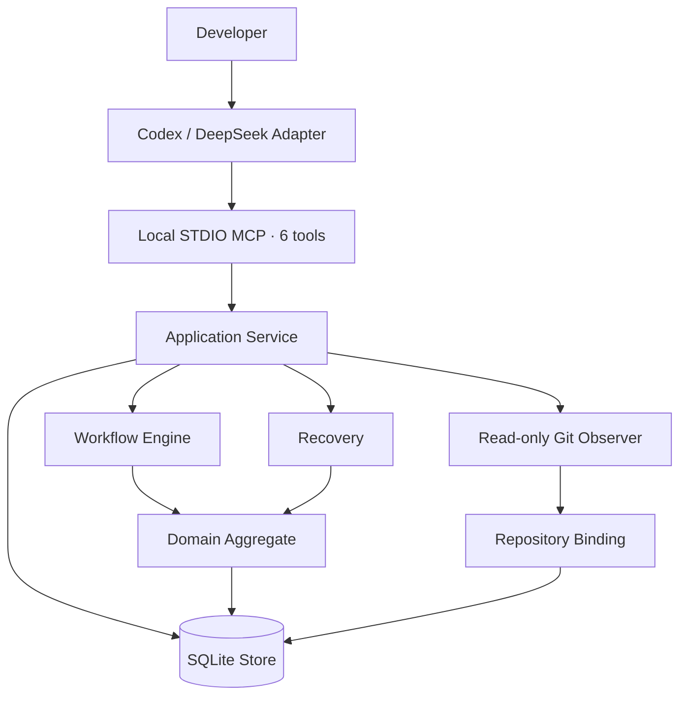
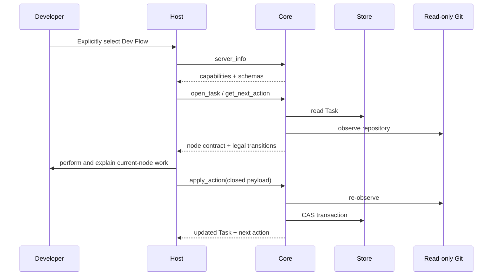

# Dev Flow Architecture

[中文](ARCHITECTURE.md) | [English](ARCHITECTURE_en.md)

## Design goal

Dev Flow is built around one rule: process facts are stored once. Go Core manages the Task, state
graph, transitions, evidence, recovery, and outcome. Codex and DeepSeek connect host capabilities to
that authority.



## Component responsibilities

### Host Adapter

`packages/codex/` and `packages/deepseek/`:

- admit explicit Dev Flow requests;
- start the packaged Core and complete the capability handshake;
- present the current node, legal transitions, and comprehension request;
- map semantic method steps to available host operations;
- construct and forward a closed node payload;
- retain operation identity and read before recovery after an uncertain mutation.

An Adapter does not store the Task, current node, transition table, baseline, repository claim, or
recovery classification. It does not infer completion or destination.

### MCP Contract

`internal/mcp/` exposes six tools over local STDIO:

```text
dev_flow_server_info
dev_flow_open_task
dev_flow_get_task
dev_flow_get_next_action
dev_flow_apply_action
dev_flow_cancel_task
```

Each tool uses a closed JSON Schema and typed Result Envelope. The host reads server information and
live schemas before any task-bearing call.

### Application Service

`internal/application/` coordinates Store, Workflow, Recovery, and Repository Observer. It owns use
case sequencing, transaction inputs, and projections, but no second process definition.

### Workflow

`internal/workflow/` is the executable authority for `standard-development`. It defines:

- 11 nodes and their contracts;
- 29 transitions, guards, and reason rules;
- node-specific payload validators;
- authority invalidation;
- semantic method steps;
- the process definition digest.

The current graph is expressed directly in static Go. It has no runtime graph parser, registry, DSL,
or compatibility process.

### Domain

`internal/domain/` defines the `ProcessTask` aggregate and its invariants. Its principal
authorities include:

```text
TaskIntent
RequirementsBaseline
DesignBaseline
TaskPlanBaseline
ImplementationRecord
TestRecord
ComprehensionAssessment
ProcessOutcome
```

`TaskIntent` preserves original authorization and the immutable method profile. Requirements,
Design, and TaskPlan use increasing revisions to identify current authority. Upstream changes
invalidate related downstream records.

### Store

`internal/store/` uses a CGo-free SQLite driver to persist:

- the current Task snapshot;
- append-only TaskEvent audit entries;
- bounded evidence;
- the repository claim;
- LastOperation;
- revision CAS.

A normal mutation updates snapshot, event, evidence, and claim in one transaction. Current reads use
the Task snapshot; TaskEvent provides an audit trail rather than routine event replay.

Before write capability is exposed, Store performs a read-only preflight over the SQLite Schema,
snapshot, process definition, Task/Event/Claim cardinality, and current-node authority. Incompatible
or pre-graph data returns `SCHEMA_UNSUPPORTED` with zero writes.

### Read-only Git Observer

`internal/repository/` reads canonical repository identity, branch, HEAD, index/worktree, and
bounded changed paths. These facts establish the repository binding and describe repository state
around a mutation.

Core does not run checkout, reset, clean, stash, commit, merge, rebase, push, tag, or publication
operations, and exposes no generic shell. Action `allowed_effects` describe operations a host may
perform under user authority.

### Recovery

`internal/recovery/` uses operation identity, the current Task, LastOperation, and one read-only
repository observation to produce:

```text
not_started
completed_and_recorded
completed_but_unrecorded
partially_completed
conflicting
```

A probe always performs zero writes. An explicit recovery apply may commit the original transition
at most once or create `BLOCKED` for a partial or conflicting result. The blocker records the
source node, and resolution returns only to that resume node.

## Task interaction



If the final response is uncertain, the host retains the original request, operation, source cursor,
revision, action, and payload, then uses read/probe to obtain Core's recovery assessment.

## Versioning and distribution

Core, Codex, and DeepSeek are independent products:

```text
Core      → CORE_VERSION
Codex     → packages/codex/package.json
DeepSeek  → packages/deepseek/package.json
```

A host package contains one macOS arm64 Core executable. Build and release evidence reads the Core
version and digest from the actual executable. The Codex Plugin manifest only mirrors the Codex
package version.

Release tooling lives under `release/` and `scripts/`; it is not part of Core, MCP, or SQLite.
A product release uses an independently selected `quick` or `normal` flow, exact confirmation, an
external release directory, and a recoverable publication record.

## Source navigation

| Path | Responsibility |
| --- | --- |
| `cmd/dev-flow/` | Core CLI, version, and STDIO server lifecycle |
| `internal/domain/` | Task aggregate, baselines, actions, evidence, outcome, and limits |
| `internal/workflow/` | Process, nodes, transitions, payloads, guards, and invalidation |
| `internal/application/` | Use case orchestration |
| `internal/recovery/` | Reconciliation, assessment, and blockers |
| `internal/repository/` | Read-only Git observation |
| `internal/store/` | SQLite bootstrap, strict codec, CAS, events, and claims |
| `internal/mcp/` | Six tools, closed JSON, and Result Envelope |
| `packages/codex/` | Codex Plugin, Skill, lifecycle, and package |
| `packages/deepseek/` | DSH bundle, Skill, guard, and package |
| `protocol/fixtures/` | Public contract and host-parity fixtures |
| `tests/contract/`, `tests/journeys/` | Deterministic contract and process evidence |
| `release/`, `scripts/` | Standalone release contracts and tooling |

Source code, machine-readable schemas, and executable tests define current behavior. Documentation
helps readers understand the system and is not used as runtime, build, or release input.
