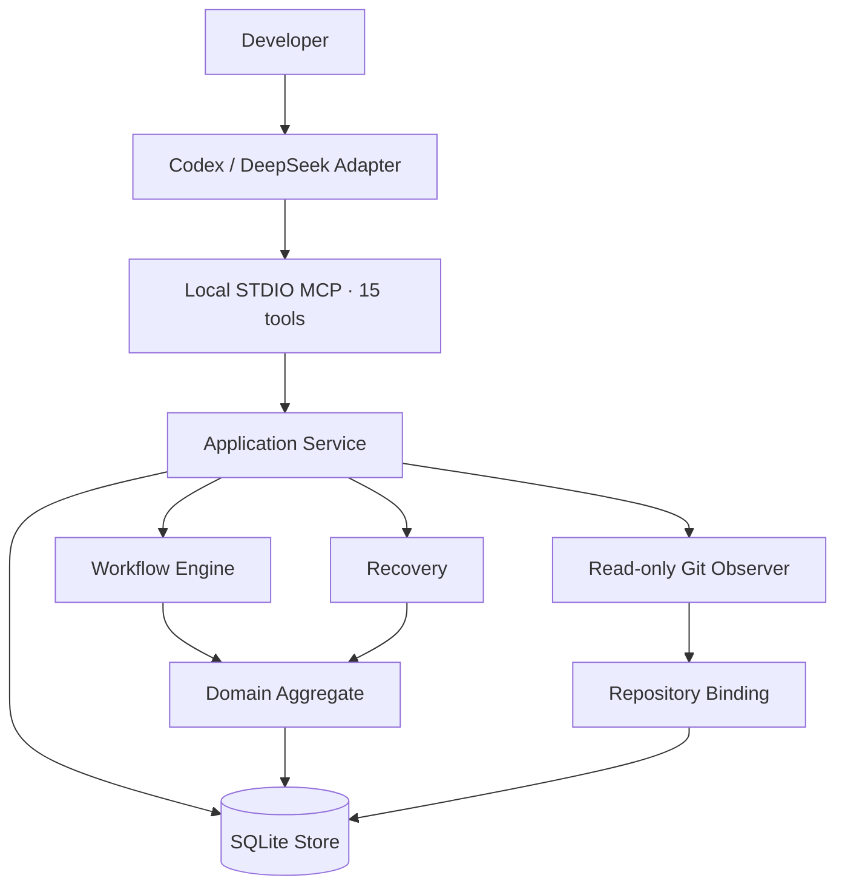
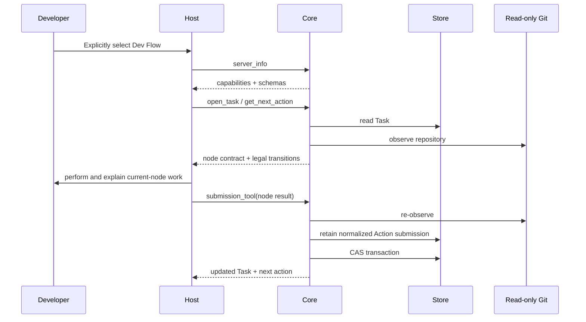

# Dev Flow Architecture

[中文](ARCHITECTURE.md) | [English](ARCHITECTURE_en.md)

## Design goal

Dev Flow is built around one rule: process facts are stored once. Go Core manages the Task, state
graph, transitions, evidence, recovery, and outcome. Codex and DeepSeek connect host capabilities to
that authority.



## Component responsibilities

### Host Adapter

`packages/codex/` and `packages/deepseek/`:

- admit explicit Dev Flow requests;
- start the packaged Core and complete the capability handshake;
- present the current node, legal transitions, and comprehension request;
- map semantic method steps to available host operations;
- submit node results through the current Action's `submission_tool`;
- retain the Task ID and Action ID after an uncertain mutation and recover from Core's retained normalized submission.

An Adapter does not store the Task, current node, transition table, baseline, repository claim, or
recovery classification. It does not infer completion or destination.

The Codex Adapter `setup` lifecycle creates or validates fixed user configuration before any
registration mutation, then constructs the setup result from actual configuration and receipt writes
after registration read-back. Rich, plain, and JSON are presentations of that result. MCP STDIO,
Core, and the DeepSeek Adapter do not participate in this display.

### MCP Contract

`internal/mcp/` exposes fifteen tools over local STDIO:

```text
dev_flow_server_info
dev_flow_open_task
dev_flow_get_task
dev_flow_get_next_action
dev_flow_submit_requirements
dev_flow_submit_design
dev_flow_submit_tasks
dev_flow_submit_implementation
dev_flow_submit_test
dev_flow_submit_comprehension
dev_flow_submit_refactor
dev_flow_submit_delivery
dev_flow_resolve_blocker
dev_flow_recover_action
dev_flow_cancel_task
```

Each tool uses a closed JSON Schema and typed Result Envelope. The host reads server information and
live schemas before any task-bearing call.

### Application Service

`internal/application/` coordinates Store, Workflow, Recovery, and Repository Observer. It owns use
case sequencing, transaction inputs, and projections, but no second process definition.

### Workflow

`internal/workflow/` is the executable authority for `standard-development`. It defines:

- 11 nodes and their contracts;
- 29 transitions, guards, and reason rules;
- node-specific payload validators;
- authority invalidation;
- semantic method steps;
- the process definition digest.

The current graph is expressed directly in static Go. It has no runtime graph parser, registry, DSL,
or compatibility process.

### Domain

`internal/domain/` defines the `ProcessTask` aggregate and its invariants. Its principal
authorities include:

```text
TaskIntent
RequirementsBaseline
DesignBaseline
TaskPlanBaseline
ImplementationRecord
TestRecord
ComprehensionAssessment
ProcessOutcome
```

`TaskIntent` preserves original authorization and the immutable method profile. Requirements,
Design, and TaskPlan use increasing revisions to identify current authority. Upstream changes
invalidate related downstream records.

### Store

`internal/store/` uses a CGo-free SQLite driver to persist:

- the current Task snapshot;
- append-only TaskEvent audit entries;
- bounded evidence;
- the repository claim;
- LastOperation;
- revision CAS.

A normal mutation updates snapshot, event, evidence, and claim in one transaction. Current reads use
the Task snapshot; TaskEvent provides an audit trail rather than routine event replay.

Before advancing the revision, an Action submission writes one bounded normalized `ActionCommit`
into the current Task snapshot without adding an event or process cursor. The following Task mutation
retains the latest submission so Recovery can read the original input directly.

Before write capability is exposed, Store performs a read-only preflight over the SQLite Schema,
snapshot, process definition, Task/Event/Claim cardinality, and current-node authority. Incompatible
or pre-graph data returns `SCHEMA_UNSUPPORTED` with zero writes.

### Read-only Git Observer

`internal/repository/` reads canonical repository identity, branch, HEAD, index/worktree, and
bounded changed paths. These facts establish the repository binding and describe repository state
around a mutation.

Action results explicitly declare the mutation envelope through `changed_paths`/`no_file_changes`;
artifact references remain evidence. Application validates per-repository paths against the issuance
baseline and fresh observation before choosing rebind or `REPOSITORY_DRIFT`.

Core does not run checkout, reset, clean, stash, commit, merge, rebase, push, tag, or publication
operations, and exposes no generic shell. Action `allowed_effects` describe operations a host may
perform under user authority.

### Recovery

`internal/recovery/` uses the normalized Action submission retained in the Task snapshot,
LastOperation, and one read-only repository observation to produce:

```text
not_started
completed_and_recorded
completed_but_unrecorded
partially_completed
conflicting
```

Ordinary reads automatically return the Assessment for the retained submission.
`dev_flow_recover_action` may commit the original transition or create `BLOCKED` for a partial or
conflicting result. The blocker records the source node, and resolution returns only to that resume
node.

## Repository Scope, configuration, and persistence boundary

`internal/webui` is a loopback HTTP adapter inside Core. `packages/webui` builds React, TypeScript, and Vite static assets
that enter the same binary through `go:embed`. Application, Workflow, and Recovery still decide Task, Action, Guard,
Recovery, Blocker, and Outcome; the browser only projects views and submits current identities. A mode-`0600` receipt binds
PID, process-start identity, data-root digest, and URL so compatible Core binaries carried by Codex and DeepSeek reuse one
process and SQLite authority. Reset stays at the CLI/Store boundary and uses a target-bound plan, exclusive SQLite access,
and target revalidation. The HTTP route set contains no reset mutation.
A typed frontend catalog maintains Simplified Chinese and English. First use follows `navigator.languages`; a manual choice
enters local site storage only and creates no Core, Task, receipt, or account state.

`ProcessTask.Repository` continues to store the primary repository binding.
`PrimaryRepositoryKey` defaults to `primary`, and `AdditionalRepositories` stores zero to seven
additional bindings in strict key order. Scope membership, roles, and keys are immutable after
creation. A single-repository Task keeps its primary binding digest as the effective
`repository_binding_digest`. A multi-repository Task derives the one effective digest with a
length-prefixed SHA-256 aggregate over a fixed domain, entry count, primary role/key/component
digest, and sorted additions. Action, operation, Recovery, Blocker, and Outcome continue to use this
existing field; there is no second Scope digest.

When opening a Task, Application observes the primary repository first and each additional
repository in key order. It constructs one Store mutation only after every observation succeeds and
every identity is unique. A Task can be resumed through the claim of any participating repository
without changing its primary repository, keys, or ordering. Public multi-repository paths use
`<repository-key>::<repository-relative-path>` and Application dispatches them as ordinary
repository-relative paths to each Observer. Single-repository path syntax is unchanged.

SQLite continues to store the whole process aggregate as one Task row with one revision CAS. An
active Task holds one `repository_claims` row for every identity in its Scope. Acquire, Retain, and
Release process the complete ordered claim set in the same transaction as the Task snapshot and
event. A conflict or set mismatch rolls back or safe-stops; it cannot leave a partial claim set,
repository-level revision, or second state machine.

Alongside the existing `host`, `repository_path`, and `new_task` fields, `dev_flow_open_task` adds
only optional `primary_repository_key` and at most seven closed
`additional_repositories[{key,repository_path}]` entries. The Task result retains the primary
`repository` and adds the primary key plus sorted `additional_repositories`.
`dev_flow_server_info({})` returns
`host_preferences.codex.codebase_memory` and
`host_preferences.deepseek.codebase_memory` from the read-only
`$HOME/.dev-flow/config.json` snapshot loaded at process startup. Missing configuration yields false
for both values. Configuration and index availability never enter the Task or process digest.

Before opening a writable connection, Store uses an immutable read-only preflight to verify the
current exact Schema, closed snapshots, and complete claim sets. Old or unknown Schemas follow
`reject-and-reset`: reject with zero writes and never migrate, delete, rename, or overwrite data.
The user can select a new `DEV_FLOW_DATA_DIR` or archive the old directory outside Core.

## Task interaction



If the final response is uncertain, the host retains the original request, operation, source cursor,
revision, action, and payload, then uses read/probe to obtain Core's recovery assessment.

## Versioning and distribution

Core, Codex, and DeepSeek are independent products:

```text
Core      → CORE_VERSION
Codex     → packages/codex/package.json
DeepSeek  → packages/deepseek/package.json
```

A host package contains one macOS arm64 Core executable. Build and release evidence reads the Core
version and digest from the actual executable. The Codex Plugin manifest only mirrors the Codex
package version.

Release tooling lives under `release/` and `scripts/`; it is not part of Core, MCP, or SQLite.
A product release uses an independently selected `quick` or `normal` flow, exact confirmation, an
external release directory, and a recoverable publication record.

## Source navigation

| Path | Responsibility |
| --- | --- |
| `cmd/dev-flow/` | Core CLI, version, and STDIO server lifecycle |
| `internal/domain/` | Task aggregate, baselines, actions, evidence, outcome, and limits |
| `internal/workflow/` | Process, nodes, transitions, payloads, guards, and invalidation |
| `internal/application/` | Use case orchestration |
| `internal/recovery/` | Reconciliation, assessment, and blockers |
| `internal/repository/` | Read-only Git observation |
| `internal/store/` | SQLite bootstrap, strict codec, CAS, events, and claims |
| `internal/mcp/` | Six tools, closed JSON, and Result Envelope |
| `packages/codex/` | Codex Plugin, Skill, lifecycle, and package |
| `packages/deepseek/` | DSH bundle, Skill, guard, and package |
| `protocol/fixtures/` | Public contract and host-parity fixtures |
| `tests/contract/`, `tests/journeys/` | Deterministic contract and process evidence |
| `release/`, `scripts/` | Standalone release contracts and tooling |

Source code, machine-readable schemas, and executable tests define current behavior. Documentation
helps readers understand the system and is not used as runtime, build, or release input.

## Codex Skill activation boundary

`packages/codex/plugin/skills/dev-flow/agents/openai.yaml` permits Host implicit selection, while the
`SKILL.md` description supplies positive task-bearing uses and negative non-task boundaries. The exact
`$dev-flow-codex:dev-flow` selector and implicit selection converge on one admission path. The launcher
reuses the MCP instructions exported by `packages/codex/lib/lifecycle.mjs`, and setup validates metadata,
Skill, and instruction consistency. Activation source is not stored in Core, Task, SQLite, receipts, or
user configuration.
