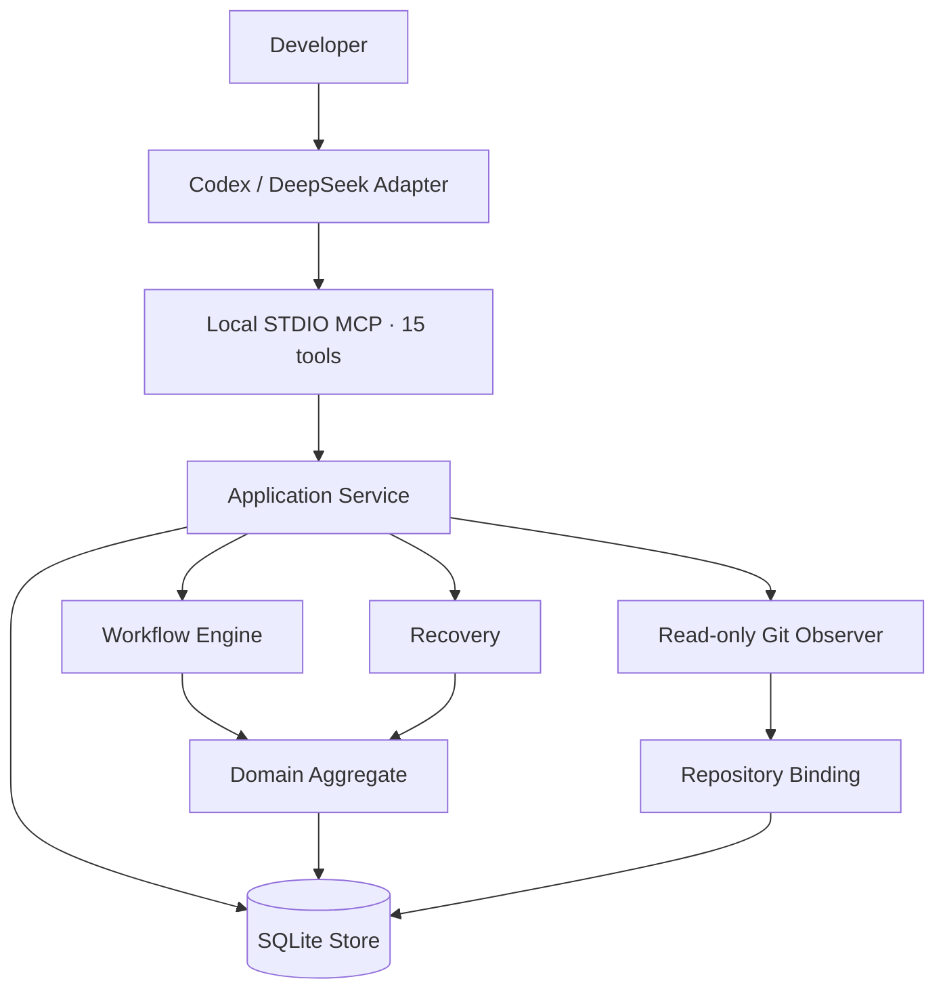
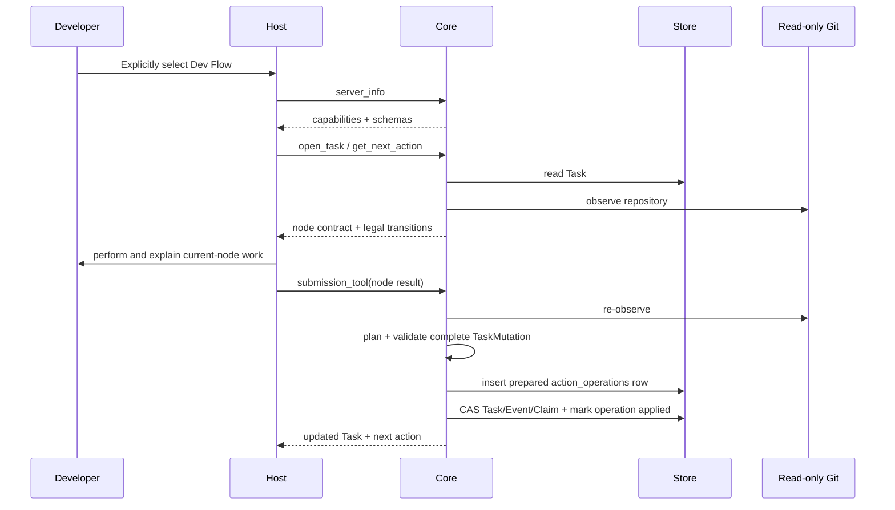

# Dev Flow Architecture

[中文](ARCHITECTURE.md) | [English](ARCHITECTURE_en.md)

> This document explains Dev Flow implementation and protocol. To decide whether the project fits
> your work, first read the [README](../README.md) and
> [Product Definition](PRODUCT_en.md).

This page is the primary home for state-graph, submission-protocol, persistence, Recovery,
multi-repository, worktree, WebUI-receipt, and Host-lifecycle details moved out of user-facing
documents. The [Command Reference](COMMANDS_en.md) remains the complete invocation reference.

## User concepts and internal concepts

| User concept | Internal implementation |
| --- | --- |
| Current task | `ProcessTask` |
| Current stage | current node |
| Next step | current Action and transitions |
| Task scope | `TaskIntent` and Repository Scope |
| Verification limit | verification budget |
| Existing verification | `TestRecord` / evidence |
| Recent test attempts | `VerificationAttempt`, retaining at most three entries |
| Recovery conclusion | Recovery Assessment |
| Blocking reason | Blocker |
| Completion result | `ProcessOutcome` |

## Design goal

Dev Flow is built around one rule: process facts are stored once. Go Core manages the Task, state
graph, transitions, evidence, recovery, and outcome. Codex and DeepSeek connect host capabilities to
that authority.



## Component responsibilities

### Host Adapter

`packages/codex/` and `packages/deepseek/`:

- admit explicit Dev Flow requests;
- start the packaged Core and complete the capability handshake;
- present the current node, legal transitions, and comprehension request;
- map semantic method steps to available host operations;
- call the packaged Core file-scope check before Codex `apply_patch` and before DeepSeek `write`, `edit`, or mutating `str_replace_editor` execution;
- compare the complete draft member by member with the current `submission_tool` live schema before
  every ordinary submission and the one allowed corrected submission;
- submit node results through the current Action's `submission_tool`;
- retain the Task ID and Action ID after an uncertain mutation and recover from Core's retained normalized submission.

An Adapter does not store the Task, current node, transition table, baseline, repository claim, or
recovery classification. It does not infer completion or destination.

The Codex pre-submit comparison covers required and extra members at every level, nested value and
array-item types, nullability, enums, and consts. When the draft cannot match the live schema exactly,
the Adapter stops before calling the tool instead of inferring types from field names, reference
prose, or error text. The live tool schema remains the only submission-shape contract.

The Codex Adapter `setup` lifecycle creates or validates fixed user configuration before any
registration mutation, then constructs the setup result from actual configuration and receipt writes
after registration read-back. Rich, plain, and JSON are presentations of that result. MCP STDIO,
Core, and the DeepSeek Adapter do not participate in this display.

### MCP Contract

`internal/mcp/` exposes fifteen tools over local STDIO:

```text
dev_flow_server_info
dev_flow_open_task
dev_flow_get_task
dev_flow_get_next_action
dev_flow_submit_requirements
dev_flow_submit_design
dev_flow_submit_tasks
dev_flow_submit_implementation
dev_flow_submit_test
dev_flow_submit_comprehension
dev_flow_submit_refactor
dev_flow_submit_delivery
dev_flow_resolve_blocker
dev_flow_recover_action
dev_flow_cancel_task
```

Each tool uses a closed JSON Schema and typed Result Envelope. The host reads server information and
live schemas before any task-bearing call.

### Application Service

`internal/application/` coordinates Store, Workflow, Recovery, and Repository Observer. It owns use
case sequencing, transaction inputs, and projections, but no second process definition.

### Workflow

`internal/workflow/` is the executable authority for `standard-development`. It defines:

- 11 nodes and their contracts;
- 29 transitions, guards, and reason rules;
- node-specific payload validators;
- authority invalidation;
- automatic-brake decisions for three exact repeated test attempts;
- semantic method steps;
- the process definition digest.

The current graph is expressed directly in static Go. It has no runtime graph parser, registry, DSL,
or compatibility process.

### Domain

`internal/domain/` defines the `ProcessTask` aggregate and its invariants. Its principal
authorities include:

```text
TaskIntent
RequirementsBaseline
DesignBaseline
TaskPlanBaseline
ImplementationRecord
TestRecord
VerificationAttempt
ComprehensionAssessment
ProcessOutcome
```

`TaskIntent` preserves original authorization and the immutable method profile. Requirements,
Design, and TaskPlan use increasing revisions to identify current authority. Upstream changes
invalidate related downstream records.

### Store

`internal/store/` uses a CGo-free SQLite driver to persist:

- the current Task snapshot;
- an independent recoverable Action operation;
- append-only TaskEvent audit entries;
- bounded evidence;
- at most three recent `VerificationAttempt` entries;
- file-scope requests, developer decisions, applicability, and cumulative Task-introduced paths;
- the repository claim;
- LastOperation;
- revision CAS.

A normal mutation updates snapshot, event, evidence, and claim in one transaction. Current reads use
the Task snapshot; TaskEvent provides an audit trail rather than routine event replay.

A Core-retained Action submission first builds and validates the complete next `TaskMutation` in
memory, then writes the bounded normalized payload as a BLOB in an independent `action_operations`
record. A following transaction performs the Task revision CAS, inserts the Event, processes the
complete Claim set, and fills the operation's `applied_revision`. The Task snapshot carries no
recovery payload; Recovery reads the independent operation record after an uncertain response.

Before write capability is exposed, Store performs a read-only preflight over the exact current
SQLite Schema, snapshot, process definition, Task/Action-operation/Event/Claim relationships, and
current-node authority. Any non-current Schema returns generic `SCHEMA_UNSUPPORTED`.

### Read-only Git Observer

`internal/repository/` reads canonical repository identity, branch, HEAD, index/worktree, and
bounded changed paths. These facts establish the repository binding and describe repository state
around a mutation.

Action results declare the mutation envelope through `changed_paths` newly produced relative to the
current Action's issuance state, or `no_file_changes` when this node changed no files; artifact references
remain evidence. Application validates per-repository paths against the issuance baseline and fresh
observation before choosing rebind or `REPOSITORY_DRIFT`. An exact binding paired with declared file
changes returns the field rule `repository_effect_not_observed` instead of being reported as real drift.

Node-specific MCP tools use submission schemas derived from the complete internal schemas. The Design
baseline's `requirements_revision`, the Tasks baseline's `design_revision`, Implementation's
`task_plan_revision`, Delivery acceptance, automated/manual evidence IDs, and Test/Comprehension
record IDs are removed from the submission schema and filled by Core; submitting
them is rejected as `unknown_member`. The complete internal contract remains unchanged. The MCP
boundary recursively checks required members against the submission schema and returns exact paths for
missing members in nested objects and array items.

`SubmitAction` first validates the current Action ID, kind, and Task status, rejects duplicate JSON
members, and fills system revisions from that same Task snapshot. Host submissions containing these
Core-owned members are rejected as `unknown_member`. Workflow then validates the complete internal payload;
Application checks revisions, records, work items, passing-test conditions, user confirmation,
acceptance, and evidence sets against the current Task. Core has already written Delivery authority
members into the complete payload from that same Task snapshot, so they are outside caller correction.
Failures return value-free `ContractViolation` or `GuardFailure` detail. A proven zero-write
`required_member_missing` with an exact path on a node submission may enter one
`correct_current_action`; the Host must stop when the missing content requires a new user decision.
Application also builds and validates the complete next Task, Action, Event, and Claim mutation before
any operation record is written. Core stages the normalized payload only after every check succeeds,
and Recovery replays that immutable submission.

Core does not run checkout, reset, clean, stash, commit, merge, rebase, push, tag, or publication
operations, and exposes no generic shell. Action `allowed_effects` describe operations a host may
perform under user authority.

### Ask before an out-of-scope file write

The union of every WorkItem's `ExpectedPaths` in the current Task Plan is the planned file scope. A
single-repository Task uses ordinary relative paths; a multi-repository Task uses
`<repository-key>::<repository-relative-path>`. Repository contract paths use `/` on every platform;
backslashes are rejected, and Host-native absolute paths are normalized before entering the Core
contract. Exact files match literally, and only a trailing
`directory/**` means files below that directory. This is not a general glob language or workflow
DSL. A write in additional repository B or C proceeds without another question when that repository
is already in immutable Repository Scope, the Host can write it, and the target is planned.

The Codex Plugin bundles a `PreToolUse` hook that runs after the developer trusts it and uses the
package-owned `dev-flow-codex hook pre-tool-use` launcher on `PATH` to parse `apply_patch` headers.
The DeepSeek Adapter reads structured file-tool paths in `tools/pre-execute`. Both ultimately send
normalized absolute targets and a write-intent digest to the internal `dev-flow host-check
pre-file-write` command. This managed Core command reuses the same
Application/SQLite Task authority, performs no target write, and creates no second process state.
Ordinary writes are unaffected when no Task is active; a supported write fails closed when an active
Task check is unavailable.

Before the Host writes an unplanned path, Core adds a `FileScopeRecord` and moves the Task to the
existing `BLOCKED` node:

- `allow_once` binds the path set, write-intent digest, Task Plan revision, and newly issued source Action; a different write asks again;
- `expand_scope` archives the current Task Plan, clears downstream Implementation/Test/Comprehension authority, and returns to `TASKS`; semantic changes use the existing `tasks_require_requirements` route;
- `reject` binds the current Task Plan revision and supported Host tools continue to deny that path.

`BLOCKED` remains outside ordinary transitions. A separate TaskEvent records entry into the blocker,
and the existing `RESOLVE_BLOCKER` Action resolves it. The ordinary nodes and 29 outgoing
transitions remain unchanged, so the process definition digest remains unchanged.
`dev_flow_resolve_blocker` additionally accepts `choice` and a non-empty `reason` for file-scope
blockers; other blocker calls retain their original identity-only input.

Every successful Action merges Git-proven paths newly introduced relative to Action issuance into
`task_changed_paths`. Before `implementation_ready_for_test`, `refactor_ready_for_test`, or
`delivery_complete`, Core requires every cumulative path to match current ExpectedPaths or a consumed
`allow_once` record. The strict codec rejects unknown members.

The two checks are not a filesystem sandbox. Bash, external processes, and some specialized tools
may bypass the Host prewrite entry. Core can later find their paths through Git and stop unexplained
files from advancing, but a final path-only observation cannot distinguish a later bypassed rewrite
of a file that was already authorized once.

### Automatic verification brake

A TEST submission first passes the existing verification-budget check and retains its evidence. The
Task snapshot also keeps the three most recent `VerificationAttempt` entries. Each records its Task
Plan, Implementation revision, original transition destination, evidence IDs, normalized result and
failure digests, and changed paths. The first version uses exact matching only:

- the same automatic check and failure appear in three consecutive attempts;
- the complete normalized test result is identical in three attempts;
- all three tests originally return to IMPLEMENT, Implementation revisions increase, and the changed
  paths and failure digest remain identical.

The third result is still committed in the same Task mutation, but the mutation sets the current node
to `BLOCKED` and retains the original transition destination in `resume_node`. TaskEvent does not
invent a standard transition. The Blocker condition is `allow_verification_retry`. A Host must wait
for explicit developer approval before calling `dev_flow_resolve_blocker`; resolution returns to the
retained destination. The three-attempt sliding window means another exact repetition pauses again.

This capability adds no node, transition, or second process cursor, so the `standard-development`
definition digest is unchanged.

### Recovery

`internal/recovery/` uses the normalized Action submission retained in the independent operation record,
LastOperation, and one read-only repository observation to produce:

```text
not_started
completed_and_recorded
completed_but_unrecorded
partially_completed
conflicting
```

Ordinary reads automatically return the Assessment for the retained submission.
`dev_flow_recover_action` may commit the original transition or create `BLOCKED` for a partial or
conflicting result. The blocker records the source node, and resolution returns only to that resume
node.

## Repository Scope, configuration, and persistence boundary

`internal/webui` is a loopback HTTP adapter inside Core. `packages/webui` builds React, TypeScript, and Vite static assets
that enter the same binary through `go:embed`. Application, Workflow, and Recovery still decide Task, Action, Guard,
Recovery, Blocker, and Outcome; the browser only projects views and submits current identities. A receipt binds PID,
process-start identity, data-root digest, and URL. macOS requires mode `0600`; Windows requires a regular non-symlink
file under the user product directory. Compatible Core binaries carried by Codex and DeepSeek therefore reuse one process
and SQLite authority.
A typed frontend catalog maintains Simplified Chinese and English. First use follows `navigator.languages`; a manual choice
enters local site storage only and creates no Core, Task, receipt, or account state.

Package runtime selection accepts only `darwin-arm64` and `win32-x64`. The Windows executable is
`runtime/win32-x64/dev-flow.exe`; 32-bit, ARM64, Windows Server, and cross-pairs are outside the
product support scope. The default product root is `$HOME/Library/Application Support/dev-flow` on
macOS and `%LOCALAPPDATA%\dev-flow` on Windows. Configuration is read from
`$HOME/.dev-flow/config.json` or `%USERPROFILE%\.dev-flow\config.json`, respectively. macOS enforces
POSIX directory and receipt modes. Windows relies on the current profile and LocalAppData inherited
ACL while retaining canonical-path, regular-file, and symlink checks. The Windows WebUI background
process uses a separate process group and creation time as its start identity. Stop first requests
`CTRL_BREAK`; if another console cannot deliver it or the exact process does not exit, only the
receipt-matched process is terminated.

Each npm package selects these path, permission, and executable rules through a small package-local
platform implementation. Go process, receipt, and signal behavior lives in separate `darwin` and
`windows` build-tag files. Platform selection stays outside Core semantics; Domain, Workflow,
Application, and Recovery contain no operating-system decisions.

`ProcessTask.Repository` continues to store the primary repository binding.
`PrimaryRepositoryKey` defaults to `primary`, and `AdditionalRepositories` stores zero to seven
additional bindings in strict key order. Scope membership, roles, and keys are immutable after
creation. A single-repository Task keeps its primary binding digest as the effective
`repository_binding_digest`. A multi-repository Task derives the one effective digest with a
length-prefixed SHA-256 aggregate over a fixed domain, entry count, primary role/key/component
digest, and sorted additions. Action, operation, Recovery, Blocker, and Outcome continue to use this
existing field; there is no second Scope digest.

When opening a Task, Application observes the primary repository first and each additional
repository in key order. It constructs one Store mutation only after every observation succeeds and
every identity is unique. A Task can be resumed through the claim of any participating repository
without changing its primary repository, keys, or ordering. Public multi-repository paths use
`<repository-key>::<repository-relative-path>` and Application dispatches them as ordinary
repository-relative paths to each Observer. Single-repository path syntax is unchanged. These public
contract paths always use `/`, independently of the Host path separator.

Repository binding keeps two identities with different responsibilities. `GitCommonDirDigest`
groups linked worktrees in one local logical repository, while `RepositoryIdentity` combines that
digest with the canonical root and identifies one physical worktree. Store keeps the latter as the
exclusive claim key, so Tasks in different worktrees may run concurrently while a second active
Task in the same worktree still conflicts. Control Center projects the primary repository group and
worktree path from the Task snapshot without persisting new state.

SQLite continues to store the whole process aggregate as one Task row with one revision CAS. Each
Task retains at most one latest `action_operations` row for Core-retained submission idempotency and
recovery; it is not a second process cursor. An active Task holds one `repository_claims` row for
every identity in its Scope. Acquire, Retain, and Release process the complete ordered claim set in the same transaction as the Task snapshot and
event. A conflict or set mismatch rolls back or safe-stops; it cannot leave a partial claim set,
repository-level revision, or second state machine.

Before single-Task admission, the Codex Skill recognizes an explicit parallel batch. Its coordinator
uses only a Host-provided worktree-backed task/thread capability to create one Codex task per bounded
item. The coordinator calls no Core tool and creates no parent Task. Every child performs the normal
handshake and Action loop in its own canonical worktree. Shared-directory sub-agents, Core Git
mutation, and automatic merging are outside this route.

One new request does not take that pre-admission route. It calls `dev_flow_open_task` once in the
current worktree. Only when the call carried non-null `new_task` and its complete result is
`ACTIVE_TASK_CONFLICT` does the Codex Skill use the same Host capability to create exactly one child.
Creation fixes `target.environment.type="worktree"` and omits `startingState`, so the Host builds the
worktree from committed project default-branch state. The Skill does not read, copy, or apply the
occupied checkout's index, tracked working-tree changes, or untracked files. The child receives the
original bounded request and exact selector, then performs its own handshake. The coordinator makes
no further Core call and does not retry creation. Explicit resume, `HOST_OWNERSHIP_CONFLICT`, and
other errors still safe-stop, leaving the original Task, claim, and worktree unchanged.

Alongside the existing `host`, `repository_path`, and `new_task` fields, `dev_flow_open_task` adds
only optional `primary_repository_key` and at most seven closed
`additional_repositories[{key,repository_path}]` entries. The Task result retains the primary
`repository` and adds the primary key plus sorted `additional_repositories`.
`dev_flow_server_info({})` returns
`host_preferences.codex.codebase_memory` and
`host_preferences.deepseek.codebase_memory` from the read-only configuration snapshot loaded at
process startup (`$HOME/.dev-flow/config.json` on macOS
or `%USERPROFILE%\.dev-flow\config.json` on Windows). Missing configuration yields false
for both values. Configuration and index availability never enter the Task or process digest.

Before opening a writable connection, Store uses an immutable read-only preflight to verify the
current exact Schema, closed snapshots, and complete claim sets. It implements only this current
persistence format.

## Task interaction



If the final response is uncertain, a Host using Core-retained submission keeps only the Task ID and
Action ID, then reads the assessment backed by the independent operation record. The explicit
operation-probe path continues to carry its complete probe.

## Versioning and distribution

Core, Codex, and DeepSeek are independent products:

```text
Core      → CORE_VERSION
Codex     → packages/codex/package.json
DeepSeek  → packages/deepseek/package.json
```

A host package contains `runtime/darwin-arm64/dev-flow` and
`runtime/win32-x64/dev-flow.exe`; runtime selection uses only the exact OS/CPU match. Build and
release use the runtime-keyed JSON report produced by `scripts/build-core-runtimes.mjs`, which builds
both targets once for local packaging, release staging, and real Host journeys. Neither the Codex
nor DeepSeek source package stores a precompiled Core: each manifest declares the final paths, and a
temporary staging directory builds both runtimes before packing. Build and release checks verify each
executable's GOOS, GOARCH, Core version, and digest. The Codex Plugin manifest only mirrors the Codex
package version.

Release tooling lives under `release/` and `scripts/`; it is not part of Core, MCP, or SQLite.
A product release uses fixed checks, exact confirmation, an external release directory, and remote
read-back for safe retries.

## Source navigation

| Path | Responsibility |
| --- | --- |
| `cmd/dev-flow/` | Core CLI, version, and STDIO server lifecycle |
| `internal/domain/` | Task aggregate, baselines, actions, evidence, outcome, and limits |
| `internal/workflow/` | Process, nodes, transitions, payloads, guards, and invalidation |
| `internal/application/` | Use case orchestration |
| `internal/recovery/` | Reconciliation, assessment, and blockers |
| `internal/repository/` | Read-only Git observation |
| `internal/store/` | SQLite bootstrap, strict codec, Action operations, CAS, events, and claims |
| `internal/mcp/` | Fifteen tools, closed JSON, and Result Envelope |
| `packages/codex/` | Codex Plugin, Skill, lifecycle, platform implementation, and package |
| `packages/deepseek/` | DSH bundle, Skill, guard, platform implementation, and package |
| `packages/dev-flow/` | Unified lifecycle, Control Center launcher, and platform implementation |
| `protocol/fixtures/` | Public contract and host-parity fixtures |
| `tests/contract/`, `tests/journeys/` | Deterministic contract and process evidence |
| `release/`, `scripts/` | Dual-runtime builds, standalone release contracts, and tooling |

Source code, machine-readable schemas, and executable tests define current behavior. Documentation
helps readers understand the system and is not used as runtime, build, or release input.

## Codex Skill activation boundary

`packages/codex/plugin/skills/dev-flow/agents/openai.yaml` permits Host implicit selection, while the
`SKILL.md` description supplies positive task-bearing uses and negative non-task boundaries. The exact
`$dev-flow-codex:dev-flow` selector and implicit selection converge on one admission path. The launcher
reuses the MCP instructions exported by `packages/codex/lib/lifecycle.mjs`, and setup validates metadata,
Skill, and instruction consistency. Activation source is not stored in Core, Task, SQLite, receipts, or
user configuration.
