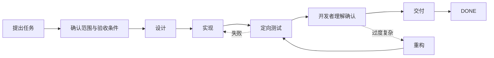

# 两分钟看懂 Dev Flow

[中文](DEMO.md) | [English](DEMO_en.md)

这是一段面向使用者的流程演示，不是完整协议说明。文末链接指向多组真实 Host 旅程证据；这些证据
分别证明不同能力，本页不会把它们包装成“同一次运行证明了所有事情”。

## 用户提出任务

开发者对 Codex 说：

```text
增加登录失败次数限制。修改范围只限认证模块，只运行验证该行为所需的定向测试。
```

如果没有持久任务状态，长会话可能逐渐扩大范围、追加越来越多的验证，或在重启后忘记做到哪里。
Dev Flow 把这条请求变成可以恢复的开发过程：



## 开发者实际感受到什么

### 1. 任务先有边界

Dev Flow 保存原始需求、验收条件、明确不做的内容和 verification budget。Codex 仍然负责修改
仓库，但当前步骤会说明这一阶段需要完成什么，以及可以合法进入哪些下一步。

### 2. 会话结束后进度仍然存在

当前节点、证据、阻塞原因和仓库身份保存在本地。Codex 会话被压缩或重启后，新会话读取的是同一个
Task，而不是重新扫描仓库并从聊天记录猜测进度。

```text
重启前：TEST，revision 5
重启后：TEST，revision 5
下一步：复用已有定向证据，或报告明确缺口
```

### 3. 返工路径是明确的

测试失败不会在当前步骤里悄悄扩展成无关重构，而是返回对应的实现或设计节点。复杂度问题可以进入
`REFACTOR`，但只要修改过代码，就必须重新经过 `TEST`。

### 4. 测试通过并不等于可以交付

测试之后，Dev Flow 要求开发者确认当前实现能否被解释、审查和维护。功能正确但明显过度复杂的
结果，可以在交付前返回重构。

### 5. 写操作结果不确定时先读取再重试

如果写操作响应丢失或中断，调用方先读取权威 Task 状态，不会直接重放操作并承担重复副作用风险。

## 仓库中已有的真实证据

下面是相互独立的证据路径，每一项只证明表格中列出的范围：

| 证据 | 证明内容 |
| --- | --- |
| [Codex 多仓库 Attempt 7](../tests/journeys/codex/evidence/feature-001-multi-repository-attempt-7.json) | 两个独立 Codex 会话从附加仓库恢复同一个 Core Task，恢复前后 revision、Action、binding 和 Scope 一致 |
| [DeepSeek 多仓库 Attempt 5](../tests/journeys/deepseek/evidence/feature-001-multi-repository-attempt-5.json) | 真实 DSH 旅程完成多仓库修改、重启恢复、一次定向验证、理解确认并到达 `DONE` |
| [PR #8 的 Codex 状态图验收](https://github.com/Innocent-children/dev-flow/pull/8) | 真实 Codex 旅程覆盖重启、重构、重新测试、明确理解确认、交付和 Core `DONE` |
| [Support Matrix](SUPPORT-MATRIX.md) | 哪些稳定 registry package 与 Host 环境具有最终生命周期证据 |

## 体验稳定版 Codex package

```bash
npm install -g dev-flow-codex@latest
dev-flow-codex setup
dev-flow-codex --version
```

进入 Git 仓库后直接描述一个边界明确的开发任务。需要强制选择 Dev Flow 时：

```text
$dev-flow-codex:dev-flow 修复登录失败次数限制，只运行定向测试。
```

稳定 package 可能晚于当前 `main`。评估预览能力前，请先阅读[项目状态页](PROJECT-STATUS.md)。
