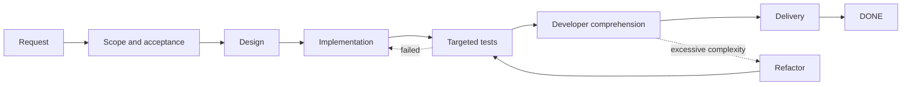

# Dev Flow in Two Minutes

[中文](DEMO.md) | [English](DEMO_en.md)

This is a narrated walkthrough of the behavior Dev Flow is designed to provide. It is intentionally
short and human-readable. The evidence links at the end point to separate real Host journeys; this
page does not pretend that one transcript proves every capability at once.

## The request

A developer asks Codex:

```text
Add a failed-login attempt limit. Keep the change inside the authentication module and run only the
targeted tests needed for this behavior.
```

Without durable task state, a long coding session may expand the scope, add more verification than
was requested, or lose its place after a restart. Dev Flow turns the request into a recoverable
process:



## What the developer experiences

### 1. The task starts with boundaries

Dev Flow retains the original request, acceptance criteria, explicit out-of-scope work, and the
verification budget. Codex still changes the repository, but the current step says what needs to be
completed and which next transitions are legal.

### 2. Progress survives the session

The current node, evidence, blockers, and repository identity are stored locally. After context
compaction or a Host restart, the next Codex session reads the same Task instead of rescanning the
repository and inferring progress from chat history.

```text
Before restart: TEST, revision 5
After restart:  TEST, revision 5
Next step:      reuse the existing targeted evidence or report a concrete gap
```

### 3. Rework has an explicit destination

A failed test does not silently expand the current step into unrelated refactoring. It returns to the
corresponding implementation or design node. A complexity concern may enter `REFACTOR`, but any code
change must pass through `TEST` again.

### 4. Passing tests is not the delivery gate

After testing, Dev Flow asks the developer whether the current implementation can be explained,
reviewed, and maintained. A correct but unnecessarily complex result can return to refactoring before
delivery.

### 5. An uncertain write is read before it is retried

If a write response is lost or interrupted, the caller reads authoritative Task state first instead
of replaying the operation and risking duplicate effects.

## Real evidence already in this repository

The entries below are independent evidence paths. Each proves only the scope stated in the table.

| Evidence | What it demonstrates |
| --- | --- |
| [Codex multi-repository Attempt 7](../tests/journeys/codex/evidence/feature-001-multi-repository-attempt-7.json) | Two independent Codex sessions resume the same Core Task from an additional repository; revision, Action, binding, and Scope are unchanged across resume |
| [DeepSeek multi-repository Attempt 5](../tests/journeys/deepseek/evidence/feature-001-multi-repository-attempt-5.json) | A real DSH journey completes multi-repository changes, restart recovery, one targeted verification, comprehension acceptance, and `DONE` |
| [PR #8 Codex graph acceptance](https://github.com/Innocent-children/dev-flow/pull/8) | A real Codex journey covers restart, refactoring, retesting, explicit comprehension acceptance, delivery, and Core `DONE` |
| [Support Matrix](SUPPORT-MATRIX_en.md) | Which stable registry packages and Host environments have final lifecycle evidence |

## Try the stable Codex package

```bash
npm install -g dev-flow-codex@latest
dev-flow-codex setup
dev-flow-codex --version
```

From a Git repository, describe a bounded development task. To force Dev Flow selection:

```text
$dev-flow-codex:dev-flow Fix the failed-login attempt limit and run only targeted tests.
```

The stable package may lag behind current `main`. Read [Project Status](PROJECT-STATUS_en.md) before
evaluating preview capabilities.
