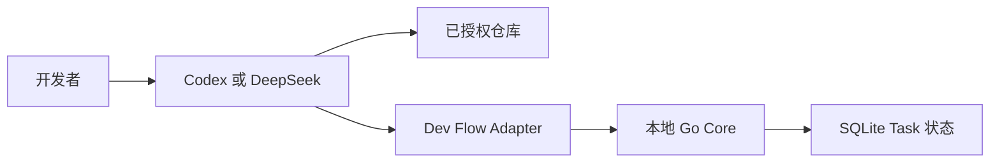

# Dev Flow 威胁模型

[中文](THREAT-MODEL.md) | [English](THREAT-MODEL_en.md)

## 最重要的边界

Dev Flow 保护的是**开发任务的过程状态**，不是包裹编程 Agent 的安全沙箱。

Codex 或 DeepSeek Harness 仍然使用开发者授予的权限读取仓库、修改文件和运行命令；Go Core 负责
保存权威 Task 状态，并校验流转、仓库绑定、持久化和 Recovery 决策。

## 需要保护什么

- 开发者声明的一个至八个 Git 仓库；
- Task 原始意图、当前阶段、revision、Action、证据、Blocker 和 Outcome；
- Repository Scope、仓库身份与 aggregate binding；
- 本地 SQLite、安装 receipt 与用户配置；
- npm package、bundled Core、Git Tag、GitHub Release 与 artifact digest；
- 日志和验证证据中可能出现的路径、代码片段和诊断信息。

## 谁负责什么

| 参与者 | 责任 |
| --- | --- |
| 开发者 | 授权仓库和 Host 权限，确认任务边界、理解结论与发布操作 |
| Codex / DeepSeek Harness | 真正读取文件、修改仓库和运行命令，是高权限执行面 |
| Host Adapter | 按当前 Action、Scope、verification budget 和 Recovery 合同调用 Core |
| Go Core | 保存唯一流程状态，校验 revision、binding、闭合 payload、流转和持久化 |
| 仓库内容 | 视为不可信输入，可能包含 prompt injection、危险脚本、symlink 或恶意文件名 |
| npm / GitHub | 提供远程 package 和 Release 身份，发布流程必须回读核对 |

## 主要风险与现有防护

本机 WebUI 只监听 `tcp4 127.0.0.1` 并要求精确 Host；mutation 还验证精确 Origin、进程内随机 session
值与当前 Task revision。mode `0600` receipt 绑定进程启动身份、data-root digest、URL 和实时 Core identity，
避免错误复用或 PID 重用。浏览器没有 reset mutation；CLI token 绑定 canonical database 与当时存在的 SQLite
sidecars，独占锁失败或目标变化时零删除，Adapter、registration、配置和无关文件不属于目标。

| 风险 | 当前防护 |
| --- | --- |
| 路径穿越、symlink 或索引结果扩大仓库范围 | Task 创建时规范化并冻结 Scope；多仓库路径显式带 repository key；索引不能增加成员 |
| 旧 Action、重复请求或丢失响应造成重复状态变化 | revision CAS、Action/request identity、repository binding、幂等读取和 read-before-retry |
| 仓库被替换或任一成员发生冲突性 drift | apply 前重新观察全部 Scope 成员；冲突导致零 Core 写入或明确 Recovery/Blocker |
| 仓库中的 prompt injection 诱导扩大工作 | TaskIntent、allowed effects、显式 Scope 和验证预算独立于仓库文本；高风险 Git/发布仍需用户授权 |
| SQLite、配置或 executable 被本地进程篡改 | strict codec、Schema 检查、closed fields 与 package/executable identity 验证 |
| 安装或移除误删相邻配置和 Task 数据 | ownership receipt；remove 只清理自己管理的注册；普通卸载保留 Task 数据 |
| beta、源码和稳定支持被混为一谈 | 稳定声明只来自 Support Matrix；beta 与 source 在 Project Status 中单独标记 |
| 日志或旅程证据泄露隐私 | 提交的 evidence 只保留有界机器事实与 digest；raw transcript 默认不提交 |

## 剩余风险

- Core 不拦截 Host 的每一次文件读取、写入或 shell 命令；被攻陷的 Host 或错误授权仍可造成损害。
- 具有同一用户权限或管理员权限的攻击者可以替换本地 binary、SQLite 或配置。
- 当前没有加密状态库、多用户隔离、远程认证、自动 secret scanning、代码签名或透明度日志。
- Dev Flow 不能保证模型输出正确、代码无漏洞、测试充分或完全免疫 prompt injection。
- 不受支持的平台、Host 版本和 source-only build 没有稳定安全支持声明。

安全问题请按仓库根目录的 [Security Policy](../SECURITY.md) 私密报告。
