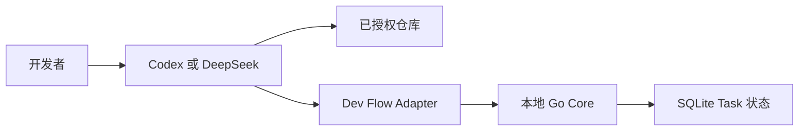

# Dev Flow 威胁模型

[中文](THREAT-MODEL.md) | [English](THREAT-MODEL_en.md)

## 最重要的边界

Dev Flow 保护的是**开发任务的过程状态**，不是包裹编程 Agent 的安全沙箱。

Codex 或 DeepSeek Harness 仍然使用开发者授予的权限读取仓库、修改文件和运行命令；Go Core 负责
保存权威 Task 状态，并校验流转、仓库绑定、持久化和 Recovery 决策。

## 需要保护什么

- 开发者声明的一个至八个 Git 仓库；
- Task 原始意图、当前阶段、revision、Action、证据、Blocker、Outcome，以及可恢复 Action 操作的
  规范化 payload 与 digest；
- Repository Scope、仓库身份与 aggregate binding；
- WorkspaceOrigin、工作树实例身份、固定 base commit、当前 Task surface；
- 本地 SQLite、安装 receipt、provisioning receipt、relocation record 与用户配置；
- npm package、bundled Core、Git Tag、GitHub Release 与 artifact digest；
- 日志和验证证据中可能出现的路径、代码片段和诊断信息。

## 谁负责什么

| 参与者 | 责任 |
| --- | --- |
| 开发者 | 选择是否进入 Dev Flow；确认 remote/base/target、仓库和 Host 权限、理解结论、handoff、清理与发布操作 |
| Codex / DeepSeek Harness | 真正读取文件、修改仓库和运行命令，是高权限执行面 |
| Host Adapter | 只读评估请求；在确认后执行 fetch、branch、worktree、relaunch/handoff；按 Action、Scope、预算和 Recovery 调用 Core |
| Go Core | 只读观察 Git，保存唯一流程状态，计算 Task surface，并校验 revision、workspace、闭合 payload、流转和持久化 |
| 仓库内容 | 视为不可信输入，可能包含 prompt injection、危险脚本、symlink 或恶意文件名 |
| npm / GitHub | 提供远程 package 和 Release 身份，发布流程必须回读核对 |

## 主要风险与现有防护

本机 WebUI 只监听 `tcp4 127.0.0.1` 并要求精确 Host；mutation 还验证精确 Origin、进程内随机 session
值与当前 Task revision。macOS receipt 是 mode `0600` 的普通非链接文件；Windows receipt 是位于用户
profile 下、继承该目录 ACL 的普通非链接文件。两者都绑定进程启动身份、data-root digest、URL 和实时
Core identity，避免错误复用或 PID 重用；Windows 从内核进程信息读取创建时间。统一管理器的
`factory-reset` 计划绑定当前 ownership target；可恢复清理移动精确目标，永久
清理还要求独立确认。身份或目标变化会停止清理。

| 风险 | 当前防护 |
| --- | --- |
| 小请求被流程接管，或确认前产生 Task/Git 写入 | 新请求先做只读评估并停止；assessment 绑定 request、root、HEAD 和 status；显式 selector 也不能跳过选择 |
| 远端基线、目标分支或源 checkout 内容进入错误工作树 | 逐仓确认 remote/base/target；精确 fetch 并冻结 commit；验证 branch、HEAD、common/git-dir 与 clean；不复制源 checkout dirty 内容 |
| provisioning 或 Host dispatch 结果不确定而被重复执行 | 窄 provisioning receipt 绑定一次 launch 与资源；不确定时读取 receipt/Host 状态，不盲目重试或 force cleanup |
| 路径穿越、symlink 或索引结果扩大仓库范围 | Task 创建时规范化并冻结 Scope；多仓库路径显式带 repository key；索引不能增加成员 |
| 旧 Action、重复请求或丢失响应造成重复状态变化 | 完整 mutation 先校验后暂存；独立 Action 操作记录、revision CAS、Action/request identity、repository binding、原子 applied marker 和 read-before-retry |
| 工作树被替换、历史回退或任一成员发生冲突 | worktree-specific Git dir、task branch、base、HEAD ancestry 与 content 分别核对；resume 和下一 Action 在实际工作前返回明确 Blocker 或 unavailable |
| Host 自报文件范围遗漏真实变化 | Core 从 base commit、commits、index、worktree 和 untracked 状态计算当前 surface；节点 payload 不接受 Host 文件变化声明 |
| relocation 失败或响应丢失造成双重 claim/handoff | Core prepare 保留源 claim；Host handoff 只执行一次；目标核验后在一个事务中替换 bindings 和 claims |
| 仓库中的 prompt injection 诱导扩大工作 | TaskIntent、allowed effects、显式 Scope 和验证预算独立于仓库文本；高风险 Git/发布仍需用户授权 |
| SQLite、配置或 executable 被本地进程篡改 | strict codec、Schema 检查、Task/Action-operation 关联检查、closed fields 与 package/executable identity 验证 |
| 安装或移除误删相邻配置和 Task 数据 | ownership receipt；remove 只清理自己管理的注册；普通卸载保留 Task 数据 |
| beta、源码和稳定支持被混为一谈 | 稳定声明只来自 Support Matrix；beta 与 source 在 Project Status 中单独标记 |
| 日志或旅程证据泄露隐私 | 提交的 evidence 只保留有界机器事实与 digest；raw transcript 默认不提交 |

## 剩余风险

- Core 不拦截 Host 的每一次文件读取、写入或 shell 命令；被攻陷的 Host 或错误授权仍可造成损害。
- worktree 隔离只定义源码修改归属，不隔离进程、网络、凭据、端口、数据库或容器。
- fetch、branch、worktree、handoff 与 cleanup 是 Host 高权限操作；receipt 只缩小可恢复范围，不消除错误授权风险。
- 具有同一用户权限或管理员权限的攻击者可以替换本地 binary、SQLite 或配置。
- 当前没有加密状态库、多用户隔离、远程认证、自动 secret scanning、代码签名或透明度日志。
- Dev Flow 不能保证模型输出正确、代码无漏洞、测试充分或完全免疫 prompt injection。
- 不受支持的平台、Host 版本和 source-only build 没有稳定安全支持声明。

安全问题请按仓库根目录的 [Security Policy](../SECURITY.md) 私密报告。
