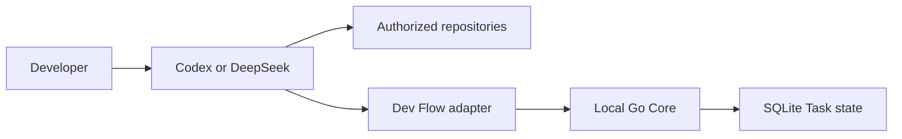

# Dev Flow Threat Model

[中文](THREAT-MODEL.md) | [English](THREAT-MODEL_en.md)

## The important boundary

Dev Flow protects **task process state**; it is not a sandbox around the coding agent.

Codex or DeepSeek Harness still reads repositories, changes files, and runs commands with the
permissions the developer gave it. The Go Core keeps the authoritative Task state and validates
transitions, bindings, persistence, and recovery decisions.

## Assets

- the one to eight Git repositories explicitly authorized by the developer;
- original Task intent, current stage, revision, Action, evidence, Blocker, Outcome, and the canonical
  payload and digest of a recoverable Action operation;
- Repository Scope, repository identities, and the aggregate binding;
- WorkspaceOrigin, worktree-instance identity, the fixed base commit, and current Task surface;
- local SQLite, installation and provisioning receipts, relocation records, and user configuration;
- npm packages, bundled Core executables, Git Tags, GitHub Releases, and artifact digests;
- paths, code fragments, and diagnostics that may appear in logs or evidence.

## Responsibilities

| Participant | Responsibility |
| --- | --- |
| Developer | Chooses whether to enter Dev Flow and confirms remote/base/target, repository and Host permissions, comprehension, handoff, cleanup, and releases |
| Codex / DeepSeek Harness | Actually reads files, changes repositories, and runs commands; this is the privileged execution surface |
| Host Adapter | Assesses requests read-only; after confirmation performs fetch, branch, worktree, relaunch/handoff; judges scope before commands, full suites, test-code changes, and review; calls Core under the Action, Scope, current verification plan, and Recovery contract |
| Go Core | Observes Git read-only, retains the one process state, derives Task surface, and validates revision, workspace, closed payloads, transitions, and persistence |
| Repository content | Treated as untrusted input that may contain prompt injection, dangerous scripts, symlinks, or hostile filenames |
| npm / GitHub | Supplies remote package and Release identities that the release flow must read back |

## Main risks and current defenses

The local WebUI binds only `tcp4 127.0.0.1` and requires the exact Host. Mutations also validate the exact Origin, a random
process-local session value, and current Task revision. On macOS the receipt is a mode-`0600` regular non-link file; on
Windows it is a regular non-link file under the user profile and inherits that directory's ACL. Both bind process-start
identity, data-root digest, URL, and live Core identity to prevent wrong reuse or PID reuse; Windows obtains creation time
from kernel process information. The unified manager's `factory-reset` plan binds the current ownership targets;
recoverable cleanup moves exact targets, while permanent cleanup requires separate confirmation.
Identity or target drift stops cleanup.

| Risk | Current defense |
| --- | --- |
| A small request is captured by the workflow or confirmation causes early Task/Git writes | Every new request stops after a read-only, request/root/HEAD/status-bound assessment; an exact selector cannot skip the developer choice |
| Wrong remote/base/target or source-checkout content enters a Task worktree | Per-repository confirmation, exact fetch and frozen commit, branch/HEAD/common-dir/git-dir/clean verification, and no copying of source dirtiness |
| An uncertain provisioning or Host dispatch result is executed twice | A narrow provisioning receipt binds one launch and owned resources; uncertainty reads receipt/Host state instead of blindly retrying or force-cleaning |
| Path traversal, symlinks, or index results expand Repository Scope | Scope is canonicalized and frozen at Task creation; multi-repository paths carry an explicit key; indexes cannot add members |
| A stale Action, duplicate request, or lost response repeats a state change | complete mutation validation before staging; an independent Action operation record, revision CAS, Action/request identity, repository binding, an atomic applied marker, and read-before-retry |
| A worktree is replaced, history rewinds, or a Scope member conflicts | Worktree-specific Git dir, task branch, base, HEAD ancestry, and content are checked separately; resume and next Action surface a blocker or unavailable result before work |
| Host-reported paths omit actual changes | Core derives current surface from the base commit, commits, index, worktree, and untracked state; node payloads accept no Host file-change report |
| Relocation failure or a lost response creates duplicate claims or handoffs | Core prepare retains source claims, Host handoff runs once, and verified destination bindings/claims replace them in one transaction |
| Repository prompt injection tries to expand work | TaskIntent, allowed effects, explicit Scope, the TASKS verification plan, and reasoned budget adjustments are independent of repository prose; Host review stays within the diff and causal impact; high-risk Git and release actions still require user authorization |
| Available budget is mistaken for a full-suite reason | Skills require a fresh broad-impact, focused-check, uncovered-risk, and repository-checkpoint decision every time; Evidence retains the current `full_suite_reason` |
| SQLite, configuration, or the executable is modified locally | strict codecs, Schema checks, Task/Action-operation relationship checks, closed fields, and package/executable identity verification detect several inconsistencies |
| Setup or removal deletes adjacent configuration or Task data | ownership receipts; remove cleans only managed registration; ordinary uninstall retains Task data |
| beta, source, and stable support are confused | only the Support Matrix defines stable support; beta and source are labeled separately in Project Status |
| Logs or journey evidence leak sensitive data | committed evidence keeps bounded machine facts and digests; raw transcripts are not committed by default |

## Residual risk

- Core does not intercept every Host file read, write, or shell command; a compromised Host or incorrect
  authorization can still cause harm.
- Worktree isolation defines source-change ownership; it does not isolate processes, networks,
  credentials, ports, databases, or containers.
- Fetch, branch, worktree, handoff, and cleanup remain privileged Host operations. Receipts bound the
  recoverable scope but cannot remove the risk of incorrect authorization.
- An attacker with the same local-user or administrator privileges can replace binaries, SQLite, or
  configuration.
- There is currently no encrypted state store, multi-user isolation, remote authentication, automatic
  secret scanning, code signing, or transparency log.
- Dev Flow cannot guarantee correct model output, vulnerability-free code, sufficient tests, or immunity
  to prompt injection.
- Core cannot prove that natural-language reasons are causally related to the change; Host semantic
  judgment about verification and review scope can still be wrong.
- Unsupported platforms, Host versions, and source-only builds do not have a stable security support claim.

Report security issues privately by following the repository [Security Policy](../SECURITY.md).
