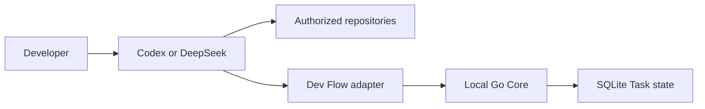

# Dev Flow Threat Model

[中文](THREAT-MODEL.md) | [English](THREAT-MODEL_en.md)

## The important boundary

Dev Flow protects **task process state**; it is not a sandbox around the coding agent.

Codex or DeepSeek Harness still reads repositories, changes files, and runs commands with the
permissions the developer gave it. The Go Core keeps the authoritative Task state and validates
transitions, bindings, persistence, and recovery decisions.

## Assets

- the one to eight Git repositories explicitly authorized by the developer;
- original Task intent, current stage, revision, Action, evidence, Blocker, and Outcome;
- Repository Scope, repository identities, and the aggregate binding;
- local SQLite, installation receipts, and user configuration;
- npm packages, bundled Core executables, Git Tags, GitHub Releases, and artifact digests;
- paths, code fragments, and diagnostics that may appear in logs or evidence.

## Responsibilities

| Participant | Responsibility |
| --- | --- |
| Developer | Authorizes repositories and Host permissions; confirms task boundaries, comprehension, and releases |
| Codex / DeepSeek Harness | Actually reads files, changes repositories, and runs commands; this is the privileged execution surface |
| Host Adapter | Calls Core according to the current Action, Scope, verification budget, and Recovery contract |
| Go Core | Retains the single process state and validates revision, binding, closed payloads, transitions, and persistence |
| Repository content | Treated as untrusted input that may contain prompt injection, dangerous scripts, symlinks, or hostile filenames |
| npm / GitHub | Supplies remote package and Release identities that the release flow must read back |

## Main risks and current defenses

| Risk | Current defense |
| --- | --- |
| Path traversal, symlinks, or index results expand Repository Scope | Scope is canonicalized and frozen at Task creation; multi-repository paths carry an explicit key; indexes cannot add members |
| A stale Action, duplicate request, or lost response repeats a state change | revision CAS, Action/request identity, repository binding, idempotent reads, and read-before-retry |
| A repository is replaced or any Scope member drifts incompatibly | Every member is observed again before apply; conflicts produce zero Core writes or an explicit Recovery/Blocker result |
| Repository prompt injection tries to expand work | TaskIntent, allowed effects, explicit Scope, and verification budget are independent of repository prose; high-risk Git and release actions still require user authorization |
| SQLite, configuration, or the executable is modified locally | strict codecs, Schema checks, closed fields, and package/executable identity verification detect several inconsistencies |
| Setup or removal deletes adjacent configuration or Task data | ownership receipts; remove cleans only managed registration; ordinary uninstall retains Task data |
| beta, source, and stable support are confused | only the Support Matrix defines stable support; beta and source are labeled separately in Project Status |
| Logs or journey evidence leak sensitive data | committed evidence keeps bounded machine facts and digests; raw transcripts are not committed by default |

## Residual risk

- Core does not intercept every Host file read, write, or shell command; a compromised Host or incorrect
  authorization can still cause harm.
- An attacker with the same local-user or administrator privileges can replace binaries, SQLite, or
  configuration.
- There is currently no encrypted state store, multi-user isolation, remote authentication, automatic
  secret scanning, code signing, or transparency log.
- Dev Flow cannot guarantee correct model output, vulnerability-free code, sufficient tests, or immunity
  to prompt injection.
- Unsupported platforms, Host versions, and source-only builds do not have a stable security support claim.

Report security issues privately by following the repository [Security Policy](../SECURITY.md).
