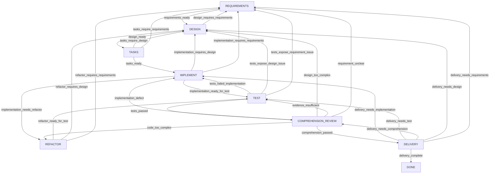

# Feature Specification: Refactor to a Development Process Graph

**Feature Branch**: `008-refactor-to-development-process-graph`

**Created**: 2026-08-18

**Status**: Implementing

**Change Type**: Product Feature

**Contract Impact**: Public Core, MCP, Persistence, Recovery, Host Adapter

**Release Impact**: None — a separate Release Change is required

**Dependencies**: Completed Features 002, 003, 005, 006, and 007 on product `0.3.0`

**Input**: Replace the existing mostly linear development workflow with a visible state graph that
guides a developer through requirements, design, implementation, testing, comprehension, refactoring,
and delivery, while mapping each node to Spec Kit or OpenSpec operations.

**Contract Freeze Review**: Completed 2026-08-19 with no acceptance-impacting clarification, a
60/60 requirements-quality checklist, and no CRITICAL, HIGH, or acceptance-impacting MEDIUM analyze
finding. Release authority remains excluded.

**Phase 5D Audit Amendment**: The 2026-08-19 Phase 2–5 audit reopened User Story 2 hardening for
closed problem classifications, exact current-evidence and aggregate invariants, store-open claim
preflight, public MCP closure, and explicit pre-Phase-7 Recovery fail-closed behavior. The audit
introduced no new process node, transition, method profile, storage generation, or release scope.

## Problem Statement

The existing Core Contract 0.1 persists a task, returns one next action, and safely recovers uncertain
mutations. It does not present development as a developer-facing process graph:

- a developer sees the current phase but not the complete set of legal next phases and their
  selection conditions;
- task creation requires a nearly final goal, scope, exclusions, acceptance criteria, and
  verification budget before the requirements-grooming step can begin;
- design and implementation can be reworked, but “the design or code is too complex for the
  developer to understand” is not a first-class decision;
- refactoring is not an explicit node with a mandatory return through testing;
- Spec Kit and OpenSpec operations are not selected from the current Core node, so developers and
  AI hosts can forget which method step should run next;
- adapters carry long procedural instructions and can become an accidental second workflow
  authority.

The product must become a development-process management tool rather than a linear action sequencer.
For every active task, the Core must answer:

```text
Where am I?
What is this node for?
What must be true before I leave?
What evidence must I produce?
Which transitions are legal?
Why would I select each transition?
What should I do in plain, Spec Kit, or OpenSpec mode?
```

The refactor must reuse the existing persistence, repository binding, mutation identity, recovery,
and six-tool architecture where those mechanisms remain valid.

## User Scenarios & Testing

### User Story 1 - Navigate the current development node (Priority: P1)

As a developer, I can open or resume a task and see one authoritative current node together with its
purpose, completion conditions, allowed effects, required evidence, method steps, and complete legal
next-node list, so I never have to reconstruct the process from chat history.

**Why this priority**: Visible process navigation is the minimum product capability. Without it,
adding more states or method integrations only creates more hidden rules.

**Independent Test**: Open a new task from an initial request, read its next action, and verify that
the task starts in `REQUIREMENTS` and returns the full node contract plus exactly the legal
`requirements_ready → DESIGN` transition. Complete that action and verify that `DESIGN` returns its
own complete legal edge set.

**Acceptance Scenarios**:

1. **Given** a new standard task, **When** the developer reads the current action, **Then** the result
   identifies `standard-development@1`, the current node, every node obligation, and every legal
   outgoing transition.
2. **Given** a current node with three legal destinations, **When** the developer reads the action,
   **Then** all three transition IDs, destinations, guards, and reason rules are returned in one
   result.
3. **Given** a caller submits a destination or transition not returned for the current action,
   **When** Core validates the mutation, **Then** it rejects the request with zero task, event,
   evidence, or claim writes.
4. **Given** the same active action is read repeatedly, **When** no mutation commits, **Then** its
   task, revision, action, node contract, transition set, and process-definition digest remain
   stable.

---

### User Story 2 - Loop through testing, comprehension, and refactoring (Priority: P2)

As a developer, I can follow normal development forward and deliberately move backward when testing
or comprehension exposes a problem, so the process reflects real iterative development instead of
pretending every step succeeds linearly.

**Why this priority**: The primary product value is controlled iteration. Test failure, unclear
requirements, excessive design complexity, and incomprehensible code must lead to different,
explicitly justified destinations.

**Independent Test**: Drive one standard task through requirements, design, tasks, implementation,
and testing; fail testing back to implementation; pass testing; report that the code is too complex;
refactor; prove that delivery is forbidden until testing and comprehension pass again; then reach
`DONE`.

**Acceptance Scenarios**:

1. **Given** `TEST` exposes an implementation defect, **When** the caller selects
   `tests_failed_implementation` with `problem_class=implementation_failure`, **Then** Core returns
   to `IMPLEMENT` and retains the reason.
2. **Given** `TEST` exposes a design flaw or requirement gap, **When** the corresponding transition
   and exact problem class are selected, **Then** Core returns to `DESIGN` or `REQUIREMENTS` and
   invalidates downstream authorities; changing only `transition_id` cannot select another
   destination from the same facts.
3. **Given** tests pass, **When** the test result commits, **Then** the only forward destination is
   `COMPREHENSION_REVIEW`, not `DELIVERY` or `DONE`.
4. **Given** the developer cannot explain the design or code, **When** comprehension review reports
   the exact concern, **Then** Core permits a justified return to `DESIGN`, `IMPLEMENT`, or
   `REFACTOR`.
5. **Given** repository files change in `REFACTOR`, **When** refactoring completes, **Then** Core
   enters `TEST`, invalidates stale test/comprehension evidence, and refuses direct delivery.
6. **Given** current test and developer-comprehension evidence both match the latest repository and
   baselines, **When** delivery completes every current acceptance criterion, **Then** Core enters
   `DONE` only when the submitted automated and manual evidence lists exactly equal the current
   Core-derived evidence sets.
7. **Given** a task has `allow_manual_handoff=false`, **When** automated testing passes and the
   developer explicitly confirms comprehension, **Then** the task can still reach `DONE`; the same
   budget continues to reject `source=user` evidence submitted at `TEST`.

---

### User Story 3 - Use a method profile without creating another workflow (Priority: P3)

As a developer, I can select `plain`, `spec-kit`, or `openspec` when creating a task and receive
node-specific operations for that method, while the Core remains the only owner of the current node
and legal transitions.

**Why this priority**: Method tools are useful only when they reduce memory burden without creating
a second, drifting state machine.

**Independent Test**: Create three otherwise equivalent tasks in isolated repositories, one per
profile. Verify that all three receive the same process/node/transition semantics, while their
rendered operations differ. Complete a node with equivalent semantic evidence and verify identical
Core transitions.

**Acceptance Scenarios**:

1. **Given** a `spec-kit` task in `REQUIREMENTS`, **When** the current action is rendered by the
   Codex adapter, **Then** it identifies the requirement-definition and clarification capabilities
   without changing the Core transition set.
2. **Given** an `openspec` task, **When** a node has an installed OpenSpec capability, **Then** the
   adapter renders the matching operation and expected artifacts.
3. **Given** a selected method capability is unavailable, **When** the action is rendered, **Then**
   the adapter reports the missing capability and offers the Core-declared plain-equivalent work;
   it does not mark the node complete or invent evidence.
4. **Given** a Spec Kit or OpenSpec artifact says work is complete, **When** no matching Core action
   commits, **Then** the authoritative task remains on its current node.
5. **Given** equivalent semantic node results from different profiles, **When** Core validates them,
   **Then** profile-specific command spelling has no effect on the transition decision.

---

### User Story 4 - Start the graph Core on a clean storage generation (Priority: P4)

As a developer using a rapidly evolving pre-1.0 product, I can start the graph-based Core from a fresh
Schema 2 data directory, receive a clear zero-write rejection for any pre-graph database, and then
explicitly choose whether to archive, rename, delete, or abandon the old data before creating new
graph tasks.

**Why this priority**: Preserving the released linear task model would force a legacy process, dual
snapshot codecs, dual projections, migration branches, and permanent tests into the new product.
During rapid iteration, a clear breaking boundary is preferable, provided the product never deletes
old data silently.

**Independent Test**: Start with an empty data directory and prove direct Schema 2 bootstrap plus
restart of a standard task. Separately copy a representative Schema 1 database, attempt to open it,
and prove `SCHEMA_UNSUPPORTED` with an unchanged file/logical manifest. Select a new data directory
and prove that only `standard-development@1` can be created. Exercise uncertain mutation recovery on
that current-generation task.

**Acceptance Scenarios**:

1. **Given** an empty usable data directory, **When** the graph Core opens it, **Then** it creates the
   final Schema 2 baseline directly and creates no Schema 1 or migration-compatibility state.
2. **Given** a Schema 1/pre-graph database, **When** the graph Core opens it, **Then** it returns
   `SCHEMA_UNSUPPORTED`, performs zero file/row/task/event/claim writes, and does not decode an old task.
3. **Given** unsupported historical data, **When** setup, update, Core open, remove, or uninstall runs,
   **Then** no operation automatically deletes, truncates, converts, or replaces that data.
4. **Given** the user explicitly selects a fresh directory or manually archives/renames/deletes the
   old data, **When** Core opens again, **Then** it creates only a
   `standard-development@1`/snapshot-version-2 task at `REQUIREMENTS`.
5. **Given** a future/corrupt schema, snapshot, or process definition, **When** Core reads it, **Then**
   it fails closed without deleting or rewriting database state.
6. **Given** an uncertain current-generation graph mutation, **When** the caller follows
   read-before-retry, **Then** the five recovery classifications and duplicate-prevention guarantees
   remain in force.
7. **Given** an exact current-generation graph operation probe, **When** a caller performs a recovery
   read or explicit recovery apply, **Then** Core derives one of the five classifications; the read
   remains zero-write and only explicit recovery apply may adopt exact unrecorded work or create a
   recovery blocker.

### Edge Cases

- A new task contains only an initial request and no known scope or acceptance criteria.
- The requirements node cannot complete because a material question still needs the developer's
  answer.
- Requirements are revised after implementation has begun.
- Design changes after tasks have been decomposed.
- Test passes, but the developer explicitly says the implementation is too complex to understand.
- AI reports comprehension success without an explicit user confirmation.
- A refactor changes files but claims testing can be skipped.
- A backward transition omits its required reason.
- A caller reuses one finding while changing only `transition_id` or supplies a `problem_class` that
  does not match that transition.
- A caller supplies both `transition_id` and a destination node.
- A method profile is selected but its command integration is not installed.
- A task is interrupted after repository mutation but before the apply result is received.
- A Schema 1/pre-graph database exists in the selected data directory.
- The user has not yet authorized archiving, renaming, deleting, or replacing the old data directory.
- A Schema 2 task is malformed, uses a future snapshot version, or references an unsupported process.
- Two Core handles attempt the same graph transition concurrently.
- A delivery payload references test or comprehension evidence produced before the latest code
  change.
- A delivery payload omits current automated, user-test, or comprehension-confirmation evidence, or
  includes static/host-observed/old evidence in an automated/manual list.
- A valid non-null Recovery input arrives before Phase 7.
- A decoded task carries authority that is impossible for its current node, or an active/terminal
  task has a missing, duplicate, orphaned, or mismatched repository claim.
- Cancellation is attempted for `DONE`/`CANCELLED`, or the cancellation reason is empty, untrimmed,
  invalid UTF-8, or oversized.

## State-Graph Impact

### Process Definition

- **Process ID**: `standard-development`
- **Process Version**: `1`
- **Definition Identity**: `standard-development@1`
- **Historical Task Runtime**: None
- **Existing Data Disposition**: `reject-and-reset` (zero-write reject; user-controlled fresh directory/reset)
- **Definition Digest**: SHA-256 of the canonical closed process definition specified in
  `contracts/process-graph.md`
- **New-Task Entry Node**: `REQUIREMENTS`
- **Terminal Node**: `DONE`
- **Exceptional Nodes**: `BLOCKED`, `CANCELLED`

The process is built into Core. There is no user-supplied process file or graph DSL.

### Target Graph



`BLOCKED` is entered only by Core recovery/safety logic and returns only to its stored resume node
after its machine condition is proven. `CANCELLED` is entered only through
`dev_flow_cancel_task`. Neither is caller-selected through a normal process transition.

### Node Contract Summary

| Node | Purpose | Completion Conditions | Primary Allowed Effects | Required Evidence |
| --- | --- | --- | --- | --- |
| `REQUIREMENTS` | Turn initial intent into the current requirements authority | Goal, scope, exclusions, acceptance, constraints, and material questions are resolved | Read repository, edit process artifacts, request user decisions | Requirements baseline and artifact summary |
| `DESIGN` | Select the simplest viable design for the current requirements | Approach, components, decisions, risks, alternatives, and complexity justification are complete | Read repository, edit process artifacts, request user decisions | Design baseline tied to requirements revision |
| `TASKS` | Decompose the approved design into bounded executable work | Work items, dependencies, paths, acceptance mapping, and verification steps are complete | Read repository, edit process artifacts | Task-plan baseline tied to design revision |
| `IMPLEMENT` | Execute the current task-plan slice and record deviations | Changed surface and deviations are exact; next problem class is identified | Read repository, edit product/process files | Implementation summary and repository observation |
| `TEST` | Verify current behavior within budget | Checks, outcomes, failures, unverified items, and manual items are exact | Read repository, run verification, edit process artifacts | Test evidence bound to current repository/baselines |
| `COMPREHENSION_REVIEW` | Prove the developer can understand and maintain the result | Explanation is complete; user confirms understanding or selects an exact remediation path | Read repository, edit process artifacts, request user decision | Comprehension assessment and explicit user evidence for pass |
| `REFACTOR` | Simplify design/code without silently changing requirements | Simplifications and changed surface are exact; behavior-changing needs are routed backward | Read repository, edit product/process files | Refactor summary and repository observation |
| `DELIVERY` | Reconcile current requirements, tests, comprehension, risks, and handoff | Every latest acceptance criterion is satisfied and current evidence is referenced | Read repository, edit process artifacts, prepare delivery | Delivery mapping and current evidence references |
| `DONE` | Retain the completed outcome | N/A | None | Terminal outcome |
| `BLOCKED` | Preserve a safety/recovery blocker | Stored machine condition is proven | Read repository, resolve blocker | Blocker-resolution evidence |
| `CANCELLED` | Retain explicit cancellation | N/A | None | Cancellation reason/outcome |

### Complete Transition Summary

| Source | Transition ID | Destination | Guard / When to Choose | Reason Required |
| --- | --- | --- | --- | --- |
| `REQUIREMENTS` | `requirements_ready` | `DESIGN` | A new current requirements baseline is complete and has no material unresolved question | No |
| `DESIGN` | `design_ready` | `TASKS` | A design baseline tied to the current requirements revision is complete | No |
| `DESIGN` | `design_requires_requirements` | `REQUIREMENTS` | A material requirement, scope, or acceptance gap prevents a valid design | Yes |
| `TASKS` | `tasks_ready` | `IMPLEMENT` | A task-plan baseline tied to the current design revision is complete | No |
| `TASKS` | `tasks_require_design` | `DESIGN` | The design cannot be decomposed without correction or simplification | Yes |
| `TASKS` | `tasks_require_requirements` | `REQUIREMENTS` | Task decomposition exposes a material requirement gap | Yes |
| `IMPLEMENT` | `implementation_ready_for_test` | `TEST` | The current work slice is implemented and its changed surface is reported | No |
| `IMPLEMENT` | `implementation_requires_design` | `DESIGN` | Implementation proves the current design invalid or excessively complex | Yes |
| `IMPLEMENT` | `implementation_requires_requirements` | `REQUIREMENTS` | Implementation exposes a material requirement gap | Yes |
| `IMPLEMENT` | `implementation_needs_refactor` | `REFACTOR` | Current behavior exists but the implementation must be simplified before acceptance | Yes |
| `TEST` | `tests_passed` | `COMPREHENSION_REVIEW` | Required checks pass and all failed items are empty | No |
| `TEST` | `tests_failed_implementation` | `IMPLEMENT` | Failure is attributable to implementation | Yes |
| `TEST` | `tests_expose_design_issue` | `DESIGN` | Failure demonstrates a design defect or unjustified complexity | Yes |
| `TEST` | `tests_expose_requirement_issue` | `REQUIREMENTS` | Testability or observed behavior exposes a requirement gap | Yes |
| `COMPREHENSION_REVIEW` | `comprehension_passed` | `DELIVERY` | Explicit user confirmation and a current comprehension assessment show no unresolved complexity | No |
| `COMPREHENSION_REVIEW` | `implementation_defect` | `IMPLEMENT` | A concrete implementation defect, other than simplification alone, must be corrected | Yes |
| `COMPREHENSION_REVIEW` | `code_too_complex` | `REFACTOR` | The code works but contains unnecessary abstraction or is not maintainable | Yes |
| `COMPREHENSION_REVIEW` | `design_too_complex` | `DESIGN` | The design itself is unnecessarily complex or cannot be explained | Yes |
| `COMPREHENSION_REVIEW` | `evidence_insufficient` | `TEST` | More current verification is required before comprehension can be accepted | Yes |
| `COMPREHENSION_REVIEW` | `requirement_unclear` | `REQUIREMENTS` | The developer cannot understand behavior because requirements remain ambiguous | Yes |
| `REFACTOR` | `refactor_ready_for_test` | `TEST` | Refactor work is complete; all changed paths and intended behavior preservation are reported | No |
| `REFACTOR` | `refactor_requires_design` | `DESIGN` | Safe simplification requires a design revision | Yes |
| `REFACTOR` | `refactor_requires_requirements` | `REQUIREMENTS` | Safe simplification requires a requirement revision | Yes |
| `DELIVERY` | `delivery_complete` | `DONE` | Latest acceptance, test, comprehension, repository, and evidence authorities all agree | No |
| `DELIVERY` | `delivery_needs_implementation` | `IMPLEMENT` | A concrete implementation gap remains | Yes |
| `DELIVERY` | `delivery_needs_test` | `TEST` | Current test evidence is missing, stale, failed, or insufficient | Yes |
| `DELIVERY` | `delivery_needs_comprehension` | `COMPREHENSION_REVIEW` | Current developer-comprehension evidence is missing or stale | Yes |
| `DELIVERY` | `delivery_needs_design` | `DESIGN` | Final reconciliation exposes a design gap | Yes |
| `DELIVERY` | `delivery_needs_requirements` | `REQUIREMENTS` | Final reconciliation exposes a requirement/acceptance gap | Yes |

### Method-Profile Summary

| Node | Semantic Steps | `plain` | `spec-kit` | `openspec` |
| --- | --- | --- | --- | --- |
| `REQUIREMENTS` | capture, clarify, validate requirements | Guided questions and bounded requirements summary | `specify`, `clarify`, requirements checklist capabilities | `explore`/`propose` capabilities and change-spec review |
| `DESIGN` | choose approach, reject complexity | Write/review a bounded design | `plan` and design-artifact review | proposal design review/update |
| `TASKS` | decompose and analyze consistency | Write bounded work items | `tasks`, `analyze` capabilities | proposal task review/update |
| `IMPLEMENT` | execute one current slice | Follow current task plan | `implement` capability for the selected slice | `apply` capability for the selected change |
| `TEST` | run budgeted checks and record evidence | Run plan-defined checks | Plan-defined checks; no invented command | `verify` when installed, otherwise plan-defined checks |
| `COMPREHENSION_REVIEW` | explain, identify excess complexity, obtain confirmation | Developer review and explicit confirmation | Review spec/plan/tasks/code; no command owns the verdict | Review proposal/design/tasks/code; no command owns the verdict |
| `REFACTOR` | simplify and reconcile artifacts | Perform bounded refactor | Amend artifacts when needed, then implement bounded refactor | Update change artifacts when needed, then apply bounded refactor |
| `DELIVERY` | reconcile acceptance and close method artifacts | Prepare final handoff | Final consistency analysis/checklist as available | validate/sync/archive capabilities as available |

The exact capability and fallback contract is in `contracts/method-profiles.md`.

## Phase 5D Historical Implementation Boundary

Phase 5D hardened the already implemented Phase 2–5 runtime. Its temporary Recovery behavior was:

- omitted or explicit-null `operation_probe` and `recovery_apply` preserved ordinary read/apply
  behavior;
- every syntactically valid non-null Recovery request failed closed as `RECOVERY_UNAVAILABLE` with
  `retry_safe=false` and `action=none` before repository observation or mutation;
- malformed, incomplete, duplicate-member, or unknown-member Recovery input remained
  `INVALID_ARGUMENT`;
- the five-class Recovery model remained the Feature target and was not claimed complete by this
  temporary safety boundary.

Phase 7A supersedes this runtime boundary for supported `standard-development@1` tasks. The historical
T096 checkpoint remains complete evidence of the earlier fail-closed state.

## Requirements

### Functional Requirements

- **FR-001**: Core MUST provide the built-in process definition `standard-development@1`.
- **FR-002**: New tasks MUST start at `REQUIREMENTS` and MUST NOT accept a caller-selected process,
  process version, entry node, or alternate process route.
- **FR-003**: The normal node vocabulary MUST contain exactly `REQUIREMENTS`, `DESIGN`, `TASKS`,
  `IMPLEMENT`, `TEST`, `COMPREHENSION_REVIEW`, `REFACTOR`, `DELIVERY`, and `DONE`.
- **FR-004**: Exceptional node behavior MUST retain `BLOCKED` and `CANCELLED` without making either a
  caller-selected normal transition.
- **FR-005**: Every active action MUST return `process_id`, `process_version`,
  `process_definition_digest`, and `current_node` as closed top-level fields.
- **FR-006**: Every active action MUST return `node_purpose`, `entry_conditions`,
  `completion_conditions`, `allowed_effects`, `required_evidence`, and `method_steps` as closed
  top-level fields.
- **FR-007**: Every active action MUST return the complete legal outgoing transition set for its
  current node in the closed top-level field `available_transitions`.
- **FR-008**: Every returned transition MUST contain a stable transition ID, destination node,
  selection guard, and `reason_required` flag.
- **FR-009**: A normal apply MUST accept one returned `transition_id`; callers MUST NOT supply a
  destination, next node, process state, or transition guard result.
- **FR-010**: Core MUST derive the destination from its built-in definition and reject an absent,
  stale, unknown, or source-incompatible transition with zero writes.
- **FR-011**: Every backward, rework, or remediation transition marked by the process contract MUST
  require a normalized bounded reason and an exact source-node `problem_class` bound to that
  transition.
- **FR-012**: The exact legal transition table MUST match the complete transition summary and
  `contracts/process-graph.md`; every forward transition MUST use `problem_class=none`, every
  remediation transition MUST use its one mapped non-`none` class, and the typed facts MUST match
  that class.
- **FR-013**: `TEST` success MUST enter `COMPREHENSION_REVIEW`; no test result may skip directly to
  `DELIVERY` or `DONE`.
- **FR-014**: `COMPREHENSION_REVIEW` success MUST require explicit user-confirmation evidence tied to
  the current repository and current requirements/design authorities. This confirmation is not a
  TEST manual-handoff item and MUST NOT be disabled by `allow_manual_handoff=false`.
- **FR-015**: AI-generated explanation or static inspection alone MUST NOT satisfy
  `comprehension_passed`.
- **FR-016**: Any repository-changing `IMPLEMENT` or `REFACTOR` mutation MUST invalidate previously
  current test, comprehension, and delivery readiness.
- **FR-017**: `REFACTOR` MUST have no direct transition to `COMPREHENSION_REVIEW`, `DELIVERY`, or
  `DONE`; completed refactor work MUST return through `TEST`.
- **FR-018**: `DELIVERY` MUST construct terminal acceptance from the latest requirements baseline and
  reject stale test, comprehension, baseline, repository, or evidence references. Caller-submitted
  automated/manual evidence IDs MUST exactly equal the current Core-derived source-partitioned sets;
  current unverified or manual-handoff items prevent completion.
- **FR-019**: Task creation MUST persist an immutable `TaskIntent` containing the initial request,
  known initial bounds, verification authority, and selected method profile.
- **FR-020**: Task creation MUST NOT require complete final acceptance criteria before entering
  `REQUIREMENTS`.
- **FR-021**: `requirements_ready` MUST create the first or next versioned requirements baseline with
  a non-empty goal and acceptance-criteria list and no material unresolved question.
- **FR-022**: Returning to `REQUIREMENTS` and completing it again MUST create a new requirements
  revision, retain a bounded prior-baseline reference, and invalidate dependent current authorities.
- **FR-023**: `design_ready` MUST create a versioned design baseline tied to the exact current
  requirements revision.
- **FR-024**: `tasks_ready` MUST create a versioned task-plan baseline tied to the exact current
  design revision.
- **FR-025**: Test and comprehension records MUST identify the repository-binding digest and baseline
  revisions they prove.
- **FR-026**: Core MUST retain bounded baseline history references without requiring runtime event
  replay to read the current task.
- **FR-027**: New tasks MUST select exactly one method profile from `plain`, `spec-kit`, or
  `openspec`; the selection is immutable for the task.
- **FR-028**: Core MUST expose tool-neutral semantic method-step IDs and MUST NOT execute, import, or
  parse Spec Kit/OpenSpec as a production dependency.
- **FR-029**: Host adapters MAY render installed method capabilities and expected artifacts, but MUST
  NOT alter node, transition, completion, recovery, or terminal semantics.
- **FR-030**: Missing method tooling MUST leave the task on the same node; a plain-equivalent fallback
  MAY be used only when reported honestly in method evidence.
- **FR-031**: Repository Spec Kit/OpenSpec files MAY be referenced as bounded artifacts/evidence, but
  their checkbox, archive, or command state MUST NOT mutate Core without a valid apply.
- **FR-032**: Core Contract 0.2 MUST preserve exactly six public MCP tools with their existing names.
- **FR-033**: `dev_flow_server_info` MUST report Core Contract schema `2`, supported process
  definitions through an explicit public DTO using `definition_digest`, method profiles, and the
  unchanged six-tool catalog in the contract-defined order and with no additional field.
- **FR-034**: `open_task`, `get_task`, and `get_next_action` results MUST expose process, node,
  baseline, node-contract, transition, method-profile, and terminal projections defined by
  `contracts/mcp-tools-0.2.md`.
- **FR-035**: `apply_action` MUST use closed node-specific payloads with a common
  `transition_id`, `summary`, `reason`, artifact references, and method evidence.
- **FR-036**: Unknown/duplicate members, a caller destination, wrong node payload, stale identity,
  stale transition, or incompatible baseline reference MUST fail closed.
- **FR-037**: Core MUST add stable `TRANSITION_NOT_ALLOWED` and `PROCESS_UNSUPPORTED` errors while
  retaining existing stable recovery, repository, storage, conflict, and terminal errors;
  `RECOVERY_UNAVAILABLE` remains reserved after its Phase 5D historical use.
- **FR-038**: Core MUST remain read-only with respect to Git history and MUST expose no generic shell.
- **FR-039**: Codex guidance MUST consume the Core-returned node and transition contract rather than
  embedding a second transition table.
- **FR-040**: Shared Codex and DeepSeek contract fixtures MUST project identical Core Contract 0.2
  semantics; this parity MUST NOT claim a DeepSeek product or real-host journey.
- **FR-041**: Feature implementation MUST retain revision CAS, repository claims, action identity,
  operation identity, bounded evidence, and transactionally consistent snapshot/event/claim writes.
- **FR-042**: Feature implementation MUST NOT change product/package version or perform any public
  release mutation.
- **FR-043**: Process definition identity MUST hash only the stable semantic identifiers and
  declaration ordering frozen in `contracts/process-graph.md`; human purpose, descriptions,
  selection text, guidance, and localized wording MUST NOT affect the digest or invalidate an
  otherwise machine-equivalent persisted action.
- **FR-044**: `ProcessTask` validation MUST enforce the closed current-node authority matrix and all
  cross-record references in `data-model.md`; corrupt snapshots MUST safe-stop during decode,
  store-open preflight, and load rather than waiting for mutation.
- **FR-045**: Store-open preflight MUST validate task/claim cardinality and exact repository, task,
  and host identity for every active task, forbid claims for terminal tasks and orphan claims, and
  return `STORAGE_UNAVAILABLE` with zero writes for every mismatch.
- **FR-046**: Cancellation MUST validate service/context/request identity and a normalized bounded
  UTF-8 reason at the Application boundary; cancelling `DONE` or `CANCELLED` MUST return
  `TASK_TERMINAL` with zero writes.
- **FR-047**: `open_task.new_task`, read `operation_probe`, and apply `recovery_apply` MUST be
  optional and accept explicit null; omitted/null values retain ordinary behavior while non-null
  Recovery values follow the graph-native five-class reconciliation contract.
- **FR-048**: Test manual-handoff budget enforcement MUST apply only to `TEST` manual handoff items
  and `source=user` TEST evidence; comprehension user confirmation uses its independent mandatory
  evidence validation while retaining common evidence limits and identity rules.

### Storage Generation and Reset Requirements

- **FR-S001**: Feature 008 MUST establish SQLite Schema 2 as a fresh bootstrap baseline; it MUST NOT
  apply Schema 1 first or implement Schema 1 → Schema 2 task migration.
- **FR-S002**: The only supported persisted task shape MUST be snapshot version 2 governed by the exact
  `standard-development@1` definition digest.
- **FR-S003**: Production code MUST NOT retain `legacy-linear@1`, a snapshot-version-1 codec, a dual
  task projection, or an old-task mutation/continuation branch.
- **FR-S004**: Opening a Schema 1 or otherwise pre-graph database MUST return `SCHEMA_UNSUPPORTED`
  before task decoding and MUST perform zero file, schema, row, task, event, evidence, or claim writes.
- **FR-S005**: Core, setup, update, remove, and uninstall MUST NOT automatically delete, truncate,
  convert, rename, or replace unsupported task data.
- **FR-S006**: User recovery from the incompatible boundary MUST be explicit: select a fresh data
  directory or manually archive/rename/delete the old data outside Core, after which Core may create
  a fresh Schema 2 database.
- **FR-S007**: Future schema/snapshot/process versions, digest mismatch, malformed rows, and partial
  Schema 2 MUST fail closed while preserving original files and rows.
- **FR-S008**: Current-generation terminal tasks and repository claims MUST retain their normal
  read/release semantics; package remove/uninstall MUST retain supported Schema 2 task data.
- **FR-S009**: Uncertain mutations for current-generation tasks MUST retain the five classifications:
  `not_started`, `completed_and_recorded`, `completed_but_unrecorded`, `partially_completed`, and
  `conflicting`.
- **FR-S010**: A graph mutation whose result is missing, cancelled, malformed, truncated, or
  transport-failed MUST require the complete operation probe and read-before-retry route.
- **FR-S011**: Phase 5D's completed historical checkpoint required valid non-null Recovery inputs to
  return `RECOVERY_UNAVAILABLE` before observation or writes. Phase 7A supersedes that temporary
  runtime behavior; malformed Recovery inputs remain `INVALID_ARGUMENT`.

### Non-Goals

- The feature MUST NOT implement a user-configurable graph, workflow file, graph parser, graph editor,
  parallel branch, subtask hierarchy, or process plugin API.
- The feature MUST NOT add a seventh MCP tool or a generic “set state”/“go to node” command.
- The feature MUST NOT allow an adapter, method tool, or caller to provide a destination node.
- The feature MUST NOT add automatic Git mutation, repository repair, shell execution, remote
  transport, Web UI, telemetry, authentication, or multi-repository behavior.
- The feature MUST NOT install or bundle Spec Kit/OpenSpec in the Go Core.
- The feature MUST NOT rewrite historical Feature packages or released `0.3.0` evidence.
- The feature MUST NOT implement or publish the DeepSeek product.
- The feature MUST NOT change versions, publish npm, create/move a Tag, mutate a GitHub Release, or
  claim final distributed-artifact support.

### Key Entities

- **ProcessDefinition**: A built-in, versioned, digest-bound closed set of nodes and transitions.
- **NodeDefinition**: Purpose, entry assumptions, completion conditions, effects, evidence, method
  steps, and complete outgoing edges for one node.
- **TransitionDefinition**: Stable transition ID, source, destination, guard, and reason rule.
- **TaskIntent**: Immutable initial user request, known bounds, verification authority, and method
  profile.
- **RequirementsBaseline**: Versioned current goal, scope, exclusions, acceptance, constraints, and
  assumptions.
- **DesignBaseline**: Versioned design authority tied to one requirements revision.
- **TaskPlanBaseline**: Versioned work decomposition tied to one design revision.
- **ProcessCursor**: Task's process reference, current node, current node revision, and current action.
- **ArtifactReference**: Bounded host-submitted path/digest/role summary; evidence, not Core authority.
- **MethodEvidence**: Bounded record of the semantic step, rendered capability/fallback, and honest
  status.
- **TestRecord**: Current verification evidence bound to repository and baseline revisions.
- **ComprehensionAssessment**: Developer-facing explanation, complexity findings, and explicit user
  confirmation bound to current authorities.
- **StorageGeneration**: The exact supported Schema, snapshot version, process identity, and bootstrap digest for current tasks.
- **Outcome**: Terminal delivery mapped to the latest requirements baseline and current evidence.

## Success Criteria

### Measurable Outcomes

- **SC-001**: For every nonterminal standard node, one read returns 100% of its legal outgoing
  transitions with stable IDs, destinations, guards, and reason rules.
- **SC-002**: Automated contract tests prove every declared standard transition succeeds under its
  guard and every undeclared source/destination/transition combination performs zero writes.
- **SC-003**: A new task can be created from an initial request with zero known acceptance criteria
  and can form its first valid requirements baseline inside the process.
- **SC-004**: A complete primary journey reaches `DONE` through
  `REQUIREMENTS → DESIGN → TASKS → IMPLEMENT → TEST → COMPREHENSION_REVIEW → DELIVERY → DONE`.
- **SC-005**: A rework journey demonstrates at least one test failure, one
  `COMPREHENSION_REVIEW → REFACTOR` transition, mandatory return through `TEST`, and final completion
  with no stale evidence.
- **SC-006**: Delivery is rejected in 100% of tests where test or comprehension evidence predates the
  latest repository-changing mutation or baseline revision.
- **SC-007**: `comprehension_passed` is rejected without explicit current user-confirmation evidence.
- **SC-008**: `plain`, `spec-kit`, and `openspec` return identical Core graph semantics and different
  profile guidance for every normal node.
- **SC-009**: Missing Spec Kit/OpenSpec capability causes zero Core writes and provides a
  plain-equivalent fallback without claiming tool execution.
- **SC-010**: The public MCP catalog remains exactly six tools and all Core Contract 0.2 shared
  fixtures pass for both host identities.
- **SC-011**: A fresh empty data directory bootstraps the exact Schema 2 baseline once, and a
  standard task closes/reopens with identical task/action/process/baseline state.
- **SC-012**: Every representative Schema 1/pre-graph database is rejected as `SCHEMA_UNSUPPORTED`
  with an unchanged file or logical table/row manifest; no old task is decoded or projected.
- **SC-013**: Future schema/snapshot/process, bootstrap-digest mismatch, partial Schema 2, and
  malformed-row tests all safe-stop with zero writes.
- **SC-014**: Five-class uncertain-mutation tests pass for a repository-changing standard transition
  and prove at-most-once revision/event mutation under two concurrent Core handles.
- **SC-015**: Final source-local acceptance MUST combine two complementary evidence components bound
  to the same exact artifact filename, SHA-256, size, source commit, package version, Core version,
  and Core SHA-256:
  1. native Codex graph-flow evidence from Attempt 3 proving ordinary-prompt zero Core calls,
     Contract 0.2 handshake, multiple legal destinations, restart/resume, the code-complexity verdict,
     `REFACTOR → TEST`, exactly two successful targeted
     `node --test test/proof-writer.test.mjs` commands, explicit current user comprehension
     confirmation, `DELIVERY → DONE`, and no unexpected repository path; and
  2. deterministic exact-artifact lifecycle evidence, executed without Codex, proving installation,
     setup, creation and completion of one real Schema 2 graph Task through the packaged Core,
     remove, repeated-remove no-op, npm uninstall, retained Task/Event/Evidence data, reinstall from
     the same artifact, and zero-write reopen of that same terminal Task with
     `current_cursor=DONE`, `outcome.status=completed`, `current_action=null`, and no claim.
  Attempt 3 remains recorded as `runner_failed_after_native_sessions`: its native sessions reached
  Core `DONE`, while its lifecycle stage was not run because command classification produced a false
  positive after those sessions. Attempts 1 and 2 remain failed evidence, and Attempt 4 is forbidden.
  Deterministic lifecycle evidence MUST NOT be labeled native Codex evidence or represented as the
  Attempt 3 Task.
- **SC-016**: Feature completion changes no public npm version, Git Tag, GitHub Release, or released
  `0.3.0` artifact identity.
- **SC-017**: Omitted/null Recovery fields preserve ordinary behavior; valid non-null graph probes
  produce a Core-derived read-only assessment, and only explicit recovery apply may commit the
  classifier's internal directive.
- **SC-018**: Table-driven tests prove all 29 transitions accept only their exact `problem_class`,
  typed facts, and reason combination; changing only the transition ID is rejected with zero writes.
- **SC-019**: A task with `allow_manual_handoff=false` completes the automated-test → explicit-user-
  comprehension → delivery journey while `source=user` TEST evidence remains rejected.
- **SC-020**: MCP schema tests prove the four optional fields accept omission/null, reject unknown
  and duplicate members, and the full ServerInfo fixture matches the exact public DTO and ordering.
- **SC-021**: Definition-digest tests prove human wording changes are identity-stable while changing
  a node, transition, guard, reason rule, or declaration order changes the digest.
- **SC-022**: Every node-authority and cross-record corruption fixture safe-stops at decode,
  store-open, and load with no write exposure.
- **SC-023**: Store-open claim tests cover active/terminal cardinality, orphan, repository/task/host
  mismatch, and duplicate ownership with byte/logical manifests proving zero writes.
- **SC-024**: Terminal cancellation and every invalid reason return stable public errors with zero
  writes; valid active and blocked cancellation still commit once and release the claim.
- **SC-025**: Delivery rejects empty, omitted, stale, duplicate, cross-list, wrong-source, failed, or
  incomplete current evidence and succeeds only with the exact Core-derived ordered evidence sets.

## Assumptions

- The first graph is built in code and remains intentionally non-configurable.
- One repository has at most one active task and one current node.
- Method profiles guide one Host Agent; they do not launch a separate orchestrator.
- Spec Kit/OpenSpec command names and installed capabilities may evolve, so the Core contract uses
  semantic step IDs and adapters perform capability rendering.
- The SQLite directory location, repository identity, revision CAS, action identity, and
  repository-claim model remain reusable only for the new Schema 2 generation; existing Schema 1 task
  files are intentionally unsupported.
- The first implementation may retain bounded summaries/digests rather than full historical
  requirement/design document bodies in the Task snapshot.
- Product publication and version selection occur only after this Feature is complete.

## Open Questions

None. Any new acceptance-impacting question requires an explicit Feature amendment followed by
checklist and analyze review before implementation.
